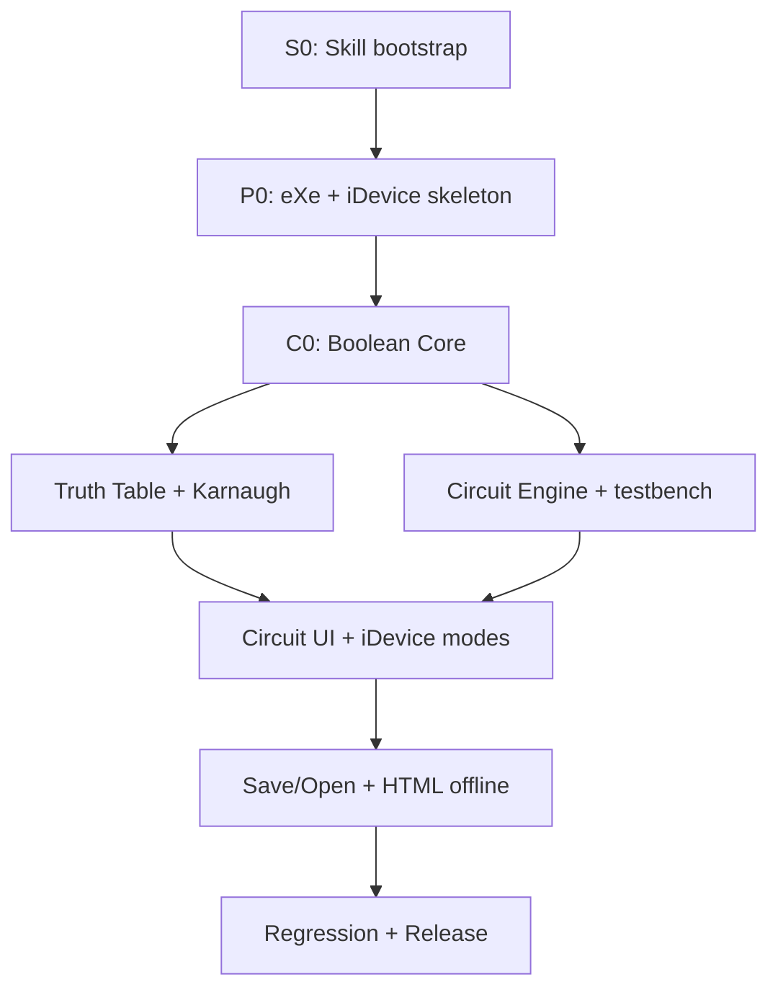

# KẾ HOẠCH THỰC THI 14 NGÀY — SKILL-FIRST, CORE-FIRST SOLO LOGIC ALPHA

**Phiên bản:** 0.5  
**Ngày bắt đầu:** Thứ Ba, 11/08/2026  
**Ngày bàn giao:** Thứ Hai, 24/08/2026  
**Nguồn lực:** 1 người phát triển + Codex làm AI writer duy nhất; reviewer AI khác là tùy chọn  
**Ngân sách:** 80 giờ trong 10 ngày làm việc  
**Đầu ra:** `Solo Logic Alpha`, `Solo Logic Alpha Limited` hoặc `Technical Prototype`

## 1. Mục tiêu điều hành

Hoàn thành chuỗi end-to-end:

> Skill đã kiểm chứng → eXeLearning/iDevice tối thiểu → Boolean Core → Truth Table → Karnaugh → Circuit Engine → Circuit UI → lưu/mở → HTML offline.

Không viết feature trước khi Gate S0 đạt. Không xây giao diện mạch trước khi Boolean Core, K-map validator và circuit engine có test xanh.



## 2. Quy tắc làm việc với AI

- Codex là AI writer duy nhất được sửa worktree trong toàn bộ Solo Logic Alpha.
- Claude Code, OpenCode, Gemini/Antigravity hoặc công cụ khác chỉ review đọc khi người phát triển giao rõ; không công cụ nào là dependency để Codex bắt đầu hoặc hoàn thành task.
- Mỗi lần chỉ thực thi một Task Packet đã có ID.
- AI phải đọc `SPEC.md`, phần task trong `PLAN.md` và skill được chỉ định trước khi sửa.
- Không tin câu “đã xong”; người phát triển chạy lệnh test và demo.
- Mọi thay đổi ngoài task được ghi backlog, không trộn vào diff.
- Feature branch/checkpoint phải có thể quay lại; không refactor lớn sau Gate G4.

### 2.1. Task Packet bắt buộc

```text
TASK: <ID và tên>
SPEC: <requirement ID>
SKILLS: <tên skill cần kích hoạt>
MỤC TIÊU: <một kết quả duy nhất>
FILE ĐƯỢC SỬA: <danh sách chính xác>
KHÔNG LÀM: <out-of-scope>
ACCEPTANCE: <input/output hoặc hành trình>
TEST BẮT BUỘC: <lệnh + kết quả mong đợi>
ĐẦU RA: diff + test result + rủi ro còn lại
```

Nếu chưa biết file thực tế của eXeLearning, task P01–P02 phải tạo `docs/architecture/repo-map.md`. Không được đoán đường dẫn rồi cho AI sửa lan rộng.

### 2.2. Routing skill

| Loại task | `SKILLS` |
|---|---|
| Chia việc/khóa task | `exelearning-logic-alpha`, `plan-writing` |
| Core/validator/engine/grader | `exelearning-logic-alpha`, `test-driven-development` |
| Build hoặc test lỗi | `exelearning-logic-alpha`, `systematic-debugging`; thêm TDD sau khi có root cause |
| Nhận review | `receiving-code-review`, `exelearning-logic-alpha` |
| UI/lifecycle | `exelearning-logic-alpha`; test integration/smoke theo Task Packet |

## 3. Phân bổ 80 giờ

| Workstream | Giờ | Kết quả |
|---|---:|---|
| S — Skill bootstrap | 3 | Whitelist, chuẩn hóa, lock, sync, discovery |
| P — Platform baseline | 9 | Build eXe, repo map, iDevice/schema skeleton |
| C — Boolean Core | 16 | Lexer, parser, evaluator, conversion, minimizer |
| T — Boolean/Truth Table | 6 | Model, UI tối thiểu và grader |
| K — Karnaugh | 12 | Gray map, UI, group validator và grader |
| E — Circuit Engine | 12 | Netlist, simulation, testbench, half-adder |
| U — Circuit/iDevice UI | 8 | Node/wire UI và bốn mode iDevice |
| I — Integration/export | 7 | Save/open, preview, HTML offline, asset audit |
| Q — QA/release | 7 | Course E2E, regression, bàn giao |
| **Tổng** | **80** | Không còn ngân sách cho analog/Arduino/AI/SCORM |

## 4. Cổng Go/No-Go

| Gate | Hạn | Bằng chứng | Nếu thất bại |
|---|---|---|---|
| G-S0 — Skill ready | Cuối giờ 3, ngày 1 | AT-S01…AT-S03 bằng provenance, parity và Codex routing; công cụ AI khác không bắt buộc | Dừng feature; sửa import/metadata/routing. Không dùng skill chưa kiểm chứng. |
| G-P0 — Platform ready | Cuối ngày 2 | Build eXe + iDevice placeholder + schema round-trip | Timebox 2 giờ; vẫn fail thì chuyển standalone Core prototype và ghi `Technical Prototype`. |
| G-C0 — Core frozen | Cuối ngày 4 | BOOL-01…BOOL-08, property/golden test xanh | Dừng UI; sửa Core. Không làm K-map/circuit trên API sai. |
| G-K0 — Learning core | Cuối ngày 6 | Truth table + K-map 4 biến chấm đúng wrap/overlap/don't-care | Bỏ overlay/polish; giữ model, chọn ô, validator và score. |
| G-E0 — Circuit core | Giữa ngày 8 | Half-adder netlist đạt 4/4 bằng test, loop/dangling được báo | Không làm canvas; sửa engine/testbench. |
| G-U0 — UI slice | Cuối ngày 9 | Half-adder nối/chấm được trong iDevice | Dùng grid/form nối pin fallback và gắn `Limited`. |
| G-R0 — Release | 15:00 ngày 10 | Toàn bộ AT, offline, không Sev-1/2 | Gắn đúng nhãn; không che test chưa đạt. |

## 5. Backlog nguyên tử

### 5.1. S — Skill bootstrap, 3 giờ

| ID | H | Phụ thuộc | Task | Definition of Done |
|---|---:|---|---|---|
| S01 | 0.5 | — | Khóa nguồn skill | Xác minh local mirror do chủ sở hữu cung cấp có 11 `SKILL.md`, khớp nội dung commit provenance `377275c…` sau chuẩn hóa LF/CRLF và ghi hash. Không cần tải mạng. |
| S02 | 0.5 | S01 | Audit quyền và an toàn | Ghi quyền AGPL do chủ sở hữu cấp; lập whitelist/exclusion; đọc toàn bộ file sẽ giữ; không chạy script. |
| S03 | 0.75 | S02 | Nhập và chuẩn hóa | Tạo bốn skill nguồn + `exelearning-logic-alpha` trong `.agents/skills`; frontmatter/name/ref hợp lệ. |
| S04 | 0.75 | S03 | Lock và đồng bộ | Tạo `.ai/skills.lock.json`, `tools/ai/sync-project-skills.ps1`; sync sang `.claude/skills`; `-Check` xanh. |
| S05 | 0.5 | S04 | Codex discovery/routing smoke | Codex thấy đúng năm managed skill; dry-run parser và debugging kích hoạt đúng skill mà không sửa mã; AT-S01…AT-S03 có log. Công cụ khác chỉ kiểm tra tương thích tùy chọn. |

Chi tiết thực thi S01–S05:

1. Dùng local mirror do chủ sở hữu cung cấp ở ngoài project; không copy toàn bộ bộ nguồn vào project và không ghi đường dẫn máy phát triển vào artifact phân phối.
2. So nội dung local với commit provenance đã khóa sau chuẩn hóa LF/CRLF; không fetch `main` và không cần truy cập GitHub.
3. Copy whitelist vào `.agents/skills`, sau đó chỉnh bản dự án theo SPEC.
4. Không giữ `CREATION-LOG`, test-pressure, server, WebSocket hoặc script không được skill dự án tham chiếu.
5. Tính SHA-256 trước và sau chuẩn hóa; ghi từng file vào lock.
6. Script sync chỉ lấy `.agents/skills` làm nguồn và `.claude/skills` làm đích; `-Check` chỉ đọc.
7. `AGENTS.md`, `CLAUDE.md`, `GEMINI.md` phải yêu cầu: đọc SPEC/PLAN, nêu Task ID + skill, Codex là writer duy nhất, không mở rộng P0.
8. Kiểm tra Codex discovery/routing trong phiên hiện tại bằng dry-run không sửa mã; discovery trên công cụ khác được ghi riêng là optional và không ảnh hưởng Gate.

### 5.2. P — Platform baseline, 9 giờ

| ID | H | Phụ thuộc | Task | Definition of Done |
|---|---:|---|---|---|
| P01 | 1 | G-S0 | Chụp baseline dự án | Pin eXe commit/toolchain; ghi branch, lệnh build/test và cây module liên quan vào `repo-map.md`. |
| P02 | 4 | P01 | Build upstream Windows | App chạy từ source; log lỗi baseline; không nâng dependency ngoài blocker đã chứng minh. |
| P03 | 2 | P02 | iDevice placeholder | Electronics Logic xuất hiện trong palette; editor/preview/HTML runtime render placeholder. |
| P04 | 2 | P03 | Schema/lifecycle skeleton | `schemaVersion:1`, validator, fixture 0→1 và smoke save/open/export. |

### 5.3. C — Boolean Core, 16 giờ

| ID | H | Phụ thuộc | Task | Definition of Done |
|---|---:|---|---|---|
| C01 | 2 | P04 | Hợp đồng Core + fixtures | Type/API, grammar, ordering, errors và golden fixtures được khóa bằng test đỏ. |
| C02 | 3 | C01 | Lexer/normalizer | Nhận toàn bộ operator variants, từ khóa trước implicit AND, giữ vị trí lỗi. |
| C03 | 3 | C02 | Parser AST | NOT > AND > XOR > OR, ngoặc và lỗi tiếng Việt; không `eval`. |
| C04 | 2 | C03 | Evaluator/truth vector | Đúng mọi tổ hợp 2–4 biến; deterministic. |
| C05 | 2 | C04 | Equivalence/conversion | Expression ↔ vector ↔ minterm/don't-care ↔ K-map model. |
| C06 | 4 | C05 | SOP minimizer + property test | SOP tối giản ổn định; golden test và tối thiểu 100 test equivalence sinh tự động. |

### 5.4. T — Boolean/Truth Table, 6 giờ

| ID | H | Phụ thuộc | Task | Definition of Done |
|---|---:|---|---|---|
| T01 | 2 | C05,P04 | Domain model + authoring | Chọn mode, variables, expression/minterm, prompt, score; validate trước lưu. |
| T02 | 2 | T01 | Learner UI | Nhập expression hoặc `2^n` ô; 0/1/X, reset, empty/invalid states. |
| T03 | 2 | T02,C04 | Grader/feedback | Chấm syntax/equivalence/từng ô; trả `GradingResult` v1 và bằng chứng. |

### 5.5. K — Karnaugh, 12 giờ

| ID | H | Phụ thuộc | Task | Definition of Done |
|---|---:|---|---|---|
| K01 | 3 | C05 | Gray-code model | Mapping 2/3/4 biến và cell↔minterm có golden tests. |
| K02 | 3 | K01,P04 | UI tối thiểu | Render nhãn, nhập ô, chọn nhiều ô và danh sách nhóm. |
| K03 | 4 | K01,K02 | Group validator | Power-of-two, rectangle, overlap, wrap, don't-care; loại nhóm chứa 0. |
| K04 | 2 | C06,K03 | Scoring/solution | Coverage, minimality, SOP equivalence và bài vàng bốn biến. |

### 5.6. E — Circuit Engine, 12 giờ

| ID | H | Phụ thuộc | Task | Definition of Done |
|---|---:|---|---|---|
| E01 | 3 | C04,P04 | Netlist validation/topology | Node/pin/wire schema, topo sort, loop/dangling/multi-source errors. |
| E02 | 4 | E01 | Engine `0/1/X` | Input, Output, NOT, AND, OR, XOR; propagation deterministic và unit tests. |
| E03 | 3 | E02 | Testbench/grading | Map I/O, chạy mọi tổ hợp, trả check evidence và score. |
| E04 | 2 | E03 | Half-adder fixture | Netlist đúng đạt 4/4; thiếu/sai wire thất bại; lỗi cấu trúc không crash. |

### 5.7. U — Circuit/iDevice UI, 8 giờ

| ID | H | Phụ thuộc | Task | Definition of Done |
|---|---:|---|---|---|
| U01 | 4 | G-E0,P04 | Node UI | Palette, add/move/delete node trên grid/SVG; không pan/zoom/auto-layout. |
| U02 | 2 | U01,E01 | Wire UI | Click source → target, delete wire và feedback kết nối sai. |
| U03 | 2 | U02,T03,K04,E04 | Bốn mode iDevice | Chuyển mode, author/learner state tách biệt, empty/invalid/runtime-error states. |

### 5.8. I — Integration/export, 7 giờ

| ID | H | Phụ thuộc | Task | Definition of Done |
|---|---:|---|---|---|
| I01 | 3 | U03 | Save/open/preview integration | Bốn mode round-trip 10 lần và preview dùng cùng schema/core. |
| I02 | 3 | I01 | HTML runtime offline | TT/K-map/half-adder render/chấm offline bằng đường dẫn tương đối. |
| I03 | 1 | I02 | Asset/secret audit | Text/ảnh/MP4 chạy; không request mạng/path tuyệt đối/secret/thư mục AI trong export. |

### 5.9. Q — QA/release, 7 giờ

| ID | H | Phụ thuộc | Task | Definition of Done |
|---|---:|---|---|---|
| Q01 | 3 | I03 | Course E2E | Một `.elpx` chứa text, media, TT, K-map và half-adder; demo script tái lập. |
| Q02 | 2 | Q01 | Regression/security | Chạy AT-S/AT-01…AT-10, malformed JSON, offline và secret scan. |
| Q03 | 2 | Q02 | Bàn giao | README build/run/demo, test report, limitations, release notes và backlog. |

## 6. Lịch 10 ngày

### Ngày 1 — Skill và build baseline

- S01–S05 (3 giờ), P01–P02 (5 giờ).
- Gate G-S0 phải đạt trước P01.
- Cuối ngày: Codex phát hiện đúng năm managed skill, eXe upstream chạy hoặc có root-cause log tái lập.

### Ngày 2 — iDevice skeleton và hợp đồng Core

- P03, P04, C01 và phần đầu C02.
- Gate G-P0 cuối ngày.
- Không xây UI feature ngoài placeholder/schema.

### Ngày 3 — Parser và evaluator

- Hoàn tất C02–C05.
- Codex tự bổ sung invalid/edge fixtures và tự kiểm tra grammar/data contract; reviewer ngoài chỉ dùng khi người phát triển chủ động yêu cầu.

### Ngày 4 — Minimizer và Truth Table

- C06, T01, T02.
- Gate G-C0; đóng băng API Core v1.

### Ngày 5 — Truth Table và K-map model/UI

- T03, K01, K02.
- Cuối ngày phải có bài truth table tạo/làm/chấm trong preview tối thiểu.

### Ngày 6 — K-map correctness trước polish

- K03, K04 và phần đầu E01.
- Gate G-K0 bằng bài có wrap, overlap và don't-care.

### Ngày 7 — Circuit Engine

- Hoàn tất E01, E02, E03.
- Chưa xây canvas nếu engine/testbench đỏ.

### Ngày 8 — Half-adder và node UI

- E04, U01 và U02.
- Gate G-E0 giữa ngày; sau đó mới được làm node/wire UI.

### Ngày 9 — Hoàn tất UI và export

- U03, I01 và I02.
- Gate G-U0 cuối ngày; feature freeze.

### Ngày 10 — Offline, E2E và release

- I03, Q01–Q03.
- 08:00–12:00 chạy toàn bộ AT; 13:00 demo từ đầu; 15:00 Gate G-R0.
- Chỉ sửa Sev-1/2; không thêm feature.

Cuối tuần chỉ dùng làm dự phòng cho blocker gate, tối đa 10 giờ và không tính để hứa thêm phạm vi.

## 7. Definition of Done

Một task chỉ đóng khi:

- Task Packet ghi đúng requirement và skill.
- Diff chỉ chạm file được phép; không có thay đổi dependency ngoài task.
- Core/validator/engine/grader đã đi qua Red → Green → Refactor.
- Test bắt buộc xanh và người phát triển đã tự chạy.
- UI có empty, invalid và runtime-error state phù hợp.
- Save/open/export không mất dữ liệu liên quan.
- Một AI khác review diff/test; feedback đã được kiểm chứng trước khi sửa.
- Commit nhỏ chứa Task ID và main vẫn build.

## 8. Test tối thiểu

### Unit/property/golden

- Lexer/parser precedence, implicit AND và invalid syntax.
- Evaluator/equivalence trên toàn bộ tổ hợp 2–4 biến.
- Round-trip expression/vector/minterm/K-map.
- Gray-code mapping, K-map overlap/wrap/don't-care.
- Netlist validation, topo, gate truth function và loop detection.
- Golden: `A'B + AB'`, `AB + A'B = B`, bốn góc K-map, half-adder đúng/sai.

### Integration/E2E

- iDevice editor → preview → save/open → HTML.
- Learner làm TT/K-map/circuit, chấm và làm lại.
- Skill parity/discovery/trigger.
- Offline audit: không request mạng, path tuyệt đối, secret hoặc AI development files.

## 9. Severity và nhãn bàn giao

| Mức | Ví dụ | Quy tắc |
|---|---|---|
| Sev-1 | Mất/corrupt project, thực thi expression, lộ secret | Stop-ship |
| Sev-2 | Core/grader sai, save/open/export hỏng, crash P0 | Stop-ship |
| Sev-3 | UI khó dùng nhưng có workaround rõ | Ghi limitation; có thể defer |
| Sev-4 | Màu, animation, polish, P1 | Defer |

- **Solo Logic Alpha:** toàn bộ AT đạt, không Sev-1/2.
- **Solo Logic Alpha Limited:** engine/grader/save/export đạt; circuit UI dùng grid/form fallback.
- **Technical Prototype:** thiếu iDevice round-trip hoặc HTML offline; không được gọi Alpha.

## 10. Risk register

| ID | Rủi ro | Trigger | Phản ứng |
|---|---|---|---|
| R1 | Skill xung đột hoặc kích hoạt quá mức | Codex nạp sai hoặc không giới hạn đúng năm managed skill | Chỉ whitelist, sửa description, chạy lại G-S0 |
| R2 | Drift `.agents` và `.claude` | `sync -Check` đỏ | `.agents` là chuẩn; sync rồi review diff |
| R3 | Bằng chứng quyền phân phối skill bị mất hoặc lệch | Lock thiếu owner authorization/AGPL hoặc hash local không khớp | Không publish tới khi phục hồi bằng chứng và chạy lại AT-S01 |
| R4 | Build eXe chiếm sprint | G-P0 fail | Timebox; chuyển standalone Core prototype |
| R5 | AI sửa lan rộng | Diff ngoài file hoặc >400 dòng logic/task | Dừng, tách packet/diff; chỉ một writer |
| R6 | Parser syntax phình to | AI thêm operator ngoài SPEC | Từ chối; giữ grammar v1 |
| R7 | K-map đẹp nhưng sai | Golden test đỏ | Bỏ polish; sửa model/validator |
| R8 | Canvas tốn thời gian | G-U0 trễ >4 giờ | Grid/form click-to-connect và nhãn `Limited` |
| R9 | Không còn giờ QA | Burndown lệch >15% ngày 6 | Cắt P1/polish; bảo vệ I/Q |

## 11. Prompt khởi động cho Codex

Codex là writer duy nhất. Dùng prompt sau khi bắt đầu hoặc tiếp nối một phiên trong project root:

```text
Đọc toàn bộ SPEC.md, PLAN.md và AGENTS.md. Codex là AI writer duy nhất.
Xác định task đang mở và xuất Task Packet trước khi sửa.
Tuân thủ SKILL-01…SKILL-14, phạm vi P0 và các gate theo thứ tự.
Dùng local skill mirror đã được chủ sở hữu cấp quyền AGPL; không fetch GitHub
và không chạy script nguồn. Công cụ AI khác chỉ là reviewer tùy chọn,
không phải dependency hoặc điều kiện gate.
Kết thúc mỗi task bằng diff, lệnh test, output thực tế và rủi ro còn lại.
```

Sau khi G-S0 xanh, tiếp tục bằng prompt:

```text
Đọc SPEC.md, PLAN.md, AGENTS.md và kích hoạt exelearning-logic-alpha.
Codex là writer duy nhất.
Thực hiện đúng task tiếp theo đang mở, bắt đầu từ P01.
Nếu task tạo code lõi/validator/engine/grader, dùng
test-driven-development. Nếu gặp lỗi, dùng systematic-debugging và
chưa sửa cho đến khi có root cause. Chỉ sửa file trong Task Packet,
chạy test bắt buộc và dừng tại gate gần nhất.
```

## 12. Bàn giao ngày 24/08/2026

1. Source fork AGPL tại commit/tag cố định.
2. Năm project skill, lock file, sync/check script và discovery evidence.
3. Boolean Core cùng unit/property/golden tests.
4. Electronics Logic iDevice với TT, K-map và circuit.
5. Course demo `.elpx` có text, ảnh/video và half-adder.
6. HTML offline export.
7. Test report AT-S01…AT-S03 và AT-01…AT-10.
8. README build/run/demo, release notes, limitations và backlog.

SCORM, analog, Arduino, chatbot/RAG và AI chấm bài không nằm trong 80 giờ.
