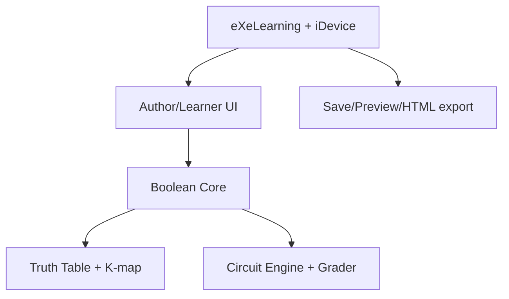

# ĐẶC TẢ SẢN PHẨM — ELECTRONICS LESSON STUDIO

**Phiên bản:** 0.5 — Codex-first, Skill-first, Core-first Solo Logic Alpha  
**Ngày chốt:** 12/08/2026  
**Sprint mục tiêu:** 11/08/2026–24/08/2026  
**Nguồn lực:** 1 người phát triển và Codex làm AI writer duy nhất; công cụ AI khác chỉ review tùy chọn khi người phát triển giao  
**Ngân sách:** 80 giờ làm việc tập trung  
**Nền tảng đích:** Windows 10/11 64-bit; nghiệm thu Alpha bắt buộc trên Windows 11  
**Giấy phép sản phẩm:** GNU AGPL-3.0-or-later  
**Nền tảng cơ sở:** fork eXeLearning 4.x tại commit được khóa khi bắt đầu  
**Trạng thái:** baseline thực thi; `SPEC.md` là nguồn yêu cầu chuẩn, `PLAN.md` là thứ tự thực hiện

## 1. Mục tiêu và thứ tự ưu tiên

Trong hai tuần, dự án phải tạo được một **Alpha chạy thật, có thể demo và tiếp tục phát triển** theo chuỗi:

> Biểu thức Boolean → bảng chân trị → Karnaugh → mạch logic tổ hợp → chấm xác định → lưu/mở → HTML offline.

Thứ tự ưu tiên bắt buộc:

1. Cài và kiểm chứng bộ skill cho AI coding.
2. Chứng minh fork eXeLearning build được và nhận một iDevice tối thiểu.
3. Xây Boolean Core và bộ kiểm thử độc lập UI.
4. Xây model/grader bảng chân trị và Karnaugh.
5. Xây netlist, engine và testbench mạch logic.
6. Chỉ sau khi engine đúng mới xây giao diện nối mạch.
7. Cuối cùng mới tích hợp save/open, preview và HTML offline.

Không được làm UI đẹp, analog, Arduino, chatbot, RAG hoặc AI chấm bài khi một cổng lõi phía trước còn đỏ.

### 1.1. Alpha đạt khi

- Bộ skill dự án được khóa nguồn, chuẩn hóa và được Codex phát hiện, kích hoạt đúng; discovery trên công cụ AI khác là kiểm tra tương thích tùy chọn, không chặn Alpha.
- Fork eXeLearning chạy từ source trên Windows 11.
- Electronics Logic iDevice tạo, sửa, lưu, mở lại, preview và export không mất dữ liệu.
- Boolean Core, K-map validator, circuit engine và grader chạy bằng test tự động, không phụ thuộc DOM/Electron.
- Người học hoàn thành truth table, K-map và half-adder hoàn toàn offline.
- Course mẫu đi qua đủ hành trình soạn → làm → chấm → lưu/mở → HTML offline.
- Không có lỗi mất dữ liệu, chấm sai, crash hành trình P0 hoặc lộ thông tin nhạy cảm.

### 1.2. Alpha không phải

- Bản phát hành đại trà hoặc công cụ dùng cho kỳ thi chính thức.
- Bộ mô phỏng mạch điện tương tự, Arduino hoặc logic tuần tự.
- Sản phẩm có chatbot/RAG/AI chấm bài.
- Bộ cài Windows ký số, auto-update hoặc SCORM score/resume.

## 2. Hệ thống skill cho AI coding

### 2.1. Nguồn được khóa

- Nguồn nhận trực tiếp: local mirror do chủ sở hữu cung cấp; đường dẫn máy phát triển không được ghi vào artifact phân phối.
- Provenance repository: `https://github.com/danghoangsqtt-sys/Skill_vibe_coding`
- Commit provenance kiểm chứng ngày 11/08/2026: `377275c64d26c69e66ae3da01caaf275c8166ce0`
- Nội dung local mirror phải khớp nguồn đã pin sau khi chuẩn hóa LF/CRLF; không cần tải lại từ GitHub và không được lấy trực tiếp nhánh `main`.
- Mọi cập nhật skill là một task riêng, phải audit và chạy lại Gate S0.

Repository nguồn hiện có 11 skill. Alpha chỉ nhập bốn skill quy trình và tạo thêm một skill miền dự án.

### 2.2. Whitelist bắt buộc

| Skill | Nguồn | Phạm vi sử dụng | Điều chỉnh bắt buộc |
|---|---|---|---|
| `plan-writing` | Repo nguồn | Chia một mục trong `PLAN.md` thành Task Packet 5–8 việc | Chỉ giữ `name`, `description`; `PLAN.md` vẫn là kế hoạch chuẩn; không tự tạo roadmap khác |
| `test-driven-development` | Repo nguồn | Boolean Core, K-map validator, circuit engine, grader và bugfix | Giữ Red–Green–Refactor; UI/lifecycle dùng characterization hoặc integration test khi unit test không phù hợp |
| `systematic-debugging` | Repo nguồn | Build fail, test fail, save/open/export lỗi và hành vi bất thường | Thay tham chiếu `superpowers:*` không tồn tại bằng skill cục bộ; không chạy script đi kèm nếu chưa audit |
| `receiving-code-review` | Repo nguồn | Xử lý nhận xét của AI reviewer trước khi sửa | Kiểm chứng nhận xét với SPEC, code và test; không sửa theo nhận xét chưa xác minh |
| `exelearning-logic-alpha` | Tạo trong dự án | Mọi task sản phẩm P0 | Tóm tắt ranh giới, schema, cú pháp Boolean, quy tắc K-map, gate và lệnh test từ SPEC/PLAN |

### 2.3. Danh sách không cài ở Alpha

| Skill | Lý do loại khỏi bootstrap |
|---|---|
| `using-superpowers` | Kích hoạt quá rộng và cố nạp skill trước mọi phản hồi |
| `brainstorming` | Bắt buộc nhiều vòng phê duyệt và có HTTP/WebSocket/script cục bộ, không cần cho scope đã khóa |
| `writing-plans` | Trùng `plan-writing`, phụ thuộc subskill không có trong repo |
| `executing-plans` | Phụ thuộc `using-git-worktrees` và `finishing-a-development-branch` không có |
| `requesting-code-review` | Phụ thuộc agent `superpowers:code-reviewer` không có |
| `subagent-driven-development` | Giả định bộ điều phối subagent chung và phụ thuộc skill bị thiếu |
| `skill-creator` | Không cần để xây Alpha; bản trong repo có metadata/script dư cho ba nền tảng đích |

Không được cài một skill ngoài whitelist chỉ vì AI đề xuất. Muốn thêm phải cập nhật SPEC, nêu lợi ích, chi phí ngữ cảnh, phụ thuộc và bài kiểm tra kích hoạt.

### 2.4. Cấu trúc thư mục chuẩn

```text
<project-root>/
├── .agents/
│   └── skills/                     # bản chuẩn cho Codex và các công cụ tương thích Agent Skills
│       ├── plan-writing/
│       ├── test-driven-development/
│       ├── systematic-debugging/
│       ├── receiving-code-review/
│       └── exelearning-logic-alpha/
├── .claude/
│   └── skills/                     # bản tương thích tùy chọn cho Claude Code
├── .ai/
│   └── skills.lock.json            # repo, commit, file nguồn, SHA-256 và trạng thái license
├── tools/
│   └── ai/
│       └── sync-project-skills.ps1 # đồng bộ + kiểm tra hai cây skill
├── AGENTS.md
├── CLAUDE.md
├── GEMINI.md
├── SPEC.md
└── PLAN.md
```

Không đặt skill trong `src`, `public`, `assets`, package runtime hoặc bất kỳ thư mục nào được exporter đưa vào HTML/SCORM.

Trên Windows dùng bản sao được kiểm tra thay vì symlink. `.agents/skills` là nguồn chuẩn; script đồng bộ phải sao chép sang `.claude/skills`, sau đó so SHA-256 và thất bại nếu hai bản khác nhau.

### 2.5. Yêu cầu skill có mã truy vết

| ID | P | Yêu cầu nghiệm thu |
|---|---:|---|
| SKILL-01 | P0 | Xác minh local mirror do chủ sở hữu cung cấp có đúng 11 `SKILL.md`, khớp nội dung commit provenance đã khóa sau chuẩn hóa LF/CRLF và ghi bằng chứng vào lock; không bắt buộc truy cập mạng. |
| SKILL-02 | P0 | Chỉ bốn thư mục whitelist được lấy từ local mirror; không chép cả bộ nguồn vào dự án. |
| SKILL-03 | P0 | Mỗi `SKILL.md` dự án có frontmatter tương thích chung: đúng `name`, `description`, tên thư mục trùng `name`. |
| SKILL-04 | P0 | Loại metadata không cần thiết và tham chiếu tới skill/agent không tồn tại; mọi liên kết tệp tương đối còn lại đều tồn tại. |
| SKILL-05 | P0 | Không thực thi script lấy từ repo ở bước import. Script muốn giữ phải được đọc, ghi lý do và test riêng. |
| SKILL-06 | P0 | `.ai/skills.lock.json` lưu provenance repo/commit, SHA-256 local source, SHA-256 bản đã chuẩn hóa, quyền phân phối và danh sách file giữ/loại. |
| SKILL-07 | P0 | `sync-project-skills.ps1` không xóa ngoài hai thư mục skill đích, hỗ trợ `-Check` và trả exit code khác 0 khi lệch. |
| SKILL-08 | P0 | `exelearning-logic-alpha/SKILL.md` dẫn tới `SPEC.md` và `PLAN.md`, không sao chép toàn bộ hai tài liệu vào context. |
| SKILL-09 | P0 | Codex liệt kê được đúng năm managed skill từ `.agents/skills` trong project và dùng đúng skill theo Task Packet. Discovery trên Claude Code, OpenCode hoặc Gemini/Antigravity chỉ là kiểm tra tương thích tùy chọn, không chặn Gate S0. |
| SKILL-10 | P0 | Trong Codex, một dry-run prompt parser kích hoạt domain skill + TDD và yêu cầu test đỏ trước; một dry-run prompt lỗi kích hoạt systematic debugging, yêu cầu dữ liệu tái lập và root cause trước khi sửa. Không dry-run nào được sửa mã. |
| SKILL-11 | P0 | Skill không xuất hiện trong HTML/SCORM, không chứa token, khóa API hoặc đường dẫn tuyệt đối máy phát triển. |
| SKILL-12 | P0 | Trước khi commit vào repo AGPL, lock phải ghi bằng chứng chủ sở hữu cho phép sử dụng, sửa đổi và phân phối các skill nhập theo giấy phép tương thích; nếu chưa rõ thì Gate S0 chưa đạt. |
| SKILL-13 | P0 | Không auto-pull hoặc auto-update skill trong sprint. |
| SKILL-14 | P0 | Mọi task code sau S0 phải ghi `SKILLS`, requirement ID, file được sửa, lệnh test và bằng chứng hoàn thành. |

### 2.6. Quy tắc giải quyết xung đột

Trong phạm vi tài liệu dự án, thứ tự là:

1. Yêu cầu trực tiếp hiện tại của người phát triển.
2. `SPEC.md`.
3. `PLAN.md` và Task Packet đang thực thi.
4. `exelearning-logic-alpha`.
5. Bốn workflow skill nhập từ repo.

Quy tắc nền tảng, quyền truy cập và chính sách an toàn của từng AI tool luôn được tôn trọng. Skill không được tự mở rộng quyền, thay đổi P0 hoặc bỏ qua gate.

### 2.7. Ma trận kích hoạt

| Tình huống | Skill phải dùng | Skill không cần nạp |
|---|---|---|
| Bắt đầu một ngày hoặc chia task | `exelearning-logic-alpha`, `plan-writing` | TDD/debug nếu chưa code |
| Tạo Core/validator/engine/grader | `exelearning-logic-alpha`, `test-driven-development` | `plan-writing` nếu Task Packet đã rõ |
| Build/test/runtime lỗi | `exelearning-logic-alpha`, `systematic-debugging`; sau đó TDD khi có root cause | Không brainstorming lại toàn dự án |
| Nhận review tùy chọn từ công cụ khác | `receiving-code-review`, `exelearning-logic-alpha` | Không sửa ngay khi chưa kiểm chứng |
| UI thuần bố cục/CSS | `exelearning-logic-alpha`; dùng integration/smoke test | Không ép unit TDD cho pixel |

## 3. Nguyên tắc bất biến của sản phẩm

1. **Đúng trước đẹp.** Core và grader phải xanh trước UI.
2. **Chấm xác định.** AI không tạo hoặc sửa điểm kỹ thuật.
3. **Một nguồn dữ liệu.** Dữ liệu iDevice là nguồn chuẩn; preview/export render từ cùng model.
4. **Offline trước.** Toàn bộ P0 chạy không Internet sau khi cài dependency phát triển.
5. **Không viết lại eXeLearning.** Tận dụng editor, cây bài, media, save/open và exporter hiện có.
6. **Giới hạn rõ.** Logic tổ hợp, tối đa bốn biến; tối đa hai đầu ra cho mạch để đủ half-adder.
7. **Có bằng chứng.** Không đóng task bằng lời xác nhận của AI; phải có test, log hoặc kịch bản demo tái lập.
8. **Một writer.** Codex là AI writer duy nhất cho toàn bộ Solo Logic Alpha. Công cụ AI khác chỉ được review ở chế độ đọc khi người phát triển giao rõ và không bao giờ là điều kiện để Codex tiếp tục task.

## 4. Phạm vi P0/P1

| Năng lực | P0 — bắt buộc | P1 — chỉ khi P0 xanh | Sau Alpha |
|---|---|---|---|
| AI workflow | 5 skill dự án, lock, sync, discovery, Task Packet | Tự động validate trigger | Orchestrator nhiều agent |
| eXeLearning | Build, iDevice, save/open, preview | Development build Windows | Installer ký số, auto-update |
| Nội dung | Text, ảnh, MP4 cục bộ qua chức năng eXe | Cảnh báo asset thiếu | Media processing |
| Đại số logic | Parse, evaluate, equivalence, minterm, SOP tối giản 2–4 biến | POS | 5+ biến, HDL |
| Bảng chân trị | Tạo/điền/chấm 2–4 biến, 1 output, 0/1/X | Sinh đề | Nhiều output |
| Karnaugh | 2–4 biến, Gray code, overlap, wrap, don't-care, SOP | Gợi ý từng bước | 5–6 biến |
| Mạch logic | Input, Output/LED, NOT, AND, OR, XOR; wire; 0/1/X; testbench | NAND/NOR/XNOR | Clock, flip-flop, timing |
| Xuất bản | HTML offline | SCORM 1.2 launch | SCORM score/resume/2004 |
| AI trong sản phẩm | Không thuộc P0 | Không | Gateway, chatbot, RAG, rubric |
| Analog/Arduino | Không | Không | Sprint riêng |

## 5. Hành trình P0

### 5.1. Người biên soạn

1. Tạo trang bài học trong eXeLearning và thêm text, ảnh hoặc MP4 cục bộ.
2. Chèn Electronics Logic iDevice.
3. Chọn Boolean, Truth Table, Karnaugh hoặc Logic Circuit.
4. Nhập đề, biến, đáp án/testbench, điểm và lời giải ngắn.
5. Preview, lưu dự án, đóng/mở lại và export HTML5 offline.

### 5.2. Người học

1. Mở bài trong preview hoặc HTML offline.
2. Nhập biểu thức/ô bảng, tạo nhóm Karnaugh hoặc nối mạch.
3. Nhấn **Kiểm tra**.
4. Xem điểm, check sai và lời giải do người biên soạn cung cấp.
5. Sửa bài và làm lại không cần reload hoặc Internet.

## 6. Yêu cầu chức năng sản phẩm

### 6.1. Nền tảng và iDevice

| ID | P | Yêu cầu nghiệm thu |
|---|---:|---|
| PLAT-01 | P0 | Pin commit upstream eXeLearning; app chạy từ source trên Windows 11 theo README tái lập. |
| PLAT-02 | P0 | Electronics Logic xuất hiện trong palette, mở editor và render placeholder. |
| PLAT-03 | P0 | Editor, preview và HTML export dùng cùng `schemaVersion: 1`. |
| PLAT-04 | P0 | Save → close → reopen giữ JSON chuẩn hóa trong 10 vòng. |
| PLAT-05 | P0 | Fixture schema 0 migrate sang 1 không mất dữ liệu. |
| PLAT-06 | P0 | Dữ liệu sai hiển thị lỗi tiếng Việt và không crash. |
| PLAT-07 | P0 | Text, ảnh và MP4 course mẫu hiển thị khi ngắt mạng. |

### 6.2. Boolean Core

| ID | P | Yêu cầu nghiệm thu |
|---|---:|---|
| BOOL-01 | P0 | Module thuần, không phụ thuộc DOM/Electron và chạy unit test riêng. |
| BOOL-02 | P0 | Hỗ trợ biến một ký tự `A`–`D`, hằng `0`, `1` và ngoặc. |
| BOOL-03 | P0 | Nhận NOT `!A`, `¬A`, `A'`; AND `AB`, `A.B`, `A*B`, `A AND B`; OR `A+B`, `A OR B`; XOR `A XOR B`, `A⊕B`. |
| BOOL-04 | P0 | Parser trả AST hoặc lỗi gồm vị trí, token mong đợi và thông báo tiếng Việt. |
| BOOL-05 | P0 | Evaluator tạo vector cho mọi tổ hợp theo thứ tự biến xác định. |
| BOOL-06 | P0 | So tương đương bằng toàn bộ tổ hợp, không so chuỗi. |
| BOOL-07 | P0 | Chuyển expression ↔ vector ↔ minterm/don't-care ↔ K-map model. |
| BOOL-08 | P0 | Tối giản SOP chính xác tối đa bốn biến và có kết quả ổn định. |
| BOOL-09 | P0 | Mode Boolean chấm expression bằng equivalence và chỉ rõ lỗi syntax. |

Lexer phải nhận từ khóa `NOT`, `AND`, `OR`, `XOR` trước phép nhân ẩn. Thứ tự ưu tiên là NOT > AND > XOR > OR. Không dùng `eval` hoặc `Function`.

### 6.3. Bảng chân trị

| ID | P | Yêu cầu nghiệm thu |
|---|---:|---|
| TT-01 | P0 | Người soạn chọn 2–4 biến và expression hoặc minterm/don't-care. |
| TT-02 | P0 | Sinh đúng `2^n` hàng từ `000…0` đến `111…1`. |
| TT-03 | P0 | Người học chỉ nhập `0`, `1`, `X`; input khác báo lỗi rõ. |
| TT-04 | P0 | Chấm từng ô, không lộ toàn bộ đáp án trước lần kiểm tra đầu. |
| TT-05 | P0 | Expression được chấm bằng equivalence trên toàn bộ tổ hợp. |
| TT-06 | P0 | Làm lại xóa feedback cũ nhưng giữ đề và authoring state. |

### 6.4. Karnaugh

| ID | P | Yêu cầu nghiệm thu |
|---|---:|---|
| KM-01 | P0 | K-map 2/3/4 biến đúng Gray code và nhãn hàng/cột. |
| KM-02 | P0 | Người học điền `0/1/X` hoặc nhận ô sinh sẵn từ minterm. |
| KM-03 | P0 | Chọn ô rồi tạo nhóm, không phụ thuộc kéo chuột chính xác. |
| KM-04 | P0 | Nhóm chỉ có 1/2/4/8/16 ô và là rectangle trong không gian Gray. |
| KM-05 | P0 | Hỗ trợ overlap/wrap; nhóm không chứa ô `0`. |
| KM-06 | P0 | Chấm phủ mọi minterm `1`, dùng don't-care và nhóm sai/thừa. |
| KM-07 | P0 | SOP cuối chấm equivalence; hiển thị một lời giải tối giản chuẩn. |
| KM-08 | P0 | Không trừ điểm vì cách nhóm khác nếu hợp lệ, phủ đủ và tối giản. |

### 6.5. Mạch logic tổ hợp

| ID | P | Yêu cầu nghiệm thu |
|---|---:|---|
| LOG-01 | P0 | Palette có Input, Output/LED, NOT, AND, OR, XOR. |
| LOG-02 | P0 | Thêm/di chuyển/xóa node; nối bằng source pin → target pin. |
| LOG-03 | P0 | Netlist JSON v1 lưu node, pin, wire, vị trí và round-trip không đổi nghĩa. |
| LOG-04 | P0 | Engine lan truyền `0/1/X` theo topo và báo vòng lặp tổ hợp. |
| LOG-05 | P0 | Đổi Input cập nhật Output/LED không reload. |
| LOG-06 | P0 | Báo pin treo, nhiều nguồn vào một pin và wire trỏ node đã xóa. |
| LOG-07 | P0 | Người soạn map input/output và khai báo truth table chuẩn. |
| LOG-08 | P0 | Test runner chạy mọi tổ hợp, trả số case đạt và bằng chứng output sai. |
| LOG-09 | P0 | Half-adder Sum=`A XOR B`, Carry=`AB` đạt 4/4 hoàn toàn offline. |
| LOG-10 | P1 | NAND/NOR/XNOR chỉ được thêm sau Gate Release. |

### 6.6. Export

| ID | P | Yêu cầu nghiệm thu |
|---|---:|---|
| EXP-01 | P0 | HTML export chứa runtime/CSS/asset bằng đường dẫn tương đối. |
| EXP-02 | P0 | Ngắt mạng vẫn hoàn thành TT, K-map và half-adder. |
| EXP-03 | P0 | Export không chứa `.agents`, `.claude`, `.ai`, token, path tuyệt đối hoặc stack trace. |
| EXP-04 | P1 | SCORM 1.2 chỉ cần upload và launch trên Moodle. |

## 7. Hợp đồng dữ liệu v1

```json
{
  "id": "uuid",
  "type": "electronics.logic",
  "schemaVersion": 1,
  "mode": "boolean|truthTable|kmap|circuit",
  "prompt": "Thiết kế mạch half-adder",
  "variables": ["A", "B"],
  "authoring": {},
  "answer": {},
  "grading": {"maxScore": 10},
  "learner": {},
  "accessibility": {"label": ""}
}
```

Circuit netlist:

```json
{
  "schemaVersion": 1,
  "nodes": [
    {"id": "in-a", "kind": "INPUT", "x": 40, "y": 80},
    {"id": "xor-1", "kind": "XOR", "x": 180, "y": 80}
  ],
  "wires": [
    {"id": "w1", "from": {"node": "in-a", "pin": "out"}, "to": {"node": "xor-1", "pin": "a"}}
  ]
}
```

Grading result:

```json
{
  "attemptId": "uuid",
  "exerciseId": "uuid",
  "engine": "electronics-logic-core",
  "engineVersion": "0.1.0",
  "score": 8,
  "maxScore": 10,
  "checks": [
    {"id": "case-11-carry", "passed": false, "expected": "1", "actual": "0"}
  ],
  "createdAt": "ISO-8601"
}
```

`X` trong truth table/K-map là don't-care; `X` trong circuit là tín hiệu chưa xác định. Hai khái niệm phải có type/field riêng.

## 8. Kiến trúc và ranh giới



- Boolean Core không biết eXeLearning, DOM hoặc Electron.
- Cùng evaluator dùng cho expression, table, K-map và gate truth function.
- UI chỉ gọi Core qua input/output đã type và validate.
- Authoring state và learner state tách riêng.
- Không sửa lõi eXeLearning ngoài registration/lifecycle thực sự cần.
- Skill chỉ điều khiển quá trình phát triển, không là dependency runtime.

## 9. Chấm điểm

1. Validate và chuẩn hóa input.
2. Sinh expected vector bằng Boolean Core.
3. Chấm từng check độc lập.
4. Tính điểm theo trọng số đã validate tổng 100%.
5. Trả bằng chứng, không chỉ trả một con điểm.
6. Cùng input và engine version luôn cho cùng kết quả.

Trọng số mặc định:

- Truth table: 70% ô, 30% expression nếu có.
- K-map: 30% ô, 40% nhóm hợp lệ/phủ đủ, 30% SOP.
- Circuit: 100% testbench; lỗi cấu trúc chặn chạy và trả check tương ứng.

## 10. Phi chức năng và an toàn

| ID | Ngưỡng Alpha |
|---|---|
| NFR-01 | Unit test Core chạy dưới 10 giây trên máy phát triển. |
| NFR-02 | Bài bốn biến chấm dưới 100 ms, không tính animation. |
| NFR-03 | Save/open 10 lần không sai khác JSON chuẩn hóa. |
| NFR-04 | Hành trình offline P0 không tạo request Internet. |
| NFR-05 | Core/grader mới đạt branch coverage tối thiểu 90%; UI ưu tiên integration/E2E. |
| NFR-06 | Không còn Sev-1/Sev-2 trước tag Alpha. |
| NFR-07 | Lỗi người học bằng tiếng Việt; log kỹ thuật không hiển thị trực tiếp. |
| NFR-08 | Không chạy lệnh tải từ Internet mà chưa khóa version/commit. |

An toàn tối thiểu:

- Không dùng `eval`, `Function` hoặc thực thi chuỗi JavaScript.
- Validate JSON trước render/chấm; nội dung HTML qua sanitizer của eXeLearning.
- iDevice không mở thêm quyền Node trong Electron renderer.
- Không ghi API key/token vào repo, fixture, log hoặc export.
- Không dùng `curl | shell`, không chạy script từ skill repo khi chưa audit.
- Alpha dùng public test phía client và không tuyên bố chống gian lận.

## 11. Nghiệm thu bắt buộc

| Test | Kịch bản | Điều kiện đạt |
|---|---|---|
| AT-S01 | Skill provenance | Đúng repo/commit; whitelist, hash và license status có trong lock. |
| AT-S02 | Skill parity | `.agents/skills` và `.claude/skills` giống nhau theo `-Check`. |
| AT-S03 | Codex skill routing | Codex thấy đúng năm managed skill; dry-run parser nạp `exelearning-logic-alpha` + `test-driven-development`, dry-run lỗi nạp `systematic-debugging`, và cả hai đều không sửa mã. Kiểm tra công cụ AI khác là tùy chọn. |
| AT-01 | Build sạch | Windows 11 làm theo README và chạy app. |
| AT-02 | iDevice round-trip | Tạo bốn mode, save/open 10 lần; JSON không đổi nghĩa. |
| AT-03 | Nội dung offline | Text, ảnh, MP4 và iDevice hiển thị khi ngắt mạng. |
| AT-04 | Boolean | Tối thiểu 30 fixture syntax và 100 cặp equivalence đúng. |
| AT-05 | Truth table | Sai một ô/expression; feedback chỉ đúng lỗi. |
| AT-06 | Karnaugh | Bài bốn biến có don't-care, overlap và wrap chấm đúng. |
| AT-07 | Logic | Half-adder đúng 4/4; tháo dây làm test thất bại. |
| AT-08 | Circuit errors | Loop, pin treo, nhiều nguồn được báo và không crash. |
| AT-09 | HTML offline | Hoàn thành AT-05…AT-07 không mạng; không đóng gói thư mục AI. |
| AT-10 | Regression | Lint/unit/integration/E2E xanh; không Sev-1/2. |

Chỉ gắn nhãn `Solo Logic Alpha` khi AT-S01…AT-S03 và AT-01…AT-10 đều đạt.

## 12. Quy tắc cắt phạm vi

Nếu chậm, cắt theo thứ tự:

1. SCORM launch.
2. NAND/NOR/XNOR.
3. Development installer.
4. Hiệu ứng dây, màu nhóm và polish.
5. Tự sinh lời giải đẹp; vẫn giữ đáp án chuẩn và grader.

Không được cắt skill provenance/discovery, Boolean test, K-map correctness, circuit testbench, save/open hoặc HTML offline để giữ tính năng trình diễn khác.

## 13. Nguồn tham chiếu

- Skill source: local mirror do chủ sở hữu cung cấp; không ghi đường dẫn máy phát triển. Repository chỉ dùng làm provenance: <https://github.com/danghoangsqtt-sys/Skill_vibe_coding>
- Claude Code project skills (tương thích tùy chọn): <https://code.claude.com/docs/en/skills>
- OpenCode Agent Skills (tương thích tùy chọn): <https://opencode.ai/docs/skills/>
- Gemini CLI Agent Skills (tương thích tùy chọn): <https://geminicli.com/docs/cli/skills/>
- Google Antigravity project skills (tương thích tùy chọn): <https://codelabs.developers.google.com/getting-started-with-antigravity-skills>
- eXeLearning: <https://github.com/exelearning/exelearning>
