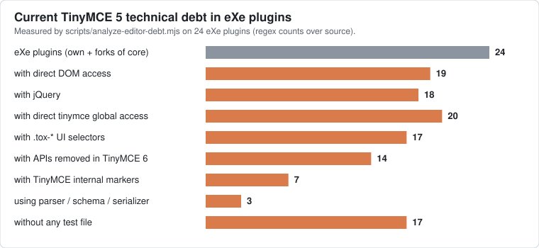
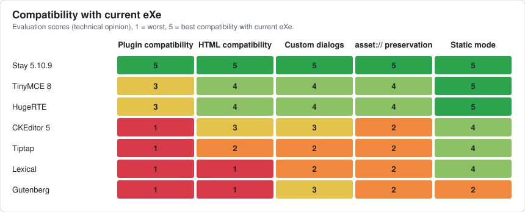
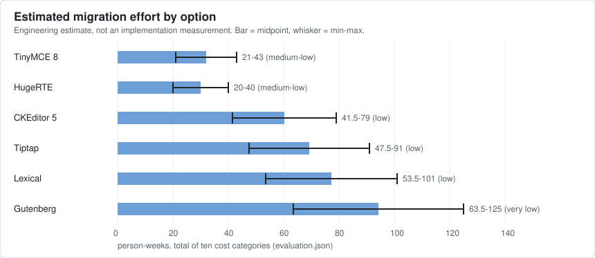
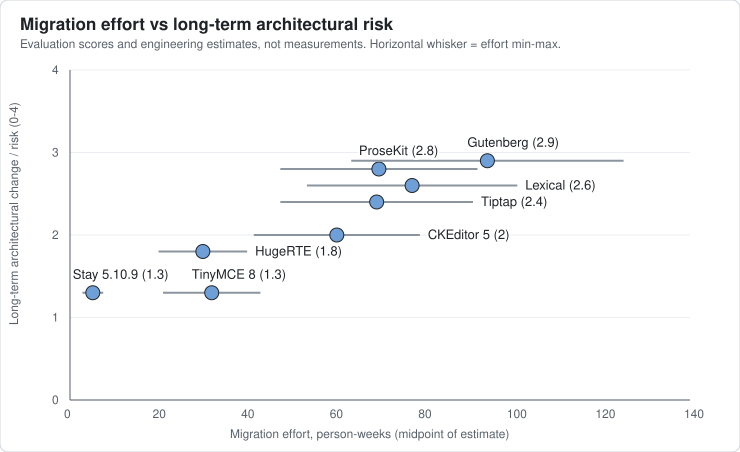

# ADR-2467-01: Future rich-text editor strategy

> **This record proposes; it does not decide.** Its purpose is to give the team one
> place with the evidence, the estimates and the trade-offs, so that the choice of
> eXeLearning's rich-text editor can be discussed in
> [PR #2467](https://github.com/exelearning/exelearning/pull/2467) and recorded here
> once there is consensus.

## How to read this record

Every statement is one of the following kinds, and is labelled when it matters:

- **[FACT]**: observed in this repository at `f64d72fb5` (the `main` this branch starts
  from), reproduced by [`scripts/analyze-editor-debt.mjs`](../../../scripts/analyze-editor-debt.mjs),
  or read from a cited external source.
- **[EST]**: an engineering estimate. Effort figures are never implementation
  measurements.
- **[OPINION]**: technical judgement by the authors of this record.
- **[MEASURED]**: a one-off experiment run outside this repository (for example the
  HTML-fidelity run); its inputs are not committed, so it cannot be reproduced from `main`.
- **UNVERIFIED**: could not be confirmed; do not rely on it without checking.

All external sources were checked on **2026-09-27** unless another date is given.
npm facts come from `npm view <package>` (<https://www.npmjs.com/>); GitHub advisories
from `gh api repos/<owner>/<repo>/security-advisories`.

## Context

eXeLearning edits most of its content, the HTML inside iDevices, with a TinyMCE 5
build committed under `public/libs/tinymce_5/` together with 24 eXe-specific plugins.
The same static build is embedded by the WordPress plugin
[wp-exelearning](https://github.com/exelearning/wp-exelearning), by the Moodle and
Omeka S integrations, by the Electron desktop app and by the offline/PWA build.

Three pull requests forced the question this record answers:

- **#1593** (open): replaces committed third-party libraries with dependencies
  declared in `package.json` and copied at build time. Whatever editor is chosen
  should be consumed through that pipeline.
  <https://github.com/exelearning/exelearning/pull/1593>
- **#2464** (closed 2026-09-27): bumped Bootstrap, jQuery UI and TinyMCE to 5.10.9.
  The TinyMCE part was put on hold until the team decides the editor strategy here.
  <https://github.com/exelearning/exelearning/pull/2464>
- **#2463** (closed 2026-09-27): removed the `codemagic` plugin and its CodeMirror 3.
  It was closed because removing it is a visible regression; the alternative, a
  modernised CodeMagic, has to be argued. That is done in *CodeMagic strategy* below.
  <https://github.com/exelearning/exelearning/pull/2463>

In addition, WordPress.org reviewers questioned the libraries that wp-exelearning
bundles (Guideline 13, see *WordPress distribution considerations*). No reviewer
statement about TinyMCE specifically exists; anything this record says about how a
reviewer would react is **[OPINION]**.

## Problem

Which rich-text engine should eXeLearning use for the next several years, how should
it be delivered, and how should the move away from TinyMCE 5 be sequenced, given that
TinyMCE 5 no longer receives free security fixes and eXe's editor is coupled to it far
beyond the public API?

## Current architecture

**Loading [FACT]:**

| Context | How TinyMCE is loaded |
|---|---|
| Web/server workarea | `views/workarea/workarea.njk:64-65`: `tinymce.min.js` and `tinymce_5_settings.js` through the `asset` filter |
| Static/PWA build (WordPress, Electron, offline) | `scripts/static-bundle/static-index.html:348-349` |
| interactive-video iDevice | A second, independent TinyMCE instance written with `document.write` (`edition/editor/index.html:99`) |
| Vitest | `public/vitest.setup.js:940-991` evaluates the real core into jsdom |

**Instantiation [FACT]:** iDevices render `<textarea class="exe-html-editor">` and
`$exeTinyMCE.init('multiple-visible', '.exe-html-editor')` turns them into editors.
`$exeTinyMCE` is an eXe object in `public/app/editor/tinymce_5_settings.js` (1,087
lines) that owns the configuration, the Media Library hooks and the `asset://`
handling. Six iDevice files go through `$exeTinyMCE.init`; six others call
`tinymce.init` directly with their own configuration (guess, interactive-video,
map, quick-questions, quick-questions-multiple-choice, trivial). That is **12 init
sites plus the interactive-video second instance**; 44 iDevice files mention TinyMCE.

**The editor contract seen by iDevices [FACT]** (script output, non-test files): 279
`tinyMCE.get(`, 20 `tinymce.get(`, 27 `tinymce.editors`. In practice iDevices use
`get(id).getContent()/setContent()/save()`, `editors[]`, `init` and `remove`.

**Core [FACT]:** the bundled core is **TinyMCE 5.10.2 (2021-11-17)**, byte-identical
to `npm pack tinymce@5.10.2`, as are the theme, icons, skins and 20 upstream plugins.
There are no core patches.

**Plugins [FACT]** (`public/libs/tinymce_5/js/tinymce/plugins/`, 44 directories):

- **20 upstream, unmodified**: advlist, anchor, autolink, autoresize, charmap, code,
  directionality, fullscreen, hr, image, insertdatetime, link, lists, paste, preview,
  searchreplace, table, textcolor, visualblocks, visualchars.
- **4 eXe forks of core plugins**, each from a different upstream patch level:
  `exeimage` (image@5.10.2), `exelink` (link@5.10.3), `exemedia` (media@5.10.3) and
  `template` (template@5.10.5, keeps the upstream name).
- **20 eXe-own**: abbr, abcmusic, addcontent, blockquoteandcite, clearfloat,
  codemagic, definitionlist, easyattributes, edicuatex, exealign, exeaudio, exeeffects,
  exegames_hangman, exemermaid, exemindmap, modalwindow, pastecode, rssfeed,
  toggletoolbars, tooltips.

The main configuration enables 40 plugins; the six direct-init iDevices add
`autoresize code image link lists paste textcolor`. Every shipped plugin is referenced
by some configuration.

**Collaboration [FACT]:** Yjs syncs pages, blocks and whole iDevices. Editing an iDevice
takes an exclusive lock (`public/app/yjs/YjsLockManager.js`); the editor's HTML is
written to Yjs as one string when the iDevice is saved
(`YjsStructureBinding.updateComponent()`, `public/app/yjs/YjsStructureBinding.js:2080-2178`).
Character-level co-editing does not exist: the unused TinyMCE binding was deleted in
`dfdd7cd9f` (PR #2267) and issue #2169 decided it should not be activated
(<https://github.com/exelearning/exelearning/issues/2169>). In static mode, which
wp-exelearning uses, collaboration is disabled (`public/app/core/Capabilities.js`).

## Current technical debt



*How chart 4 was computed [FACT]:* `node scripts/analyze-editor-debt.mjs` walks the 24
non-upstream plugin directories, strips comments and counts regex matches per plugin;
a bar counts the plugins with at least one match. "Direct DOM access" means
`getBody()/getDoc()/…`, `document.querySelector/createElement/write`, `innerHTML`,
`outerHTML`, `contentWindow` or `contentDocument`. "Direct tinymce global access" is
any `tinymce.X`/`tinyMCE.X` other than `PluginManager.add`. The exact regexes are in
the script's `METRICS` table. They are indicators, not an AST analysis.

**Size and tests [FACT]:** eXe plugin code (own plus forks, vendored libraries excluded)
is **15,908 non-blank lines**, with **1,147 lines of colocated tests**. Only 7 of the 24
plugins have a test file (codemagic, definitionlist, exeimage, exemedia, exemermaid,
exemindmap, pastecode); `exelink` (2,312 lines) and `tooltips` (938 lines) have none.
Earlier drafts quoted "~22,000" or "~16k" lines; those counted raw lines including
the vendored jQuery and Cropper inside exemindmap. This record uses the script's figure.

**Coupling totals across the 24 plugins [FACT]:**

| Coupling | Count | Why it matters |
|---|---|---|
| `.tox-*` UI selectors | 133 | Pin TinyMCE 5's DOM; also 7 in `public/app`, SCSS and E2E |
| TinyMCE internal markers (`data-mce-*`, `mce-object`, …) | 111 | Internal, some persisted in content |
| `tinymce.util.*` / `tinymce.dom.*` internals | 49 | Not public API |
| APIs removed or renamed in TinyMCE 6 | 26 | `DomQuery`, `util.XHR/Promise`, `.settings`, `getParam`, `.fire`, toolbar names |
| `activeEditor` | 40 | Fragile with several editors per iDevice |
| `tinymce.DOM` static helper | 259 | Global helper |
| jQuery matches | 295 | Couples plugins to the host page |
| `parent.` / `top.` reach-arounds | 24 | 18 of them in exemindmap |
| `windowManager.openUrl` iframe dialogs | 4 | codemagic, edicuatex, abcmusic, exemindmap |

**Content-format coupling [FACT]:** `data-mce-html="true"` and `data-mce-pdf="true"`
are written into saved content (`AssetManager.js`, `modalFileManager.js`,
`tinymce_5_settings.js`; 9 and 2 occurrences in application code) and read back at
render time (`asset_url_resolver.js` selects `iframe[data-mce-html]`). Export code
detects classes that plugins emit (`exe-fx`, `exe-tooltip`, `highlighted-code`,
`abc-music`; `src/shared/export/constants.ts`). Editor output is therefore a public
format contract, not a private detail.

**Other couplings [FACT]:**

- `tinymce_5_settings.js` monkey-patches `editor.windowManager.open` (`_patchAssetDialogs`)
  to rewrite `blob:` to `asset://` inside the exeimage/exemedia dialog specs, and walks
  TinyMCE's internal `span.mce-preview-object[data-mce-p-src]` placeholder.
- `public/libs/abcjs/exe_abc_music.js:241` hard-codes
  `tinymce_5/js/tinymce/plugins/abcmusic`; `public/app/yjs/ResourceFetcher.js:52`
  lists `tinymce_5`. A runtime library depends on the editor's folder layout.
- Two iframe sub-apps live inside plugin folders and bring old libraries:
  codemagic (CodeMirror 3.21.1 plus `batched_scripts.js`) and exemindmap (jQuery 1.6.1
  at runtime, jQuery UI 1.8, jquery.tmpl). Both need Bun routes
  (`/api/codemagic-editor/*`, `/api/exemindmap-editor/*` in `src/index.ts`).
- `exegames_hangman` and `rssfeed` register buttons, but neither name appears in any
  toolbar, menu or context menu. **[OPINION]** candidates for deletion, not migration;
  UNVERIFIED whether another entry point exposes them.
- Tests: 17 Vitest files, 26 Playwright specs/helpers and 1 Bun spec touch TinyMCE or
  `.tox-*`; `tinymce_5_settings.test.js` alone is 2,727 lines and asserts the pruning of
  the vendored tree (lines 2670-2727).
- `public/app/common/common_edition.js:67-68` still branches on
  `tinymce.majorVersion == 4 / 3`; neither branch runs under 5.

**Upstream security status [FACT]:** 11 published TinyMCE advisories affect 5.10.2
(<https://github.com/tinymce/tinymce/security/advisories>):

| Advisory | Severity | Fixed for free in |
|---|---|---|
| GHSA-q742-qvgc-gc2f (CVE-2026-47759, `data-mce-` src/href/style) | high | 7.9.3, 8.5.1 (5.x only in paid 5.11.1) |
| GHSA-vg35-5wq7-3x7w (CVE-2026-47761, media `data-mce-object`) | high | 7.9.3, 8.5.1 (5.x only in paid 5.11.1) |
| GHSA-v98h-vmpc-fpqv (CVE-2026-47762, `mce:protected`) | high | 7.9.3, 8.5.1 (5.x only in paid 5.11.1) |
| GHSA-9hcv-j9pv-qmph (CVE-2024-38356), GHSA-w9jx-4g6g-rp7x (CVE-2024-38357) | medium | 6.8.4, 7.2.0 (5.x only in 5.11.0) |
| GHSA-438c-3975-5x3f (CVE-2024-29203), GHSA-5359-pvf2-pw78 (CVE-2024-29881) | medium | 7.0.0 only |
| GHSA-v626-r774-j7f8 (CVE-2023-48219) | medium | 5.10.9 |
| GHSA-hgqx-r2hp-jr38, GHSA-v65r-p3vv-jjfv (CVE-2023-45819/45818) | medium | 5.10.8 |
| GHSA-gg8r-xjwq-4w92 (CVE-2022-23494) | medium | 5.10.7 (the advisory range says `<5.10.6`; an upstream inconsistency) |

The three 2026 highs were published in the TinyMCE repository on 2026-05-20; the global
GitHub Advisory Database entries were published on 2026-06-05 and state the 5.x range as
`<= 5.10.9`, patched: none (e.g. <https://github.com/advisories/GHSA-vg35-5wq7-3x7w>).
A fourth 2026 high, GHSA-mh5m-5hw4-5c69 (CVE-2026-47760), affects only 6.8.0 to <7.1.0.
Bumping to 5.10.9 (#2464) closes 4 of the 11. Tiny's support page states that
"TinyMCE 5 (both open source and commercial versions) is no longer receiving security
updates" except through a paid LTS agreement
(<https://www.tiny.cloud/docs/tinymce/latest/support/>).

## Requirements

Derived from the facts above. A candidate that cannot meet the first seven is not viable.

1. **HTML in, HTML out.** iDevice fields and HTML fields inside `jsonProperties` are
   strings; Yjs, ELPX and the exporters read strings.
2. **Arbitrary historical HTML survives** load and save: custom classes, `data-*`,
   `style`, iframes, audio, `dl`, wrappers, floats, and `data-mce-html`/`data-mce-pdf`
   markers (or a tested migration of them). eXe currently sets `valid_elements: '*[*]'`
   (`tinymce_5_settings.js:817-819`).
3. **`asset://` ↔ `blob:` rewriting**, the upload handler and the Media Library file
   picker keep working, including in dialogs.
4. **Several independent editors per iDevice**, created and destroyed by iDevice code.
5. **Save-time commit semantics**: nothing is written to Yjs while typing
   (`test/e2e/playwright/specs/collaborative/idevice-save-sync.spec.ts`).
6. **Runs with no server and no network**: static, Electron, offline and embedded in
   WordPress, Moodle and Omeka S. No license server, no CDN, no phone-home.
7. **License gate: free software compatible with AGPL-3.0-or-later.** The engine and
   every component eXe needs from it must be free software that can be combined into an
   AGPL-3.0-or-later distribution, redistributable offline and acceptable for a GPL
   WordPress.org plugin. The functionality eXe needs must not depend on proprietary or
   premium components, nor on a runtime license key or license server that restricts use.
   This is a **hard gate**, applied before scoring; see *License gate* below.
8. The educational plugins keep their output contract (`exe-fx`, `exe-tooltip`,
   `highlighted-code`, `abc-music`, math, Mermaid, mind maps).
9. A source-HTML view with search/replace (today: CodeMagic).
10. Delivered through the #1593 npm pipeline, not hand-copied.

## Non-requirements

- **Character-level collaborative editing.** It does not exist, was deliberately not
  activated (#2169), and is off in static mode. A native Yjs binding is a *possible
  future advantage*, not a requirement for this migration. The sibling specification
  record DR-0006 points the other way; see *Yjs considerations* for how the two relate.
- Premium or cloud features of any vendor (AI, comments, track changes, cloud RTC). If
  co-editing is ever promoted to a requirement, it must also pass the license gate: a
  vendor whose only collaboration path is commercial then fails for that need.
- Feature parity with Word paste cleaning beyond what eXe has today.
- Changing the ELPX content model from HTML to a structured document model.
- Changing the iDevice lock model.

## License gate

eXeLearning is AGPL-3.0-or-later. Requirement 7 is applied as a hard gate **before** any
scoring. An option passes only if all four hold:

- **(a)** it is free software;
- **(b)** its license can be combined into an AGPL-3.0-or-later distribution;
- **(c)** the features eXe needs are in the free build, with no premium or proprietary
  component;
- **(d)** it runs self-hosted and offline, with no license server, phone-home or CDN, and
  no runtime key that restricts use. A fixed, public, offline value such as TinyMCE's
  `'gpl'` or CKEditor's `'GPL'` counts as a condition, not a failure.

Verdicts are **PASS**, **PASS-WITH-CONDITIONS** (the conditions are listed and become
obligations of the option) or **FAIL**. An option that fails is not scored; it is listed
under *Discarded by the license gate*. `evaluation.json` records the verdict of every
scored option (`license.gate`) and the discarded ones (`discardedByLicenseGate`), and
`scripts/analyze-editor-debt.mjs` refuses to score an option whose verdict is not PASS or
PASS-WITH-CONDITIONS.

**How the licenses were read [FACT]:** the `LICENSE`/`license.md` file inside the
published npm tarball (`npm pack`), the repository LICENSE file, or the npm `license`
field where marked "npm field". All checked **2026-09-27**. The compatibility reasoning
follows the FSF: GPL-2.0-or-later code can be used under GPLv3, and "You can always link
GPLv3-covered modules with AGPLv3-covered modules"
(<https://www.gnu.org/licenses/gpl-faq.html#AllCompatibility>); LGPL-2.1, Expat (MIT),
Modified BSD, Apache-2.0 and MPL-2.0 are listed as GPLv3-compatible
(<https://www.gnu.org/licenses/license-list.html>). **This is not legal advice.**

### Is CKEditor 5 free?

**Yes for the core, no for collaboration and several features.** In detail:

- [FACT] `ckeditor5@48.5.2` `LICENSE.md`: "Licensed under a dual-license model … the GNU
  General Public License Version 2 or later (see COPYING.GPL), or commercial license
  terms". That is free software, and through "or later" it combines with AGPL-3.0 under
  GPLv3 §13. The GPL meta-package depends only on GPL packages and contains everything
  eXe needs: General HTML Support, `html-embed`, basic `source-editing`, `table`,
  `media-embed`, `image`, `upload`, basic `paste-from-office`, `find-and-replace`,
  `list`, `font`, `code-block`, `style`.
- [FACT] Everything in `ckeditor5-premium-features@48.5.2` is commercial ("licensed under a
  commercial license"): real-time collaboration, comments, track changes, revision
  history, **Templates**, **enhanced source editing**, **enhanced paste from Office**,
  export to PDF/Word, import from Word, AI, multi-level lists, pagination and others
  (<https://ckeditor.com/legal/ckeditor-licensing-options>).
- [FACT] **The LTS edition is not free.** `@ckeditor/ckeditor5-core@47.7.5` (dist-tags
  `lts-v47` and `staging`) says "CKEditor 5 Long Term Support Edition is licensed under a
  commercial license", and its code runs `if (licenseKey == 'GPL') { blockEditor('lts');
  … }` (<https://ckeditor.com/docs/ckeditor5/latest/getting-started/setup/using-lts-edition.html>).
  A GPL user has to follow the current major line (48.x) and absorb every major upgrade.
- [FACT] Under GPL: `licenseKey: 'GPL'` is required and works only for self-hosted
  builds (npm or ZIP), not the CDN; the GPL branch returns before the usage-reporting code
  runs; the "Powered by CKEditor" badge is forced on
  (<https://ckeditor.com/docs/ckeditor5/latest/getting-started/licensing/license-key-and-activation.html>,
  source of `@ckeditor/ckeditor5-core` and `-ui` 48.5.2).
- [FACT] The collaboration engine is operational transformation, present in the GPL
  `@ckeditor/ckeditor5-engine@48.5.2` itself (`dist/model/operation/…`); only the
  collaboration plugin and its server are commercial. A free, open-source OT server for
  CKEditor 5 was not found (UNVERIFIED that none exists). No Yjs binding exists except
  Velt's `@veltdev/ckeditor-crdt`, which is licensed "Proprietary" and needs a Velt SaaS
  account.
- **Verdict: PASS-WITH-CONDITIONS** for single-author editing. Conditions: the 48.x GPL
  build only; `licenseKey:'GPL'`; self-hosted; the badge stays; never import
  `ckeditor5-premium-features`; eXe writes its own template plugin (it ships 12 layout
  templates, `tinymce_5_settings.js:51-81`). [OPINION] **It would FAIL the gate if
  co-editing became a requirement**, because its only collaboration path is commercial.
  So would TinyMCE 8, HugeRTE and Jodit, which have no free *structural* collaboration
  path either; what sets CKEditor apart is its commercial-only LTS line.

### Gate table

| Option (version checked) | SPDX (source) | Verdict | Conditions / reason |
|---|---|---|---|
| TinyMCE 5.10.9 (`5-latest`) | LGPL-2.1 (npm; bundled `license.txt`) | **PASS** | None for the license; security end of life is a separate problem |
| TinyMCE 5.11 LTS (paid) | UNVERIFIED | **FAIL** | Commercial; redistribution under AGPL not confirmed in writing |
| TinyMCE 8.9.2 | GPL-2.0-or-later (repo `LICENSE.md`); npm 8.3+ `license.md` adds "By use of this Software you have agreed to these Tiny … Terms" | **PASS-WITH-CONDITIONS** | `license_key:'gpl'` (offline, no license plugin loaded); build from the tagged GitHub source or get a written opinion on the npm sentence (see *Licensing*); no `tinymce-premium`; own `template` plugin ("Removed in 7.0. Replaced by the premium Templates plugin", <https://www.tiny.cloud/docs/tinymce/latest/migration-from-6x/>); no advcode or PowerPaste |
| HugeRTE 1.0.14 | MIT (file) | **PASS** | Keeps `template` under MIT. [OPINION] Later TinyMCE fixes are GPL and cannot be merged into MIT |
| CKEditor 5 48.5.2 | GPL-2.0-or-later OR LicenseRef-Commercial (file) | **PASS-WITH-CONDITIONS** | See *Is CKEditor 5 free?* |
| CKEditor 5 47.x LTS | LicenseRef-Commercial (file) | **FAIL** | Commercial; blocks the GPL key |
| Tiptap 3.31.3 (core, StarterKit, table, image, collaboration, `@tiptap/y-tiptap`) | MIT (npm, repo) | **PASS** | Pro extensions ("Snapshots, Comments, and some features of AI Toolkit also require an active subscription", <https://github.com/ueberdosis/tiptap-docs/blob/main/src/content/guides/pro-extensions.mdx>) and Tiptap Cloud are paid and not needed; Hocuspocus 4.7.0 is MIT |
| ProseMirror + y-prosemirror 1.3.7 | MIT | **PASS** | None |
| ProseKit 0.22.3 | MIT (npm) | **PASS** | None |
| Lexical 0.51.0 + `@lexical/yjs` | MIT | **PASS** | None |
| Gutenberg (`@wordpress/block-editor` 18.0.0) | GPL-2.0-or-later (npm); `LICENSE.md` adds MPL-2.0 for contributions since 2021-04-15 | **PASS** | None (rejected on fit) |
| Remirror 3.0.3 + `@remirror/extension-yjs` 4.0.3 | MIT | **PASS** | License only; discarded on maintenance status |
| Milkdown 7.22.2 + `@milkdown/plugin-collab` | MIT | **PASS** | License only; discarded on model |
| BlockNote 0.55.0 | Core, react, server-util: MPL-2.0; `xl-*` (multi-column, AI, DOCX/PDF/ODT export): "GPL-3.0 OR PROPRIETARY" (<https://github.com/TypeCellOS/BlockNote/blob/main/LICENSE.txt>) | **PASS** (core); `xl-*` PASS-WITH-CONDITIONS | MPL-2.0 without the "Incompatible With Secondary Licenses" notice; `xl-*` combine as GPL-3.0-only under §13. Discarded on fit |
| Quill 2.0.3 + y-quill 1.0.0 | BSD-3-Clause / MIT | **PASS** | License only; discarded on maintenance and fidelity |
| Plate (`platejs` 53.3.14, `@platejs/yjs` 53.2.0) | MIT (`@platejs/diff` Apache-2.0 + MIT) | **PASS** | Plate Plus templates are paid and not needed. Discarded on fit |
| Slate 0.126.2 + `@slate-yjs/core` 1.0.2 | MIT | **PASS** | License only; discarded |
| BlockSuite 0.22.x | npm says MIT, repository LICENSE says MPL-2.0 | **PASS-WITH-CONDITIONS** | Resolve the mismatch first (both are compatible). Discarded on fit |
| SuperDoc 2.18.0 | AGPL-3.0 (npm; "only" vs "or later" UNVERIFIED) | **PASS** | Combined work becomes AGPL-3.0 [OPINION]. Off-target (DOCX editor) |
| wangEditor-next 6.4.2 + `@wangeditor-next/yjs` | MIT | **PASS** | License only; not evaluated beyond screening |
| Jodit 4.15.14 | MIT (file); `jodit-pro` proprietary | **PASS-WITH-CONDITIONS** | Bundle Ace (BSD-3-Clause) and js-beautify locally instead of the cdnjs default (`esm/plugins/source/config.js`); never ship `jodit-pro` |
| SunEditor 3.3.3 | MIT (file) | **PASS** | Security advisories are a separate matter |
| Froala 5.4.0 | Proprietary (`License.txt`: "you have to purchase a license") | **FAIL** | Not free software |
| Editor.js, Trix, Squire, Trumbowyg, Summernote, Pell | Apache-2.0 / MIT (npm field only) | **PASS** | License only; screened out on fit |
| CodeMirror 6 + y-codemirror.next 0.3.6 | MIT | **PASS** | None |
| Monaco 0.57.0 + y-monaco 0.1.6 | MIT (+ `ThirdPartyNotices.txt`) | **PASS** | Ship the third-party notices |
| Ace 1.44.0 + y-ace | BSD-3-Clause / MIT (GitHub only, not on npm) | **PASS** | None |
| Prism Code Editor 5.4.0 | MIT (file) | **PASS** | None |
| Yjs 13.6.33, y-protocols, y-websocket, Hocuspocus 4.7.0 | MIT | **PASS** | None |
| eXe's current CodeMagic plugin | **No license text** | **UNVERIFIED, treated as a risk** | See *CodeMagic strategy* |

**Headline [OPINION]:** every scored finalist passes the gate; none is excluded by it. The
hard FAILs are Froala, the CKEditor 5 LTS edition and the paid TinyMCE 5 LTS, and none of
them was a finalist. What differs between finalists is the **conditions**: TinyMCE 8 has
the npm terms sentence and a premium `template`; CKEditor 5 has the badge, no free LTS, a
premium `template` and no free collaboration; HugeRTE, Tiptap, ProseKit, Lexical and
Gutenberg pass without conditions for the functionality eXe needs.

### Discarded by the license gate

| Option | Reason |
|---|---|
| Froala | Proprietary; not free software |
| CKEditor 5 LTS (47.x) | Commercial edition; refuses the GPL key |
| Paid TinyMCE 5 LTS (5.11.x), former option 0b | Commercial; redistribution inside an AGPL application and a WordPress.org plugin not confirmed in writing. Price UNVERIFIED |

## Alternatives considered

The list below is the result of a screening; details and sources follow in each
subsection. Options 1 to 6, plus 4b, are the finalists that appear in the charts. Every finalist
passed the *License gate*.

| # | Option | License gate | Status after screening |
|---|---|---|---|
| 0 | Stay on TinyMCE 5 (5.10.9 bump plus interim hardening) | PASS | Baseline, not a long-term option |
| 1 | **TinyMCE 8** | PASS-WITH-CONDITIONS | Finalist |
| 2 | **HugeRTE** (MIT fork of TinyMCE 6/7-pre) | PASS | Finalist |
| 3 | **CKEditor 5** with General HTML Support | PASS-WITH-CONDITIONS | Finalist, best "modern rewrite" for HTML fidelity |
| 4 | **Tiptap / ProseMirror** | PASS | Finalist, best for a structured model and Yjs |
| 4b | **ProseKit** (ProseMirror) | PASS | Finalist added under the Yjs lens; bus factor 1 |
| 5 | **Lexical** | PASS | Finalist on request; weakest fit |
| 6 | **Gutenberg block editor** | PASS | Finalist on request; rejected on evidence |
| – | Jodit, SunEditor | PASS-WITH-CONDITIONS / PASS | Screened; possible second-line HTML-first editors |
| – | Yjs-bindable editors: Remirror, Milkdown, BlockNote, Quill 2 + y-quill, Plate / Slate + slate-yjs, BlockSuite, SuperDoc, wangEditor-next | PASS (license only) | Screened under the Yjs lens and discarded on fit or maintenance; see *Editors with Yjs bindings* |
| – | Editor.js, Summernote, Trix, Pell | PASS (license only) | Screened out |
| – | Froala, CKEditor 5 LTS, paid TinyMCE 5 LTS (former 0b) | **FAIL** | Discarded by the license gate |
| – | Squire, Trumbowyg | PASS (npm field) | **Not screened** |
| – | Umo Editor (Vue, Tiptap), Atlaskit editor (React) | not checked | **Not screened**; most likely out on framework or model. Licenses and versions UNVERIFIED |

### Option 0: stay on TinyMCE 5.10.9 with interim hardening

- [FACT] npm `5-latest` is 5.10.9 (2023-11-15), LGPL-2.1. It closes 4 of the 11
  advisories; the 3 high 2026 ones have no free 5.x fix.
- [EST] 2.8–7.5 person-weeks including the CodeMagic modernisation and interim hardening:
  a Content-Security-Policy for the editor iframe, DOMPurify with an explicit
  allow-list on `.elp` import, and sandboxing the preview. This was not evaluated in
  depth by any report and is proposed as a follow-up whatever the final choice.
- [OPINION] This is a **bridge**, not a destination: the security debt grows
  monotonically, and the argument "core's TinyMCE cannot run our plugins" is weaker
  for an end-of-life 5.x than for a maintained 8.x.

### Former option 0b: paid TinyMCE 5 LTS (discarded by the license gate)

- [FACT] Tiny sells extended 5.x support (support page above); 5.11.0/5.11.1 fix the
  2024 and 2026 advisories. The 5.11 builds are not on npm.
- UNVERIFIED: price, and whether the LTS build may be redistributed inside an AGPL
  application and a WordPress.org plugin. **[OPINION]** Until both are confirmed in
  writing it fails the license gate, and it is not scored.

### Option 1: TinyMCE 8

- [FACT] `latest` 8.9.2 (2026-09-23). 17 releases between 2025-09-27 and 2026-09-27;
  23 across 8.x (bundled `CHANGELOG.md`). ~1.26 M npm downloads/week
  (<https://api.npmjs.org/downloads/point/last-week/tinymce>, secondary signal).
- [FACT] Self-hosting requires `license_key: 'gpl'`; without a key 8.x disables the
  editor (<https://www.tiny.cloud/docs/tinymce/latest/license-key/>). An "Upgrade"
  promotion appears unless `promotion: false`.
- [FACT] Free support only for "around six months after the new major version is
  available" (support page). Tracking the latest 8.x minor and moving to 9 is a
  recurring obligation. TinyMCE 9 date: UNVERIFIED.
- [FACT] The 5.x dialog and `ui.registry` model carries over:
  `windowManager.open/openUrl` are still typed in 8.9.2's `tinymce.d.ts`. What breaks:
  `DomQuery`, `editor.settings`, `getParam`, `util.XHR/Promise`, toolbar names
  (6.0, <https://www.tiny.cloud/docs/tinymce/6/migration-from-5x/>); the open-source
  `template` plugin is removed in 7.0
  (<https://www.tiny.cloud/docs/tinymce/7/migration-from-6x/>); `selection.setContent`
  deprecated, split-button DOM and stricter DOMPurify in 8.0
  (<https://www.tiny.cloud/docs/tinymce/latest/migration-from-7x/>).
- [FACT] Security-relevant defaults since 7.0: `sandbox_iframes: true`,
  `convert_unsafe_embeds: true`; DOMPurify sanitisation since 6.4
  (`xss_sanitization` to disable). [OPINION] eXe's `asset://` and `blob:` iframes are
  not host-matchable by `sandbox_iframes_exclusions`, so eXe would need
  `sandbox_iframes: false` or a narrower strategy.
- [FACT] 8.9.2 embeds DOMPurify 3.4.12 (three labels exist: `notices.txt` 3.3.2, banner
  3.4.11, code 3.4.12). That is behind DOMPurify GHSA-55q2-fjhq-7xh7 (fixed 3.4.13) and
  two low advisories of 2026-09-23 (fixed 3.4.16)
  (<https://github.com/cure53/DOMPurify/security/advisories>). Consumers cannot bump the
  bundled DOMPurify independently. This applies to TinyMCE as much as to HugeRTE.
- Precedents: Moodle `main` and 5.2 ship **8.2.2**, built from a clone of the upstream
  repository (`public/lib/editor/tiny/readme_moodle.md` and `thirdpartylibs.xml` on
  <https://github.com/moodle/moodle>), with `license_key:'gpl'`, `sandbox_iframes:false`,
  `xss_sanitization:false` ("We do this in PHP") and `promotion:false`. 8.2.2 is
  **below 8.5.1**, so Moodle main is inside the affected range of the 2026 highs, and
  "Patches included: N/A" records no backport; Moodle relies on a PHP purifier that
  eXe's static mode does not have. Moodle's `thirdpartylibs.xml` still says `MIT` for
  8.2.2, most likely stale metadata (the "why" is UNVERIFIED). Chamilo is moving from
  5.10.9 to 8.x for the same CVEs (<https://github.com/chamilo/chamilo-lms/issues/9092>).
  [OPINION] Moodle is a weaker precedent than it looks.
- License gate: **PASS-WITH-CONDITIONS** (see *License gate* and *Licensing*). The
  `template` replacement is premium, so eXe's `template` fork has to be rebuilt as an eXe
  plugin; that work is inside the "Own plugins" estimate (it is one of the 4 forks) and is
  the main reason TinyMCE 8 is estimated slightly above HugeRTE.
- [FACT] No Yjs binding, free or paid: Tiny's own RTC "will be retired and deactivated on
  December 31, 2023" (<https://www.tiny.cloud/docs/tinymce/6/rtc-introduction/>) and was
  not Yjs. The only Yjs adapter found is Velt's `@veltdev/tinymce-crdt` 1.0.2, licensed
  "Proprietary" and SaaS-bound, which fails the gate.

### Option 2: HugeRTE

- [FACT] MIT fork of TinyMCE `main` at 6.8.3 plus unreleased 7.0 work, taken just before
  the GPL relicensing commit (<https://github.com/hugerte/hugerte>,
  <https://github.com/hugerte/hugerte/issues/1>). npm `hugerte` 1.0.14 (2026-09-06 UTC),
  MIT, **one npm maintainer** (`carlosmintfan`). Global renamed to `window.hugerte`; no
  `tinymce` alias. Keeps `template`; `hr` and `paste` are in core. 30 plugins.
- [FACT] Activity 2025-09-27 → 2026-09-27: 104 commits (carlosmintfan 56, dependabot 34,
  Copilot 7). A dormant period from about 2025-03 to 2026-02 (1.0.10 was
  attribution-only). OpenCollective: $85.30 raised in total
  (<https://opencollective.com/hugerte>). The maintainer wrote that he is "a single person
  which also has other projects and limited time"
  (<https://github.com/orgs/hugerte/discussions/46#discussioncomment-11977987>).
- [FACT] Security: two high advisories (2026-07-18, no own CVE IDs), inherited from
  TinyMCE's 2026 highs, fixed 23 and 40 days after TinyMCE
  (<https://github.com/hugerte/hugerte/security/advisories>). A HugeRTE-specific mXSS
  regression (`SAFE_FOR_XML` disabled) was fixed in PR #217. Every future TinyMCE fix is
  GPL code that an MIT fork has to reimplement clean-room.
- [FACT] Adobe Commerce replaced TinyMCE with HugeRTE
  (<https://experienceleague.adobe.com/en/docs/commerce-operations/release/notes/security-patches/2-4-8-patches>);
  its user docs say "2.4.6 and later", inconsistent with the patch notes that tie it to
  2.4.8-p3. Magento `2.4-develop` vendors HugeRTE **1.0.4** under `lib/web/hugerte/`,
  missing the 1.0.11–1.0.14 fixes. Adobe is not a visible contributor or sponsor.
- UNVERIFIED: the CI and AI-agent workflow characterisation (`opencode.yml` triggered by
  any `/oc` comment) until the workflow file is quoted with a commit SHA.
- [EST] Exit path: moving later from HugeRTE 1.0.x to TinyMCE 8 still needs the 8.0
  changes (`selection.setContent`, split buttons, `DomParser`, language codes), a
  `template` replacement and the license route of Option 1: **4–10 person-weeks**, not
  "mostly carries over".

### Option 3: CKEditor 5 with General HTML Support (GHS)

- [FACT] `ckeditor5` 48.5.2 (2026-09-22). GPL-2.0-or-later or commercial;
  `licenseKey: 'GPL'` required since v44 and valid only for self-hosted builds
  (<https://ckeditor.com/docs/ckeditor5/latest/getting-started/licensing/license-key-and-activation.html>).
  Under GPL the "Powered by CKEditor" badge is always shown and usage reporting is skipped
  (source of `@ckeditor/ckeditor5-ui` and `-core` 48.5.2).
- [FACT] The LTS line (47.7.5, dist-tag `lts-v47`) is **commercial and refuses the GPL
  key**; an open-source user must follow 48.x and every later major. Templates, enhanced
  source editing and enhanced paste from Office are premium. License gate:
  **PASS-WITH-CONDITIONS** (see *Is CKEditor 5 free?*). The `template` rebuild is inside
  the "Own plugins" estimate.
- [FACT] GHS keeps markup no plugin handles but "does not offer any UI" and elements
  "still need to adhere to certain rules derived from the HTML schema"
  (<https://ckeditor.com/docs/ckeditor5/latest/features/html/general-html-support.html>).
  GHS itself had an XSS advisory, GHSA-jrqm-vmqc-gm93 (medium, 2026-03-04).
- [FACT] Accessibility: WCAG 2.2 A/AA claim and a VPAT for v44.3.0
  (<https://ckeditor.com/docs/ckeditor5/latest/features/accessibility.html>).
- Real-time collaboration needs CKEditor Cloud Services or a commercial on-premises
  server (<https://ckeditor.com/docs/ckeditor5/latest/features/collaboration/collaboration.html>).
  It is operational transformation, not Yjs; no free Yjs binding exists.

### Option 4: Tiptap / ProseMirror

- [FACT] `@tiptap/core` 3.31.3, MIT; paid layer is cloud features
  (<https://tiptap.dev/pricing>). ProseMirror is MIT; its GitHub repositories were
  archived on 2026-04-01 and development continues on the author's forge
  (`npm view prosemirror-model repository.url`); one lead maintainer.
- [FACT] Schema-driven: "You can't use any HTML element or attribute that is not defined
  in your schema" (<https://tiptap.dev/docs/editor/api/schema>). UI components are React.
- [FACT] Yjs: `@tiptap/extension-collaboration` 3.31.3 (MIT) runs over
  `@tiptap/y-tiptap` 3.0.9 (2026-08-18), **Tiptap's own fork** of y-prosemirror 1.x, with
  a peer dependency on `yjs ^13.5.38`. The Yjs author's binding has moved on: unscoped
  `y-prosemirror` `latest` is 1.3.7 (2025-07-03, no 1.x release since), the repository
  `master` is on 2.x ("2.0.0-13", 2026-09-25), and 2.x is **published under a new scope**:
  `@y/prosemirror` (dist-tags `latest` 2.0.0-0, `beta` 2.0.0-13) on `@y/y` 14 (`beta`
  14.0.0-rc.26). [OPINION] Tiptap and plain ProseMirror are therefore heading towards
  different Yjs majors; choosing Tiptap ties a future collaboration path to a fork that
  Tiptap maintains. Hocuspocus 4.7.0 (server and provider) is MIT, so no paid Tiptap
  component is needed for co-editing.
- License gate: **PASS**. Pro extensions (comments, snapshots, parts of the AI toolkit)
  and Tiptap Cloud are paid and not needed.
- [FACT] Advisories 2026: GHSA-cp6q-959q-f8rh (high, `mergeAttributes()` prototype
  pollution leading to executable attributes), relevant to any "preserve all attributes"
  strategy.

### Option 4b: ProseKit (added under the Yjs lens)

- [FACT] `prosekit` 0.22.3 (2026-09-20), MIT, pre-1.0. A framework-agnostic toolkit over
  ProseMirror with adapters for React, Vue, Preact, Svelte and Solid, so unlike Tiptap's
  UI components it needs no React. Its Yjs extension (`prosekit/extensions/yjs`) peers on
  the **upstream** `y-prosemirror >= 1.2.9` and `yjs >= 13.6.18`, not on Tiptap's fork.
- [FACT] One dominant maintainer: ocavue has 1,087 commits
  (`gh api repos/prosekit/prosekit/contributors`; the next entries are bots). ocavue is
  also Remirror's second contributor (364 commits), and Remirror's README says "remirror
  is in maintenance mode and is not recommended for new projects" and points to ProseKit
  (<https://github.com/remirror/remirror>).
- [OPINION] It concentrates exactly the risk that put Remirror into maintenance mode: bus
  factor 1, pre-1.0 API. Same schema-based HTML fidelity problem as Tiptap (no separate
  measurement; the Tiptap run applies to the shared ProseMirror model). It was never
  screened before this amendment and is scored so that the Yjs-capable ProseMirror family
  is represented by more than one vendor.
- [MEASURED] basic + yjs extension: 367 KB / 115 KB (Bun 1.4.2 `--minify`, `yjs`
  external, `gzip -9`, single run, ±20 %; not comparable with the esbuild figures in
  *Performance*).
- License gate: **PASS**.

### Option 5: Lexical

- [FACT] `lexical` 0.51.0 (2026-09-17), MIT, pre-1.0; nine of the last ten release notes
  mention breaking changes (<https://github.com/facebook/lexical/releases>). No published
  image node; reference UI is React. `@lexical/yjs` 0.51.0 (MIT, maintained by Meta with
  the core) binds a root `Y.XmlText`. The vanilla-JS integration effort is UNVERIFIED.
  License gate: **PASS**.

### Option 6: Gutenberg block editor

- [FACT] `@wordpress/block-editor` 18.0.0, GPL-2.0-or-later, peer React 18/19, 75 releases
  in 12 months. A minimal standalone editor measured at ~4.96 MB minified / 1.14 MB gzip
  JS with the wasm image pipeline externalised (Bun build, ±20 %).
- [FACT, reproduced with `@wordpress/blocks` 16.1.0 in jsdom] `parse()` of legacy eXe HTML
  returns `core/missing`; the Classic (freeform) block needs a `window.tinymce` global;
  `rawHandler` restructures images, tables and wrappers.
- [FACT] Real-time collaboration was removed from WordPress 7.0
  (<https://make.wordpress.org/core/2026/05/08/rtc-removed-from-7-0/>) and `@wordpress/sync`
  exposes no supported public API.
- [OPINION] Rejected both as a field editor and as a replacement for the iDevice model.

### Screened alternatives

- **Jodit** 4.15.14, MIT, HTML-first, zero dependencies; five advisories in 2026 (one
  high); its source mode loads Ace and js-beautify from cdnjs by default, which must be
  overridden for offline use (`esm/plugins/source/config.js`). Maintainer count
  UNVERIFIED.
- **SunEditor** 3.3.3 (2026-09-08), MIT, vanilla JS, HTML-first, repository pushed
  2026-09-22; a critical sanitiser-bypass advisory GHSA-6rf4-v2fh-m6p4 (2026-09-24,
  affects ≤2.47.10) and a high one GHSA-w93q-cq9w-58p7 (≤3.1.3). Not evaluated beyond
  this screening.
- **Squire, Trumbowyg**: not screened. Anyone arguing for them should add the evidence.
- **Discarded on fit**: Editor.js (JSON output), Summernote (jQuery, stagnant), Trix and
  Pell (subset models or abandoned). The Yjs-bindable editors are covered in the next
  subsection.
- **Discarded by the license gate**: Froala (proprietary), CKEditor 5 LTS, paid
  TinyMCE 5 LTS.

### Editors with Yjs bindings

The maintainer review asked for editors with Yjs bindings to be considered seriously.
The Yjs project keeps **two lists**, and they differ [FACT, both fetched 2026-09-27]:
the docs page (<https://docs.yjs.dev/ecosystem/editor-bindings>) lists ProseMirror,
Tiptap, Monaco, Quill, CodeMirror (`y-codemirror.next`) and Remirror; the README
bindings table (<https://github.com/yjs/yjs#bindings>) lists ProseMirror, Tiptap, Quill,
Monaco, CodeMirror 5 (`y-codemirror`), Ace, Slate, BlockSuite, Lexical, BlockNote,
Milkdown and SuperDoc, plus non-editor bindings (valtio, immer, SyncedStore, PSPDFKit…)
that are not editor candidates. Remirror is only on the docs page.

"Official" means maintained by the editor vendor or by the Yjs author. Versions and dates
from `npm view` and `gh api` on 2026-09-27. Granularity: "character" means concurrent
typing in the same paragraph merges.

| Stack | Binding: who, latest release | License | Yjs type, granularity | Legacy-HTML risk | Fit / outcome [OPINION] |
|---|---|---|---|---|---|
| ProseMirror + y-prosemirror | Yjs author. 1.3.7 (2025-07-03); 2.x as `@y/prosemirror` beta 2.0.0-13 on `@y/y` 14 | MIT | `Y.XmlFragment`; character-level text, node-level structure | High without catch-all nodes (Tiptap run: 71 % attributes stock) | Headless; the base of every option below. Kept inside options 4 and 4b |
| Tiptap 3 + extension-collaboration | Vendor. 3.31.3 over `@tiptap/y-tiptap` 3.0.9 (fork, Yjs 13) | MIT; Hocuspocus MIT | as ProseMirror | as ProseMirror | **Finalist (option 4)** |
| ProseKit + `prosekit/extensions/yjs` | Vendor. 0.22.3 (2026-09-20), upstream y-prosemirror 1.x | MIT | as ProseMirror | as ProseMirror | **New finalist (option 4b)**, bus factor 1 |
| Remirror + `@remirror/extension-yjs` | Vendor. Extension 4.0.3 (2026-02-27), core 3.0.3 (2025-08-02) | MIT | as ProseMirror | as ProseMirror | **Discarded**: the project itself says it is in maintenance mode and recommends ProseKit |
| Milkdown + `@milkdown/plugin-collab` | Vendor, thin wrapper over y-prosemirror. 7.22.2 (2026-09-23) | MIT | as ProseMirror | **Very high**: the model is Markdown | **Discarded**: if ProseMirror collaboration is wanted, use ProseMirror directly |
| BlockNote | Vendor, y-prosemirror. 0.55.0 (2026-09-22); peer dependencies on both Yjs 13 and `@y/y` 14 | MPL-2.0 core; `xl-*` GPL-3.0 or commercial | as ProseMirror, block model | **Very high**: "If BlockNote doesn't recognize an element's tag, it will parse it as a paragraph or plain text" (<https://www.blocknotejs.org/docs/features/import/html>) | **Discarded**: lossy by design, React-only UI, mid Yjs 13→14 transition. License is not the reason |
| Quill 2 + y-quill | Yjs author. y-quill 1.0.0 (2024-04-22); Quill 2.0.3 (2024-11-30) | BSD-3-Clause / MIT | flat `Y.Text` delta; character | **Very high** (Parchment model; [MEASURED] 8-fragment smoke test: wrappers, `dl`, classes lost, `asset://` image `src` rewritten to `//:0`) | **Discarded**: no Quill release in 22 months, dormant binding, breaks requirement 3. Its advisory GHSA-v3m3-f69x-jf25 (CVE-2025-15056) is low severity, CVSS 2.0; it is not the reason |
| Slate + `@slate-yjs/core` | Community. 1.0.2 (**2023-07-11**); repository pushed 2024-06-20; forks exist (e.g. `@alineco/slate-yjs-core`) | MIT | `Y.XmlText`; character | High: schema-less but the HTML deserialiser is yours | **Discarded**: stale canonical binding, 0.x core (framework-agnostic; only `slate-react` is React), no HTML model |
| Plate + `@platejs/yjs` | Vendor, over slate-yjs. 53.2.0 (2026-06-15) | MIT | `Y.XmlText` | High | **Discarded**: React-only (peer react ≥ 18) |
| Lexical + `@lexical/yjs` | Vendor (Meta). 0.51.0 (2026-09-17) | MIT | root `Y.XmlText` | **Very high** (class kept 0 of 6,044) | Finalist (option 5); the good binding does not offset the worst measured fidelity |
| BlockSuite | Vendor. npm 0.22.4 (2025-07-01); repository active (pushed 2026-09-25) | MIT (npm) vs MPL-2.0 (repo) | native Yjs, block model | Very high | **Discarded** on model |
| SuperDoc | Vendor. 2.18.0 | AGPL-3.0 | native Yjs, DOCX model | Off-target | **Discarded** on model |
| wangEditor-next + `@wangeditor-next/yjs` | Vendor. 6.4.2 (2026-09-13) | MIT | Slate-based | High (Slate schema) | Not evaluated beyond screening; lossy by construction [OPINION] |
| TinyMCE 8, HugeRTE, CKEditor 5, Jodit, SunEditor | **No free structural binding** found (npm and GitHub search; absence is not proof). Velt's TinyMCE and CKEditor adapters are "Proprietary" | – | string-diff on `Y.Text` possible (see *Yjs considerations*) | – | Unchanged; collaboration is a non-requirement |

**Outcome of re-screening under the Yjs lens [OPINION]:** no earlier discard is reversed.
The Yjs lens upgrades only the ProseMirror family, adds ProseKit as a finalist, and adds
evidence to the existing discards. All free Yjs rich-text paths are schema-based, so the
legacy-HTML problem measured in *Comparative analysis* remains the cost of choosing any of
them.

## Comparative analysis



*How chart 2 was computed [OPINION]:* it shows five rows of the decision matrix below
(plugin compatibility, HTML compatibility, custom dialogs, `asset://` preservation, static
mode) for each option. The scores live in
[`assets/editor-comparison/evaluation.json`](assets/editor-comparison/evaluation.json);
the chart is rendered by `node scripts/analyze-editor-debt.mjs --charts`. They are
evaluation scores, not measurements.

**HTML fidelity experiment** ([MEASURED], single run, scratch-built, **no committed
corpus**). 941 HTML fragments were extracted from the 24 `.elp`/`.elpx` files in
`test/fixtures`, parsed and serialised by each engine:

| Engine / configuration | Attributes kept | Main losses |
|---|---|---|
| Tiptap 3.31.3, stock | 71.3 % | every `div`, `section`, `figure`, `dl`, `iframe`, `audio`; `id` and `data-*` all lost |
| Tiptap with a ~40-line "preserve" layer | ~100 % | structure still normalised (`li > p`, inline images moved out, empty `<p>`); 204 of 941 fragments identical |
| Lexical 0.51.0, stock | class 0 of 6,044; `img` 0 of 917 | no image node; 1 fragment threw |
| CKEditor 5 48.5.2, stock | 44.9 % | `div`, `section`, `iframe`, `audio`, `dl`; `em` → `i` |
| CKEditor 5 with GHS allow-all | ~100 % | `em` → `i`, `b` → `strong`; 1 fragment crashed (`view-writer-cannot-break-raw-element`) |

**The same corpus was never run against TinyMCE 8 or HugeRTE.** The "pass-through"
advantage of the TinyMCE family is therefore asserted from configuration
(`valid_elements: '*[*]'`), not measured. With DOMPurify sanitisation,
`sandbox_iframes`, `convert_unsafe_embeds` and the 8.0 comment stripping enabled it may
not hold. Running this corpus on 8.9.2 and HugeRTE 1.0.14 is the first item of the
proof of concept.

**Bundle size** (see *Performance and bundle impact*).

## Migration impact

| Area | TinyMCE 8 / HugeRTE | CKEditor 5 / Tiptap / ProseKit / Lexical | Gutenberg |
|---|---|---|---|
| iDevices (12 init sites, ~300 `get()` calls) | Unchanged through `$exeTinyMCE`; the global becomes `hugerte` for HugeRTE | Need the facade described in *Proposed migration strategy* | Each field needs a React root |
| 4 core forks | Re-fork or rebuild on 8.x `image`/`link`/`media` | Rewrite as model plugins | Rewrite as blocks/formats |
| 20 own plugins | Port (`DomQuery`, settings, `.tox-*`) | Rewrite against a different paradigm | Rewrite in React |
| Settings and `asset://` hooks | Port the monkeypatch; re-check `data-mce-*` handling | Rebuild on converters/upload adapters | Rebuild |
| Persisted `data-mce-html/pdf` | Keep; round-trip test required (CVE-2026-47759 concerns exactly `data-mce-` attributes) | Migrate markers or map them in converters | Migrate |
| Theme CSS (`body#tinymce` in 6 themes) | Mostly keeps | Rewrite selectors | Rewrite |
| E2E (26 files pin `.tox-*`) | Partly survive (8.x still uses `.tox`) | Rewrite | Rewrite |
| i18n (`langs/all.js`) | Keep mapping, new strings | Rebuild | Rebuild |

## Plugin compatibility

**Normal public API** [FACT counts, OPINION on portability]: `ui.registry.add*` (69),
`execCommand`/`addCommand` (40), `selection.*` (119), `editor.dom.*` (292),
`undoManager` (16), `windowManager.open`. These have direct equivalents in TinyMCE 6/7/8
and HugeRTE, and conceptual equivalents elsewhere.

**Problematic coupling:** `.tox-*` (133), internal markers (111), util internals (49),
APIs removed in 6 (26), `activeEditor` (40), `parent.`/`top.` (24), the dialog monkeypatch.

**Risk ranking** (script `riskScore`, weights in the script are [EST]; tiers are
[OPINION]):

- **Rewrite, not port:** exemedia (361; 72 internal-marker hits, same mechanism as
  CVE-2026-47761), exemindmap (289; a legacy app with jQuery 1.6.1), exeimage (234; 17
  `activeEditor`, the dialog monkeypatch depends on it), exelink (166; no tests).
- **Port with UI rework:** tooltips, codemagic, abcmusic, easyattributes, exeaudio,
  exeeffects.
- **Mostly public API:** modalwindow, template, pastecode, exemermaid, blockquoteandcite,
  edicuatex, abbr, toggletoolbars, exealign, addcontent, clearfloat, definitionlist.
- **Delete rather than migrate (to confirm):** exegames_hangman, rssfeed.

For TinyMCE 8 and HugeRTE the plugin porting cost is essentially the same, because both
expose the TinyMCE 6 API shape. **[OPINION]** It is not a reason to prefer one of them.

## CodeMagic strategy

This is a **separate decision** from the main engine and can be taken first.

**What CodeMagic is [FACT]:** a `windowManager.openUrl` iframe (`codemagic.html`) that
loads host jQuery via `parent.eXeLearning.config`, CodeMirror **3.21.1**,
`batched_scripts.js` (CM3 modes, add-ons, the old `style_html` beautifier), `i18n.js` and
`codemagic.js`. Features: wrap, auto-close tags, highlighting toggle, fullscreen,
undo/redo, search/replace, "Reformat", insert. Server mode needs the
`/api/codemagic-editor/*` routes and `src/utils/editor-html.util.ts`. Its TinyMCE coupling
is small (0 `.tox-*`, 0 internals, 1 `activeEditor`); its debt is the library age, the
iframe and the routes.

**Licensing [FACT]:** the codemagic header credits Josh Lobe (ultimatetinymcepro.com) and
states no license; `grep -i license` in the plugin JS finds nothing. **[OPINION]** This is
a WordPress.org Guideline 1 blocker candidate. A clean reimplementation removes the code of
unknown license; whether the UI design itself needs attribution is UNVERIFIED.

**Provenance, a risk to resolve (not a finding):**

- [FACT] The original CodeMagic for TinyMCE 3 is MIT: "Released under MIT License"
  (<https://github.com/tinymce-plugins/codemagic>, `licence.txt`).
- [FACT] Josh Lobe's free WordPress plugin "Ultimate TinyMCE" is GPL version 2 **without**
  "or later" (`main.php` on <https://plugins.svn.wordpress.org/ultimate-tinymce/trunk/>),
  and still bundles the MIT CodeMagic; "Ultimate TinyMCE Pro" was a paid product.
- UNVERIFIED: where eXe's TinyMCE 4+ port came from. [OPINION] If it derives from
  GPL-2.0-only code it cannot be combined with AGPL-3.0-or-later; if it derives from the
  "Pro" product it cannot be redistributed; if it is an MIT derivative the MIT notice is
  missing. Until provenance is shown, treat it as failing the license gate for
  redistribution. Option B below removes the question, so it now has a license argument as
  well as a technical one.

**Yjs bindings for the source view [FACT]:**

- CodeMirror 6: `y-codemirror.next` 0.3.6 (2026-08-18), MIT, by the Yjs author. It binds a
  plain `Y.Text`, character-level, and is on the Yjs docs page. (The README's CodeMirror
  row links `y-codemirror`, the CodeMirror 5 binding.)
- Monaco: `y-monaco` 0.1.6 (**2024-07-31**, repository last pushed then), MIT. Monaco
  0.57.0 measured 2,696 KB / 688 KB plus 104 KB CSS without language workers ([MEASURED],
  Bun 1.4.2, single run), and "Is the editor supported in mobile browsers…? No."
  (<https://github.com/microsoft/monaco-editor#faq>).
- Ace: `y-ace`, MIT, GitHub only (not on npm), repository last pushed 2025-03-19; stale
  (<https://github.com/bajrangCoder/y-ace>).
- [OPINION] The value is narrow: a source view and a WYSIWYG binding cannot coherently
  co-edit the same field. The exception is a field that is a raw HTML string: eXe's
  existing `Y.Text htmlContent` could be bound by `y-codemirror.next` once the save path
  stops doing delete-all + insert. That is a bonus for B, not a reason for it. Monaco and
  Ace are discarded: size, no mobile support and a stale binding for Monaco; no advantage
  and a stale binding for Ace.

| Option | Size (measured, min / gzip) | Effort [EST] | Assessment [OPINION] |
|---|---|---|---|
| A. Keep, upgrade to CodeMirror 5.65.21 | 279 KB / 90 KB | 1–3 days, UNVERIFIED | Stop-gap only: keeps iframe, jQuery, routes, unknown license; ships a second copy of the library WordPress ships (`wp-codemirror`, CM 5.65.20) |
| **B. CodeMirror 6 behind the same `codemagic` ID** | 544 KB / 183 KB, lazy-loadable | 1–2 person-weeks | Removes iframe, jQuery injection, routes and `parent.tinymce` coupling |
| C. CodeJar | 6 KB / 2.6 KB + highlighter | – | No search/replace or autocomplete: regression |
| D. Prism Code Editor 5.4.0 | 58 KB / 23.5 KB | 1–2 person-weeks | Credible, smaller; one maintainer, recent ownership change, accessibility claim UNVERIFIED |
| E. Ace 1.44.0 | 475 KB / 126 KB + modes | – | Heavier than B with no advantage; `y-ace` stale |
| G. Monaco 0.57.0 | 2,696 KB / 688 KB + CSS | – | Rejected: size, no mobile support, `y-monaco` unreleased since 2024 |
| F. Engine's plain `code` dialog | 0 | < 1 day | The regression rejected in #2463; TinyMCE's advcode is premium |

Sizes: `bun build --minify`, `gzip -9`, Bun 1.4.2, ±20 %. The libraries in A, B, D, E and G are
MIT or BSD-3-Clause and pass the license gate (CodeJar's license was not checked); eXe's
current CodeMagic code does not pass until its provenance is shown.

**Testing the hypothesis "CodeMirror 6 behind the same plugin ID" (without assuming it):**

- *Against:* B is ~8× heavier than D. *Answer:* it loads only when the dialog opens,
  as Moodle's `tiny_html` does; the claim that `html({ nestedLanguages })` can trim
  `@lezer/javascript` is **not measured**.
- *Against:* Guideline 13, WordPress ships CodeMirror. *Answer [OPINION]:* WordPress ships
  **CodeMirror 5** as `wp-codemirror`; CM6 is a different library that core does not ship,
  so B is easier to defend than A, which bundles a second copy of core's library. The
  automated Plugin Check matches `codemirror(\.min)?\.js`, i.e. CM5-style files
  (<https://github.com/WordPress/plugin-check>). How human reviewers treat CM6 is
  UNVERIFIED.
- *Against:* single-maintainer supply chain (CM5, CM6 and ProseMirror moved off GitHub in
  April 2026). *Answer:* true, and the same rubric is applied to HugeRTE below. CM6 has 47
  releases in 12 months (`@codemirror/view` 6.43.13, 2026-09-22) and Moodle core ships it
  (<https://raw.githubusercontent.com/moodle/moodle/main/public/lib/editor/tiny/plugins/html/thirdpartylibs.xml>).
- *Against:* keeping the ID is cosmetic. *Answer:* the ID only preserves toolbar and user
  habit. The value is building CodeMagic as an **engine-agnostic module** whose plugin
  file is a thin wrapper calling `getContent()`/`setContent()`; then it survives any
  engine change. D shares this property.

**Proposal [OPINION]:** B, with D as fallback if size becomes a hard constraint and A only
as a days-long stop-gap. "Reformat" (js-beautify) stays an explicit button, never
automatic, because beautifying can change whitespace-sensitive inline HTML. This can ship
before the engine decision and would have reduced #2463's regression to zero.

## Yjs considerations

- [FACT] Current model: iDevice locks plus whole-HTML save-time sync; `Y.Text` is used as
  a container with delete-all + insert; no collaboration in static mode (see *Current
  architecture*).
- [FACT] The code confirms it: `YjsStructureBinding.updateComponent()` runs
  `ytext.delete(0, ytext.length); ytext.insert(0, safeValue)`
  (`public/app/yjs/YjsStructureBinding.js:2139-2140`); eXe depends on `yjs ^13.6.32` and
  `y-websocket ^3.1.0` (`package.json`). Server-side exporters read the HTML as a string
  (`src/shared/export/adapters/YjsDocumentAdapter.ts:344`, `src/yjs/structure-binding.ts:323`).
- [FACT] Native *structural* bindings exist only for schema-based editors: the ProseMirror
  family (y-prosemirror, Tiptap's fork `@tiptap/y-tiptap`, ProseKit, Remirror, Milkdown,
  BlockNote), Lexical (`@lexical/yjs`), Slate/Plate (`@slate-yjs/core`, `@platejs/yjs`)
  and Quill (y-quill). All are MIT (see *Editors with Yjs bindings* and both Yjs lists
  cited there). TinyMCE, HugeRTE, CKEditor 5, Jodit and SunEditor have **no free
  structural binding**. CKEditor's collaboration is commercial OT and server-bound; Velt's
  TinyMCE and CKEditor adapters are proprietary SaaS.
- [FACT] **A string-diff binding is still a license-clean path for HTML-first editors.**
  Gutenberg's own sync stores rich text as HTML strings in `Y.Text` and applies a diff
  (`@wordpress/core-data`, `src/utils/crdt-blocks.ts:1097-1135`), and admits the diff
  "fails in certain cases, producing corrupted output". eXe's removed
  `YjsTinyMCEBinding` did the same ("common prefix and suffix" diff and a full
  `setContent` on remote change; `git show dfdd7cd9f^:public/app/yjs/YjsTinyMCEBinding.js`).
  [OPINION] So a TinyMCE-family editor is not excluded from future sync, but string-diff
  sync on raw HTML is fragile. The accurate statement is "no *structural* binding", not
  "no Yjs path".
- [FACT] **Yjs 14 is a change of namespace, not a version bump.** `@y/prosemirror@2.0.0-13`
  depends on `@y/y ^14.0.0-rc.26` and peers on `@y/protocols`, not on `yjs`/`y-protocols`.
  Following it would move eXe's whole stack to the `@y/*` scope, including
  `y-websocket` → `@y/websocket`, whose `latest` is the prerelease 4.0.0-0. The unscoped
  `yjs` package also carries stale 14 prereleases (`next` 14.0.0-8, 2025-06-23; `beta`
  14.0.0-16, 2025-12-07), so "Yjs 14" is ambiguous (`npm view yjs dist-tags time`).
  [OPINION] Two Yjs cores in one bundle (as BlockNote's peer dependencies allow) is a
  known duplicate-instance hazard.
- [FACT] **The ProseMirror family is splitting across Yjs majors.** Tiptap's
  `@tiptap/y-tiptap` 3.0.9 peers on `yjs ^13.5.38`; ProseKit peers on unscoped
  `y-prosemirror >= 1.2.9` (1.x, frozen since 2025-07-03); upstream development is on
  `@y/prosemirror` 2.x over `@y/y` 14. [OPINION] Near term, Yjs 13 matches what eXe ships;
  long term, each choice implies a different migration.
- [OPINION] **A hybrid binding was not evaluated and should be measured.** A schema-based
  editor (ProseMirror, Tiptap or ProseKit) can carry a catch-all *raw-HTML atom node* for
  markup its schema does not model. Fidelity comes from keeping that markup verbatim;
  character-level collaboration then works only in the parts the schema models. This is
  the realistic way to get "Yjs plus legacy eXe HTML" and it weakens the claim that legacy
  HTML is a hard blocker. It needs a measurement on the 941-fragment corpus: the share of
  content that ends up inside opaque nodes.
- [OPINION] Adopting any native binding would change the stored model from HTML strings to
  `Y.XmlFragment` (or `XmlText`) per field, move the lock from iDevice to field level, need
  a server-side Yjs-tree-to-HTML serialiser (schema plus a DOM) for the exporters and the
  CLI, keep HTML fields inside `jsonProperties` out of the binding, and possibly pull the
  Yjs 14 namespace move. [EST, low confidence] **+3 to 8 person-weeks on top of** the
  migration estimates, which do not include it. That is a separate ADR. Recommended
  weight in this decision: low.

**Relation to DR-0006 [FACT + OPINION].** The sibling specification record
`exelearning/idevices-spec` DR-0006 (status "Recommended", 2026-04-09) recommends
continuous, non-blocking sync with no save step and maps rich text to `Y.XmlFragment`
(<https://github.com/exelearning/idevices-spec/blob/main/docs/decisions/DR-0006-collaborative-non-blocking-editing.md>).
That contradicts requirement 5 (save-time commit) and the non-requirement
"character-level collaborative editing" of this record. It also calls `Y.XmlFragment`
"compatible with TinyMCE Yjs bindings (y-prosemirror or y-tiptap adapters)"; that is
inaccurate, because both bind ProseMirror, not TinyMCE. Proposed resolution, for the team
to confirm in PR #2467:

- **For the first migration this record governs**: requirement 5 describes what the code
  and `idevice-save-sync.spec.ts` do today, and no engine choice should also change the
  collaboration model (non-requirement "Changing the iDevice lock model").
- **DR-0006 remains the long-term direction**, and the engine choice must not close that
  door. That is why "Yjs integration (free, maintained binding)" is scored and why the
  ProseMirror family stays in the matrix, and why the collaboration-model ADR (open
  question 9) should cite DR-0006 and supersede or amend one of the two.
- DR-0006's TinyMCE sentence should be corrected in that repository.
- Independent of the editor, and to be filed separately: no lock keep-alive during long
  iDevice edits, no notice to a client that loses a lock race, and the concatenation
  hazard of concurrent delete-all + insert (all **PLAUSIBLE, not reproduced by a test**);
  `public/app/yjs/INTEGRATION.md` still describes a NestJS/Socket.io server.

## WordPress distribution considerations

- [FACT] Guideline 13: "plugins may not include those libraries in their own code.
  Instead plugins must use the versions of those libraries packaged with WordPress"
  (<https://developer.wordpress.org/plugins/wordpress-org/detailed-plugin-guidelines/>).
  WordPress core ships TinyMCE **4.9.11** (`$tinymce_version = '49110-20250317'` in trunk
  `wp-includes/version.php`, <https://github.com/WordPress/wordpress-develop>), CodeMirror
  5.65.20 as `wp-codemirror`, and React 18.3.1 plus the `wp-*` packages.
- [FACT] The automated Plugin Check flags `jquery*.js`, `jquery-ui*.js` and
  `codemirror(.min)?.js`, but not TinyMCE (`File_Type_Check::look_for_library_core_files`,
  <https://github.com/WordPress/plugin-check>). eXe's build contains
  `plugins/codemagic/includes/codemirror/codemirror.js` and
  `exemindmap/editor/js/jquery.min.js`, which match.
- [OPINION] Arguments available to wp-exelearning:
  - Core's TinyMCE 4.9 cannot run eXe's plugins (they need the 5+ `ui.registry` API) and
    the editor runs in its own iframe document outside `wp_enqueue_script`.
  - A maintained 8.x or a different library (HugeRTE, CKEditor 5) is easier to defend
    than an end-of-life 5.x with public high CVEs.
  - HugeRTE uses a different global, so it cannot clash with core's `tinymce` on admin
    pages. Gutenberg would be the worst case: it duplicates exactly what core ships.
  - No reviewer statement supports any of this; it is argument, not evidence.
- [OPINION] **A trust-model issue bigger than the editor.** eXe deliberately allows
  arbitrary HTML and JavaScript (`*[*]`; the fixture corpus contains 19 `onclick` and
  scripts). In wp-exelearning a WordPress user **without `unfiltered_html`** (Author,
  Contributor) can upload an `.elp` whose extracted HTML then runs on the site. No editor
  choice fixes that; it needs a policy in wp-exelearning (capability check or sanitising
  on extraction). It should be tracked in that repository.
- [FACT] Licensing inside eXe's own plugins: most eXe-own plugins declare **CC BY-SA 4.0**
  in their headers, exemindmap declares MIT, codemagic declares none. [OPINION] CC BY-SA
  4.0 is one-way compatible with GPLv3 only; whether WordPress.org accepts it under
  Guideline 1 is UNVERIFIED. This applies to every option.
  Addition [FACT]: Creative Commons declared the one-way route to GPLv3 on 2015-10-08
  (<https://creativecommons.org/share-your-work/licensing-considerations/compatible-licenses/>),
  and the FSF notes that adapted CC BY-SA works cannot be licensed "GPL version 3, or (at
  your option) any later version" unless CC is named as a proxy under GPLv3 §14
  (<https://www.gnu.org/licenses/license-list.html#ccbysa>). [OPINION, not legal advice]
  So those files end up **GPL-3.0-only** inside the AGPL program (combined under §13):
  legal but untidy. The clean fix, whatever the editor, is for the copyright holders to
  relicense eXe's own plugins to AGPL-3.0-or-later; whether all contributors consent is
  UNVERIFIED.

## Licensing

- eXeLearning is **AGPL-3.0-or-later** (`LICENSE`, `package.json`). `public/libs/README.md`
  lists `tinymce_5/*` as LGPL-2.1; `THIRD-PARTY-NOTICES.md` does not list TinyMCE [FACT].
- [FACT] GPL-2.0-or-later code can be used under GPLv3, and "You can always link
  GPLv3-covered modules with AGPLv3-covered modules"
  (<https://www.gnu.org/licenses/gpl-faq.html#AllCompatibility>). [OPINION, not legal
  advice] TinyMCE 7/8, CKEditor 5 and Gutenberg (GPL-2.0-or-later) and MIT editors are
  therefore compatible with eXe.

| Option | License | Key / branding | Offline, no cloud |
|---|---|---|---|
| TinyMCE 5.10.x | LGPL-2.1 | none | yes |
| TinyMCE 8 | GPL-2.0-or-later; npm 8.3+ `license.md` adds Tiny's terms (below) | `license_key:'gpl'`, `promotion:false` | yes by code reading; runtime network capture **UNVERIFIED** |
| HugeRTE | MIT (+ bundled DOMPurify MPL-2.0/Apache-2.0) | none | yes |
| CKEditor 5 48.x | GPL-2.0-or-later or commercial | `licenseKey:'GPL'`, permanent badge | yes for self-hosted |
| CKEditor 5 47.x LTS | commercial | GPL key blocked | – (fails the gate) |
| Tiptap / ProseMirror / ProseKit / Lexical | MIT | none (Tiptap Pro and Cloud paid, not needed) | yes |
| Gutenberg | GPL-2.0-or-later | none | yes |
| Yjs bindings (y-prosemirror, `@tiptap/y-tiptap`, `@lexical/yjs`, y-codemirror.next …) and Hocuspocus | MIT | none | yes, self-hosted |
| BlockNote | MPL-2.0 core; `xl-*` GPL-3.0 or commercial | none | yes |
| CodeMirror 6 / Monaco | MIT | none | yes |
| Froala | proprietary | commercial key | – (fails the gate) |

The full per-option verdicts are in *License gate*. [FACT] Whichever editor is chosen,
its notice (and for Monaco its `ThirdPartyNotices.txt`) must be added to
`THIRD-PARTY-NOTICES.md`, which today lists neither TinyMCE nor CodeMirror.

**The TinyMCE 8 npm license text [FACT].** Up to 8.2.2 the npm `license.md` is plain GPL.
From **8.3.0 (2025-12-10)** it reads "Licensed under, and subject to the restrictions of:
1. The terms of GNU General Public License Version 2 or later; or 2. The Tiny
Technologies, Inc Software Terms & Conditions … **By use of this Software you have agreed
to these Tiny Technologies, Inc Software Terms & Conditions of Use.**" The repository's
`LICENSE.md` is still plain GPL. The Gruntfile copies the repository `LICENSE.md` into
source builds and applies `license-npm.md` only to the npm component zip ("TINY-13411: The
component zip which is used for NPM needs to have dual license";
`modules/tinymce/Gruntfile.js` lines 333-334 and 690-692 on
<https://github.com/tinymce/tinymce>).

**These two routes conflict, and the team must pick one [OPINION]:**

1. *Consume npm through #1593.* Simple and consistent with #1593, but ships the "By use …
   you have agreed" sentence. It may be read as an additional restriction on the GPL grant
   (removable under GPLv3 §7, but ambiguous for WordPress.org and distribution
   packagers). Needs a written legal or FSF-style opinion first.
2. *Build from the tagged GitHub source* inside the #1593 pipeline (a build step rather
   than a plain copy), as Moodle does. Pure GPL text, more build complexity.

Whether Tiny intends the sentence to restrict GPL users is UNVERIFIED. Choosing HugeRTE
or an MIT editor avoids the question.

## Security

- [FACT] Status quo: 11 advisories, 3 high without a free 5.x fix (see *Current technical
  debt*).
- [OPINION] **Exploitability depends on eXe's trust model.** Authors can already inject
  JavaScript by design, so sanitiser-bypass CVEs matter mainly on cross-trust paths:
  importing an untrusted `.elp`, server-mode collaboration between co-authors, and
  wp-exelearning uploads by users without `unfiltered_html`. This lowers the urgency of a
  *fast* major upgrade and raises the value of the cheap interim mitigations in Option 0.
  It does not make staying on 5.x acceptable indefinitely.
- [OPINION] **Sanitisation policy must be decided with the engine.** Turning on
  TinyMCE 7/8 (or HugeRTE) DOMPurify would strip legitimate legacy content (`onclick`,
  inline scripts in HTML iDevices). Turning it off, as Moodle does, gives back much of the
  CVE benefit, and eXe's static mode has no server-side purifier to compensate. The
  decisions `xss_sanitization`, `sandbox_iframes` (for `asset://`/`blob:` iframes) and
  `convert_unsafe_embeds` (legacy `<object>`/`<embed>`) belong in the same ADR as the
  engine.
- [FACT] Bundled sanitisers lag: TinyMCE 8.9.2 ships DOMPurify 3.4.12, HugeRTE 1.0.14 ships
  3.4.14, both behind DOMPurify's 2026-09-23 fixes. Neither can be patched by the consumer.
- [FACT] Other bundled legacy code with known advisories: jQuery 1.6.1 in the mind-map
  editor (CVE-2011-4969, CVE-2012-6708, CVE-2015-9251, CVE-2020-11023; via
  <https://github.com/advisories?query=jquery>), CodeMirror 3.21.1 (whether CVE-2020-7760's
  affected mode is bundled is UNVERIFIED).
- [OPINION] A uniform sustainability rubric is applied to every dependency in the matrix
  (publishers, funding, time to fix the 2026 highs, cost to fork if abandoned). Measured
  time-to-fix for the 2026 TinyMCE highs: TinyMCE 0 days (source), HugeRTE 23–40 days,
  Moodle main not yet (8.2.2). Tiny's commercial direction (license changed in 7.0 and
  again in the 8.3 npm text; features moved to premium) is scored under *License* and
  *Lock-in*, not ignored.

## Accessibility

- [FACT] CKEditor 5: WCAG 2.2 A/AA claim and VPAT (link above). Lexical: keyboard
  accessibility contract, mobile screen readers "not exercised"
  (`packages/lexical-website/docs/concepts/keyboard-accessibility.md`). Tiptap: a guide
  only (<https://tiptap.dev/docs/guides/accessibility>); toolbars are the integrator's job.
  CodeMirror 6: "works well with screen readers and keyboard-only users"
  (<https://codemirror.net/>).
- UNVERIFIED: a current conformance statement for TinyMCE 8 and HugeRTE, independent
  audits of Gutenberg and Prism Code Editor. The matrix scores for these are **[OPINION]**.
- [OPINION] eXe's own dialogs (exeimage, exemedia, tooltips, …) matter more for authors
  than the engine's claims; any migration should include keyboard and screen-reader checks
  of the eXe dialogs, not only of the toolbar.

## Performance and bundle impact

| Engine | Core JS (min / gzip) | Source | Kind |
|---|---|---|---|
| TinyMCE 5.10.2 (today) | 392 KB / 134 KB; whole `tinymce_5` directory 2.9 MB | repo | [FACT] |
| TinyMCE 5.10.9 | 393 KB / 135 KB | npm tarball | [FACT] |
| TinyMCE 8.9.2 | 487 KB / 170 KB; all min assets 3.12 MB | npm tarball | [FACT] |
| HugeRTE 1.0.14 | 482 KB / 169 KB; all min assets ~2.57 MB | npm tarball | [FACT] |
| Lexical (core + rich-text, html, table, list, link, history) | 291 KB / 93 KB | esbuild | [MEASURED] |
| Tiptap (StarterKit + TableKit + Image) | 439 KB / 139 KB, no UI | esbuild | [MEASURED] |
| ProseKit (basic + yjs extension, `yjs` external) | 367 KB / 115 KB, no UI | Bun build | [MEASURED] |
| CKEditor 5 Classic + GHS + tables, media, source | 1,139 KB / 311 KB + ~216 KB CSS | esbuild | [MEASURED] |
| Gutenberg minimal field | ~4.96 MB / 1.14 MB (+ ~69 KB gzip CSS) | Bun build | [MEASURED] |

- [EST] TinyMCE 8 adds ~25–30 % of core payload over 5.x; dropping `paste`, `hr`, `lists`
  and `template` folders offsets part of it. eXe's plugins (~1.7 MB in `plugins/`) are
  unaffected by the engine size.
- Runtime memory with many editors per iDevice was **not measured** for any engine.
- The tables' "measured" values are single builds; treat ±20 %.

## Migration cost



*How chart 1 was computed [EST]:* the bar is the midpoint and the whisker the min–max of
the sum of the ten categories in the table below, taken from
[`evaluation.json`](assets/editor-comparison/evaluation.json) and rendered by
`node scripts/analyze-editor-debt.mjs --charts`. **Engineering estimate, not an
implementation measurement.**

Person-weeks, min–max. **Every cell is an engineering estimate, not an implementation
measurement.** The basis is the measured surface: 24 plugins / 15,908 lines, 4 forks, 12
iDevice init sites, ~300 `get()` calls, 17 Vitest and 26 Playwright files, the
`asset://` hooks and the persisted markers. No earlier effort figure from the research
("several person-weeks", "multi-quarter", "several person-months") is comparable with
these or with each other.

| Category | Stay 5.10.9 | TinyMCE 8 | HugeRTE | CKEditor 5 | Tiptap | ProseKit | Lexical | Gutenberg |
|---|---|---|---|---|---|---|---|---|
| Proof of concept | 0 | 1–2 | 1–2 | 2–4 | 2–4 | 2–4 | 2–4 | 3–6 |
| Core migration | 1–3 | 3–6 | 3–5 | 6–10 | 8–14 | 8–15 | 10–18 | 12–24 |
| Own plugins | 0 | 8–16 | 7–14 | 16–30 | 18–34 | 18–34 | 20–38 | 24–45 |
| CodeMagic | 1–2 | 1–2 | 1–2 | 1.5–3 | 1.5–3 | 1.5–3 | 1.5–3 | 1.5–3 |
| asset:// pipeline | 0 | 2–4 | 2–4 | 3–6 | 3–6 | 3–6 | 3–6 | 4–8 |
| Unit tests | 0.5–1 | 2–4 | 2–4 | 4–8 | 4–8 | 4–8 | 4–8 | 5–10 |
| E2E tests | 0–0.5 | 1–3 | 1–3 | 3–6 | 3–6 | 3–6 | 3–6 | 4–8 |
| Legacy compatibility | 0–0.5 | 2–4 | 2–4 | 4–8 | 6–12 | 6–12 | 8–14 | 8–16 |
| Documentation | 0.25–0.5 | 0.5–1 | 0.5–1 | 1–2 | 1–2 | 1–2 | 1–2 | 1–2 |
| Cleanup | 0 | 0.5–1 | 0.5–1 | 1–2 | 1–2 | 1–2 | 1–2 | 1–3 |
| **Total** | **2.8–7.5** | **21–43** | **20–40** | **41.5–79** | **47.5–91** | **47.5–92** | **53.5–101** | **63.5–125** |
| Confidence | medium | medium-low | medium-low | low | low | low | low | very low |

Notes on the estimates:

- *Stay* core migration includes the interim hardening (CSP, import sanitisation).
- *HugeRTE* is slightly cheaper than TinyMCE 8 because `template` survives and no license
  route has to be settled (TinyMCE 7+ and CKEditor 5 moved Templates to premium, so both
  estimates include rebuilding eXe's `template` fork, 12 templates, as an eXe plugin), but its later exit to TinyMCE 8 is estimated separately at
  **4–10 person-weeks** (see Option 2).
- *ProseKit* equals Tiptap except core migration (+1 week at the top of the range for
  pre-1.0 API churn). No estimate includes a native Yjs binding (+3 to 8 person-weeks
  [EST], see *Yjs considerations*).
- *CodeMagic* is identical across TinyMCE-family options if built engine-agnostic; for
  other engines the dialog host must be rebuilt.
- *Legacy compatibility* includes building the round-trip corpus gate in CI; for schema
  editors it also includes the "preserve" layer.
- *E2E* is smaller for the TinyMCE family because 8.x still renders `.tox-*`; whether the
  specific selectors survive is UNVERIFIED.

## SWOT analysis

Only eXe-specific points.

### TinyMCE 8

| Strengths | Weaknesses |
|---|---|
| Same HTML-first model and `windowManager`/`ui.registry` API family as today; most plugins port rather than rewrite | Recurring major-upgrade obligation (~6 months of free fixes after each new major) |
| Most active upstream of the TinyMCE family; security fixes land first | `template` removed; Word paste cleaning removed from open source |
| Offline with `license_key:'gpl'`; no framework dependency | Bundled DOMPurify lags upstream; `sandbox_iframes`/sanitisation defaults conflict with `asset://` iframes and legacy HTML |

| Opportunities | Threats |
|---|---|
| Clean up `.tox-*`, `DomQuery`, forks while porting; move plugins out of `public/libs` | npm 8.3+ license sentence; conflict with #1593's plain npm route |
| Same engine as Moodle and (soon) Chamilo; shared knowledge | Further features moving to premium; license changed twice already |
| A maintained engine strengthens the wp-exelearning case | Persisted `data-mce-*` markers vs CVE-2026-47759 behaviour are untested |

### HugeRTE

| Strengths | Weaknesses |
|---|---|
| MIT, no key, no promotion, keeps `template` | Bus factor 1, $85 in funding, a dormant year already happened |
| TinyMCE 6 API shape: same porting cost as TinyMCE 8 | Every upstream fix must be reimplemented clean-room; 23–40 days behind on the 2026 highs |
| Different global: no clash with WordPress core's `tinymce` | Docs and language packs depend on Tiny's v6 assets; no minor release in two years |

| Opportunities | Threats |
|---|---|
| eXe could contribute upstream and share maintenance with Adobe's users | Abandonment; flagship user vendors a stale 1.0.4 |
| Avoids the TinyMCE 8 license question for downstream integrators | Exit to TinyMCE 8 costs another 4–10 person-weeks [EST] |

### CKEditor 5 (best modern rewrite for eXe's HTML)

| Strengths | Weaknesses |
|---|---|
| Real UI included; strongest accessibility statement (VPAT) | Largest bundle (~311 KB gzip JS + CSS) |
| GHS keeps ~100 % of attributes in the single-run experiment | Every eXe plugin rewritten on the model/view/converter architecture |
| Active vendor; GPL build contains everything eXe needs for single-author editing | Permanent "Powered by" badge under GPL; `licenseKey` plumbing; the LTS line is commercial, so GPL users must take every major |

| Opportunities | Threats |
|---|---|
| Modern model, source editing (Classic editor) | GHS is where a 2026 XSS advisory landed; `em` → `i` and a crash on 1 of 941 fragments |
| | No free collaboration path at all: would fail the license gate if co-editing became a requirement |
| Clearer separation of eXe features as widgets | Upsell pressure (RTC, Templates, enhanced source and paste are commercial) |

### Tiptap / ProseMirror (best modern rewrite for a structured model and Yjs)

| Strengths | Weaknesses |
|---|---|
| MIT, headless, vanilla-usable; native Yjs binding | Schema drops unknown markup: 71 % of attributes stock, structure normalised even with a preserve layer |
| Stable v3 API | No UI or source view; React UI components |

| Opportunities | Threats |
|---|---|
| Character-level collaboration if ever wanted, all MIT (y-tiptap, Hocuspocus) | ProseMirror has one lead maintainer; upstream y-prosemirror 2 moves to the `@y/*` namespace while Tiptap stays on its own Yjs 13 fork |
| Structured content for future features | A preserve-all-attributes layer reopens the XSS surface (GHSA-cp6q-959q-f8rh) |

### ProseKit (the second ProseMirror finalist)

| Strengths | Weaknesses |
|---|---|
| MIT, framework-agnostic (no React), upstream y-prosemirror | Bus factor 1 (the same maintainer who stepped back from Remirror); pre-1.0 |
| Same ProseMirror model and Yjs path as Tiptap without a vendor fork | Same schema fidelity problem as Tiptap; smaller community |

| Opportunities | Threats |
|---|---|
| A vanilla-JS ProseMirror route that fits eXe's non-React UI | Remirror's fate repeating; y-prosemirror 1.x is frozen and 2.x moves to `@y/*` |

## Risk matrix

Probability and impact are **[OPINION]** (Low / Medium / High).

| Risk | Probability | Impact | Option | Mitigation |
|---|---|---|---|---|
| Historical HTML silently rewritten or lost on load/save | High | High | Tiptap, Lexical, Gutenberg | Corpus round-trip gate in CI; opaque HTML island node; do not choose without passing the gate |
| Historical HTML altered by sanitisation/sandbox defaults | Medium | High | TinyMCE 8, HugeRTE, CKEditor 5 | Run the 941-fragment corpus on 8.9.2/HugeRTE first; decide `xss_sanitization`, `sandbox_iframes`, `convert_unsafe_embeds` explicitly |
| Persisted `data-mce-html/pdf` markers stripped or rewritten | Medium | High | All except Stay | Round-trip test on the target; migrate markers to eXe-owned `data-exe-*` with a load-time mapper |
| Broken eXe plugins after migration | High | High | All except Stay | Migrate by risk tier; tests first for exelink and tooltips; feature flag |
| Feature loss (template, Word paste, source view, mind maps) | Medium | Medium | TinyMCE 8 (template), schema editors (source view) | Rebuild `template` as an eXe plugin; CodeMagic B; accept documented losses explicitly |
| Unpatched vulnerabilities while migrating | High | Medium | Stay, and any option during the transition | Interim CSP and import sanitisation; bump to 5.10.9 now |
| Upstream abandonment | Medium | High | HugeRTE (high), Lexical 0.x churn (medium) | Keep an exit plan and a thin boundary; contribute upstream |
| Single-maintainer dependency | High | Medium | HugeRTE, ProseKit, ProseMirror/Tiptap, CodeMirror 6, Prism Code Editor | Same rubric for all; pin versions; watch advisories; budget a fork |
| Vendor license or feature drift | Medium | Medium | TinyMCE 8, CKEditor 5 | Decide the license route; avoid premium-dependent features |
| A needed feature turns out to be premium-only (license gate) | Medium | High | TinyMCE 8, CKEditor 5 (Templates, enhanced source, collaboration) | Gate every new need against the free build; own template plugin; CodeMagic B |
| Yjs stack split: `@y/*` 14 upstream vs Tiptap's Yjs 13 fork | Medium | Medium | Tiptap, ProseKit, BlockNote | Pin one line; no native binding without its own ADR; avoid two Yjs cores in one bundle |
| CodeMagic code of unknown provenance redistributed | Medium | High | All (current code) | CodeMagic B, a clean CodeMirror 6 implementation |
| WordPress.org rejection of bundled libraries or plugin licenses | Medium | High | All (TinyMCE via human review; CodeMirror 3 and jQuery via automated check; CC BY-SA and unlicensed plugin code) | CodeMagic B; remove jQuery 1.6.1 from exemindmap; clarify plugin licenses; argue the self-contained editor |
| wp-exelearning users without `unfiltered_html` running uploaded scripts | Medium | High | Independent of editor | Capability check or sanitising extraction in wp-exelearning |
| Bundle growth | High | Low | CKEditor 5, Gutenberg (high); TinyMCE 8 (low) | Lazy-load plugins and CodeMagic; measure in CI |
| Offline/static breakage (CDN defaults, license servers, absolute paths) | Medium | High | Jodit, CKEditor 5 cloud build, TinyMCE without `gpl` key | Self-hosted builds only; static-mode E2E |
| `asset://` regressions (blob mapping, dialog patch, upload handler) | High | High | All except Stay | Port `_patchAssetDialogs` to a public hook; dedicated tests |
| Dialog, iframe and media regressions (`openUrl` apps, `sandbox_iframes`, media placeholder) | High | Medium | All except Stay | Keep `openUrl` apps behind a small dialog adapter; exemedia rewrite with tests |
| Future migrations become as costly as this one | High | High | All | Move plugins out of the vendor tree; narrow boundary; no new `.tox-*` or internal markers |

## Decision criteria

Unweighted scores, 1 = worst for eXe, 5 = best. **Every score is technical opinion**,
anchored in the facts cited above; the source of truth is
[`evaluation.json`](assets/editor-comparison/evaluation.json). "Stay 5.10.9" is a
reference point: it scores well on compatibility because it *is* the current state, and it
fails the security requirement in the long term.

**The license gate comes first.** Only options that PASS or PASS-WITH-CONDITIONS in
*License gate* are scored; FAIL options (Froala, CKEditor 5 LTS, paid TinyMCE 5 LTS) are
not in the matrix, and the script refuses to score an option without a passing verdict.
Conditions are not scored away: they are obligations of the option if it is chosen, and
they feed criteria 10 ("License") and 38 ("Free maintenance path").

**Changes in this amendment [OPINION]:** ProseKit added as a finalist; criterion 26
renamed "Yjs integration (free, maintained binding)" and Tiptap lowered from 5 to 4
because its binding is a vendor fork on Yjs 13 while upstream moves to `@y/*` 14 (ProseKit
and Lexical also 4); criterion 38 "Free maintenance path" added, which gathers facts that
were scattered in the text: CKEditor 5's LTS is paid, so a GPL user must take every major
(2); TinyMCE gives free fixes only for about six months after each new major (3); HugeRTE
cannot absorb TinyMCE's GPL fixes into its MIT code (3); staying on 5.x has only a paid
LTS (1); Tiptap has a paid tier that is not needed (4); ProseKit, Lexical and Gutenberg
have no paid tier (5).

| # | Criterion | Stay 5.10.9 | TinyMCE 8 | HugeRTE | CKEditor 5 | Tiptap | ProseKit | Lexical | Gutenberg |
|---|---|---|---|---|---|---|---|---|---|
| 1 | HTML compatibility | 5 | 4 | 4 | 3 | 2 | 2 | 1 | 1 |
| 2 | Plugin compatibility | 5 | 3 | 3 | 1 | 1 | 1 | 1 | 1 |
| 3 | Migration cost | 5 | 3 | 3 | 2 | 1 | 1 | 1 | 1 |
| 4 | Own maintenance effort | 2 | 4 | 3 | 3 | 2 | 2 | 1 | 2 |
| 5 | Project stability | 3 | 4 | 3 | 4 | 4 | 3 | 1 | 2 |
| 6 | Security | 1 | 4 | 3 | 3 | 3 | 3 | 3 | 3 |
| 7 | Update frequency | 1 | 5 | 3 | 5 | 5 | 5 | 5 | 5 |
| 8 | Community | 1 | 5 | 2 | 4 | 4 | 2 | 4 | 5 |
| 9 | Bus factor | 1 | 4 | 1 | 4 | 3 | 1 | 4 | 5 |
| 10 | License | 5 | 3 | 5 | 3 | 5 | 5 | 5 | 4 |
| 11 | AGPL compatibility | 5 | 4 | 5 | 5 | 5 | 5 | 5 | 5 |
| 12 | Offline redistribution | 5 | 4 | 5 | 4 | 5 | 5 | 5 | 4 |
| 13 | No cloud dependency | 5 | 4 | 5 | 4 | 5 | 5 | 5 | 5 |
| 14 | Bundle size | 4 | 3 | 3 | 1 | 4 | 4 | 5 | 1 |
| 15 | Runtime size | 3 | 3 | 3 | 2 | 4 | 4 | 4 | 1 |
| 16 | Lazy loading | 3 | 3 | 3 | 3 | 4 | 4 | 4 | 2 |
| 17 | Performance | 3 | 3 | 3 | 3 | 4 | 4 | 4 | 2 |
| 18 | Accessibility | 2 | 4 | 3 | 5 | 2 | 2 | 3 | 4 |
| 19 | Mobile | 2 | 4 | 3 | 4 | 3 | 3 | 3 | 3 |
| 20 | Tables | 4 | 4 | 4 | 4 | 3 | 3 | 2 | 3 |
| 21 | Media | 4 | 3 | 3 | 3 | 2 | 2 | 1 | 3 |
| 22 | Custom dialogs | 5 | 4 | 4 | 3 | 2 | 2 | 2 | 3 |
| 23 | Custom plugins | 5 | 4 | 4 | 3 | 3 | 3 | 2 | 2 |
| 24 | Source HTML | 4 | 4 | 4 | 3 | 1 | 1 | 1 | 2 |
| 25 | Extensibility | 3 | 4 | 4 | 4 | 5 | 5 | 4 | 4 |
| 26 | Yjs integration (free, maintained binding) | 2 | 2 | 2 | 1 | 4 | 4 | 4 | 2 |
| 27 | Static mode | 5 | 5 | 5 | 4 | 4 | 4 | 4 | 2 |
| 28 | Electron | 5 | 5 | 5 | 5 | 5 | 5 | 5 | 4 |
| 29 | Server | 5 | 5 | 5 | 5 | 5 | 5 | 5 | 4 |
| 30 | WordPress (wp-exelearning) | 3 | 4 | 4 | 3 | 4 | 4 | 4 | 1 |
| 31 | Guideline 13 risk | 2 | 3 | 4 | 4 | 5 | 5 | 5 | 1 |
| 32 | asset:// preservation | 5 | 4 | 4 | 2 | 2 | 2 | 2 | 2 |
| 33 | Educational plugin preservation | 5 | 3 | 3 | 2 | 2 | 2 | 1 | 1 |
| 34 | Framework dependency | 5 | 5 | 5 | 5 | 4 | 5 | 4 | 1 |
| 35 | Lock-in | 3 | 3 | 4 | 3 | 3 | 3 | 3 | 1 |
| 36 | Abandonment risk | 1 | 4 | 2 | 4 | 4 | 2 | 3 | 5 |
| 37 | Ease of replacing the engine later | 3 | 3 | 3 | 2 | 2 | 2 | 2 | 1 |
| 38 | Free maintenance path | 1 | 3 | 3 | 2 | 4 | 5 | 5 | 5 |
| | **Unweighted total (of 190)** | **131** | **143** | **135** | **125** | **130** | **125** | **123** | **103** |

Scoring notes: for "cost", "risk", "effort", "lock-in" and "dependency" criteria a higher
score means *less* cost or risk. ProseKit's scores differ from Tiptap's only on project
stability (3, pre-1.0), community (2), bus factor (1), framework dependency (5, no React),
abandonment risk (2, the Remirror precedent) and free maintenance path (5). "Runtime size", "lazy loading", "performance" and
"mobile" were not measured for any engine and carry the least evidence.



*How chart 3 was computed [OPINION + EST]:* X is the midpoint of the effort total above
(whisker = min–max). Y is the mean of `5 − score` over eight matrix rows that describe
long-term architectural change or risk: HTML compatibility, plugin compatibility,
`asset://` preservation, educational plugin preservation, framework dependency, bus
factor, abandonment risk and lock-in (0 = no change/risk, 4 = maximal). The list is in
`evaluation.json` (`architecturalRisk`); the script computes the values.

## Suggested weighting for discussion

Weights are 0 (ignored) to 3 (critical). **These weights are debatable, are offered only
to structure the discussion, and must not decide automatically.** The weighted result is
the weighted sum divided by the maximum reachable with the same weights, as a percentage.

| Criterion | Suggested (balanced) | Maximum compatibility | Maximum security | Maximum innovation | Minimum own maintenance | Maximum WordPress distribution |
|---|---|---|---|---|---|---|
| HTML compatibility | 3 | 3 | 1 | 1 | 1 | 1 |
| Plugin compatibility | 2 | 3 | 1 | 0 | 3 | 1 |
| Migration cost | 2 | 3 | 1 | 0 | 3 | 1 |
| Own maintenance effort | 2 | 1 | 1 | 1 | 3 | 1 |
| Project stability | 2 | 1 | 3 | 1 | 3 | 1 |
| Security | 3 | 1 | 3 | 1 | 1 | 2 |
| Update frequency | 1 | 1 | 3 | 2 | 1 | 1 |
| Community | 1 | 1 | 2 | 2 | 1 | 1 |
| Bus factor | 2 | 1 | 3 | 1 | 2 | 1 |
| License | 2 | 1 | 1 | 1 | 1 | 3 |
| AGPL compatibility | 3 | 1 | 1 | 1 | 1 | 3 |
| Offline redistribution | 3 | 1 | 1 | 1 | 1 | 3 |
| No cloud dependency | 3 | 1 | 2 | 1 | 1 | 3 |
| Bundle size | 1 | 1 | 1 | 2 | 1 | 2 |
| Runtime size | 1 | 1 | 1 | 2 | 1 | 1 |
| Lazy loading | 1 | 1 | 1 | 3 | 1 | 1 |
| Performance | 1 | 1 | 1 | 3 | 1 | 1 |
| Accessibility | 2 | 1 | 1 | 2 | 1 | 1 |
| Mobile | 1 | 1 | 1 | 3 | 1 | 1 |
| Tables | 1 | 1 | 1 | 1 | 1 | 1 |
| Media | 2 | 1 | 1 | 1 | 1 | 1 |
| Custom dialogs | 1 | 3 | 1 | 1 | 1 | 1 |
| Custom plugins | 2 | 1 | 1 | 1 | 1 | 1 |
| Source HTML | 2 | 3 | 1 | 1 | 1 | 1 |
| Extensibility | 1 | 1 | 1 | 3 | 1 | 1 |
| Yjs integration (free, maintained binding) | 1 | 0 | 0 | 3 | 1 | 1 |
| Static mode | 3 | 3 | 1 | 1 | 1 | 3 |
| Electron | 2 | 3 | 1 | 1 | 1 | 1 |
| Server | 2 | 3 | 1 | 1 | 1 | 1 |
| WordPress (wp-exelearning) | 2 | 1 | 1 | 1 | 1 | 3 |
| Guideline 13 risk | 2 | 1 | 1 | 1 | 1 | 3 |
| asset:// preservation | 3 | 3 | 1 | 1 | 1 | 1 |
| Educational plugin preservation | 3 | 3 | 1 | 1 | 1 | 1 |
| Framework dependency | 2 | 1 | 1 | 1 | 1 | 2 |
| Lock-in | 1 | 1 | 1 | 1 | 1 | 1 |
| Abandonment risk | 2 | 1 | 3 | 1 | 3 | 1 |
| Ease of replacing the engine later | 1 | 1 | 1 | 2 | 2 | 1 |
| Free maintenance path | 2 | 1 | 2 | 1 | 3 | 2 |

**Weighted result, suggested profile:** TinyMCE 8 76.6 · HugeRTE 74.1 · Stay 5.10.9 73.5 ·
Tiptap 67.9 · CKEditor 5 67.0 · ProseKit 65.6 · Lexical 63.7 · Gutenberg 55.2.

## How changing the weights changes the result

| Weight profile | Stay 5.10.9 | TinyMCE 8 | HugeRTE | CKEditor 5 | Tiptap | ProseKit | Lexical | Gutenberg | Leader (margin) |
|---|---|---|---|---|---|---|---|---|---|
| Suggested (balanced) | 73.5 | 76.6 | 74.1 | 67.0 | 67.9 | 65.6 | 63.7 | 55.2 | TinyMCE 8 (+2.5 over HugeRTE) |
| Maximum compatibility | 79.6 | 77.5 | 74.7 | 64.6 | 61.8 | 60.0 | 57.9 | 50.2 | Stay 5.10.9 (+2.1 over TinyMCE 8) |
| Maximum security | 60.0 | 78.0 | 66.8 | 69.6 | 70.8 | 64.4 | 66.0 | 62.4 | TinyMCE 8 (+7.2 over Tiptap) |
| Maximum innovation | 61.9 | 73.8 | 67.7 | 65.8 | 72.7 | 70.0 | 70.0 | 55.4 | TinyMCE 8 (+1.1 over Tiptap) |
| Minimum own maintenance | 65.0 | 73.8 | 66.5 | 62.7 | 64.2 | 60.0 | 58.8 | 54.2 | TinyMCE 8 (+7.3 over HugeRTE) |
| Maximum WordPress distribution | 72.1 | 75.7 | 76.8 | 67.9 | 75.4 | 74.3 | 73.6 | 56.1 | HugeRTE (+1.1 over TinyMCE 8) |

What the sensitivity analysis shows [OPINION]:

- **The top of the ranking is fragile.** In four of six profiles the leader wins by less
  than 3 points out of 100, well inside the uncertainty of opinion scores. The matrix does
  not "pick" an engine; it narrows the discussion.
- **The amendment did not change any leader.** The new "Free maintenance path" criterion
  moved HugeRTE above Stay in the suggested profile, and TinyMCE 8's margin in maximum
  innovation widened from +0.4 to +1.1 over Tiptap because Tiptap's Yjs score dropped;
  every profile keeps the same winner as before.
- **Maximum compatibility favours staying**, which is expected (the baseline *is* current
  compatibility) and is exactly why a hard security requirement, not a weight, has to
  exclude Stay in the long term.
- **Maximum security** separates TinyMCE 8 most clearly; HugeRTE drops because of bus
  factor, lag and abandonment risk.
- **Maximum innovation** makes Tiptap nearly tie TinyMCE 8, only because plugin
  compatibility and migration cost weigh 0. Any weight on HTML fidelity puts Tiptap back
  behind. This is the only profile where the Yjs lens matters, and even there it does not
  change the leader.
- **ProseKit never beats Tiptap.** Framework independence and a free maintenance path do
  not offset bus factor 1, pre-1.0 stability and the Remirror precedent. It stays in the
  matrix as the non-React, upstream-y-prosemirror alternative if the team ever prefers the
  ProseMirror family.
- **Maximum WordPress distribution** puts HugeRTE first: MIT, a different global, no npm
  license sentence. The margin (1.1) is small.
- **Gutenberg is last in every profile.** Lexical is never above fifth, except in maximum
  innovation, where it ties ProseKit for third.
- A reviewer who changes a single score can flip the TinyMCE 8 / HugeRTE / Stay order;
  anyone disagreeing should propose the score change in the PR with its evidence.

To recompute after changing `evaluation.json`: `node scripts/analyze-editor-debt.mjs
--out tmp/editor-debt` (tables in `editor-debt.md`) and `--charts` for the SVGs.

## Open questions

1. Which license route for TinyMCE 8: npm 8.3+ text with a legal opinion, or a
   source build inside #1593? Or does this question alone favour HugeRTE?
2. `xss_sanitization`, `sandbox_iframes` and `convert_unsafe_embeds` policy, decided
   together with the trust model (untrusted `.elp` import, server collaboration,
   wp-exelearning without `unfiltered_html`).
3. Does the 941-fragment corpus survive TinyMCE 8.9.2 and HugeRTE 1.0.14 with the proposed
   configuration? Do persisted `data-mce-html/pdf` markers survive 8.x?
4. Which current features are non-negotiable (template, Word paste, mind maps, hangman,
   RSS feed)? Can `exegames_hangman` and `rssfeed` be deleted?
5. Does the GPL self-hosted TinyMCE 8 build make any network request at runtime? Needs a
   DevTools or Playwright network capture before it is used in a WordPress.org Guideline 7
   argument (currently only a code reading).
6. Is the paid TinyMCE 5 LTS redistributable, and at what price?
7. Are CC BY-SA 4.0 plugin headers acceptable for WordPress.org, and who can relicense
   them? What is codemagic's license?
8. Does `window.parent.eXeLearning.symfony.fullURL` or `top.$exeAuthoring.fileUpload`
   (used by exemindmap) still exist at runtime? UNVERIFIED.
9. Should the collaboration model (locks plus save-time sync) get its own ADR before any
   Yjs-driven editor argument is weighed? It must reconcile this record's requirement 5
   with `idevices-spec` DR-0006 (continuous `Y.XmlFragment` sync) and say which wins.
10. Where does eXe's CodeMagic port come from (MIT, GPL-2.0-only or the paid "Pro"
    product)? Until answered, CodeMagic B is also the license fix.
11. If the ProseMirror family is ever preferred: what share of the 941-fragment corpus ends
    up inside a raw-HTML atom node, and which Yjs line (Tiptap's Yjs 13 fork or upstream
    `@y/*` 14) would eXe follow?
12. Is any feature the team calls non-negotiable (question 4) premium-only in the preferred
    engine? If so, that engine fails the license gate for that need.

## Proposed migration strategy

### Big-bang vs incremental

| | Big-bang | Incremental |
|---|---|---|
| Shape | One branch replaces TinyMCE 5 and all plugins | Steps below, each shippable |
| Dual maintenance | None, but a long-lived branch rots against `main` | Bounded: two engines only behind a flag, with a removal date |
| Risk | All regressions surface at once | Regressions surface per plugin tier |
| Fit for eXe | [OPINION] Poor: 24 plugins, 7 of them (~29 %) with tests, three deployment targets | [OPINION] Better, if the dual phase is time-boxed |

**Proposed incremental sequence [OPINION]:**

1. **Now, engine-independent:** bump to 5.10.9 (the TinyMCE half of #2464) and add the
   interim hardening; land CodeMagic B; delete unreachable plugins once confirmed.
2. **Extract eXe plugins out of the vendor tree** (structure below) without changing
   behaviour; update `exe_abc_music.js`, `ResourceFetcher.js` and the pruning test.
3. **Add compatibility tests first:** commit the corpus round-trip gate; add tests for
   `exelink` and `tooltips`; add `asset://` and dialog tests.
4. **Introduce the target engine through #1593**, behind a feature flag, with both engines
   selectable in development and CI only.
5. **Migrate plugins by risk tier**, lowest first, so the tooling matures before
   exemedia/exeimage/exelink.
6. **Remove TinyMCE 5** and the flag at a date fixed when step 4 starts. **No indefinite
   dual maintenance.**

### Future structure

Proposed, adapted to this repository's conventions (colocated Vitest tests, vendored
libraries generated by #1593):

```text
public/app/editor/
  engine/            # loader and configuration for the chosen engine
                     # (the engine itself comes from the #1593 pipeline, not from git)
  exe-editor.js      # the eXe boundary, see below (today: $exeTinyMCE in tinymce_5_settings.js)
  plugins/
    exeimage/        # moved from public/libs/tinymce_5/js/tinymce/plugins/exeimage
      plugin.js
      exeimage.test.js
    …
  codemagic/         # engine-agnostic source editor (CodeMirror 6), thin plugin wrapper
test/fixtures/editor-roundtrip/   # the HTML corpus and expected outputs
```

### Does an adapter layer add value? [OPINION]

- **Yes, at the boundary between eXe and the editor**, which is small and already exists as
  `$exeTinyMCE`: create/destroy editors, `get(id).getContent/setContent/save`,
  `editors[]`, the `asset://` hooks, the upload handler, the dialog host and the Yjs
  save hook. Pointing iDevices at that object instead of the `tinyMCE` global covers ~95 % [EST]
  of their ~300 calls and makes the next engine change cheaper.
- **No, inside plugins.** Emulating the TinyMCE API over another engine would be a large,
  leaky abstraction that nobody upstream maintains. Plugins should use the chosen engine's
  native API directly.
- **If a TinyMCE-family engine is chosen, the adapter barely changes**: the plugin API is
  already the engine's API, so a generic adapter would be unnecessary abstraction. Keep
  only the boundary object and forbid new `.tox-*`, `data-mce-*` and `tinymce.util.*`
  uses in eXe code (a lint rule is enough).
- **If a schema editor is chosen**, the boundary is necessary but not sufficient; the
  cost is in the plugins and the content model, as the estimates show.

## Decision

**No decision has been made yet.**

This record stays `Proposed` while the team discusses it in
[PR #2467](https://github.com/exelearning/exelearning/pull/2467). It moves to `Accepted`
only when enough consensus is documented there, with the chosen option, the answers to
the open questions that block it (at least the license route and the sanitisation
policy), and the names of the deciders in the frontmatter.

## Consequences

### Positive

- The team decides with one shared set of counts, estimates and sources.
- The metrics script makes the debt measurable and re-runnable after each step.
- CodeMagic and the interim hardening can proceed now; they do not depend on the engine.

### Negative

- Until a decision is made, TinyMCE 5.10.2 keeps its 11 advisories (4 closable at once
  with 5.10.9).
- Scores and estimates are opinion; they may give false precision if read as a ranking.

### Neutral

- #2464 (TinyMCE part) and #2463 stay closed; their outcome follows from this record.
- Whatever is chosen should be consumed through #1593.
- Every candidate passed the license gate; the gate stays in force for any option added
  later and for any feature promoted to a requirement.

## Risks

See *Risk matrix*. The largest risk of *this record* is anchoring: the suggested weights
favour the TinyMCE family by small margins that a single score change can reverse.

## Validation

- `node scripts/analyze-editor-debt.mjs` reproduces every repository count quoted here;
  `bun test scripts/analyze-editor-debt.spec.ts` checks determinism and that the charts in
  `assets/editor-comparison/` match the script and `evaluation.json`.
- Before acceptance: run the HTML corpus on the preferred engine(s); capture the network
  activity of a GPL self-hosted TinyMCE 8 build; round-trip `data-mce-html/pdf`.
- After implementation: the round-trip gate runs in CI and the script shows zero
  `.tox-*`, internal markers and removed APIs in eXe plugins.

## Follow-up work

- Bump TinyMCE to 5.10.9 and add interim hardening (independent of the choice).
- CodeMagic on CodeMirror 6 behind the same ID (reopens the substance of #2463).
- Commit the HTML round-trip corpus and its gate.
- wp-exelearning: policy for `.elp` uploads by users without `unfiltered_html`.
- Clarify licenses of eXe plugins (CC BY-SA 4.0 headers, codemagic provenance); consider
  relicensing eXe-own plugins to AGPL-3.0-or-later.
- Add the chosen editor's notice to `THIRD-PARTY-NOTICES.md`.
- Ask `idevices-spec` to correct DR-0006's "TinyMCE Yjs bindings" sentence and to
  cross-reference this record.
- Separate issues: Yjs lock keep-alive and lost-lock notice; stale `INTEGRATION.md`.

## References

- Repository at `f64d72fb5`: `public/libs/tinymce_5/`, `public/app/editor/tinymce_5_settings.js`,
  `public/app/yjs/`, `public/app/core/Capabilities.js`, `src/index.ts`,
  `src/shared/export/constants.ts`, `test/e2e/playwright/`.
- [`scripts/analyze-editor-debt.mjs`](../../../scripts/analyze-editor-debt.mjs) and
  [`assets/editor-comparison/evaluation.json`](assets/editor-comparison/evaluation.json).
- PRs and issues: #1593, #2463, #2464, #2267, #2169, #2467 on
  <https://github.com/exelearning/exelearning>.
- TinyMCE: <https://www.npmjs.com/package/tinymce>, <https://github.com/tinymce/tinymce>,
  <https://github.com/tinymce/tinymce/security/advisories>,
  <https://www.tiny.cloud/docs/tinymce/latest/support/>,
  <https://www.tiny.cloud/docs/tinymce/latest/license-key/>,
  <https://www.tiny.cloud/docs/tinymce/6/migration-from-5x/>,
  <https://www.tiny.cloud/docs/tinymce/7/migration-from-6x/>,
  <https://www.tiny.cloud/docs/tinymce/latest/migration-from-7x/>.
- HugeRTE: <https://github.com/hugerte/hugerte>, <https://www.npmjs.com/package/hugerte>,
  <https://opencollective.com/hugerte>, <https://github.com/hugerte/hugerte/security/advisories>.
- Adobe Commerce: <https://experienceleague.adobe.com/en/docs/commerce-operations/release/notes/security-patches/2-4-8-patches>,
  <https://experienceleague.adobe.com/en/docs/commerce-admin/content-design/wysiwyg/editor>,
  <https://github.com/magento/magento2/tree/2.4-develop/lib/web/hugerte>.
- Moodle: <https://github.com/moodle/moodle> (`public/lib/editor/tiny/`).
- CKEditor 5: <https://ckeditor.com/docs/ckeditor5/latest/getting-started/licensing/license-and-legal.html>,
  <https://github.com/ckeditor/ckeditor5/security/advisories>.
- Tiptap / ProseMirror / Lexical: <https://tiptap.dev/docs/editor/api/schema>,
  <https://prosemirror.net/docs/guide/>, <https://lexical.dev/docs/getting-started/quick-start>,
  <https://github.com/yjs/y-prosemirror>, <https://docs.yjs.dev/ecosystem/editor-bindings>.
- Gutenberg / WordPress: <https://developer.wordpress.org/block-editor/how-to-guides/platform/custom-block-editor/>,
  <https://make.wordpress.org/core/2026/05/08/rtc-removed-from-7-0/>,
  <https://developer.wordpress.org/plugins/wordpress-org/detailed-plugin-guidelines/>,
  <https://github.com/WordPress/plugin-check>.
- DOMPurify: <https://github.com/cure53/DOMPurify/security/advisories>.
- CodeMirror: <https://codemirror.net/>, <https://code.haverbeke.berlin/codemirror/dev>.
- GNU license compatibility: <https://www.gnu.org/licenses/gpl-faq.html#AllCompatibility>,
  <https://www.gnu.org/licenses/license-list.html>.
- Creative Commons: <https://creativecommons.org/share-your-work/licensing-considerations/compatible-licenses/>,
  <https://wiki.creativecommons.org/wiki/ShareAlike_compatibility:_GPLv3>.
- CKEditor 5 licensing: <https://ckeditor.com/legal/ckeditor-licensing-options>,
  <https://ckeditor.com/docs/ckeditor5/latest/getting-started/setup/using-lts-edition.html>,
  <https://ckeditor.com/docs/ckeditor5/latest/features/source-editing/source-editing.html>.
- Yjs bindings: <https://docs.yjs.dev/ecosystem/editor-bindings>, <https://github.com/yjs/yjs#bindings>,
  <https://github.com/yjs/y-prosemirror>, <https://www.npmjs.com/package/@y/prosemirror>,
  <https://www.npmjs.com/package/@tiptap/y-tiptap>, <https://github.com/yjs/y-codemirror.next>,
  <https://github.com/yjs/y-monaco>, <https://github.com/bajrangCoder/y-ace>.
- Yjs-bindable editors: <https://github.com/prosekit/prosekit>, <https://github.com/remirror/remirror>,
  <https://www.blocknotejs.org/pricing>, <https://www.blocknotejs.org/docs/features/import/html>,
  <https://github.com/TypeCellOS/BlockNote/blob/main/LICENSE.txt>, <https://tiptap.dev/pricing>,
  <https://pro.platejs.org/pricing>, <https://github.com/advisories/GHSA-v3m3-f69x-jf25>,
  <https://github.com/toeverything/blocksuite>.
- TinyMCE RTC retirement: <https://www.tiny.cloud/docs/tinymce/6/rtc-introduction/>.
- DR-0006: <https://github.com/exelearning/idevices-spec/blob/main/docs/decisions/DR-0006-collaborative-non-blocking-editing.md>.
- CodeMagic provenance: <https://github.com/tinymce-plugins/codemagic>,
  <https://plugins.svn.wordpress.org/ultimate-tinymce/trunk/>.
