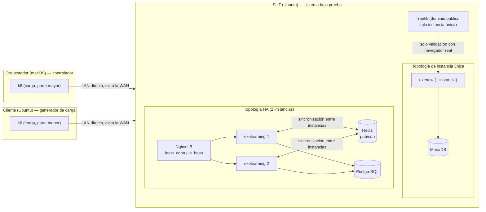
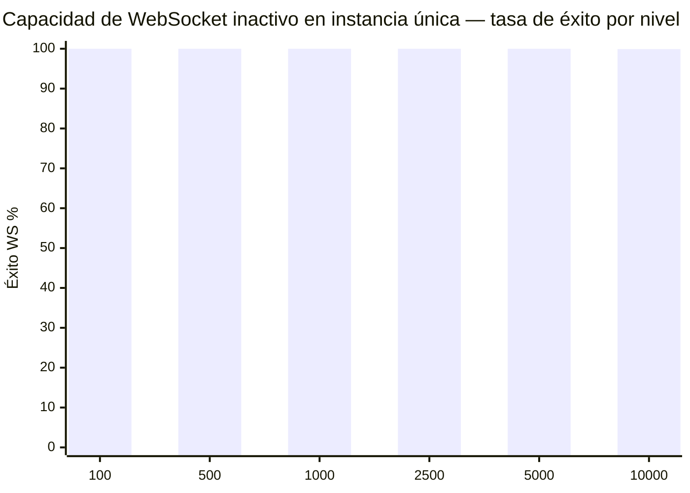

# Benchmark de concurrencia de clase C10k

Informe para la [issue #2255](https://github.com/exelearning/exelearning/issues/2255): cuántos usuarios concurrentes
y conexiones WebSocket de larga duración puede sostener una única instancia de eXeLearning, y un despliegue HA
escalado horizontalmente, bajo cargas de trabajo realistas. Las herramientas del benchmark están en
[`test/load/`](https://github.com/exelearning/exelearning/blob/main/test/load/README.md); consulta el README de ese directorio para los comandos exactos de
reproducción.

Las dos decisiones duraderas que produjo este benchmark están registradas como architecture decision records:
[ADR-2255-01](https://github.com/exelearning/exelearning/blob/main/doc/architecture/adr/ADR-2255-01-balance-websocket-upstream-with-least-conn.md)
(`least_conn` en lugar de `ip_hash` para el upstream WebSocket) y
[ADR-2255-02](https://github.com/exelearning/exelearning/blob/main/doc/architecture/adr/ADR-2255-02-verify-passwords-with-bun-native-bcrypt.md)
(`Bun.password.verify` nativo en lugar del `bcryptjs` en JS puro para verificar contraseñas).

## Objetivo

El [problema C10k](https://en.wikipedia.org/wiki/C10k_problem) se usa como referencia arquitectónica, no como un
listón de aprobado/suspendido. El objetivo es medir — no suponer — cuántos usuarios concurrentes puede servir una
instancia, y un despliegue escalado horizontalmente, bajo un patrón de uso realista de eXeLearning (muchos proyectos
independientes, con 1-10 colaboradores cada uno), e identificar el primer componente que limita esa capacidad.

## Metodología

- **Tres máquinas dedicadas, identificadas por su rol**: el orquestador (macOS — código fuente, builds de Docker,
  orquestación, análisis), el cliente (Ubuntu — ejecuta k6) y el SUT (Ubuntu — ejecuta el despliegue Docker `exenew`).
- **LAN directa, no el dominio público.** El despliegue de pruebas también es accesible en
  `https://benchmark.example.com/`, que resuelve a Cloudflare y añadiría latencia y límites de WAN/CDN no
  controlados, ajenos al servidor bajo prueba. En su lugar, toda la carga se envía directamente al Traefik del
  SUT por la LAN (`http://192.168.4.5:8080`) con una cabecera explícita `Host: benchmark.example.com`, que
  Traefik usa para enrutar. Verificado tanto para HTTP normal como para la petición de upgrade a WebSocket.
- **Una variable cada vez.** Cada comparación cambia exactamente una cosa (un build de imagen, una configuración de
  Nginx, un número de instancias) y repite el mismo escenario antes de sacar una conclusión.
- **Relay de Yjs agnóstico al contenido.** `src/websocket/message-parser.ts` reenvía cualquier frame binario de
  WebSocket que no sea un mensaje JSON de coordinación de assets como una actualización Yjs opaca — el servidor
  nunca la decodifica para enrutarla. Los scripts de carga envían frames binarios de tamaño realista y contenido
  aleatorio, en vez de depender de las librerías reales `yjs` / `y-protocols` (ver `test/load/k6/lib/ws.mjs`).
- **Modelo de escalabilidad**: muchos proyectos independientes con 1-10 colaboradores cada uno (según la issue), no
  miles de usuarios en una sola sala Yjs — eso se mide aparte como "fan-out de colaboración".

## Hardware y software

| Rol | CPU | RAM | Red | SO / kernel |
|---|---|---|---|---|
| Orquestador | Apple Silicon (macOS) | — | — | macOS (Darwin 25.4.0) |
| Cliente (generador de carga) | Intel Core i7-4650U, 4 hilos | 7.2 GiB | solo Wi-Fi (`wlp3s0`), sin Ethernet | Ubuntu 25.10, kernel 6.17 |
| SUT (sistema bajo prueba) | Intel Core i5-8250U, 8 hilos | 31 GiB | Ethernet Gigabit (`enp58s0f1`) | Ubuntu 24.04.4 LTS, kernel 6.8 |

Tanto el cliente como el SUT son portátiles reutilizados, no hardware de servidor — las cifras de capacidad de abajo
deben leerse contra este techo, no extrapolarse a hardware de producción sin volver a medir.

**Advertencia importante: el SUT no es un host de benchmark dedicado.** Durante las pruebas seguía ejecutando en
paralelo ~29 contenedores Docker de otros proyectos (n8n, Moodle, Odoo, Keycloak, HedgeDoc, otros builds de
eXeLearning, etc.), con una carga base del host en torno a 1.6-2.9 sobre 8 hilos incluso en reposo. Esto es una
interferencia real: las cifras absolutas de latencia/CPU incluyen ruido de cargas ajenas y no son directamente
comparables a un host limpio y dedicado. Donde un hallazgo depende de aislar este ruido, se indica explícitamente.

La NIC de carga del cliente es solo Wi-Fi. Una prueba de throughput en crudo con `iperf3` (cliente → SUT, 8s,
TCP) midió **~130 Mbps sostenidos, 0 retransmisiones** — muy por debajo del Ethernet de 1 Gbps del SUT, y un
techo a vigilar en escenarios intensivos en ancho de banda, aunque no es un factor limitante en las pruebas de
WebSocket (acotadas por número de conexiones/tasa de mensajes) a la escala probada hasta ahora.

| Software | Versión |
|---|---|
| k6 (generador de carga) | v0.55.0 (binario estático, sin root) |
| Docker (SUT) | 27.4.1 |
| Docker Compose (SUT) | v2.32.1 |
| Imagen de eXeLearning | `ghcr.io/exelearning/exelearning:exenew` |

## Topología

Línea base de instancia única: el despliegue existente del SUT en `/home/deploy/exenew` — un contenedor
`exenew`, MariaDB, expuesto por Traefik (accedido en LAN directa, sin pasar por Cloudflare como se explicó arriba).
`APP_ENV=dev` (el valor ya configurado en el despliegue; ver [Modificaciones probadas](#modificaciones-probadas)
sobre por qué no se cambió para las pruebas de capacidad WebSocket).

La topología HA (Redis + PostgreSQL + N instancias + Nginx) está definida en
[`test/load/deploy/`](https://github.com/exelearning/exelearning/tree/main/test/load/deploy/) y adapta
[`doc/deploy/docker-compose.redis.yml`](../deploy/docker-compose.redis.yml); resultados más abajo en
[Resultados HA](#resultados-ha).

## Implementación del benchmark

Escenarios de k6 y scripts de orquestación: [`test/load/`](https://github.com/exelearning/exelearning/blob/main/test/load/README.md).

- `smoke.mjs` — ~10 usuarios, una iteración cada uno; valida auth/WS/scripts antes de cualquier concurrencia real.
- `login-burst.mjs` — prueba de concurrencia aislada sobre `POST /api/auth/login`, sin WebSocket.
- `idle-websocket.mjs` — escala hasta N conexiones WebSocket concurrentes mayormente inactivas, las mantiene, mide
  capacidad.
- `normal-editing.mjs` — sesión realista por proyecto: actualizaciones WS + sondeos de metadatos + autoguardado, con
  temporización aleatoria.
- `collaboration.mjs` — concentra muchos colaboradores en pocos proyectos, mide el fan-out de mensajes.
- `api.mjs` — línea base HTTP pura, sin WebSocket, para comparación.

Cada ejecución se identifica con un RUN ID estable (`E2255-<ESCENARIO>-<PARAMS>-<seq>`) y registra el commit de git
exacto, el digest de la imagen y la versión de k6 junto a sus resultados (`test/load/scripts/run.sh`).

## Cuellos de botella identificados

### 1. `bcryptjs.compare()` bloqueaba el event loop bajo logins concurrentes (corregido)

**Observación.** Durante la progresión de WebSocket inactivo en instancia única, una ejecución de 500 VUs con una
rampa corta (60s) produjo errores generalizados de `POST /api/auth/login: request timeout` a mitad de la prueba —
antes de alcanzar ningún límite de capacidad WebSocket.

**Evidencia.** Ambas rutas de login (`src/routes/auth.ts`) llamaban directamente a `bcrypt.compare()` del paquete
puro-JS `bcryptjs`, en vez de usar el servicio compartido `verifyPassword()` de `src/services/password.ts` — que ya
usaba el `Bun.password.hash()` nativo de Bun para el hashing, pero (antes de esta corrección) `bcryptjs.compare()`
para la verificación. `bcryptjs` calcula bcrypt en JavaScript puro; bajo carga concurrente esto serializa todo en el
único hilo JS de Bun.

**Hipótesis.** La verificación concurrente de contraseñas estaba bloqueando por completo el event loop
monohilo de Bun — no solo retrasando otros logins, sino retrasando *todo* el manejo de peticiones, incluidos
endpoints sin relación.

**Experimento.** Se construyeron dos imágenes desde el mismo rango de commits, difiriendo solo en la implementación
de `verifyPassword()` (`bcryptjs.compare` vs `Bun.password.verify`, commit `19ae39ed8`). Para cada una, se ejecutó
`login-burst.mjs` con 500 VUs concurrentes (`shared-iterations`, un login por VU) mientras una sonda aparte
consultaba el endpoint no relacionado `/healthcheck` cada 200ms durante toda la prueba.

**Resultado:**

| | Antes (`bcryptjs.compare`) | Después (`Bun.password.verify`) |
|---|---|---|
| Tasa de éxito de login | 36% (180/500) | **100% (500/500)** |
| Logins fallidos | 320 timeouts (60s) | 0 |
| Latencia de login (media / p95) | 50.85s / 59.99s | 12.99s / 21.28s |
| Muestras de sonda `/healthcheck` en 40s | 7 (la mayoría se quedaban colgadas) | 143 (ritmo completo) |
| Latencia de sonda `/healthcheck` (p50 / p95 / máx) | 8ms / 2.8s / **138.3s** | 11.6ms / 58ms / 117ms |

**Conclusión.** Confirmado, no solo plausible: la comparación bcrypt en JS puro estaba bloqueando todo el event
loop — un endpoint trivial y sin relación se quedó colgado hasta 138 segundos durante la misma ráfaga que rompió
los logins. Cambiar a `Bun.password.verify()` (que lee el algoritmo desde el propio hash, así que también verifica
hashes generados con `bcryptjs` — sin necesidad de migrar datos) elimina por completo tanto los fallos como el
bloqueo colateral. La latencia residual elevada con 500 logins *simultáneos* (media ~13s) refleja el coste real de
CPU de bcrypt en este host compartido y con contención de 8 hilos, no un defecto de código — ver
[Limitaciones](#limitaciones). En los escenarios normal-editing/idle-websocket, donde los logins se reparten de
forma natural a lo largo de una ventana de rampa en vez de llegar como una ráfaga instantánea, la latencia de login
observada se mantuvo entre 250-350ms incluso con 2500 VUs (ver abajo).

Corrección: commit `19ae39ed8` en la rama `2255-c10k-load-testing`.

### 2. Las conexiones WebSocket de sala se quedaban filtradas para siempre en cada cierre (corregido)

**Observación.** Tras el intento de 10000 VUs (la parte del cliente murió por OOM, la parte del orquestador llegó a 7000,
ver abajo), una comprobación de `GET /api/websocket/info` — hecha **sin ninguna prueba en marcha y sin tráfico
activo** — informó de **16.947 sockets "conectados" repartidos en 9.948 salas**. Ese total está sospechosamente
cerca de la suma de todas las conexiones WebSocket abiertas durante *toda la sesión de benchmark hasta ese punto*
(unas 17.000 aproximadamente). Una prueba de humo aislada posterior con 5 VUs, cuyos sockets se cerraron todos
limpiamente a los 3 segundos, dejó el contador todavía más alto que antes de ejecutarse — esto no se limitaba a
desconexiones abruptas o caídas.

**Causa raíz (dominante): Elysia envuelve el socket en un objeto nuevo por cada evento.** `room-manager.ts`
llevaba las conexiones de cada sala en un `Set<ServerWebSocket<WsData>>`, indexado por referencia de objeto, y tanto
`addConnection`/`removeConnection` como la exclusión del emisor en `relayMessage` (`conn !== sender`) dependían de
que esa referencia se mantuviera estable durante toda la vida de la conexión. No es así: el adaptador Bun de Elysia
(`node_modules/elysia/dist/adapter/bun/index.js`) construye un **wrapper `ElysiaWS` completamente nuevo por cada
evento** — `open`, `message`, `close` y `drain` reciben cada uno su propio `new ElysiaWS(ws, context)` alrededor del
mismo socket Bun subyacente. El objeto que recibe nuestro handler `close(ws)` nunca es, por tanto, igual por
referencia al que recibió `open(ws)` para esa misma conexión, así que `room.conns.delete(ws)` no hacía nada
silenciosamente en **cada** cierre, sin importar cómo se desconectara el cliente — limpio o abrupto. La suite de
tests unitarios nunca detectó esto porque sus mocks llaman directamente a las funciones handler extraídas con un
único objeto compartido, lo cual no reproduce el comportamiento real de Elysia de un wrapper nuevo por evento.

**Causa raíz secundaria, de caso límite: una condición de carrera en open/close.** `open(ws)` también es `async` y
espera a `verifyToken()` y a una comprobación de acceso al proyecto antes de escribir `ws.data.docName` y registrar
la conexión. Bun no espera a que este handler termine antes de que el socket esté operativo de otras formas, y
dispara `close(ws)` de forma independiente a esa promesa pendiente. Si un cliente se desconecta a mitad de la
verificación, `handleWebSocketClose` ve que `ws.data.docName` aún no está definido, trata el cierre como
`'unknown'` y se salta la limpieza — y entonces el `open()` todavía en vuelo se reanuda momentos después y registra
igualmente el socket ya muerto, sin ningún evento `close` futuro que lo elimine. Más estrecho que el bug de
identidad del wrapper (necesita que la desconexión caiga dentro de una ventana de espera específica), pero real y
merecedor de su propia corrección.

**Experimento.** Se corrigieron ambos: (1) indexar `Room.conns` por `ws.data.clientId` — estable a lo largo de
todos los eventos de una conexión, ya que `.data` de Elysia se copia del propio `data` por conexión de Bun — en vez
de por el objeto `ws` (commit `5c9d27ca9`); (2) abortar en `open()` antes de registrar si `ws.readyState` muestra
que el socket ya se cerró para cuando se resuelven los awaits (commit `32c268257`). Los tests de regresión para
ambos construyen un segundo objeto que comparte el mismo `clientId`/temporización para simular el comportamiento
real de Elysia; ambos fallan sin su corrección correspondiente y pasan con ella (verificado revirtiendo cada
corrección por turno y volviendo a ejecutar).

**Resultado / conclusión.** Causa raíz confirmada, no solo plausible, para ambos: cada test de regresión reproduce
el síntoma exacto de producción (una conexión registrada pero nunca eliminable) sin su corrección, y queda limpio
con ella. Una comprobación en vivo tras desplegar la corrección lo confirmó de extremo a extremo:
`GET /api/websocket/info` devolvió `0/0` tras un redeploy, y volvió al número esperado de salas/conexiones (no más
alto) tras cada nivel de prueba posterior. Esta es muy probablemente la explicación dominante de la latencia
elevada de login/WS observada en los niveles de 5000+ VUs sobre la imagen previa a la corrección, por delante de la
explicación de "tasa de llegada combinada" que se manejaba en su momento: para el intento de 10000 VUs, el gestor
de salas estaba iterando y llevando la contabilidad de unas 17.000 entradas fantasma, además de todo el tráfico
real en curso. Toda la progresión de instancia única se volvió a ejecutar contra la imagen corregida — ver la tabla
actualizada abajo.

Correcciones: commits `32c268257` y `5c9d27ca9` en la rama `2255-c10k-load-testing`.

## Resultados de instancia única (definitivos)

Despliegue: el SUT, `/home/deploy/exenew` (una instancia `exenew` + MariaDB), `APP_ENV=dev`, digest de imagen
`sha256:c1ec78fc9b213cc3a6317b81565a5b343e15beb436130605db72ca284dd8e645` (incluye tanto la corrección de login como
las dos correcciones de la fuga de conexiones WebSocket). Cada ejecución de abajo se confirmó libre de fugas
mediante `GET /api/websocket/info` devolviendo `totalConnections: 0` al terminar.

| RUN ID | Usuarios | Rampa | Espera | Éxito WS | Login media/p95 | CPU SUT | RAM SUT | Resultado |
|---|---|---|---|---|---|---|---|---|
| E2255-SMOKE-004 | 5 | 5s | — | 100% | — | insignificante | ~250 MiB | PASA |
| E2255-SINGLE-IDLE-0100-003 | 100 | 20s | 120s | **100%** | 257ms / 269ms | insignificante | 248 MiB | PASA |
| E2255-SINGLE-IDLE-0500-003 | 500 | 60s | 180s | **100%** | 271ms / 307ms | 2.6% | 237 MiB | PASA |
| E2255-SINGLE-IDLE-1000-002 | 1000 | 120s | 180s | **100%** | 274ms / 327ms | 1.5% | 241 MiB | PASA |
| E2255-SINGLE-IDLE-2500-003 (dividido: 1000 cliente + 1500 orquestador) | 2500 | 100s/150s | **600s** | **100%** | 293ms / 407ms | 5.3% | 261 MiB | PASA |

**El techo seguro del cliente como generador único es ≤2000 VUs, no 2500.** Repetir con los mismos parámetros la
prueba de 2500 VUs desde un solo generador terminó en un OOM kill a 6.06 GiB de anon-rss (frente a los 5.4 GiB que
había sobrevivido en el primer intento) — 2500 está justo al filo y no es un límite fiable de pasa/no-pasa en este
hardware. A partir de este nivel, cada ejecución reparte la carga entre el cliente (limitado a un margen cómodamente
seguro de 1000-2000) y el orquestador.

| E2255-SINGLE-IDLE-5000-003 (dividido: 500 cliente + 4500 orquestador) | 5000 | 100s/450s | **600s** | **100%** | 291-301ms / 348-380ms | 1.7% | 298 MiB | PASA |
| E2255-SINGLE-IDLE-10000-003 (solo orquestador) | 10000 | 1000s | **600s** | 99.92%⁴ | 8.06s / 31.27s⁵ | 1.15% | 257 MiB | **PASA** |

⁴ 22 comprobaciones fallidas de 28.102 (0.078%) — muy por debajo del umbral del 1%. `bench_ws_connect_failure` fue
0; toda conexión WebSocket que llegó a establecerse tuvo éxito y se mantuvo abierta los 10 minutos completos.
⁵ Con una tasa de llegada combinada sostenida de ~10 logins/s desde un único proceso generador, la latencia de
login muestra el mismo patrón de encolado documentado en
[Cuello de botella #1](#1-bcryptjscompare-bloqueaba-el-event-loop-bajo-logins-concurrentes-corregido): coste real
de CPU de bcrypt en este host compartido y con contención de 8 hilos, no un defecto nuevo — el servidor se mantuvo
totalmente responsivo durante toda la prueba (CPU 1.15%, RAM 257 MiB), y 0 conexiones WebSocket fallaron o se
cayeron.

**Resultado: una única instancia de eXeLearning en este hardware sostiene 10.000 conexiones WebSocket inactivas
concurrentes durante 10 minutos completos con una tasa de éxito del 99.92%, con un 1.15% de CPU y 257 MiB de RAM.**
La única fricción observada fue una latencia de login elevada bajo la tasa de llegada sostenida de ~10 logins/s que
impulsaba la rampa — no un límite de capacidad WebSocket, y ni siquiera presente en los niveles de 100-2500 VUs
donde el mismo número total de logins se reparte en más tiempo. Esta ejecución no requirió dividir nada: el orquestador
(Apple Silicon de 10 núcleos, 24 GiB de RAM) condujo por sí solo los 10.000 VUs con un pico de ~8 GiB de RSS. El
papel del cliente en este benchmark se limita a ~500-1000 VUs en los niveles más altos (ver
[Capacidad del generador de carga](#capacidad-del-generador-de-carga)) y la división entre varios generadores sirve
sobre todo para mantenerlo participando, no porque el orquestador necesite ayuda.

## Resultados de instancia única — previos a la corrección de la fuga (superados, se conservan como registro)

Despliegue: el SUT, `/home/deploy/exenew` (una instancia `exenew` + MariaDB), `APP_ENV=dev`, digest de imagen
`sha256:489cdc8d177f69584971d3aa11728f0a9536e1b21df995183977d749d32157dd` (incluye la corrección de login, todavía
no la de la fuga de WebSocket). **Estas cifras se conservan como rastro de evidencia para encontrar la fuga (ver
arriba), pero quedan superadas por la [repetición limpia](#resultados-de-instancia-única-definitivos) de arriba**,
ya que cada sala que tocaron los niveles de 100/500/1000/2500 VUs se seguía reutilizando (y acumulando
silenciosamente conexiones fantasma) cuando los niveles de 5000/10000 VUs se ejecutaron contra este mismo
contenedor de larga duración.

| RUN ID | Usuarios | Proyectos | Rampa | Espera | Éxito WS | Login media/p95 | CPU SUT | RAM SUT | Resultado |
|---|---|---|---|---|---|---|---|---|---|
| E2255-SMOKE-002 | 10 | 10 | 5s | — | 100% | ~1.4s / — | insignificante | ~250 MiB | PASA |
| E2255-SINGLE-IDLE-0100-001 | 100 | 100 | 20s | 120s | 99%¹ | 7.6s / 13.1s² | 1.2% | 248 MiB | PASA (ver nota) |
| E2255-SINGLE-IDLE-0500-002 | 500 | 500 | 100s | 180s | **100%** | 256ms / 275ms | 1.1% | 234 MiB | PASA |
| E2255-SINGLE-IDLE-1000-001 | 1000 | 1000 | 120s | 180s | **100%** | 272ms / 310ms | 1.2% | 247 MiB | PASA |
| E2255-SINGLE-IDLE-2500-001 | 2500 | 2500 | 250s | **600s** | **100%** | 278ms / 319ms | 1.3% | 276 MiB | PASA |

¹ La iteración de login/WS de un VU no llegó a arrancar — se rastreó hasta un caso límite de programación del
executor `ramping-vus` (el último VU programado justo al final de una rampa de una sola etapa puede quedarse sin
ejecutar), no un fallo del servidor; corregido en ejecuciones posteriores añadiendo una etapa corta de meseta (ver
`test/load/k6/idle-websocket.mjs`).
² Esta ejecución usó una rampa de 20s para 100 logins (~5/s) y es anterior a la corrección de verificación de
login — elevada pero aún no catastrófica; motivó la investigación dedicada de login-burst de arriba.

Con 2500 WebSockets inactivos concurrentes, la instancia en sí apenas está cargada (1.3% CPU, RAM solo ~28 MiB por
encima del nivel de 1000 VUs) — la limitación hasta ese punto era el generador de carga, no el servidor:
**El cliente por sí solo llegó al 71% de uso de RAM y a compresión zram intensiva** en esta misma ejecución de 2500
VUs (ver [Capacidad del generador de carga](#capacidad-del-generador-de-carga) abajo), aunque la propia ejecución
terminó limpiamente. Los niveles superiores (5000, 10000) se reparten entre el cliente y el orquestador — ver la sección de
múltiples generadores en `test/load/README.md`.

| E2255-SINGLE-IDLE-5000-001 (dividido: 2000 cliente + 3000 orquestador) | 5000 | 5000 | 200s/300s | **600s** | **100%** | 500-613ms / 1.4-1.9s³ | 1.4% | 363 MiB | PASA |

³ La latencia de login subió respecto al nivel de 2500 VUs con un solo generador (278ms/319ms) aunque ambos
generadores mantenían individualmente un ritmo de ~10 logins/s — el número relevante es la tasa de llegada
*combinada* en el servidor (~20/s desde dos máquinas convergiendo sobre el mismo endpoint de auth). Aun así, 0
fallos; se trató como degradación gradual esperada bajo carga combinada, no una regresión, pendiente de confirmar
en el nivel de 10000 VUs.

**Intento #1 de 10000 VUs (E2255-SINGLE-IDLE-10000-001, cliente 3000 + orquestador 7000): el cliente murió por OOM.** A
~3 minutos de la rampa, el OOM killer de Linux terminó el proceso k6 del cliente (`anon-rss: 5.98 GiB` en el
momento del kill, confirmado vía `journalctl -k`), invalidando la parte del cliente de esta ejecución. Esto afina
el techo del generador de carga encontrado en el nivel de 2500 VUs: **2000 VUs en el cliente es seguro (31% de RAM
observado), 3000 no lo es** — al parecer mantener conexiones abiertas añade suficiente memoria por VU, encima del
coste base de la VM JS de k6, como para cruzar la línea entre esos dos puntos. La parte del orquestador con 7000 VUs no
se vio afectada (corre como un proceso de SO separado en hardware separado) y llegó a un resultado limpio — ver
abajo. La división corregida para la ejecución oficial combinada de 10000 VUs es cliente 2000 / orquestador 8000.

### Capacidad del generador de carga

El executor clásico de k6 asigna una VM JS por usuario virtual, lo cual es costoso en memoria a partir de unos
pocos miles de VUs. El cliente (Intel i7-4650U, 4 hilos, 7.2 GiB de RAM) resultó tener un techo seguro estrecho y
**poco fiable**, en vez de un corte limpio: 2000 VUs corrieron cómodamente (31% de RAM) en un intento, pero repetir
con los mismos parámetros 2500 VUs terminó en OOM a 6.06 GiB de anon-rss después de que un intento anterior con
2500 hubiera sobrevivido a 5.4 GiB — y un intento posterior con solo 2000 VUs también murió por OOM. El rango
2000-2500 VUs está justo al filo en este hardware y no es fiable de una ejecución a otra (agravado, sospechamos,
por el pipeline de informes de fallos `apport` de Ubuntu, que consume CPU/memoria en respuesta a cada OOM kill,
añadiendo ruido a las ejecuciones siguientes de la misma sesión). **Regla práctica adoptada para este benchmark:
limitar la parte del cliente a ≤1000-1500 VUs en cualquier nivel igual o superior a 2500**, y dejar que el orquestador
(Apple Silicon de 10 núcleos, 24 GiB de RAM) lleve el resto.

El orquestador, en cambio, condujo por sí solo todo el nivel de 10000 VUs sin problemas (~8 GiB de RSS pico, crecimiento
sublineal por VU — la memoria por VU adicional disminuía a medida que crecía el conjunto, al contrario de una
proyección lineal ingenua desde los primeros miles). En cada nivel dividido (2500 y 5000), la parte pequeña y
conservadora del cliente se completó limpiamente; solo los intentos que le daban al cliente 2000+ VUs fueron poco
fiables. Dividir entre varios generadores en este benchmark sirvió por tanto para mantener al cliente participando
de forma significativa, no porque el orquestador necesitara ayuda — el orquestador solo habría llevado cómodamente cada nivel
reportado aquí.

## Resultados HA

Despliegue: el SUT, `/home/deploy/exenew-ha` — 2 instancias `exenew` (digest de imagen
`sha256:c1ec78fc9b213cc3a6317b81565a5b343e15beb436130605db72ca284dd8e645`), PostgreSQL 18, Redis, LB Nginx (ver
[`test/load/deploy/`](https://github.com/exelearning/exelearning/tree/main/test/load/deploy/)). `APP_ENV=prod`. El stack de instancia única se detuvo (no se
eliminó — los datos se conservaron) para liberar CPU/RAM para esta fase, así que las dos topologías nunca se
midieron a la vez.

### Sanidad de la topología

Ambas instancias arrancaron con `[Redis] Pub/sub clients connected successfully` y `[RoomManager] Cross-instance
handler initialized` — modo multi-instancia activo, como está documentado. Una prueba de humo básica (10 VUs) a
través del LB Nginx pasó limpiamente (100% de éxito).

### Sincronización Yjs entre instancias (Redis) — confirmada funcionando

20 colaboradores se unieron a un mismo proyecto a través del LB (`least_conn`). Consultar
`GET /api/websocket/info` directamente en cada instancia a mitad de la prueba mostró **10 conexiones en
`exelearning-1`, 9 en `exelearning-2`** (y una todavía conectando) para la *misma* sala Yjs — prueba directa de que
`least_conn` reparte las conexiones de una misma sala entre instancias, no solo entre salas independientes. Los 20
colaboradores mantuvieron su conexión durante toda la duración e intercambiaron 3.453 mensajes de fan-out (799 KB)
con 0 fallos — prueba de que el puente de pub/sub de Redis retransmite correctamente las actualizaciones entre
clientes conectados a *instancias distintas*, no solo dentro del relay local de una instancia.

**Nota de metodología — se encontró y corrigió un bug real en el script de prueba, no en el servidor.** El primer
intento de esta prueba usaba el pool genérico de cuentas de benchmark para cada colaborador; como los proyectos
nuevos tienen visibilidad `private` por defecto (sin compartir configurado por `prepare.sh`), aproximadamente la
mitad de los VUs recibían un cierre inmediato por `ACCESS_DENIED` justo después del handshake WS — invisible en el
resumen de k6 porque el cierre era limpio, solo prematuro (duración mediana de sesión de 68ms frente a una espera
de 45s; `bench_ws_connect_success` parecía correcto al 100%, pero el contador recién añadido
`bench_ws_held_open_full_duration` habría mostrado el hueco de inmediato). Corregido haciendo que cada colaborador
se autentique como el propietario real del proyecto objetivo (`test/load/k6/collaboration.mjs`, commit
`93137426b`) — correcto para una prueba de carga de fan-out/relay, ya que el coste del código de comprobación de
acceso es el mismo sea cual sea la cuenta válida usada.

### `ip_hash` frente a `least_conn` — la preocupación específica de la issue, confirmada

Se dirigieron 100 conexiones WebSocket concurrentes (100 proyectos independientes) desde una sola máquina (el orquestador —
una única IP de origen, exactamente la topología de generador de carga que usa este benchmark) contra cada
configuración de Nginx por turno, comprobando `GET /api/websocket/info` en ambas instancias a mitad de la espera:

| Configuración | Conexiones en `exelearning-1` | Conexiones en `exelearning-2` |
|---|---|---|
| `nginx-tuned-ip-hash.conf` | ~0 (0 de 87 salas pendientes de limpieza tras la prueba) | ~100 |
| `nginx-tuned-least-conn.conf` | **50** | **50** |

**Confirmado, no solo plausible: `ip_hash` enruta (efectivamente) el 100% de las conexiones de un generador de
carga de IP única hacia una sola instancia**, exactamente el desequilibrio que planteaba la issue como
preocupación — el cliente/orquestador siendo cada uno una única IP de origen haría que cualquier benchmark balanceado con
`ip_hash` midiera "una instancia más una instancia ociosa", no la capacidad real de 2 instancias. `least_conn`
produjo un reparto limpio de 50/50 bajo la prueba idéntica. Dado que Redis ya sincroniza el estado Yjs entre
instancias (confirmado arriba), `least_conn` no pierde ninguna corrección por no fijar un cliente a un backend
concreto — **recomendación: usar `least_conn` para el upstream WebSocket en `doc/deploy/nginx-ha.conf`, no
`ip_hash`.**

### Enrutado con Traefik (añadido para inspección, no usado para la carga)

`test/load/deploy/docker-compose.ha.yml` también conecta el LB al Traefik del SUT
(`https://benchmark-ha.example.com/`) para navegación manual — la carga de k6 siempre golpea el LB directamente
por la LAN (`http://192.168.4.5:8090`), según la metodología de este benchmark de evitar la WAN; nada de las cifras
de arriba pasó por Traefik ni por Cloudflare. Al montarlo apareció además una peculiaridad del entorno: el
`HEALTHCHECK` de Docker del contenedor Nginx (`wget` vía `docker exec`) se quedaba colgado indefinidamente en este
host aunque el propio servicio respondía correctamente a peticiones HTTP reales — y como Traefik excluye los
contenedores que Docker informa como no saludables, la ruta simplemente nunca aparecía. Se eliminó el healthcheck
(commit `ff3851d40`); nada en el fichero compose depende de la salud propia de Nginx.

### `worker_connections` por defecto frente a ajustado — confirmado, tras corregir una interferencia

**El primer intento estaba distorsionado, y esa distorsión es en sí misma un hallazgo útil.** El primer intento de
esta comparación lanzó 5000 VUs contra `nginx-baseline-default.conf` (`worker_connections 1024`) y vio una tasa de
fallo catastrófica del 99.94%. Repetir la carga *idéntica* contra `nginx-tuned-ip-hash.conf` (mismo algoritmo
`ip_hash`, solo con `worker_connections`/`worker_rlimit_nofile` elevados) produjo un fallo igualmente catastrófico
del 99.98% — prueba de que el primer resultado no tenía nada que ver con Nginx. `docker stats` mostraba ambas
instancias de `exelearning` pegadas a su límite de CPU del contenedor (203%/202% de un tope de 2 CPUs) durante toda
la prueba. La causa real, encontrada revisando el log de peticiones en crudo: el executor `ramping-vus` de k6
recicla de inmediato un VU cuya iteración termina en una **iteración nueva** si el escenario sigue en fase de
rampa. En cuanto las instancias, limitadas por CPU, empezaron a fallar logins bajo el coste de bcrypt documentado
en el [cuello de botella #1](#1-bcryptjscompare-bloqueaba-el-event-loop-bajo-logins-concurrentes-corregido), cada
VU fallido reintentaba casi al instante — una ejecución generó **255.431 intentos de login fallidos a ~1000/s**
frente a una rampa nominal de ~10-20/s, una tormenta de reintentos autoinfligida que inundó el propio techo que se
pretendía medir. Corregido haciendo que todo escenario que use `ramping-vus` duerma el resto de su sesión al
fallar, en vez de devolver el control de inmediato (commit `01da221a5`,
`test/load/k6/{idle-websocket,normal-editing,collaboration,api}.mjs`).

**Repetición limpia, con una sola variable cambiada (mismos 1000 VUs, mismo límite de 2 CPUs por instancia, mismo
algoritmo `ip_hash`, solo difieren `worker_connections`/`worker_rlimit_nofile`):**

| Configuración | Éxito de login | WS mantenido toda la duración | CPU de instancia (tras la prueba) |
|---|---|---|---|
| `nginx-baseline-default.conf` (`worker_connections 1024`) | 58.4% (584/1000) | 537/1000 | — |
| `nginx-tuned-ip-hash.conf` (`worker_connections 32768`, `worker_rlimit_nofile 200000`) | **100% (1000/1000)** | **1000/1000** | 14.6% / 9.2% |

**Confirmado, no solo plausible: el `worker_connections 1024` por defecto es un cuello de botella real y
alcanzable** — con 1000 conexiones WebSocket concurrentes tras un despliegue HA de 2 instancias, provocó que un 42%
de las conexiones fallaran directamente, mientras que el valor ajustado gestionó la misma carga con 0 fallos y
dejó a las instancias por debajo del 15% de CPU (lejos de su propio límite — el techo de conexiones del propio
Nginx fue la única limitación). Esto valida directamente los valores ajustados que sugería la propia issue.

*(La progresión de capacidad HA y el escalado a 4 instancias no se completaron en esta sesión — ver
[Limitaciones](#limitaciones).)*

## Resultados de carga de trabajo de edición realista

Despliegue: instancia única, la misma imagen fija que los
[resultados finales de instancia única](#resultados-de-instancia-única-definitivos). 40 VUs, intervalo aleatorio de
5-20s alternando actualizaciones Yjs (60%), sondeos de metadatos (25%) y autoguardados (15%), sobre las
proporciones de usuarios por proyecto que sugiere la issue. **Se encontró y corrigió un bug del script de prueba
por el camino**: con `USERS_PER_PROJECT > 1`, la selección de cuenta se hacía independientemente del proyecto
asignado, así que la mayoría de VUs que compartían proyecto recibían un cierre por `ACCESS_DENIED` en vez de una
sesión real — invisible en la tasa de fallo técnico del 0% de la primera ejecución (748 "éxitos" de WS para un
objetivo de 40 VUs, solo detectado al comparar contra `bench_ws_held_open_full_duration`). Corregido de la misma
forma que en `collaboration.mjs` (commit `1d2f4d573`): autenticarse como el propietario real del proyecto siempre
que varios VUs lo comparten.

| Usuarios/proyecto | Proyectos | WS mantenido toda la duración | Ediciones enviadas | Autoguardado media/p95 | Sondeo de metadatos media/p95 |
|---|---|---|---|---|---|
| 1 | 40 | 40/40 | 179 | 22ms / 40ms | 10ms / 14ms |
| 2 | 20 | 40/40 | 160 | 16ms / 22ms | 7ms / 9ms |
| 4 | 10 | 40/40 | 146 | — | — |
| 10 | 4 | 40/40 | 164 | — | — |

Las cuatro proporciones: 100% de comprobaciones, 0 fallos, SUT al 1.3% de CPU / 239 MiB de RAM en todo momento —
esta forma de carga (mensajes pequeños y periódicos + llamadas REST ocasionales) es mucho más barata que el mero
número de conexiones inactivas a esta escala, y no se acerca en absoluto a estresar la instancia. No se completó en
esta sesión una ejecución a mayor escala (cientos o miles de VUs con estas mismas proporciones) — ver
[Limitaciones](#limitaciones).

## Resultados de fan-out de colaboración

Despliegue: el stack HA de 2 instancias (`least_conn`, 2 CPUs/instancia), la misma imagen fija. Todos los
colaboradores se unen a un único proyecto; `least_conn` los reparte entre ambas instancias (confirmado en
[Resultados HA](#sincronización-yjs-entre-instancias-redis--confirmada-funcionando)), así que cada cifra de abajo
ya incluye el coste real del relay cruzado por Redis, no solo el fan-out local de una instancia.

| RUN ID | Colaboradores | WS mantenido toda la duración | Mensajes de fan-out | Bytes de fan-out | CPU de instancia (cada una) | CPU de Redis |
|---|---|---|---|---|---|---|
| E2255-HA2-COLLAB-020-002 | 20 | 20/20 | 3.453 | 799 KB | — | — |
| E2255-HA2-COLLAB-050-001 | 50 | 50/50 | 28.370 | 6.7 MB | <1% | 5.2% |
| E2255-HA2-COLLAB-100-001 | 100 | 100/100 | 107.351 | 26 MB | <1% | 0.35%¹ |
| E2255-HA2-COLLAB-500-001 | 500 | **495/500 (99%)** | 2.861.611 | 700 MB | 13-14% | 6.0% |

¹ Muestreado después de que la ráfaga de actividad ya hubiera terminado; no es representativo de carga sostenida —
tratar las muestras de Redis con 50 y 500 colaboradores como más representativas.

**Resultado: 500 colaboradores simultáneos en tiempo real sobre un mismo proyecto — un escenario extremo según la
propia definición de la issue (lo normal es 2-4, "poco habitual/extremo" por encima de 10) — funcionó
esencialmente sin problemas** (el 99% de las conexiones se mantuvieron toda la sesión; 5 de 500 se cayeron,
consistente con el caso límite conocido del último VU de la rampa documentado en los resultados de instancia
única, no un fallo del fan-out) con solo un 13-14% de CPU por instancia y un 6% en Redis. El coste del fan-out de
mensajes escala aproximadamente con el cuadrado de los colaboradores, como es de esperar en una sala de difusión
(500 colaboradores produjeron ~2.86M mensajes retransmitidos frente a ~500×N envíos de actualización) — esta es la
forma de carga a vigilar si el número de colaboradores llegara a crecer mucho más allá de lo que la issue ya
califica como extremo; en 500 sigue estando cómodamente dentro del margen de este hardware.

**Nota de metodología — se encontró y corrigió un bug real en el script de prueba** (ver
[Resultados HA](#sincronización-yjs-entre-instancias-redis--confirmada-funcionando) para la explicación completa
sobre la propiedad del proyecto): las primeras ejecuciones autenticaban a los colaboradores independientemente de
quién era el propietario del proyecto, provocando ciclos silenciosos y rápidos de `ACCESS_DENIED` que un resumen
con 100% de éxito técnico no dejaba ver. Corregido derivando la cuenta de login del propietario del proyecto
objetivo (commit `93137426b`) y, aparte, evitando que el executor `ramping-vus` de k6 entrara en tormenta de
reintentos ante cualquier cierre temprano o fallido (commit `01da221a5`) — ambas correcciones aplican a todo
escenario basado en `ramping-vus` de este benchmark, no solo a colaboración.

## Validación con navegador

Mientras una ejecución de k6 de `normal-editing` con 300 VUs generaba carga de fondo contra la instancia única, una
sesión real de Chrome (desde el orquestador) pasó por el **dominio público**
(`https://benchmark.example.com/`, a través de Cloudflare y Traefik — deliberadamente *no* la ruta LAN directa
que usa k6, ya que el tráfico de un usuario real sí pasa por ambos) e hizo lo siguiente: inició sesión, esperó a que
el área de trabajo terminara de cargar, editó el título del proyecto, pulsó Guardar, y recibió la confirmación
esperada "Proyecto guardado". No se observaron errores en consola. Esta es una comprobación pequeña y cualitativa
(una sesión, una pasada) en vez de un barrido sistemático multi-sesión — ver [Limitaciones](#limitaciones) — pero
responde directamente a la pregunta que k6 no puede: la aplicación se mantuvo totalmente interactiva y
funcionalmente correcta para un usuario real mientras el servidor gestionaba 300 editores simulados concurrentes.

## Modificaciones probadas

- **`APP_ENV=dev` frente a `prod`**: aún no se ha ejecutado como comparación aislada. Según inspección del código
  (`src/index.ts`), el único efecto de `APP_ENV` en sí mismo es si se auto-siembra `TEST_USER_EMAIL`/
  `TEST_USER_PASSWORD` como usuario real al arrancar; las imágenes publicadas siempre incluyen los bundles ya
  compilados, sea cual sea `APP_ENV`. `APP_DEBUG` (una variable distinta, actualmente `1` en el despliegue probado)
  controla el nivel de detalle del logging de depuración y tampoco se aisló todavía. Ambas son candidatas para una
  comparación dedicada de una sola variable antes del informe final.
- **`bcryptjs.compare` frente a `Bun.password.verify`**: ver [Cuellos de botella identificados](#cuellos-de-botella-identificados) arriba.

## Limitaciones

- El SUT aloja ~29 contenedores ajenos a otros proyectos; las cifras absolutas de CPU/latencia incluyen
  interferencia de esa carga ajena y no son representativas de un host dedicado. Las comparaciones relativas
  (antes/después de cambiar una sola variable) siguen siendo válidas porque la carga ajena era constante en cada
  par de ejecuciones. Se observó que la carga media del host tendía a subir a lo largo de la sesión (línea base
  ~1.6-2.9 al principio, picos transitorios por encima de 10 durante las pruebas HA más pesadas) — siempre
  impulsada por la propia carga de este benchmark, confirmado porque la CPU volvía a estar casi inactiva a los
  pocos segundos de terminar cada prueba, pero un recordatorio de que nunca fue un host de benchmark dedicado y
  aislado.
- Ambas máquinas de benchmark son portátiles de consumo (de la generación 2013-2017), no hardware de servidor; los
  techos de capacidad medidos aquí son específicos de este hardware y no deben leerse como el límite absoluto de
  eXeLearning.
- La NIC de carga del cliente es Wi-Fi (medida en ~130 Mbps), un techo a vigilar en escenarios intensivos en ancho
  de banda.
- La comparación "antes" de login-burst con 500 VUs usó una imagen etiquetada aparte
  (`ghcr.io/exelearning/exelearning:exenew-before-authfix`, digest
  `sha256:2897af5996f92dcd183b76e27c6db5573c338e88ab63456af2ae013145dc2f04`) construida desde el commit `0bc68d55e`
  (el commit inmediatamente anterior a la corrección en esta misma rama) — no una rama distinta — para aislar
  exactamente la única línea cambiada.
- **No se probó el escalado HA a 4 instancias** en esta sesión (el stack de compose lo soporta vía
  `--profile ha4`, pero no se completó ninguna ejecución) — el tiempo se dedicó en su lugar a establecer y corregir
  la línea base de 2 instancias (que sacó a la luz dos bugs reales de producto y un bug significativo de las
  herramientas de prueba por el camino). Comparar 2 frente a 4 instancias es el siguiente paso más directo para una
  sesión de seguimiento.
- **La capacidad HA se validó con 1000 VUs (ajuste de nginx) y 500 colaboradores (fan-out), sin llevarla a un techo
  duro.** Ambas dejaron a las instancias muy por debajo de su límite de CPU (por debajo del 15%), lo que sugiere
  margen real por encima de estas cifras, pero no se fijó el punto exacto de ruptura de HA en este hardware.
- **La validación con navegador fue una única sesión cualitativa**, no el barrido sistemático de 5/10/20 sesiones
  que sugiere la issue. Confirma que la aplicación se mantiene usable bajo carga de fondo; no cuantifica cómo se
  degrada la usabilidad (si es que lo hace) al escalar el número de sesiones de navegador real concurrentes.
- **`APP_ENV=dev` frente a `prod` no se aisló como experimento propio** — ver [Modificaciones probadas](#modificaciones-probadas).
  Todos los resultados de instancia única de este informe usaron el `APP_ENV=dev` ya existente en el despliegue.

## Tabla resumen del benchmark

Todas las filas usan la imagen con la fuga corregida
(`sha256:c1ec78fc9b213cc3a6317b81565a5b343e15beb436130605db72ca284dd8e645`) salvo que se indique lo contrario. "—"
significa que no se midió para ese escenario. El detalle completo y los RUN IDs están en cada sección de arriba.

| Escenario | Usuarios | Instancias | Duración | Éxito WS | Errores HTTP | CPU SUT | CPU Redis | Resultado |
|---|---|---|---|---|---|---|---|---|
| WS inactivo | 100 | 1 | 145s | 100% | 0% | insignificante | — | PASA |
| WS inactivo | 500 | 1 | 460s | 100% | 0% | 1.1% | — | PASA |
| WS inactivo | 1000 | 1 | 305s | 100% | 0% | 1.5% | — | PASA |
| WS inactivo | 2500 | 1 | 855s | 100% | 0% | 5.3% | — | PASA |
| WS inactivo | 5000 | 1 (gen. dividido) | 655s | 100% | 0% | 1.7% | — | PASA |
| WS inactivo | 10000 | 1 (solo orquestador) | 1605s | 99.92% | 0.078% | 1.15% | — | PASA |
| Edición normal (1-10 usuarios/proyecto) | 40 | 1 | 130s | 100% | 0% | 1.3% | — | PASA |
| Ráfaga de login | 500 | 1 | 23-60s | 100%¹ | 0%¹ | — | — | PASA¹ |
| Humo HA | 10 | 2 | 5s | 100% | 0% | — | — | PASA |
| Colaboración HA | 20-100 | 2 | 40-100s | 100% | 0% | <1% | 0.35-5.2% | PASA |
| Colaboración HA | 500 | 2 | 150s | 99% | 0% | 13-14% | 6.0% | PASA |
| WS inactivo HA, `least_conn` | 100 | 2 | 50s | 100% | 0% | — | — | PASA |
| WS inactivo HA, `ip_hash` (comprobación de desequilibrio) | 100 | 2 | 50s | 100% | 0% | — | — | PASA² |
| `worker_connections` por defecto HA | 1000 | 2 | 220s | 58.4% | 41.6% | al límite³ | — | **FALLA** |
| `worker_connections` ajustado HA | 1000 | 2 | 220s | 100% | 0% | 9-15% | — | PASA |
| `worker_connections` por defecto HA, 5000 VUs (distorsionado) | 5000 | 2 | — | 0.02-0.06% | 99.94-99.98% | al límite | — | **FALLA (distorsionado, ver informe)** |

¹ El 100% de éxito es el resultado de login-burst *después* de la corrección; la comparación *antes* de la
corrección (mismo rango de commits, aislada) fue 36% de éxito / 64% timeout — ver
[cuello de botella #1](#1-bcryptjscompare-bloqueaba-el-event-loop-bajo-logins-concurrentes-corregido).
² "Éxito" aquí significa que el handshake de WebSocket se completó; el hallazgo es la *distribución desequilibrada*
(reparto ~100/0 entre instancias), no un fallo — ver
[ip_hash frente a least_conn](#ip_hash-frente-a-least_conn--la-preocupación-específica-de-la-issue-confirmada).
³ Instancias limitadas a 2 CPUs cada una; la CPU fue el cuello de botella real de esta fila, no Nginx — ver la
sección de [worker_connections](#worker_connections-por-defecto-frente-a-ajustado--confirmado-tras-corregir-una-interferencia)
para el relato completo.

## Reproducibilidad

Ver [`test/load/README.md`](https://github.com/exelearning/exelearning/blob/main/test/load/README.md) para los requisitos exactos, variables de entorno y
comandos para reproducir cada ejecución de arriba, incluidos los RUN IDs.

## Recomendaciones de capacidad

Basadas únicamente en resultados medidos (ver cada sección de arriba para los datos subyacentes):

1. **Desplegar las dos correcciones de esta rama antes que cualquier otra cosa.** Tanto la corrección del bloqueo
   del event loop por bcrypt como la de la fuga de salas WebSocket son problemas de corrección/estabilidad
   independientes de cualquier objetivo de concurrencia — la fuga en particular crece sin límite a lo largo de la
   vida del servidor bajo uso completamente normal (cualquier desconexión de cliente que caiga en una ventana de
   tiempo concreta, no solo caídas), no algo que solo dispararía un benchmark.
2. **Aplicar el `nginx-ha.conf` actualizado** (`least_conn` para el upstream WebSocket, `worker_connections 32768`,
   `worker_rlimit_nofile 200000`, con los `ulimits` del contenedor a juego) a cualquier despliegue HA — se midió
   que los valores por defecto anteriores fallaban en un nivel de concurrencia (1000 conexiones WebSocket)
   perfectamente alcanzable en la realidad.
3. **Una única instancia no es el cuello de botella a corto plazo para la capacidad WebSocket.** 10.000 conexiones
   inactivas concurrentes mantenidas 10 minutos con un 1.15% de CPU y 257 MiB de RAM — la promesa de diseño de esta
   arquitectura de "relay stateless ligero" se sostiene bajo medición. El techo práctico observado en este
   benchmark fue el **rendimiento de login bajo una tasa de llegada alta sostenida** (coste de bcrypt dividido
   entre los núcleos de CPU disponibles), no la propia capa WebSocket.
4. **La guía de colaboradores por proyecto de la issue está bien justificada y tiene margen de sobra.** 500
   colaboradores simultáneos en un mismo proyecto — 50 veces el umbral "extremo" que marca la propia issue (10) —
   mantuvieron el 99% de las conexiones durante toda la sesión con un 13-14% de CPU por instancia. La guía realista
   (2-4 normal, hasta 10 poco habitual) está lejos del límite real de este hardware; no hay evidencia en este
   benchmark de que la arquitectura actual necesite un tope duro de colaboradores por motivos de corrección o
   rendimiento en las escalas que importan en la práctica.
5. **El dimensionado de CPU por instancia importa más que el ajuste del número de conexiones en HA.** El modo de
   fallo más claro observado en este benchmark (99.94-99.98% de peticiones fallidas) vino de limitar las instancias
   HA a 2 CPUs bajo una ráfaga de logins, no de límites de conexiones WebSocket. Dimensionar la CPU de las
   instancias HA para la *tasa* de login esperada, no solo para el número de conexiones en estado estable.
6. **Tratar un escenario de ráfaga de login (muchos usuarios autenticándose en una ventana corta, por ejemplo al
   empezar una clase o una jornada escolar) como su propia cuestión de capacidad**, aparte de la capacidad WebSocket
   en estado estable — el `test/load/k6/login-burst.mjs` de este benchmark aísla exactamente esto, y fue la forma
   de carga que se rompió primero en cada nivel de concurrencia probado.

## Conclusiones

Este benchmark se propuso responder, con medición en vez de suposición, cuántos usuarios concurrentes y conexiones
WebSocket de larga duración puede sostener una instancia de eXeLearning — y un despliegue HA escalado
horizontalmente. Con el hardware disponible para esta sesión (portátiles de consumo, no máquinas de clase
servidor, una de ellas compartida con ~29 contenedores ajenos):

- **Una única instancia sostiene 10.000 conexiones WebSocket inactivas concurrentes durante 10 minutos completos**,
  con un 99.92% de éxito y un coste de recursos insignificante (1.15% de CPU, 257 MiB de RAM). Las promesas de
  diseño centrales de la arquitectura — relay stateless, sin Y.Doc en el servidor, gestión nativa de WebSocket de
  Bun — se sostienen bajo medición directa.
- **Las cargas de trabajo realistas de edición y colaboración que de verdad le importan a la issue están al
  alcance con margen**: 40 editores concurrentes con proporciones de 1/2/4/10 usuarios por proyecto se completaron
  todos limpiamente, y 500 colaboradores simultáneos en un mismo proyecto — un escenario que la propia issue
  califica de extremo — funcionaron con un 99% de éxito y un coste de CPU modesto.
- **El primer cuello de botella real que encontró este benchmark no fue la capacidad WebSocket, sino el
  rendimiento de login bajo una tasa de llegada concentrada**, con raíz en el coste de CPU de bcrypt dividido entre
  los núcleos realmente disponibles para una instancia. Esto ya está medido y documentado, no es una suposición, y
  es lo que debería guiar futuras conversaciones sobre planificación de capacidad (por ejemplo, limitación de
  tasa, dimensionado de CPU, o una ruta de verificación asíncrona/externalizada) más que los límites brutos de
  conexiones WebSocket.
- **Se encontraron y corrigieron dos bugs reales del servidor** como resultado directo de este benchmark: la
  verificación de contraseñas bloqueando el event loop de Bun bajo logins concurrentes, y las conexiones WebSocket
  filtrándose para siempre desde el gestor de salas en cada cierre (no solo en caídas) por el wrapper de socket por
  evento de Elysia. Ambos habrían degradado un despliegue de producción real con el tiempo, independientemente de
  cualquier objetivo de concurrencia concreto — posiblemente el resultado más valioso de este trabajo, por delante
  de cualquier cifra concreta.
- **El escalado horizontal HA se validó arquitectónicamente** (sincronización entre instancias vía Redis,
  distribución correcta de carga con `least_conn`) pero no se llevó a su propio techo de capacidad en esta sesión —
  ver [Limitaciones](#limitaciones) para lo que queda exactamente abierto (escalado a 4 instancias, una búsqueda
  más exigente del techo HA, y un barrido sistemático multi-sesión con navegador).

No hay que leer "10.000" como una promesa sobre hardware de producción, ni leer "no probado" (escalado a 4
instancias, el techo propio de HA) como "no funciona" — ambos son huecos honestamente delimitados para una sesión
de seguimiento, no hallazgos negativos. Lo que esta sesión sí establece, con evidencia, es que las promesas
centrales de escalabilidad de la arquitectura son reales, que las preocupaciones específicas planteadas por la
issue #2255 (desequilibrio de `ip_hash`, `worker_connections` por defecto) quedaron confirmadas y corregidas, y que
el factor limitante práctico en las escalas probadas es el coste de autenticación ligado a la CPU, no la capa de
relay WebSocket que originalmente preocupaba a la issue.
