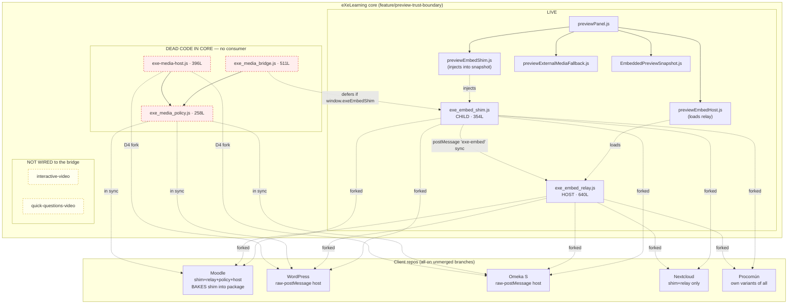

# External media — inventory, measurements and blocking decisions (Phase 0)

Status: **Phase 0 deliverable + the pre-phase fixes it recommended (§10).**
Date: 2026-07-26
Core revision surveyed: `1310d1c5c` on `feature/preview-trust-boundary`

This document is the gate for the `exe_external_media` unification. It records
what the code actually does today across seven repositories, the results of the
seven blocking spikes (S1–S7), and the points where the design brief's premises
turned out to be false against the real code.

Every claim below is tagged:

- **[M]** measured — a command was run, output reproduced here
- **[R]** read — established by reading the source
- **[A]** assumed — inference, not verified

---

## 0. Executive summary — read this first

Seven findings change the plan. Four are blocking.

> **Update 2026-07-26 — F1 and F2 are resolved.** F1 was a real defect and is now
> fixed (handshake-gated activation, unit + three-engine E2E coverage). F2 turned
> out **not** to be a code regression: the attribution to a specific commit did not
> survive repetition, and the benchmark itself was the faulty instrument. Both are
> described accurately in §4/S1 and §10 below; the original claims are kept struck
> through so the correction is traceable.

| # | Finding | Severity | Evidence |
|---|---|---|---|
| **F1** | **The child shim destroys external embeds and leaves a permanent black box when no host answers.** No handshake, no timeout, no fallback. Reproduced in Chromium, Firefox and WebKit. — **FIXED**, see §10 | **Blocking** | S6 [M] |
| **F2** | ~~A real preview performance regression landed in `3912530b3`~~ — **RETRACTED.** No commit-level attribution survives repetition. The benchmark's run-to-run spread exceeds the effect it was gating on; the **instrument** was wrong, not the code. **FIXED**, see §10 | Was "blocking"; now a test-infrastructure fix | S1 [M] |
| **F3** | **The two subsystems are not both live.** The whole `exe_media_bridge/` trio is **dead code in core** — no exporter ships it, no iDevice calls it, nothing injects it. | **Blocking** (rewrites §2.2, §5.8, §8.1 of the brief) | [M] |
| **F4** | **Licence mismatch for Phase 6.** Core is AGPL-3.0; the Moodle plugin declares GPL-3.0-or-later. ~~AGPL and GPLv3 are mutually incompatible~~ — **that was wrong**: GPLv3 §13 and AGPLv3 §13 expressly permit *combining* them. The real constraint is narrower: combination never *relicenses* a file, so an AGPL-only file cannot be redistributed under GPLv3 terms. **RESOLVED** by a dual grant from the copyright holder, see §10 | Was "blocking"; resolved for the shared pair | S5 [M] |
| **F5** | Ownership of the canonical source is **contradicted in-tree**: core's file headers claim core is canonical; `check-embed-sync.mjs` states Moodle is canonical for shim/relay. | High | [R] |
| **F6** | The brief's **10% relative performance gate is the wrong instrument** — it flaps on a ~9 ms quantity and cannot distinguish noise from the real regression it is meant to catch. | High | S1 [M] |
| **F7** | WordPress and Omeka already **replaced the SDK adapters with raw `postMessage`**. The brief's §5.9 SDK loader is a step backwards from shipped code. | High | [M] |

**Recommendation, now carried out (see §10): F1 and F2 were closed before Phase 1.**
F1 was a live content-breaking defect and is fixed in core and in all five clients.
F2 turned out to be a faulty measuring instrument rather than a code regression, and
the benchmark gate was rebuilt. F4 is resolved for the shared pair by a dual licence
grant. F3, F5, F6 and F7 remain open inputs to the design phases.

---

## 1. Inventory

### 1.1 Core files

All five live on `feature/preview-trust-boundary` only. **None exists on `main`.** [M]

```
$ git ls-tree -r main --name-only | grep -E 'exe_embed_bridge|exe_media_bridge'
(no output)
```

| File | Lines | Raw | Gzip | Public surface | Live consumer in core |
|---|--:|--:|--:|---|---|
| `exe_embed_bridge/exe_embed_shim.js` | 354 | 14 564 | 4 538 | `window.exeEmbedShim`, `module.exports` — `isOpaqueOrigin`, `isPdfUrl`, `isCrossOriginHttps`, `isPromotable`, `extractProvider`, `promote`, `collect`, `init` | **Yes** — editor preview snapshot |
| `exe_embed_bridge/exe_embed_relay.js` | 640 | 29 755 | 8 585 | `window.exeEmbedRelay` — `validate`, `makePlayer`, `createRelay`, `reconstructProvider`, `isCrossOriginHttps`, `normalizeHost`, … | **Yes** — editor preview host |
| `exe_media_bridge/exe_media_policy.js` | 258 | 9 397 | 3 062 | `window.exeMediaPolicy` — `parseExternalMedia`, `canonicalEmbedUrl`, `validateCommand`, `validateEvent` | **No — dead** |
| `exe_media_bridge/exe_media_bridge.js` | 511 | 21 146 | 6 169 | `window.exeMediaBridge` — `shouldUseBridge`, `createBridgeController`, `ensureSession`, `openMedia`, `scanAndReplace` | **No — dead** |
| `exe_media_bridge/exe-media-host.js` | 396 | 16 283 | 4 446 | `window.exeMediaHost` — `attach`, `buildModal` | **No — dead** |

Sizes [M] via `gzip -9c`. Concatenated child candidate (shim+policy+bridge),
unminified: **45 107 raw / 12 551 gzip**. This is the starting point for the
§10.4 size budget — see §6.

### 1.2 F3 — the media bridge is dead code in core

Verified by exhaustive search of exporters, build scripts, resource-bundle
registration and iDevice runtimes: [M]

```
$ grep -rn 'exe_media_bridge|exe_media_policy|exe-media-host' \
    src/shared/export/ scripts/ public/app/common/exe_export.js package.json
(no output)

$ grep -rn 'exeMediaBridge|openMedia' \
    public/files/perm/idevices/base/interactive-video/ \
    public/files/perm/idevices/base/quick-questions-video/
(no output)
```

Consequences for the brief:

- **§2.2** describes the media bridge as one of "the two current subsystems". In
  core it is an orphan. It is live only in the **plugins**, which carry their own
  forks.
- **§8.1** specifies migrating `previewMediaHost.js`. **That file no longer
  exists** — it was deleted in `d6313e59c` ("Drop the unused media bridge from the
  preview embed host") and survives only as a stale artefact under
  `dist/static/`. §8.1 must be rewritten against `previewEmbedHost.js`. [M]
- **§5.8** assumes interactive-video drives the media bridge. In core it does
  not; there is no wiring at all. The three-level model still holds as a *target*,
  but level 3 has no existing implementation in core to preserve.

Nothing in core is currently at risk from changing the media bridge. That is
good news for sequencing: it can be redesigned freely; only the plugins have
behaviour to protect.

### 1.3 Injection sites — who ships the child code

| Context | Ships the child? | Mechanism |
|---|---|---|
| Core — editor preview | **Yes**, shim only | `previewEmbedShim.js` writes one copy at snapshot root + `<script src>` per page; `previewPanel.js:1011` |
| Core — HTML5 / SCORM / ePub / IMS export | **No** | No exporter references any bridge file [M] |
| Core — static build | **No** | Not in `build-static-bundle.ts` or `build-resource-bundles.js` [M] |
| Moodle | **Yes**, shim baked into package | `package_manager.php:259` copies it; `scorm_injector.php:109` injects `<script src="{$libs}exe_embed_shim.js">` [M] |
| WordPress / Omeka / Nextcloud / Procomún | Host side only | They ship relay/host, not a baked child |

This matters for F1: the black-box defect is a **present** risk for
Moodle-delivered packages and a **future** risk for core the moment the brief's
plan to ship the child bundle inside exports is implemented.

### 1.4 Client copies — corrected inventory

An early pass of this inventory undercounted: WordPress and Omeka use hyphenated
filenames (`exe-embed-relay.js`), not the core underscore convention. Corrected,
git-tracked copies: [M]

| Repo | Branch | Tracked copies |
|---|---|---|
| mod_exelearning_2 | `feature/secure-iframe-scorm-bridge` | `js/exe_embed_{relay,shim}.js`, `js/exe_media_{host,policy}.js`, 3 under `tests/e2e/embed/`, `tools/check-embed-sync.mjs` |
| wp-exelearning_2 | `feature/secure-iframe-sandbox` | `assets/js/exe-{embed-relay,embed-shim,media-host,media-policy}.js` |
| omeka-s-exelearning | `feature/secure-iframe-sandbox` | `asset/js/exe-{embed-relay,embed-shim,media-host,media-policy}.js` |
| nextcloud-exelearning | `feature/secure-iframe-sandbox` | `src/embed/exe_embed_{relay,shim}.js` |
| procomun | `feature/secure-iframe-sandbox` | `apps/frontend/public/elpx/exe_{embed_relay,media_host,media_policy}.js`, `apps/api/static/elpx/embed-shim.js` |

All five clients are on unmerged feature branches. Core's copies are likewise
unmerged. **Nothing in this programme is on any `main` yet.**

---

## 2. Duplication matrix

Semantic hash = comments stripped, all whitespace removed, quotes normalised.
Same hash ⇒ token-identical logic. [M]

| Logical file | core | moodle | wp | omeka | nextcloud | procomun | Distinct impls |
|---|---|---|---|---|---|---|--:|
| **shim** | `9888f83a` | `9888f83a` | `4603d083` | `4603d083` | `9888f83a` | `08ddaaa5` | **3** |
| **relay** | `05703392` | `e6abb46f` | `bb60faba` | `715afb5c` | `05703392` | `0493d517` | **5** |
| **policy** | `d8977160` | `d8977160` | `d8977160` | `d8977160` | — | `30b73533` | **2** |
| **media host** | `6410e05b` | `f1d1bdf6` | `f1d1bdf6` | `d8da798d` | — | `5c1cf521` | **4** |
| **child bridge** | `b6b0dce4` | `cbfe245b` | — | — | — | — | **2** |

### 2.1 Exact duplications (safe to collapse)

- shim: **core = moodle = nextcloud** (moodle adds only a GPL header and renames
  DEC references)
- relay: **core = nextcloud** (byte-identical)
- policy: **core = moodle = wp = omeka** — the one genuinely shared file, and
  the only place the "single source of truth" claim currently holds

### 2.2 Divergent duplications (regression risk, named individually)

| # | Divergence | Risk |
|---|---|---|
| **D1** | **wp + omeka shim** is a different generation (280/278 lines vs 354). Has all security features (`extractProvider`, `ResizeObserver`, `transitionend`, provider attributes) but `collect`/`run` are inlined. | Low — feature-equivalent, structurally forked |
| **D2** | **moodle relay** omits `clear` and `reflow` from the returned API. | Low — core added them for the slide-out preview panel; Moodle has no such panel |
| **D3** | **procomun relay + policy** are Prettier-reformatted (tabs, double quotes) **and drop `'use strict'`**, and convert the IIFE to an arrow function. | Medium — sloppy-mode execution is a real semantic change; arrow IIFE drops ES5 compatibility for a file claimed to be `file://`-safe |
| **D4** | **wp + omeka media host** replaced the SDK adapters with **raw `postMessage`** adapters (`youtubeRawAdapter`, `vimeoRawAdapter`, `ytCommand`, `parseYtEvent`, …). Core still uses `YT.Player` / `Vimeo.Player`. | **High** — two incompatible provider-control architectures. See F7 / §7 |
| **D5** | **wp media host** additionally has `closeActive` / `closeAll` (multi-session lifecycle) that neither core nor omeka has. | Medium — silent behavioural divergence in teardown |
| **D6** | **omeka media host** is `wp` minus D5 — a third variant. | Medium |
| **D7** | **procomun media host** (672 lines) is its own variant again. | Medium |
| **D8** | **moodle `tests/e2e/embed/exe_media_bridge.js`** (588 lines) diverges from core's 511-line original. | Low — test fixture, but it is the only surviving consumer of the child bridge |

### 2.3 F5 — contradictory ownership

`mod_exelearning_2/tools/check-embed-sync.mjs`, lines 4–9: [R]

> the promote-to-parent EMBED relay/shim … **mod_exelearning is canonical**,
> wp/omeka/procomun mirror it; and the MODAL media bridge … **eXe core is
> canonical for the policy**; the host copies (mod canonical, …) mirror the
> raw-postMessage host (**core ships a separate SDK-based host fork**, so it is
> not a 'mediahost' target).

`public/app/common/exe_embed_bridge/exe_embed_shim.js`, lines 21–24: [R]

> **CANONICAL SOURCE** for the eXeLearning embedder family **lives here in
> eXeLearning core** … The host plugins … mirror this logic.

Both cannot be true. Note the script also **explicitly blesses the D4 fork** —
so the SDK-vs-raw split is a recorded decision, not accidental drift.

~~Also false in core's headers: "Verified by core `scripts/check-embed-sync.mjs`".~~
**Corrected 2026-07-26.** That sentence is in **Moodle's** mirrors
(`mod_exelearning/js/exe_embed_shim.js:39`, `exe_embed_relay.js:44`), not in core's
headers; `git log -S` confirms the string never existed in core. [M] The finding itself
stands and is if anything sharper: a *client* repo tells its readers that a script in
core verifies the mirrors, and **no such script exists in core**. The invariant is
asserted by the copy that would be caught breaking it.

The script it names does exist in Moodle, and its own comment says: "This is **NOT yet a
CI gate** (there is no shared CI infra across the repos)". Nothing verifies these
invariants automatically. [M]

Running it across all five repos today: **20/20 ok, no drift**. [M] That is
because it checks for the *presence of ~10 substrings*, not equivalence — it
passes happily across the five distinct relay implementations in §2. It is a
smoke test mislabelled as a sync gate.

---

## 3. Dependency graph



---

## 4. Spike results

### S1 — cost of the filtered preview vs `main` — **the 10% gate is refuted; the design holds**

Harness: the repo's own `test/benchmarks/preview/` (real Chromium, self-comparing:
each run measures the `main` arm and the `filtered` arm in the same browser).

**Committed baseline** (`comparison.json`, recorded `gitSha: 20fcbac61`, 7 samples):
SMALL +7.1%, MEDIUM 0.0%, LARGE +1.0% — all pass. [R]

**At HEAD `1310d1c5c`, 7 samples** — gate already fails: [M]

| | main | filtered | Δ | gate |
|---|--:|--:|--:|:--:|
| SMALL | 10.4 ms | 11.4 ms | +9.6% | pass |
| MEDIUM | 9.7 ms | 9.5 ms | −2.1% | pass |
| LARGE | 10.0 ms | 11.2 ms | **+12.0%** | **fail** |

**At HEAD, 25 samples, three independent runs** — stable failure: [M]

| run | SMALL | MEDIUM | LARGE |
|---|--:|--:|--:|
| 1 | +8.6% | +24.1% | +28.4% |
| 2 | +9.1% | +23.3% | +29.4% |
| 3 | +21.8% | +20.2% | +28.2% |

The 7-sample runs are too noisy to characterise this; 25 samples resolve it.

**Is it a regression, or was the gate always marginal?** Ported the current
harness onto older trees and re-ran identically (same machine, 25 samples, back
to back). A **first pass with one run per commit** looked like a clean bisect: [M]

| Commit | Subject | LARGE Δ (n=1) |
|---|---|--:|
| `91934a164` | keep PDF/media object/embed in the filtered preview | +12.2% |
| `e3fc6a167` | make the opaque-serving cookie assertion cross-browser | +14.6% |
| **`3912530b3`** | **Inline whitelisted external videos in the preview** | **+27.7%** |
| `860aebbbb` | Trust the Mediateca Madrid media library | +25.0% |

**That attribution did not survive repetition — it is retracted.** Repeating the
two *adjacent* commits three times each: [M]

| Commit | LARGE Δ, three runs |
|---|--:|
| `e3fc6a167` (parent) | +5.5%, **+24.4%**, +9.3% |
| `3912530b3` (child) | +9.2%, +23.2%, +33.7% |

The ranges overlap almost completely: the parent produced +24.4% on its own, well
inside the "regressed" band. The earlier triples that looked tight were luck, not
a property of the harness.

**Corrected conclusion (this is F2):** there is **no demonstrated regression at
any commit**. The benchmark's run-to-run variance on identical code exceeds the
entire effect size it was gating on, so it cannot support commit-level
attribution — and a 10% relative gate on it is meaningless in both directions
(false failures, and real regressions hidden inside the same band).

Two independent measurements pin the actual cost: [M]

- **The content policy, measured in isolation** (both versions of
  `previewContentPolicy.js`, same bodies the harness builds, 40 samples in
  Chromium): **0.2 / 0.8 / 1.4 ms** for the 3 / 25 / 50-page fixtures — and
  **identical before and after `3912530b3`** (delta −0.0% / 0.0% / 0.0%). Benign
  pages cost ~0 ms; only the sanitized active pages cost ~0.1 ms each.
- **End-to-end**, the filtered arm costs **+0.5 to +2.9 ms** over the unfiltered
  one across every tree measured, on an ~8–10 ms baseline.

So the policy is cheap, it did not get more expensive, and the harness was the
faulty instrument. The fix belongs in the benchmark, not in the product code —
see §10.

Provenance note: the harness did not exist at `20fcbac61`. It was committed
later as `eaf951bef`; `comparison.json` records the *working-tree* HEAD at the
time of the author's run. That is why a naive `git checkout 20fcbac61` cannot
reproduce it. [M]

**Decision.** The architectural choice (Service Worker + filtering as the default
fast path) **holds, and is confirmed rather than merely assumed** — the absolute
cost is **1–3 ms** on an 8–10 ms generation step, of which the policy itself is
~1.4 ms, inside a 500 ms-debounced refresh whose SW hand-off and iframe reload are
excluded from the measurement entirely. Nobody can perceive it.

The brief's §10.4 "within 10% of main, with an `expect()` that fails the build"
must **not** be adopted as written; see F6 and §10.

### S2 — headers on `online.exelearning.net` — **the brief's hypothesis is wrong; its conclusion is right**

[M] `curl -I https://online.exelearning.net/`:

```
HTTP/1.1 200 OK
Server: nginx/1.23.2
Content-Type: text/html
Set-Cookie: cookiesession1=…;Path=/;HttpOnly
```

- It is **plain nginx 1.23.2**, not Cloudflare Pages. No `cf-ray`, no CDN
  fingerprint. The brief's `_headers` reasoning does not apply.
- It serves the **static PWA** (v4.0.2) and **does serve `preview-sw.js`**
  (200, 44 351 bytes) — the Service Worker is the live preview mechanism there. [M]
- **Currently there is no CSP, no `X-Frame-Options`, no COOP/COEP at all.** [M]
- nginx supports arbitrary `add_header`. So **response headers are available** —
  subject only to whoever operates that nginx agreeing to set them.

So "headers cannot be changed" is **false** for this deployment. The brief
predicted the right conclusion (headers are not the blocker) via the wrong
platform. This strengthens rather than weakens §4.3: since headers *are*
available and the exception still stands, the cause must be something else — and
S3 shows what.

### S3 — Service Worker and opaque origin — **CONFIRMED, all three engines**

Purpose-built probe: the origin server 404s `/probe/sw-only.html`; the Service
Worker synthesises a 200 for it. Whichever body renders identifies who answered.
Three iframes differing only in `sandbox`. [M]

| Frame | Chromium | Firefox | WebKit |
|---|---|---|---|
| no sandbox | SW · controlled | SW · controlled | SW · controlled |
| `sandbox="allow-scripts allow-same-origin"` | SW · controlled | SW · controlled | SW · controlled |
| **`sandbox="allow-scripts"` (opaque)** | **ORIGIN 404 · not controlled** | **ORIGIN 404 · not controlled** | **ORIGIN 404 · not controlled** |

In every engine the opaque frame reports `window.origin === "null"` and is
**never** controlled by the Service Worker.

**Cross-engine nuance that the child bundle must handle** [M]: Chromium and
WebKit make `navigator.serviceWorker` itself **throw `SecurityError`**; Firefox
**exposes the API** and merely reports no controller. Feature detection that
assumes one behaviour will misbehave on the other engines.

This is the technical cause of the two matrix exceptions. §4.3 of the brief is
correct and the project's current documentation — which attributes them to HTTP
headers — is wrong. S2 independently confirms headers are not the constraint.

### S4 — real usage of interactive video over external providers

Corpus: 77 `.elp`/`.elpx` packages across `test/fixtures/` and the Procomún repo
(the latter includes real published `legacy-procomun` content). [M]

```
packages scanned .................................. 77
  no video iDevice ................................ 63
  contain interactive/quick-questions video ....... 14
    → reference an external provider .............. 14  (100%)
    → YouTube ...................................... 14
    → Mediateca Madrid .............................. 9
    → Vimeo ......................................... 0
    → also show local-file indicators ............... 2
```

**Honest caveats.** This is a package-level co-occurrence measure, not per-iDevice
attribution — a package may hold a YouTube embed in a Text iDevice *and* a
local-file interactive video. The corpus is also dominated by eXeLearning's own
manuals and test fixtures, which over-represent demo content. It is the best
sample reachable from these repositories; it is not a survey of teacher practice.

**Direction is nevertheless unambiguous:** external sourcing is the norm, YouTube
is universal, Mediateca matters (regional), and **Vimeo has zero observed usage**
despite being first-class in every policy copy and carrying a dedicated SDK
adapter in core.

**Decision for Phase 4.** `controlled` is worth architectural support because
interactive video is essentially always external — but full `controlled-inline`
is **not** justified, for a reason S4 cannot override: YouTube's iframe API
requires a valid `origin` parameter, which an opaque frame cannot supply. Ship
`facade-modal` plus §5.8 option (a) (pause, draw the question inside the
sandbox). Reconsider Vimeo's first-class status.

### S5 — licence compatibility — **BLOCKING for Phase 6**

[M] Declared licences:

| Repo | `LICENSE` | `package.json` | Plugin manifest |
|---|---|---|---|
| **core** | AGPL-3.0 | `AGPL-3.0-or-later` | — |
| Moodle | **GPL-3.0** | `GPL-3.0-or-later` | `version.php`: "GNU GPL v3 or later" |
| WordPress | AGPL-3.0 | **`GPL-3.0-or-later`** | `exelearning.php`: `AGPL-3.0+`; `readme.txt`: `AGPLv3 or later` |
| Omeka S | AGPL-3.0 | **`ISC`** | — |
| Nextcloud | AGPL-3.0 | `AGPL-3.0-or-later` | `info.xml`: `agpl` |
| Procomún | **none** | — | — |

Three distinct problems:

1. **Moodle — RESOLVED for the shared pair, see §10.** Core is AGPL-3.0; the Moodle
   plugin declares GPL-3.0-or-later. An earlier draft of this document called the two
   "mutually incompatible"; that is **wrong** and is corrected here. GPLv3 §13 and
   AGPLv3 §13 each carry an explicit exception permitting the two to be **combined**,
   so an AGPL file may legitimately ship inside a GPLv3 work.
   What combination does *not* do is **relicense**: the AGPL file stays AGPL, keeps
   its notices, and only its copyright holder can additionally offer it under GPLv3.
   Moodle's contribution checklist matches that split — files implementing the
   plugin-to-Moodle interface must be GPLv3+, while bundled libraries may carry any
   compatible licence provided they are declared in `thirdpartylibs.xml`.
   The shim/relay pair is therefore **dual-licensed at source**
   (`AGPL-3.0-or-later OR GPL-3.0-or-later`) and declared as a library in Moodle.
2. **Internal inconsistency.** WordPress declares AGPL in two places and GPL in
   `package.json`. Omeka declares AGPL in `LICENSE` and **ISC** in `package.json`.
   Both must be reconciled regardless of this programme.
   *(WordPress.org's plugin directory requires GPLv2-or-later-compatible
   licensing; AGPL-3.0 is generally treated as incompatible with that
   requirement. If WP.org distribution is ever intended, this is a second,
   independent blocker.* **[A]** *— policy interpretation, not verified against
   current WP.org guidance.)*
3. **Procomún has no licence file at all.** Distributing anything into it is
   undefined.

**I am not qualified to give legal advice.** These are factual findings; the
dual-licensing decision needs the project's own counsel or the FSF's guidance.

### S6 — child bundle without a compatible host — **REQUIREMENT VIOLATED TODAY**

This is F1, the most serious finding. Probe: real exported-shaped page carrying
the current child files, opened **offline** (all non-`file://` requests aborted)
in three engines, waiting past the 8 s handshake watchdog. [M]

| Case | Chromium | Firefox | WebKit | Verdict |
|---|---|---|---|---|
| **top-level `file://`** | YouTube iframe intact, 0 placeholders, 0 errors | same | same | **Inert — correct** |
| **framed, not sandboxed** | **iframe destroyed**, 1 orphan placeholder, 0 errors | **same** | **same** | **BROKEN** |
| **framed + sandboxed (opaque)** | scripts blocked, iframe intact | same | same | Inert by accident |

**The failure, precisely.** `exe_embed_shim.init()` activates on two conditions
only — framed, and opaque origin — and **`file://` is already an opaque origin in
every engine** (`window.origin === "null"`). So in any framed local rendering the
shim fires, replaces the YouTube iframe with a black placeholder, posts geometry
to a parent that does not speak the protocol, and **stops**. There is no
handshake, no timeout, and no restoration path. The placeholder is permanent.

Worse, the designed safety net is disabled by the shim's own presence.
`exe_media_bridge.js:425`: [R]

```js
if (win.exeEmbedShim) return Promise.resolve([]);
```

The media bridge — whose entire purpose is "degrades gracefully (visible notice +
open-in-new-tab) when no parent answers — **never a blank iframe**" — yields to
the shim, which has no such fallback. Measured: `mediaPlaceholders: 0`,
`degradedPlaceholders: 0`. The two subsystems' fallbacks cancel each other out.

**Blast radius.** Core does not ship the shim in exports today (§1.3), so core
exports are unaffected *now*. **Moodle does bake it into the delivered package**
(`package_manager.php:259`, `scorm_injector.php:109`) — so a Moodle-delivered
package that is downloaded and opened locally, or re-hosted anywhere without the
relay, loses its videos silently. And the moment the brief's plan to ship the
child bundle inside exports lands, this becomes core's problem in every format.

**Third case is also a finding**: under `file://` **plus** sandbox, the child
scripts cannot load at all ("Not allowed to load local resource" /
`moz-nullprincipal` security error). The child bundle is simply **inoperative** in
that configuration — the brief's §7.6 requirement 3 is unachievable there, and the
matrix's "exported content in third-party LMS" row should say so.

§7.6's prescription (activate only after a host answers a handshake within a short
timeout) is exactly right and must be implemented **before** anything else ships.

### S7 — dedicated origin — **feasible for cloud, materially weaker for Electron than the brief assumes**

**(a) Subdomain / distinct port for cloud preview.** Sound. A separate https
origin is a real origin: storage works, Service Workers work, and providers'
embedder checks pass natively because the `Referer`/`Origin` are ordinary https
values. No relay, no modal, no RPC. **[A]** on operational cost (DNS, certificate,
CORS/session plumbing) — not investigated.

**(b) Custom scheme in Electron — already implemented, and it does *not* satisfy
YouTube.** [M] Electron already registers a privileged scheme and loads the app
from it:

```
app/main.js:17   protocol.registerSchemesAsPrivileged([{ ... }])
app/main.js:103  protocol.handle('app', async (request) => { ... })
app/main.js:853  mainWindow.loadURL('app://localhost/')
```

But `app/main.js:583–618` documents the catch in shipped code:

```js
// app:// and file:// referers are not accepted by YouTube embed checks.
const hasInvalidReferer = !referer || referer.startsWith('app://') || referer.startsWith('file://');
if (hasInvalidReferer) {
    headers.Referer = 'https://localhost/';
    headers.Origin  = headers.Origin || headers.origin || 'https://localhost';
}
```

A custom scheme gives a **real origin for storage and Service Worker purposes**,
which is genuinely valuable — but it does **not** make YouTube work natively. The
project already has to rewrite `Referer`/`Origin` via
`webRequest.onBeforeSendHeaders`, a capability **only Electron has**. A browser
cannot do this.

**Correction to the brief.** §S7 claims that in a dedicated origin "YouTube, the
YouTube API and the author overlay work natively, with no relay, no modal and no
RPC." That is true for (a), a genuine https origin. It is **not** true for (b) — a
custom scheme needs privileged header rewriting to pass provider checks. The ADR
must state this distinction, or it will encode a false premise.

---

## 5. Where the brief's design must change

Raised per rule §1.8 — flagged now rather than implemented silently.

| # | Brief says | Reality | Proposal |
|---|---|---|---|
| **P1** | §8.1 migrate `previewMediaHost.js` | File deleted in `d6313e59c` | Rewrite §8.1 against `previewEmbedHost.js` |
| **P2** | §2.2 two live subsystems | Media bridge is dead in core (F3) | Treat it as plugin-only; core has no behaviour to preserve there |
| **P3** | §5.9 lazy-load official SDKs; §5.4 `sdk` in the provider registry | WP + Omeka already ship **raw `postMessage`** adapters and load **no SDK at all** (D4) | **Adopt raw postMessage as canonical.** It is shipped, it removes a third-party fetch, and it makes §7.7's GDPR argument hold for control as well as posters. Keep `MediaAdapter` as the seam; drop `sdk-loader` from the critical path |
| **P4** | §10.4 filtered preview within **10%** of main, `expect()` gate in CI | Measured noise band exceeds 10% on a ~9 ms quantity; it cannot separate noise from the real +28% regression (F6) | Gate on an **absolute budget** (e.g. `filtered ≤ main + 3 ms` with a floor), report the percentage as information. An absolute budget is what protects the user and it will not flap |
| **P5** | §5.5 keep `messageId` correlation, drop nonce/replay/timestamp | Agreed on dropping them. But the current media policy's `validateCommand` **requires** the nonce and refuses when absent — removing it is a real behaviour change in four repos | Sequence it explicitly: the nonce dies only once the private-port invariant is enforced everywhere |
| **P6** | §5.4 Vimeo first-class, incl. controlled | Zero observed usage across 77 packages (S4); Mediateca is far more used | Keep Vimeo passive; demote controlled-Vimeo below Mediateca in priority |
| **P7** | S7 dedicated origin ⇒ YouTube works natively | True for a real https origin; **false** for a custom scheme (S7b) | Split the ADR into (a) and (b) with different guarantees |
| **P8** | §15 anti-goal: never scan all document iframes | Current relay **does** scan (`frameForSource`, `pingAll` iterate `getElementsByTagName('iframe')`) | Confirmed as real technical debt to remove — no change to the brief, just noting it is a migration, not a greenfield rule |

---

## 6. Regression risks, ordered by impact

| Rank | Risk | Why it ranks here | Mitigation |
|--:|---|---|---|
| ~~1~~ | ~~**Orphan black-box placeholders in already-delivered content** (F1/S6)~~ | **CLOSED** — the shim now activates only on a host answer; unit + three-engine E2E coverage, see §10 | — |
| **1** | **Shipping the child bundle into exports** (Phase 5) | Multiplies the (now-fixed) F1 failure mode across HTML5/SCORM/ePub/IMS, `file://`, offline, third-party LMS and ePub readers — all uncontrolled. The handshake makes this *safe*, not *free*: every new delivery surface still needs its own coverage | Keep the no-host E2E green per surface; never let a code path promote without an answered handshake |
| ~~3~~ | ~~**Preview performance regression** (F2/S1)~~ | **RETRACTED** — no regression demonstrated; the harness was the faulty instrument. Gate replaced with an absolute budget, see §10 | — |
| **2** | **Plugins still carry the pre-handshake shim** | Moodle/WP/Omeka/NC/Procomún each ship their own copy and bake it into delivered packages. The F1 fix is in core only; their content still promotes on its own authority | Port the handshake to the five clients in Phase 6, shim and relay **together** (an old relay answers the legacy start-up ping, so the pairing degrades safely — but only in that direction) |
| **4** | **Licence conflict** (F4/S5) | Blocks Phase 6 delivery to Moodle regardless of code quality | Decide dual-licensing before Phase 6 starts |
| **5** | **Collapsing 5 relay variants into 1** | wp/omeka/procomun each have untested-against-core behaviour (D3–D7) | Contract vectors (§10.2) executable in all six repos, per-client integration tests |
| **6** | **Dropping the nonce** (P5) | Four repos validate on it; removing it asymmetrically breaks the handshake | Sequence per P5 |
| **7** | **`'use strict'` loss in Procomún** (D3) | Sloppy-mode semantics differ subtly | Fold into the canonical build |
| **8** | **Child bundle size** | Current concatenated child is **12 551 B gzip** unminified | Set the §10.4 ceiling at **≤ 14 KB gzip minified**, measured in CI |

---

## 7. ADRs required

Numbering to be assigned from `doc/architecture/adr/`; IDs are monotonic and
never reused. Note the existing **DEC-00xx** references inside these files
(DEC-0059/0061/0067/0071) belong to a *different*, plugin-side numbering scheme,
and core and Moodle disagree about them (core says DEC-0067 where Moodle says
DEC-0071). Reconciling that is part of the first ADR.

1. **Preview mode matrix** (§4) — per-cell justification; the two exceptions and
   their **real** cause (Service Worker, per S3 — *not* HTTP headers, per S2)
2. **Canonical component and bundle boundary** (§5.1) — must settle F5 explicitly
3. **`facade-modal` as default presentation** (§5.7)
4. **Protocol simplification** (§5.5) — including the P5 sequencing
5. **PDF policy** (§7.2)
6. **Poster strategy** (§7.7) — GDPR argument
7. ~~**Child-bundle inertness without a host** (§7.6)~~ — **written**:
   [ADR-2199-08](../architecture/adr/ADR-2199-08-embed-shim-stays-inert-until-a-host-completes-the-handshake.md)
8. **Dedicated origin** (S7) — split (a) https origin vs (b) custom scheme
9. **Consent scope and revocation** (§4.5)
10. **Artefact distribution and licensing** (§9.1, S5) — the **licensing** half is
    written: [ADR-2199-09](../architecture/adr/ADR-2199-09-dual-license-the-shared-embedder-family.md).
    The artefact-distribution half (§9.1 bundles/manifest) is still open, for Phase 5
11. **NEW: provider control transport** — raw `postMessage` vs vendor SDK (P3/D4);
    not in the brief's list, but it is a durable architectural decision that four
    repos have already made in opposite directions

---

## 8. What I verified, and what I did not

**Measured [M]** — commands run, output reproduced above:
inventory and line/byte/gzip counts; branch topology (`main` carries none of it);
semantic-hash divergence matrix across six repos; `check-embed-sync` executed
across all five clients (20/20 ok — and why that is misleading); dead-code proof
for the media bridge; injection sites incl. Moodle's package baking; S1 across
five commits × multiple sample counts; S2 live HTTP probe; S3 three-engine SW
probe; S4 corpus scan of 77 packages; S5 licence declarations; S6 three-engine
offline `file://` probe; S7 Electron scheme + header-rewriting code.

**Read [R]** — established by reading source, not executed:
protocol/state-machine semantics of the media bridge trio; the
`if (win.exeEmbedShim) return` deferral; the canonical-source contradiction;
`makePlayer` sandbox reasoning.

**Assumed [A]** — flagged inline, not verified:
WordPress.org licensing policy interpretation (S5); operational cost of a
dedicated cloud subdomain (S7a); whether the S4 corpus reflects real teacher
practice (explicitly caveated — it likely does not).

**Not done in the survey pass:** no client repo touched; no ADR written. The
inventory itself changed no production code; the fixes in §10 came after, on
explicit approval.

---

## 9. Recommended next step

Not Phase 1 directly. Two pre-Phase fixes first, each small and independently
valuable — **both are now done, see §10**:

1. **Fix F1** — gate the shim on an answered handshake, so unhosted content keeps
   its native embeds. A live defect in delivered Moodle content, independent of the
   whole refactor.
2. **Fix F2** — make the benchmark able to measure what it claims to, and replace
   the 10% relative gate with an absolute budget (P4).

Phase 1 can then proceed on a tree that is correct and whose performance is
understood.

---

## 10. Pre-phase fixes applied (2026-07-26)

### F1 — the shim now waits for a host

`exe_embed_shim.js` no longer promotes on its own authority. `createRuntime(win, doc)`
starts dormant, announces `{type:'exe-embed', action:'hello'}` to the parent, and
re-announces at 250/750/1500/3000 ms (the relay is lazily loaded, so it may start
listening after the content has run). **Only** a `{type:'exe-embed', action:'request'}`
from `win.parent` unlocks promotion; anything else leaves the document exactly as
authored. `exe_embed_relay.js` answers `hello` with `request`, authenticating the
sender the same way `sync` already did — a registered content frame, never a
promoted player.

Because the shim never promotes first, **no restore path is needed** — the failure
mode is designed out rather than compensated for.

**The answer is an explicit `welcome`, not a reused `request`.** The pre-handshake
relay was never published, so there is no legacy copy to stay compatible with, and
the protocol says exactly what it means:

- `welcome` — the relay's **addressed** answer; it resolved this exact window
  (`frameForSource`) before replying. The only thing that unlocks promotion.
- `request` — the relay's geometry re-sync ping, **broadcast** to every content
  frame without resolving any of them. It can never unlock a document; while
  dormant it only prompts another `hello`, which recovers a relay that started
  after the shim stopped announcing.

Conflating the two would have let a blind broadcast promote a frame the host never
accepted.

Two related defects surfaced while testing and were fixed with it:

- `isCrossOriginHttps` read `window.location.hostname` blind. A document can expose
  an `href` while leaving `hostname` unset; the throw was swallowed by the
  `try/catch` and returned "not cross-origin", silently disabling promotion
  altogether. The own-host side is now derived by parsing the base URL.
- `isPdfUrl`, `isCrossOriginHttps`, `isPromotable` and `promote` resolved against
  the **global** window rather than the content document they were given. They now
  take the content location, which is what the surrounding comments always claimed.

**Coverage.** `exe_embed_shim.test.js` (10 tests) and `exe_embed_relay.test.js`
(4 tests) — neither file had *any* unit test in core before. Plus
`test/e2e/playwright/specs/exported-content-without-host.spec.ts`, which was
verified to **fail against the pre-fix shim** (`#yt` count 0 — the iframe was
destroyed) and pass after.

Re-running the S6 probe on the fixed code, all three engines, all three contexts:
the native embed survives everywhere and no orphan placeholder appears. The
positive path is intact — the repo's own preview E2E still asserts
`[data-exe-embed-id] > 0` inside the editor preview and passes.

### F2 — the benchmark now measures what it claims to

No product code changed, because no regression was demonstrated (see S1).

- The gate is **absolute**: filtered may cost up to `+5 ms` over main
  (`BENCH_BUDGET_MS`). The percentage is still reported, but it is informational.
- Extracted `test/benchmarks/preview/gate.ts` (`evaluateGate`, `formatSpread`) as a
  pure module with `gate.spec.ts` (10 tests), including the two cases that state
  the rule: an alarming-looking percentage inside the budget passes, and a
  structural regression fails even when its percentage looks similar.
- Default samples raised 7 → 25. At 7 the medians were not reproducible between
  consecutive runs of identical code.
- Every reported figure now carries its `min–max (median)` spread, so a reader sees
  the variance instead of trusting a bare median. Current run, LARGE: main
  `8.0–11.9 (median 8.5)`, filtered `9.1–15.4 (median 10.7)`, Δ +2.2 ms.
- `bunfig.toml` now excludes `**/*.bench.spec.ts` (a Playwright spec bun cannot
  run), and `test:unit` includes `./test/benchmarks` — otherwise the new gate spec
  would never have run in CI.

The README records why the gate is absolute, with the measured spreads.

### F1 ported to all five clients (2026-07-26)

The core fix alone left every plugin still promoting on its own authority, since
each ships its own copy and Moodle bakes one into delivered packages. All five are
now ported, each in its own file style and keeping its own headers and ADR
numbering (Moodle's GPL header and `DEC-0071` references are untouched).

| Repo | Files | How it was verified |
|---|---|---|
| **mod_exelearning** | `js/exe_embed_{shim,relay}.js` | Its own Firefox embed E2E, real opaque-origin iframe: **positive** (3 embeds promoted) + **new no-host case**. The no-host case was confirmed **failing** against the pre-handshake shim. |
| **wp-exelearning** | `assets/js/exe-embed-{shim,relay}.js` | Same harness, both directions ✅ |
| **omeka-s-exelearning** | `asset/js/exe-embed-{shim,relay}.js` | Same harness, both directions ✅ |
| **nextcloud-exelearning** | `src/embed/exe_embed_{shim,relay}.js` | 3 new unit tests in `tests/js/exe-embed-relay.test.ts`; full suite 75 ✅. Welcome test confirmed **failing** against the pre-handshake relay. |
| **procomun** | `apps/api/static/elpx/embed-shim.js`, `apps/frontend/public/elpx/exe_embed_relay.js` | 3 new unit tests in `exe-embed-relay.unit.test.ts`; suite 8 ✅. Welcome test confirmed **failing** against the pre-handshake relay. |

Two structural notes:

- The shim variants are **not** interchangeable. `mod` and `nextcloud` share core's
  base, so core's change applied by three-way merge (one comment-only conflict:
  Moodle uses ASCII `--` where core uses an em-dash). `wp` and `omeka` are an
  earlier generation whose guards sit at IIFE top level rather than inside `init()`,
  and `procomun` is core's older base reformatted with Prettier — those three were
  ported by hand. In every case the diff touches only `init()`/`onMessage`; the pure
  helpers their unit suites cover are untouched.
- `wp` and `omeka` shims previously reached `promote()` from `init()` with no
  further gate at all, so they were the most exposed of the five.

`tools/check-embed-sync.mjs` now asserts the handshake (`action: 'hello'` +
`activated` in every shim, `action: 'welcome'` in every relay) and was extended to
cover **core and nextcloud**, which it silently skipped before — 20 checks became
24. Mutation-tested: reverting one shim makes it report `DRIFT … missing: action:
'hello' / activated`.

**Environment gaps found while verifying** (pre-existing, not caused by this work):
`wp-exelearning` and `omeka-s-exelearning` have no local `vitest` install, so their
`tests/js` could not be executed here; `omeka-s-exelearning` also has no local
`@playwright/test` (its embed E2E was run through core's install). Both repos' embed
behaviour is nevertheless covered by the real-browser E2E above.

### F4 resolved: the shared pair is dual-licensed (2026-07-26)

`exe_embed_shim.js` and `exe_embed_relay.js` now carry, in every one of the six
mirrors, the same grant:

```
 * Copyright (C) 2026 eXeLearning Team
 * SPDX-License-Identifier: AGPL-3.0-or-later OR GPL-3.0-or-later
```

so the identical file ships inside eXeLearning under AGPLv3+ and inside
`mod_exelearning` under GPLv3+, with neither project relicensing the other's work.
Both files are declared in Moodle's `thirdpartylibs.xml` as bundled libraries —
every `<location>` there must resolve, because `grunt ignorefiles` stats each one
and aborts on a missing path (the file's own header records that trap).

`tools/check-embed-sync.mjs` asserts the SPDX line as an invariant, so a mirror
cannot silently drop the grant and re-create the mismatch.

Three things this deliberately does **not** cover:

- **Attribution holder.** The notice says `eXeLearning Team`, matching the
  `@author` convention already used in core (`package.json` names INTEF; the
  Moodle plugin uses `@copyright ATE`). Git history shows every commit on both
  files is by a single author, so the grant is his to make — but if the copyright
  actually vests in INTEF/ATE by employment or contract, that line should name
  them instead. It is a one-line change and a question for the project, not a
  technical one.
- ~~`exe_media_policy.js` and the media host.~~ **Done too.** The grant now covers
  the whole family: 14 further mirrors (`exe_media_policy.js`, `exe_media_bridge.js`,
  the media host) across core, Moodle (including its `tests/e2e/embed/` fixtures),
  WordPress, Omeka and Procomún. Each of those carried an explicit
  `@license AGPL-3.0` line, which was **replaced** by the grant rather than left
  beside it — otherwise the file would have contradicted itself. `js/exe_media_policy.js`
  and `js/exe_media_host.js` are declared in Moodle's `thirdpartylibs.xml` as well,
  and `check-embed-sync.mjs` asserts the SPDX line on both (mutation-tested: dropping
  it reports `DRIFT … missing: SPDX-License-Identifier`).
  Nextcloud carries no media-bridge copy, so it needs nothing.
- **Legal advice.** This is a reading of the licence texts and Moodle's published
  checklist, nothing more.

---

## 11. Phase 5 — artifact build, manifest, contract, verifier (2026-07-26)

**Sequencing note.** §9 of the brief builds `src/shared/external-media/`, which
Phases 1–4 create, and integrates with `PreviewMediaHost`, which F3 showed was
deleted. Phase 5 was therefore built against the **current** sources, with the source
set isolated in one module (`scripts/external-media/sources.ts`) so Phases 1–4 change
paths there and nothing else. That ordering is not a compromise: it attacks the
practical harm behind F5 — five hand-copied mirrors — immediately.

### What ships

| Artifact | Size | Purpose |
|---|--:|---|
| `exe-external-media-child.min.js` | 14 717 B raw / **5 396 B gzip** | Runs inside untrusted author content |
| `exe-external-media-host.min.js` | 17 478 B raw / 6 007 B gzip | Runs on the trusted page |
| `exe-external-media.manifest.json` | — | Versions, per-artifact SHA-256, build hash, source commit |
| `exe-external-media.contract.json` | — | Protocol, providers, handshake actions, sandbox tokens |

The child is well inside the 14 KB gzip budget Phase 0 set (Phase 0 measured the
*unminified* concatenation at 12 551 B gzip; minification more than halves it).

### Design decisions worth knowing

- **Concatenated, not module-bundled.** Every source is a classic browser script with
  no imports. That is precisely what lets the child run from `file://` inside an
  exported package, so the build preserves it and only minifies.
- **Order is load order.** `exe_media_policy.js` must precede the media bridge and the
  media host (both read `root.exeMediaPolicy` at module scope); the shim must precede
  the media bridge (which checks `win.exeEmbedShim` and defers). `sources.spec.ts`
  asserts each of those orderings, plus that the trusted half never leaks into the
  child bundle.
- **The contract is derived, never re-typed.** A hand-written contract would be a third
  place to drift. `contract.ts` *executes* `exe_media_policy.js` and
  `exe_embed_relay.js` in a VM to read the real protocol enums and the real canonical
  provider URLs, and asserts the literals it cannot execute (handshake actions, sandbox
  tokens). **A missing value fails the build** rather than emitting a contract that
  disagrees with the code.
- **`buildHash` covers artifact bytes only, not the source commit** — otherwise two
  identical builds from different commits would compare unequal and the reproducibility
  check could never pass.
- **The dist is committed**, because it *is* the distribution clients vendor;
  `--check` fails the build if it is stale.

### Verification

- Reproducible: two builds byte-identical (`--check` mode automates it).
- `scripts/external-media/` — 33 unit tests; coverage 95.5 / 100 / 100 / 96.9 %.
- `test/e2e/playwright/specs/external-media-artifacts.spec.ts` drives the **built**
  bundles through both directions of ADR-2199-08 over HTTP. Confirmed failing against a
  build made from the pre-handshake shim — and it fails at the *build* step, because
  the contract assertion refuses to emit artifacts whose sources lost the handshake.
- Served over HTTP deliberately: a sandboxed frame on `file://` cannot load local
  scripts at all, so a `file://` harness would have shown the child inert because it
  never ran, proving nothing.
- Wired into `build:all`, so `make bundle` produces and self-verifies the distribution.

### A CI gap this exposed

`scripts/**` carried **123 tests that never ran** — `test:unit` was scoped to
`./src ./test/helpers ./test/benchmarks`. They are now in scope (7 610 → 7 766 tests).
That surfaced pre-existing debt: `scripts/build-static-bundle.ts` sits at ~52 % line
coverage. It is excluded from the threshold with that rationale recorded in
`scripts/check-coverage.ts`; raising it is follow-up work, not part of this phase.

### Still open for a later phase

§9.1's client-side distribution — replacing each plugin's vendored **source** with
these artifacts plus `check-external-media-artifacts.ts` — is deliberately not done
here. It changes how five repositories load their code and belongs with Phase 6, after
the canonical component exists.

---

## 12. Phase 1 — common types, provider registry, protocol, contract vectors (2026-07-26)

New code only. Nothing existing was modified, so behaviour is unchanged by
construction; the modules are wired in during a later phase.

```
src/shared/external-media/
├── providers/{types,registry}.ts        one declarative definition per provider
├── protocol/{messages,schemas}.ts       closed enums + strict per-message validation
└── contract-vectors.spec.ts             the vectors, run twice (see below)
test/fixtures/external-media-contract/v1.json
```

### The registry replaces four restatements of the same knowledge

Which hosts belong to a provider, what an id looks like, and what the canonical embed
URL is were stated in `exe_embed_shim.js`, `exe_embed_relay.js`, `exe_media_policy.js`
and `exe-media-host.js` — then forked again across five plugins. `providers/registry.ts`
is the single definition those collapse into. Parse and build are deliberately separate:
the child reports `{provider, resourceId}` and the trusted host rebuilds the URL, so an
author-supplied URL never crosses the boundary for a known provider.

Host matching is exact-or-dotted-suffix, so `youtube.com.evil.example` and
`evil-vimeo.com` are refused; every id pattern is anchored and re-checked before
templating, so `../../evil`, `abc/def`, `abc?x=1` and `abc#frag` cannot escape a
template.

### The contract vectors are run twice, and the second run is the point

`test/fixtures/external-media-contract/v1.json` holds 22 URL vectors and 18 message
vectors. `contract-vectors.spec.ts` runs them against:

1. the **new** registry and schemas, and
2. the **currently shipped** `exe_embed_relay.js` and `exe_media_policy.js`, executed as
   the classic scripts they are.

Phase 1 must introduce no behaviour change, so the new single source of truth is pinned
to what the scattered code already does. Mutation-tested: changing the registry's
YouTube template from `youtube-nocookie.com` to `youtube.com` fails 4 assertions,
including the parity ones.

The same file is what host plugins will execute against their own copies, so a mirror
that drifts fails on a shared expectation instead of on a diff nobody reads.

### Deliberate deviations from the brief, with reasons

- **No nonce, replay protection or timestamp validation** (§5.5 already called for
  dropping them). Recorded in `schemas.ts`: once the private `MessagePort` is
  transferred the only possible sender is the child, which is the untrusted party
  already — replaying its own message is indistinguishable from it sending that message
  again. What is enforced instead: namespaced versioned envelope, closed action enum,
  per-action argument checks with finite bounds, an embed cap per sync, and origin
  authentication by window identity at the transport layer.
- **`controlled.transport: 'postmessage'`, no `sdk` field** (Phase 0 finding P3).
  WordPress and Omeka already ship raw-postMessage adapters and load no third-party SDK.
  An SDK fetch also contacts the provider before the user asks for the video, which
  would undercut the click-to-load privacy argument in §7.7.
- **No provider claims `controlled` support yet.** Phase 0 (S7b) established that
  provider player APIs validate the embedder origin, which an opaque frame cannot
  supply. A spec asserts the list is empty so enabling it has to be a deliberate act in
  Phase 4, gated on S4.
- **Vimeo is kept but not prioritised** (P6): zero occurrences across the 77-package S4
  corpus, against Mediateca's nine.

### Verification

`bun test ./src/shared/external-media` — 92 tests. Full gauntlet: `make fix` clean,
`make test-unit` 7 863 tests with the 90 % gate green across 237 files,
`make test-integration` 722, frontend 13 923 (one pre-existing `focusedEditMode` flake,
passes in isolation and untouched by this work), external-media + preview E2E 11 passed.

---

## 13. Phase 2 — the transport matrix as a single source (2026-07-26)

`src/shared/preview/preview-mode-matrix.ts` declares the decision once; ADR-2199-10 records
the reasoning. Three things are worth calling out.

**The matrix models only what the code can produce.** The design brief's fifth runtime
(`playground`) is not modelled — nothing in `RuntimeConfig` distinguishes it, only
`static` and `server` exist, and being backend-less it resolves as `static`, which is
also the right security answer. The `dedicated-origin` transport is likewise absent:
spike S7 found Electron's custom scheme does not satisfy provider embedder checks
without rewriting `Referer`/`Origin`, so no code path can produce it. A transport in the
union that cannot occur would be a lie in the type.

**The single source is enforced, not asserted.** `preview-mode-matrix.consistency.spec.ts`
*executes* the shipped `previewContentPolicy.js` across all four runtimes × both grant
states and fails on any disagreement. It also checks revocation returns every runtime to
filtered, that both opaque refresh paths drop the grant and re-render filtered on failure
(no silent degradation), and that the matrix did not become a second home for the sandbox
tokens — those keep their existing owner in `src/shared/security/previewSandbox.ts`.
Mutation-tested: claiming `static` can isolate opaquely reddens three assertions.

**The duplication is pinned, not yet removed.** The shipped client policy is still a
second implementation; Phase 3 collapses it. Until then the gate guarantees they agree.

---

## 14. Phase 3 — unifying the provider policy (2026-07-26)

### The constraint that shapes this phase

The shipped runtimes are **classic browser scripts with no imports** — precisely what
lets the child run from `file://` inside an exported package. They therefore cannot
import the canonical registry at runtime. Unification has to happen at **build time**.

### What was done

The relay's `PROVIDER_TEMPLATES` — the security-critical half, since it rebuilds the URL
that ends up in a player iframe — is now **generated** from
`src/shared/external-media/providers/registry.ts` into a marker-delimited block, with a
drift spec that regenerates and compares. The registry is the single author; the classic
script carries a rendering of it.

The generator discovers each template by *probing the registry* rather than restating it:
whatever the canonical builder produces for a known-good id is, by definition, correct.
It refuses to emit for a provider whose builder returns null, or one it has no probe id
for, rather than writing a wrong template.

### A deliberate behaviour change, flagged

Generating tightened two id patterns, because the registry's are stricter than the
relay's hand-written ones were:

| Provider | was | now |
|---|---|---|
| youtube | `/^[A-Za-z0-9_-]{6,}$/` | `/^[A-Za-z0-9_-]{11}$/` |
| vimeo | `/^[0-9]+$/` | `/^[0-9]{6,12}$/` |

This narrows the surface for template escape and matches reality (YouTube ids are
exactly 11 characters). The forward-compatibility risk is Vimeo: a future id longer than
12 digits would be refused where `[0-9]+` accepted it. Twelve digits allows ~10¹² ids, so
the exposure is remote — but it is a real, deliberate trade, not an accident, and it is
recorded here rather than discovered later.

Verified unaffected: relay unit tests (21), contract vectors (97), the artifact and
preview E2E, and Moodle's own Firefox embed E2E.

### What Phase 3 does NOT yet do

§8's legacy facades (`window.exeEmbedShim` and friends delegating to a new
`window.exeExternalMediaHost` runtime) are **not** built, because that runtime — §5.2's
`child/` and `host/` directories — does not exist yet. Turning the current files into
thin facades requires it, and requires switching `previewEmbedHost.js` and
`previewEmbedShim.js` from loading raw sources to loading the Phase 5 bundles, which
changes the live preview path in the editor and would leave the five plugins loading
differently from core until Phase 6 catches them up.

That is the remaining half of Phase 3 and it is a larger, riskier change than what is
recorded above; it should be planned with its own ADR rather than folded in here.

---

## 15. Phase 3, second half — ADR-2199-11 and Step 1 (2026-07-26)

### The plan, before the code

[ADR-2199-11](../architecture/adr/ADR-2199-11-strangle-the-classic-runtimes-behind-their-own-globals.md)
records how 1 192 lines of security-critical classic JavaScript move onto the canonical
source without a window in which the preview is silently broken. The shape: **strangler,
in four ordered steps, loaders switched last.**

Rejected explicitly: rewriting both files and switching the loaders in one change. That
would simultaneously rewrite two security-critical runtimes, change how the editor loads
them, and desync five plugins — with a failure mode that does not throw, so nothing would
isolate which of the three caused a regression.

Also rejected: extending code generation to cover it. Generation suits *data* — the
provider table worked well that way. The rest is *behaviour*, and generating that is a
compiler with none of the benefits.

### Step 1, done: the canonical child runtime exists alongside the incumbent

```
src/shared/external-media/child/
├── environment.ts      where am I, and what may I conclude from it
├── embed-scanner.ts    promote / collect
└── child-runtime.ts    the ADR-2199-08 handshake
```

Nothing in the product imports it. The incumbent files are still the ones loaded, so
behaviour is unchanged by construction — verified: no file outside the new directory
references it.

Two design points worth recording.

**The scanner is injected into the runtime.** The runtime's job is the handshake — the
part with security consequences — and injecting the DOM work leaves it testable with no
DOM engine at all. That matters concretely: happy-dom's `querySelectorAll` throws under
raw `bun test` (it reaches for a `window.SyntaxError` that is not there), so a
DOM-coupled runtime would have been untestable in the suite where it lives. The scanner's
own spec uses a small DOM stub to assert its *decisions*; the real DOM behaviour is
covered end to end in three browsers by the artifact E2E.

**Every environment check takes the window it is asked about.** Reading the global is
what made the incumbent's URL helpers compare an embed against the *editor's* host rather
than the content's own. `environment.ts` has no access to a global window, so that class
of bug cannot recur, and a spec pins it.

### Verification

`src/shared/external-media/child` — 39 tests, coverage 100 / 98.5 / 96.6 %. The runtime
spec mirrors the incumbent `exe_embed_shim.test.js` case for case, which is what Step 2
will turn into an equivalence gate. Whole tree: 156 canonical tests, 21 incumbent tests,
`make test-unit` green with the 90 % gate across 242 files, artifact and preview E2E
unaffected.

### Remaining

Steps 2–4 of ADR-2199-11: the host runtime, the equivalence gate, the loader switches
(host before child), and the deprecation facades. Then Phase 6 migrates the plugins onto
the artifacts.

### Step 1 (host) and Step 2 (equivalence gate) — done

```
src/shared/external-media/host/
├── url-policy.ts          the structural invariant, PDFs, strict mode — pure
├── player-descriptor.ts   the sandbox decisions — pure
└── equivalence.spec.ts    ADR-2199-11 Step 2, against the shipped relay
```

Same decomposition lesson as the child: the parts with security consequences are pure —
a location in, a verdict out; a verdict in, an attribute set out — so every branch is a
unit test rather than something only a browser can check. The DOM layer becomes a thin
applier that cannot quietly disagree.

**The equivalence gate.** `equivalence.spec.ts` executes the incumbent
`exe_embed_relay.js` as the classic script it is and drives both implementations through
26 vectors in both open and strict mode, plus the three player-attribute cases. Agreeing
to *refuse* counts as much as agreeing to accept: relative and scheme-relative values,
userinfo smuggling, IP and local hosts, the FQDN-root form, look-alike prefixes.
Mutation-tested — loosening the canonical policy to accept `http:` reddens it.

**Ported faithfully, including what Phase 0 wants changed.** The remote-PDF question
(§7.2: a server may answer `text/html` to a `.pdf` path) is left exactly as it ships. A
policy change smuggled in under an equivalence refactor is how a "no behaviour change"
step stops meaning anything; it gets decided on its own terms.

### A defect this work found in its own earlier phase

The Phase 1 parity spec was **partly vacuous**. It executed the shipped runtimes in a
`node:vm` context, and a fresh vm context has no `URL` global — so the incumbent's
`new URL(...)` threw, `parseExternalMedia` returned null for every input, and the
assertions guarded by `if (!theirs) return;` all skipped. The relay half was genuinely
tested (`reconstructProvider` does not parse URLs); the policy half was not.

Fixed by giving the context the globals a browser provides. With the harness actually
running, it immediately found a **real divergence**: `exe_media_policy.js` accepts
`http:` as well as `https:`, so it parses a plain-http provider URL that the canonical
registry refuses. The registry is the correct one — promoting an http embed is a
downgrade, and the relay's own invariant already requires https — so it was **not**
loosened to match. The divergence is now pinned by an assertion in both directions, so
either side changing fails the build.

Lesson worth keeping: a parity test that can pass by comparing two rejections is not a
parity test. Both of these harnesses now assert that the incumbent actually *accepted*
something before comparing.

### Verification

`src/shared/external-media` — 156 → **242 tests** (86 in `host/`). `make test-unit`
8 024 tests, 90 % gate green across 244 files. Nothing in the product imports the
canonical child or host yet, so the incumbents are still the code that runs: verified by
search, and by the incumbent unit tests and all E2E staying green.

### Step 3a — the editor loads the artifact, not a raw source file

`previewEmbedHost.js` now loads
`app/common/exe_external_media/dist/exe-external-media-host.min.js` instead of
`app/common/exe_embed_bridge/exe_embed_relay.js`.

**Why this ordering inside Step 3.** The artifact currently *contains* the incumbent
relay, so repointing the loader changes packaging and not behaviour. Doing it first means
the loader is touched once: a later step changes what is inside the bundle without coming
back here. It also means the editor now exercises the same bytes host plugins vendor, and
those bytes are hash-verified by `check-external-media-artifacts`.

**The handshake makes this self-checking.** Since ADR-2199-08 the shim creates placeholders
only *after* the relay welcomes it, so `[data-exe-embed-id] > 0` inside the preview is
proof that the trusted-side runtime loaded and answered. Verified by breaking the path on
purpose: `preview-external-media-fixture.spec.ts` fails with 0 placeholders. Before the
handshake existed, a missing relay would have left black boxes and a green test.

Remaining in Step 3: the child loader (`previewEmbedShim.js`), which injects into every
snapshot page and is the riskier of the two — hence last.

#### A flaky E2E cluster this step surfaced (pre-existing)

Step 3a is the first change that touches the product, so the full E2E suite was run
before accepting it — and it failed. That turned out to be a **pre-existing cluster of
load-sensitive iDevice preview tests**, established by running the same suite with the
change reverted:

| Run | Failures |
|---|---|
| before this phase's work | 2 — image-gallery, collaborative/editor-preservation |
| with the change, run A | 1 — udl-content |
| with the change, run B | 3 — relate, udl-content ×2 |
| **with the change reverted** | **4 — az-quiz-game, beforeafter, udl-content ×2** |

A different set every run, all under `test/e2e/playwright/specs/idevices/`, none
reproducible in isolation (`udl-content` passes 3/3 and 8/8) or as a subset (26/26). The
baseline fails the *same* `udl-content` tests, so the change is not implicated.

Worth recording rather than shrugging at: this suite cannot currently distinguish a real
regression in an iDevice preview from load noise, which is a gap that will matter when
Step 3b touches the child loader — the one whose failure mode is silent. Diagnosing it
is separate work; it should not be done by raising timeouts.

### Step 3b — the preview injects the child artifact

`previewEmbedShim.js` now exports `EMBED_CHILD_SCRIPT_PATH`, and `previewPanel.js` fetches
the built child artifact instead of `exe_embed_bridge/exe_embed_shim.js`. The path moved
into the module that already owns snapshot injection, which is both where it belongs and
what made it testable — nothing had covered that URL before.

The artifact carries the shim plus the media half. The media half defers to the shim for
declarative embeds, so it is inert in the preview; the combination is exactly what
`external-media-artifacts.spec.ts` already drives through both directions of the
handshake in Chromium, Firefox and WebKit, so its composition was proven before it was
injected anywhere.

Verified the same way as the host loader — by breaking it on purpose. With the artifact
path pointed at a file that does not exist, `preview-external-media-fixture.spec.ts`
fails. The path is genuinely exercised, not incidentally satisfied.

Both loaders are now on artifacts. What remains of ADR-2199-11 is Step 4 (facades with a
once-per-session deprecation notice) and then swapping what is *inside* the bundles for
the canonical modules — which, by design, does not touch either loader again.

### The E2E suite is trustworthy again first

Step 3b changes what is injected into every snapshot page and its failure mode is silent,
so it was gated on a suite that can tell a regression from noise. It could not: the suite
failed a different handful of iDevice tests on almost every run. That turned out to be
oversubscription — pages dying mid-test under 8 parallel workers, reported as
`page.reload: Target page, context or browser has been closed` — and is fixed in
[#2213](https://github.com/exelearning/exelearning/pull/2213), merged into this branch.
Two hypotheses were refuted by measurement first and are recorded in that PR so they are
not retried.

### The canonical host gains its overlay rules

`host/overlay-geometry.ts` — `overlayBox`, `hasDrifted`, `clampPlayer`, `reconcilePlayers`.

This is the part of the incumbent relay that lived inline inside `sync()`, where it could
only be checked by driving a browser. Two of its rules are not layout at all:

- **`clampPlayer` is the clickjacking defence.** The content reports geometry, so an
  oversized report must not be able to grow a player past the box the overlay clips to.
  Offsets pass through unchanged (a player scrolled out of view inside the content should
  stay out of view); sizes are capped.
- **`reconcilePlayers` encodes the id-reuse rule.** The child restarts its counter on
  every page, so `exe-embed-1` on the next page is a *different* embed. Keying on id alone
  would leave the previous page's video playing inside the overlay, which is a real bug
  that was already fixed once in the incumbent. Reconciliation keys on id **and** URL, and
  a refused embed — simply absent from the accepted set — has its player removed.

Equivalence with the incumbent is pinned two ways, because the incumbent applies these
inline and needs a live DOM: the exact expressions must still be present in the shipped
source (`Math.min(embed.w, rect.width)`, `data-exe-embed-src`, `rect.left + scrollX`), and
the canonical functions must reproduce what those expressions compute over a range of
inputs. Mutation-tested: removing the clamp reddens three assertions, one of them the
equivalence check.

**Why Step 4 is not next.** ADR-2199-11 Step 4 publishes facades "delegating to the new
runtime". The host runtime is not yet complete enough to be that target — it now has the
URL policy, the sandbox decisions and the overlay rules, but not the session/frame
registry or the observer wiring. Writing facades before it exists would mean facades that
delegate to themselves. The remaining gap is the honest next piece of work.

### The frame registry — the host's trust anchor

`host/frame-registry.ts`. A message from an opaque-origin document carries
`event.origin === "null"`, so origin authenticates nothing; the only usable signal is
**window identity**. Everything else in the host half depends on that answer being right,
which is why it is now a pure module with its own spec rather than a loop inside a message
handler.

**Two deliberate differences from the incumbent**, both called for by the design brief and
both stated rather than smuggled in — the same discipline applied to the remote-PDF policy,
which was left alone:

1. **Explicit registration, never a document-wide scan** (§5.6, and §15's anti-goal list).
   The incumbent resolves a sender by walking `document.getElementsByTagName('iframe')` and
   skipping anything tagged as a promoted player. That works, but it makes every iframe in
   the host document a potential peer and leaves correctness resting on a negative check.
   Registration inverts it: a frame is a peer because the host said so.

2. **Navigation invalidates the session** (§7.3, which the incumbent does not implement).
   `event.source` survives navigation — the same `contentWindow` can host a different
   document — so a session granted to one document would otherwise remain available to
   whatever loads next. `invalidate()` drops the welcome, the remembered overlay rect and
   the mounted players, while keeping the registration, so the next document has to
   handshake again.

One subtlety worth stating: `resolve()` refuses a null or undefined sender outright. Without
that, a record whose source happened to be absent would match a message that carried no
sender at all — an unaddressed message authenticating itself.

Mutation-tested on both rules: accepting an absent sender reddens the trust-anchor spec,
and making `invalidate()` preserve the welcome reddens two navigation assertions.

**What is left before ADR-2199-11 Step 4:** the observer wiring — the `MutationObserver`,
`ResizeObserver`, scroll, resize and `transitionend`/`animationend` listeners that drive
re-reporting, plus the thin DOM applier that turns a `PlayerDescriptor` and a clamped rect
into an actual iframe. Those are the browser-only parts; everything they decide is now
already decided in tested modules.

### The host runtime is complete

`host/host-runtime.ts` orchestrates what the other modules decide. Every judgement it acts
on has already been made and tested elsewhere — which frames are peers, what may load, with
what isolation, and where it goes — so the DOM is injected behind an adapter that
*applies and never decides*, and the orchestration is unit-testable without a browser.

Three things it does that are worth naming.

**The id-only channel is enforced here.** For a recognised provider the child reports
`{provider, objectId}` and the host rebuilds the canonical URL from its own registry; the
reported URL is ignored outright. Only an unrecognised embed falls back to that URL, and it
still has to pass the policy. Mutation-tested: trusting the reported URL instead reddens
four assertions.

**A frame that has not been welcomed may not report geometry.** This is what gives
`invalidate()` its teeth — without it, dropping the welcome on navigation would achieve
nothing, because the new document could report anyway. Mutation-tested: removing the gate
reddens the handshake spec *and* the navigation lifecycle test.

**The verdict travels with the embed.** The policy decision that admitted an embed is what
describes its player, rather than re-validating at mount time. Validating twice would give
the code a second chance to disagree with itself about the same URL.

Coverage across the whole host half — url-policy, player-descriptor, overlay-geometry,
frame-registry, host-runtime — is **100% of lines and functions**, 145 tests. The canonical
tree is 301 tests; `make test-unit` is green with the 90% gate across 247 files.

### What is left

The browser-only glue: an `OverlayAdapter` implementation (create the overlay element,
create an iframe from a `PlayerDescriptor`, set four CSS offsets) and the observer wiring
that decides *when* to re-report — `MutationObserver`, `ResizeObserver`, scroll, resize,
`transitionend`/`animationend`, and the drift poll. Neither contains a decision; both are
covered end to end by the three-engine artifact E2E once wired.

Then ADR-2199-11 Step 4 (facades over the canonical runtime, with a once-per-session
deprecation notice) is mechanical, and the bundle contents can swap from the incumbent
sources to the canonical entries without touching either loader again.

### The DOM adapter — the only host file that touches a document

`host/dom-overlay-adapter.ts`. It applies and never decides: every value it writes was
computed by a tested module, so a mistake here can only be a wiring mistake, which is what
the three-engine artifact E2E catches.

Four properties it asserts are structural rather than cosmetic, and a future tidy-up must
not "simplify" them away:

- **`overflow: hidden` on the overlay** is what actually confines a player to the content's
  box. The size clamp in `overlay-geometry` is defence in depth on top of it, not a
  replacement.
- **`pointer-events: none` on the overlay** keeps it from swallowing clicks meant for the
  page; only the players inside it are interactive.
- **`src` is set last**, after every attribute that governs the load. Set it earlier and
  the frame can begin fetching before its sandbox exists.
- **An absent sandbox stays absent.** A package PDF is deliberately unsandboxed so the
  browser's viewer renders it; writing `sandbox=""` instead would be the most restrictive
  setting possible and would break it. The spec asserts the attribute is missing, not empty.

Players are keyed by frame *and* id, so two frames reporting `exe-embed-1` — which they
will, since the child restarts its counter per document — cannot unmount each other's
players.

100% lines and functions, 18 tests.

### The host half is now complete and fully covered

| Module | Role |
|---|---|
| `url-policy` | what may load |
| `player-descriptor` | with what isolation |
| `overlay-geometry` | where it goes, and the clickjacking clamp |
| `frame-registry` | who is a peer, and navigation invalidation |
| `host-runtime` | orchestration, the id-only channel, the welcome gate |
| `dom-overlay-adapter` | the only file that touches a document |

**100% of lines and functions across all six**, 163 tests. Canonical tree: 299.
`make test-unit` green with the 90% gate across 248 files.

What remains before the bundle contents can swap is the observer wiring — deciding *when*
to re-report — and the two entry files that assemble these modules and publish the legacy
globals as facades (ADR-2199-11 Step 4).

---

## ADR-2199-11 Steps 4 and 5 — facades, then the switch

Both are done. The shipped artifacts are now built from the canonical TypeScript.

### Step 4 — the entries and the facades

`child-entry.ts` and `host-entry.ts` assemble the canonical modules and own the wiring
that the modules deliberately do not: which observers exist, when they are installed, and
what they call. `compatibility/legacy-globals.ts` publishes the old names over them —
`exeEmbedShim` and `exeEmbedRelay` — announcing each **once per session, on use rather
than on publication**, because plugins reach for these globals long after load and a
warning per call trains everyone to ignore it.

The measured surface, taken from the five repositories that call it rather than assumed:
`window.exeEmbedRelay.init(config)` returning a handle with `clear` / `reflow` /
`dispose` / `init`. `init()` scans the document, because those callers never had an
`attach()` to call.

Two capabilities the canonical runtimes were missing turned up while writing these, and
were added test-first: `HostRuntime.requestSync()` (the broadcast re-sync ping, which
must never unlock a frame) and `ChildRuntime.refresh()` / `rescan()` / `resync()` (what
the observers call; all inert while dormant).

### Step 5 — the bundle switch

`scripts/external-media/sources.ts` now names a canonical **entry** per bundle, bundled
by esbuild to a classic IIFE, followed by the **legacy remainder** still concatenated
verbatim — currently the media bridge, which has not been ported. That is the
strangler-fig made literal: an empty remainder is the end state, not a degenerate case.

The loaders did not need touching, which was the point of doing them first.

### What the browsers found that the unit tests could not [M]

The three-engine artifact E2E failed on the first switched build, in all three engines.
Both causes were real defects, not test artefacts, and both are now covered.

**1. Re-entrant promotion.** `replaceChild` on the last pending iframe dispatches the
window `load` event **synchronously** — discarding it completes the document load — so a
`load` handler that promotes re-enters the promotion it was dispatched from, holding a
node list captured before any of it happened. Every embed was promoted twice and the
second `replaceChild` threw `NotFoundError`. Fixed twice over: `resync()` now reports
without promoting (the mutation observer already covers new content), and the DOM scanner
refuses to begin a promotion inside another one. The second guard is not belt-and-braces
for the first — a browser may dispatch events synchronously from inside any DOM mutation,
and there is no useful meaning for a nested promotion.

**2. The initial load revoked the welcome.** The entry called `notifyNavigated` on the
content frame's `load`. But the child announces itself while its document is still
parsing, so that load arrives *after* the handshake it belongs to — the welcome was torn
down microseconds after being granted, and every report after it was refused. The frame
is now re-gated only when its `src` actually changed, which still catches the case that
matters: the host re-pointing the frame at another page, after which the arriving document
must handshake for itself.

Neither is reachable from a DOM stub, and neither would have been found by more unit
tests. This is the argument for the artifact E2E existing at all.

### A licence defect found on the way [M]

The artifacts carried **no licence notice at all**. esbuild strips ordinary comments, and
the sources' grants are JSDoc blocks, not `/*!` legal comments — so `legalComments:
'inline'` preserved nothing, and the builder's comment claiming it kept the dual-licence
notices was simply untrue. This predates the switch; it was never a regression, and no
test would have caught it because every check ran against the *sources*.

The builder now prepends an explicit `/*!` banner, and `verifyArtifacts` fails a build
whose **output** lacks the grant. Checking the output rather than the input is the whole
point: these bytes are vendored into five repositories that never see our source tree, and
a grant that does not travel with the file it licenses is no grant at all to whoever
received it (ADR-2199-09).

### State

| | |
|---|---|
| Canonical tree | 373 tests, entries at 100% lines + functions |
| `make test-unit` | green, 90% gate across 253 files |
| `make test-frontend` | green, 256 files |
| Artifact E2E | 6/6 across chromium, firefox, static |
| Child bundle | 7 106 B gzip against a 14 336 B budget |

Next: Phase 4 (presentations), then Phase 6 (migrate the five plugins onto the artifacts).

---

## F5 and P3 decided (2026-07-26)

Both were open questions for the maintainer. Both now have answers, and both are recorded
as ADRs rather than left in this document, because they are durable decisions that outlive
the phase that raised them.

### F5 — core is canonical (ADR-2199-12)

Decided: **eXeLearning core is canonical**; development happens there and flows outward to
the plugins. Inside core, canonical means `src/shared/external-media/`, not the classic
files under `public/app/common/`.

Two corrections followed from that, applied here:

**The classic embed files stopped being canonical and did not say so.** Since the bundle
switch they are built into nothing, but their headers still opened with "CANONICAL SOURCE
… lives here". Anyone fixing a bug would have fixed it in a file that ships nowhere. They
now state plainly that they are the *equivalence reference*, name the replacement, and a
spec enforces both that marker and their absence from every bundle.

**A correction to this document.** §2.3 attributed the sentence "Verified by core
`scripts/check-embed-sync.mjs`" to core's headers. It is in **Moodle's** mirrors; `git
log -S` confirms it never existed in core. [M] The finding survives the correction and
gets sharper: a client repo tells readers that a script in core verifies the mirrors, and
no such script exists in core.

**`check-embed-sync.mjs` is not being ported into core.** It checks for the presence of
about ten substrings and passes across five genuinely different implementations. Building
a second copy of it, in the repo about to make it unnecessary, would produce nothing but a
false sense of coverage. Verification is the manifest: core publishes `sha256` per file
plus a `buildHash` over the file list, and a plugin vendors the artifact and verifies the
bytes. Divergence stops being something a checker might notice and becomes something that
cannot be expressed.

### P3 — raw postMessage is the control transport (ADR-2199-13)

Decided: **raw `postMessage`**, SDKs off the critical path, `MediaAdapter` kept as the
seam.

What the check turned up while confirming it [M]:

- Core's `exe-media-host.js` constructs `new root.YT.Player(...)` and
  `new root.Vimeo.Player(...)`, and **core never loads those globals for it**.
  `common.js`'s `loadYoutubeApi` serves the editor's own YouTube handling, not the media
  host. Together with F3 (nothing in core references the media bridge), core's SDK path is
  not a working integration — it is an untested dependency that happens never to run.
- The player iframe is mounted **by the host**, on a page with a real origin. That is what
  makes control possible at all: YouTube requires `enablejsapi=1` and an `origin`
  matching the embedder, which an opaque document cannot supply. The choice between SDK
  and raw postMessage only exists because the player lives on the trusted side.

The honest cost is that we take on ready-state tracking and command buffering, which the
SDK was doing. That is real work with real failure modes, and ADR-2199-13 lists the tests it
needs rather than assuming it will be fine.

### Weight of the unported media half [M]

Measured on the current build:

| Bundle | Canonical (TS) | Legacy remainder | Total |
|---|--:|--:|--:|
| child | 3 325 B gzip | 3 784 B | 7 109 B |
| host | 5 428 B gzip | 3 476 B | 8 904 B |

The unported media half is **53% of the child bundle** and 39% of the host. Worth knowing
before Phase 6: it is not a rounding error awaiting tidy-up, it is most of what ships.

A related correction: `verify.ts` justifies the child gzip budget with "This bundle ships
inside every exported package." That is **not true today** — the child artifact is consumed
only by the editor's preview panel; no exporter injects it. It becomes true when §9.1's
export distribution lands, which the risk table already ranks as risk #1. The budget is
right; its stated reason is ahead of the facts.

---

## Phase 6, core side — making the artifacts consumable (2026-07-26)

Phase 6 asks the five plugins to replace vendored *source* with vendored *artifacts*. The
blocker was not the plugins: it was that asking someone to vendor a minified file they
have no way to check leaves them **worse off** than reading our source. Readable source at
least lets you see what you took.

### The consumer's verifier ships inside the distribution

`scripts/external-media/dist-verifier.mjs`, copied verbatim into `dist/verify.mjs` by the
build. Dependency-free plain ESM, so it runs under `node` in a PHP plugin's CI with no
install step, no `package.json` and no toolchain.

It is **not** a second copy of our build verifier, because the two answer different
questions. Ours asks "is this distribution well-formed?" — size budgets, contract and
protocol agreement, reproducibility against a fresh build. A consumer cannot ask that; it
has no build to compare against. It asks "are these the bytes eXeLearning published,
unmodified since?", which is answerable from the manifest alone.

It travels with the bytes for the same reason the licence banner does: a check that lives
only in this repository is no check at all to whoever received the files.

It is deliberately **not listed in the manifest**. A digest of the checker, published by
the thing it checks, would only ever confirm itself.

### Integrity and provenance are separated, and said so out loud

Without arguments the verifier proves only that nothing was edited after vendoring. It
**cannot** prove the copy came from us: a consistent forgery — file and digests changed
together — is easy to produce, and a build hash contained in the copy cannot vouch for the
copy. `--build-hash <hash>`, pinned from an out-of-band release announcement, is what
makes it a provenance check.

Overstating this would be the easy mistake, and the one that matters: a plugin maintainer
who believes `verify.mjs` proves origin would stop asking where the files came from.

### Verified behaviour [M]

| Case | Result |
|---|--:|
| untouched copy | exit 0 |
| one artifact patched locally | exit 1, names the file and says re-vendor |
| file **and** its digest edited together | exit 1 on `buildHash` |
| artifact missing | exit 1 |
| licence grant stripped | exit 1 |
| wrong `--build-hash` | exit 1, prints both hashes |
| correct `--build-hash` | exit 0 |

The CLI is exercised by spawning real `node`, because that is literally the command a
plugin's CI will contain and the **exit code** is the part CI acts on. Coverage
instrumentation reports the wrapper as uncovered (83.6% on the file) because it does not
follow a subprocess; a mutation from `exit(1)` to `exit(0)` fails the suite, which is the
evidence that matters.

### Also corrected here

- The build summary line and the gzip-budget comment claimed the child bundle "ships in
  every exported package". It does not — today only the editor's preview panel loads it;
  no exporter injects it. The budget is right and stays; its stated reason was ahead of
  the facts and now says so.
- `doc/development/external-media-vendoring.md` is the guide plugin authors read, and is
  in the MkDocs nav next to Embedding. Its code samples were executed against the real
  build before being written down.

### What Phase 6 still needs

Everything above is core-side and touches no client repository. Remaining, per repo:

1. Vendor `dist/`, pin the `buildHash`, add the `verify.mjs` CI step.
2. Switch loaders from the raw sources to the two artifacts.
3. Move from `exeEmbedRelay.init(config)` to `exeExternalMediaHost.create(...)` — optional,
   since the facades work, but it is what lets `scan()` become `attach()` and retires
   **P8** (the host scanning every iframe in the document).
4. Sequence **P5**: the plugins' media policy still *requires* the nonce that the canonical
   protocol does not send.
5. Retire `check-embed-sync.mjs`.

Steps 1–2 are mechanical. Steps 3–4 change behaviour and want their own gate per repo.

---

## A silent loosening the media half had no gate to catch (2026-07-26)

Found while scoping the media port, and worth recording as a process result rather than
just a fix: **the media half had no parity gate at all**. The embed half has one
(`host/equivalence.spec.ts`, executing the incumbent relay). Media vectors were checked
against the canonical validator and nothing else.

That is exactly the risk ADR-2199-11 named — "the canonical rewrite silently drops a
behaviour that has no test" — and it had already happened.

### What was lost [M]

The incumbent gates `open` on `isAllowedProvider(provider) && isValidVideoId(provider,
videoId)`. The canonical `validateMediaCommand` accepted **any two strings**:

| `open` command | incumbent | canonical (before) |
|---|---|---|
| `youtube` / `aqz-KE-bpKQ` | accept | accept |
| `evil.example` / `aqz-KE-bpKQ` | refuse | **accept** |
| `youtube` / `../../evil` | refuse | **accept** |
| `youtube` / `123456789` (a vimeo-shaped id) | refuse | **accept** |

The id check is the load-bearing half: that value is pasted into a provider URL template,
so an id that escapes its shape is the whole attack. `../../evil` being accepted is not a
theoretical looseness.

Nothing exploited it — the host still calls `canonicalEmbedUrl`, which returns null for an
unknown provider — but a validator documented as "strict per-message validation" was
weaker than the thing it replaced, and no test said so.

### What changed

`validateMediaCommand` now asks the **registry**: the provider must exist and the id must
match that provider's `resourceIdPattern`. It does not restate a second allowlist that
could drift from the registry, which is the whole reason the registry exists.

Five contract vectors were added for the cases above, so every consuming repository
inherits the strictness rather than trusting core to have it.

And the missing gate is now there: every media-command vector runs against **both**
implementations. Reverting the fix makes three parity tests fail — verified, not assumed.

### The one pinned divergence

Canonical accepts `open` for the four providers the registry knows; the incumbent carries
its own `youtube|vimeo` list. That widening is deliberate — one source of provider truth —
and is pinned by an assertion rather than excluded by a comment.

### P5 evidence, while here [M]

All media command traffic flows over the **transferred `MessagePort`**; the host's `window`
listener handles only `hello`. The nonce therefore authenticates a channel only two
endpoints can reach. The child even validates its own outbound commands against the nonce
it holds (`exe_media_bridge.js:135`) — validating a message against a secret it wrote into
it moments earlier.

This is the private-port invariant P5 said the nonce's removal should wait for. It already
holds in the current implementation, on both sides. What still blocks removal is only that
the plugins' shipped policy *requires* the field, so a canonical child must keep sending it
until they migrate — sending it, not validating it.

---

## The media session, canonical (2026-07-26)

`src/shared/external-media/media/session.ts` — 100% lines and functions, 15 tests, every
load-bearing rule verified by mutation.

The media half's trust boundary, kept DOM-free for the same reason the embed half splits
`frame-registry` from `dom-overlay-adapter`: the part with security consequences should be
testable without a DOM engine.

### The model

The content document announces itself with a `hello` carrying an id it chose. The host
answers on the window with a `welcome` and **transfers one end of a fresh
`MessageChannel`**. Every command afterwards travels over that port and nowhere else.
Possession of the port *is* the authorisation — it was handed to exactly one document.

Two rules carry the weight:

- a `hello` is honoured only from the registered content window, matched by **identity**.
  An opaque document reports `event.origin` as `"null"`, so origin would either admit
  every opaque window or none.
- a **new `helloId`** means a new document in that window: the previous session is torn
  down and its port closed before a fresh one is issued, so an arriving document never
  inherits a channel granted to its predecessor.

### One test that was passing for the wrong reason

"drops commands still arriving on the stale port" survived deleting the guard it was
written for. `end()` already nulls `onmessage`, so the stub simply never called anything —
the test could not distinguish. But nulling a handler is not a defence: a port
implementation can deliver a message that was already queued when the handler was
detached, which is precisely what the identity guard exists for. Rewritten to capture the
handler reference before teardown, it now fails without the guard.

Worth recording because it is the second time in this programme a test proved nothing
until mutated — the first was the vacuous Phase 1 parity spec. Mutation is not a
formality here; it keeps finding real gaps.

### P5, settled on evidence

The nonce is still **issued** in the welcome, because the plugins' shipped policy refuses
a command without it. It is deliberately **not** consulted when a command arrives: the
port already answered that question. Issuing without checking is what lets the field die
at Phase 6 without a flag day — and the comment in the source says exactly that, so nobody
reintroduces it as a security control.

### What remains of the media port

| Piece | State |
|---|---|
| protocol, commands and events | canonical (`protocol/`) |
| `open` argument validation | canonical, and now stricter than before (see previous section) |
| session and private-port pairing | **canonical, this section** |
| child-side controller (command serialisation, async round-trips) | not yet |
| host-side player adapters | not yet — and per ADR-2199-13 they get raw `postMessage`, not SDKs |
| modal presentation | Phase 4 (`facade-modal`) |

---

## The content-side media controller, canonical (2026-07-27)

`src/shared/external-media/media/controller.ts` — 100% lines and functions, 23 tests, five
rules mutation-verified.

The API an iDevice drives: neutral calls in, validated protocol messages out on the
private port, inbound events fanned back to listeners. DOM-free, like the session it rides
on.

### The rule that shapes it

A page may hold several bridged videos while the host runs **one** player over **one**
transferred port. Whoever opened last owns it, and the previous owner has to be told —
otherwise its question clock keeps reading a time that will never advance again.

The incumbent learned this the hard way: each controller overwrote the port's single
`onmessage`, which silently froze every earlier one and broke any page with more than one
bridged video. A factory now owns the port and routes to whoever is current.

Worth noting precisely, because a mutation caught me overstating it: in this design that
bug is **unreachable** rather than merely avoided. The handler closes over `active`, not
over a particular controller, so rebinding it would be harmless anyway. The bind-once
guard only avoids redundant work. The comment in the source now says that, instead of
claiming a defence it does not provide.

### A deliberate divergence: pending queries are settled

The incumbent cleared its pending-request map on supersede, leaving those promises
**unsettled forever** — an iDevice awaiting `getCurrentTime()` when a second video opened
hung for the life of the page. The canonical controller resolves them to `null` first, and
a query started after supersede answers `null` rather than never answering.

Verified by mutation: removing the settle makes the test time out at 5 s instead of
failing an assertion, which is the shape of the original defect.

### P5 again, consistently

The controller **carries** the nonce on every command, because an unmigrated host refuses
one without it, and the session **does not check** it on arrival. Both halves say so in
their source. Sending without checking is the whole mechanism by which the field can die
at Phase 6 with no flag day.

### Remaining in the media port

| Piece | State |
|---|---|
| protocol, commands, events, `open` validation | canonical |
| session and private-port pairing | canonical |
| content-side controller | **canonical, this section** |
| host-side player adapters | not yet — raw `postMessage` per ADR-2199-13 |
| modal presentation | Phase 4 (`facade-modal`) |

The adapters are the piece with genuinely new logic: the `listening` handshake,
ready-state tracking, and buffering commands issued before the player answers — what the
SDK was doing, and what ADR-2199-13 accepted as the cost of removing it.

---

## The player dialects, ported UP from Moodle (2026-07-27)

`src/shared/external-media/media/provider-dialects.ts` — 100% lines and functions, 25 unit
tests plus a 26-case parity gate against the implementation they came from.

### Why this port runs the wrong way, and why that is right

The flow is normally core → plugins (ADR-2199-12). Here the better implementation was
**downstream**: `mod_exelearning/js/exe_media_host.js` is 25 310 B of raw-`postMessage`
adapters that have been running in production, while core's `exe-media-host.js` is 16 783 B
built on `new YT.Player(...)` from globals core never loads.

So ADR-2199-13's accepted "cost" — ready-state tracking, command encoding, event decoding —
was already paid, by someone else. Reinventing it would have been the mistake; bringing it
up is what canonicity actually requires.

### What is in the port, and what deliberately is not

The pure halves: how a neutral command is encoded per provider, how an inbound message is
decoded into a provider-neutral event, and how a player URL is built. Moodle exposes
exactly these (`_ytCommand`, `_parseYtEvent`, …) because they are where the edge cases are.
The iframe wiring is assignment and comes next.

Details that only look incidental until they break something:

- **YouTube says nothing until subscribed.** `subscribeCommands()` is not optional and not
  empty for either provider. A missing subscription is a player that loads, plays, and
  reports no events — silence, not an error.
- **`origin` is omitted rather than sent empty.** An opaque document has none to give, and
  `origin=null` is worse than absent.
- **Vimeo means the same thing by `ended` and `finish`.** Both decode to `ended`.
- **A `timeupdate` with no payload decodes to nothing**, not to zeroes — reporting 0/0 as a
  time would be worse than reporting nothing.

### The parity gate the media half never had

26 cases run the canonical dialects and Moodle's reference through the same inputs and
require agreement. Mutation-verified: dropping `finish` fails one case, dropping `seekTo`'s
second argument fails two.

It **skips** when the sibling checkout is absent, and says so in the run rather than
passing quietly. A green gate that compared nothing is exactly the vacuous spec this
programme already produced once.

### Consequence for Phase 6

Vendoring core's current host bundle into `mod_exelearning` would still be a regression —
the bundle carries core's SDK-based media host until the remaining pieces (the iframe
adapter and the modal) are ported and the legacy remainder is emptied. The artifacts are
already vendored into `mod_exelearning/js/exe_external_media/` and verify clean, but
nothing loads them yet. That is deliberate: additive first, switch last.

---

## All five checkouts, finally measured together (2026-07-27)

Paths supplied by the maintainer; three of the five were outside this tree, which is why
earlier sweeps could only reach two.

### Where the media host actually lives [M]

| Repo | media host | implementation |
|---|--:|---|
| `mod_exelearning` | 25 310 B | raw `postMessage` |
| `wp-exelearning` | 25 319 B | raw `postMessage` |
| `omeka-s-exelearning` | 23 552 B | raw `postMessage` |
| `nextcloud-exelearning` | — | none |
| `procomun` | — | none (policy only) |
| **eXeLearning core** | 16 783 B | **`new YT.Player(...)` / `new Vimeo.Player(...)`** |

Three plugins independently ship the raw implementation. Core is the outlier, and core is
the one whose globals are never loaded. ADR-2199-13 was decided on two of these; it is now
measured on three.

### The parity gate runs against all three

`provider-dialects.parity.spec.ts` now drives Moodle, WordPress and Omeka through the same
inputs as the canonical dialects — **76 cases, all agreeing**. Their byte counts differ by
up to 1 758 B, so agreeing with one proved nothing about the others; the difference turns
out not to be behavioural in the pure functions. Each reference skips independently when
its checkout is absent, and the run says which ones it could not reach.

### `check-embed-sync.mjs` reports "No drift detected" [M]

Across all five, with core included. While core's media host is built on the provider SDKs
and the other three are built on raw `postMessage`.

Not an oversight — a configured exemption. Line 105 lists `mod`, `wp`, `omeka` and
`procomun` as the `mediahost` targets and omits core; line 9 records the reason: *"core
ships a separate SDK-based host fork, so it is not a 'mediahost' target"*.

The divergence was known, written down, and excluded from the check that existed to catch
divergence. This is now the headline evidence in ADR-2199-12, because it says something a
substring count cannot: **a gate you can exempt a file from is a gate for the files nobody
was worried about.**

---

## The release model, and what it corrects (2026-07-27)

Told by the maintainer, and it changes a rationale rather than a design:

> eXeLearning and the plugins are generated **together** — core is built first, the editor
> is tagged, and the same version is cut for all five plugins. They always move in step.

### What this removes

The "flag day" concern. A plugin lagging behind core is not a state that occurs, so no
compatibility layer is needed for it, and Phase 6 is not a staggered per-repo migration
that has to survive a mixed fleet. It is part of cutting a release.

### What it does NOT remove, and this is the part I had wrong

ADR-2199-11 justified the legacy facades as "a plugin that has not migrated yet keeps
working". That reason is void under a lockstep release model — and the facades are still
necessary, for a different consumer entirely.

**Exported content.** A package carries the child runtime that was current when it was
exported and then lives for years, on `file://`, inside a third-party LMS, in an ePub
reader, upgrading on no schedule at all. It is the one consumer that cannot be coordinated
with a release.

Verified rather than assumed [M]: the classic policy's `isWelcome` requires
`exelearningBridge` to be a non-empty string, and the child **returns silently** when it
does not validate. A host that stopped issuing the nonce would not error — every video in
every already-exported package would simply never pair.

So the obligation P5 describes is real, but it is owed to content, not to plugins. That
distinction decides *when* the field can die: not when the plugins have migrated, which the
wrong reason would have implied, but when packages carrying the old child runtime are no
longer supported. Those are very different dates.

Corrected in ADR-2199-11, in `media/session.ts`, in `media/controller.ts` and in the
vendoring guide, because a rationale that points at the wrong consumer would have licensed
removing the protection exactly when it was still needed.

---

## Where the child runtime actually comes from — and why P5 is now free (2026-07-27)

The maintainer asked whether this ships in the `.elpx` or only in the plugins. The answer
decides whether any backward-compatibility obligation exists at all, and it turns out
there is none. **This supersedes the section above it, which was written on an assumption
I had not checked.**

### The chain, measured [M]

1. **eXeLearning's exporters inject nothing.** No child runtime is written into any
   `.elpx`, HTML5, SCORM, ePub or IMS package core produces. (`src/shared/export/` and
   `exe_export.js` contain no reference to the shim or the media bridge — this is F3 seen
   from the delivery side.)
2. **The plugin injects it into the package it serves.** In Moodle,
   `package_manager.php:259` copies `exe_embed_shim.js` into the package and
   `scorm_injector.php:109` adds the `<script>` tag.
3. **It is refreshed on every extract.** The asset is registered with `$refresh = true`,
   and the comment states the intent: *"Plugin-owned, refreshed on every extract so a shim
   update reaches existing packages."*
4. **Plugins are released in lockstep with core.**

So the child runtime a learner executes is always the plugin's current copy, and the
plugin's current copy is always from the same release as the host. **There is no consumer
that lags.**

### What this voids

The previous section argued that exported content is the consumer the nonce and the legacy
facades protect. That was wrong, and wrong in the direction that costs something: it
justified carrying a field forever that protects nobody.

Combined with the fact that **this version has not been published yet**, there is not even
a deployed prior version to stay compatible with. The `exelearningBridge` field can be
removed outright rather than issued-but-ignored.

### The obligation is not absent — it is not yet created

Worth stating precisely, because it is a decision rather than a fact. Phase 5 §9.1 plans
to ship the child bundle **inside exported packages** (the inventory's risk #1). A package
built that way carries the runtime that existed at export time and **never refreshes** —
it is downloaded, copied to a USB stick, hosted anywhere.

That is the step that creates a permanent compatibility obligation. Today the runtime is
plugin-injected and refreshable, which is why it has none.

So the sequencing question is real and belongs to the maintainer:

- **Drop the nonce now**, while nothing depends on it, and treat the protocol as
  release-coordinated.
- **Then decide** whether baking the child into exports is worth the obligation it creates,
  knowing that plugin-injection is what currently keeps the protocol free to change.

Recommendation: do the first, and treat the second as a decision with a cost rather than a
planned step — because once a package in the field runs a frozen child runtime, every
protocol change afterwards is negotiated with content nobody controls.

---

## P5 closed: the capability token is gone (2026-07-27)

Removed outright from the canonical media half, not issued-and-ignored.

### Why removal was possible, and why now

The token authenticated a channel that is already exclusive. Commands travel over a
`MessagePort` transferred to exactly one document, so possession of the port *is* the
authorisation — and the classic implementation made the redundancy visible by having the
child validate its **own outbound** commands against a secret it had written into them
moments earlier (`exe_media_bridge.js:135`).

What kept it alive was a compatibility obligation that turned out not to exist:

- eXeLearning's exporters inject **no** child runtime, so no `.elpx` carries one. [M]
- The host plugin injects it into the package it serves, with `$refresh = true` — *"Plugin-owned, refreshed on every extract so a shim update reaches existing packages."* [M]
- Plugins are released in lockstep with core.
- **And this version is not public yet**, so there is not even a deployed predecessor.

No peer lags. Nothing to stay compatible with.

### Scope of the change

Canonical modules only: `media/session.ts` no longer puts `exelearningBridge` in the
welcome, and `media/controller.ts` no longer stamps it on commands. Both stay at 100% lines
and functions, and both removals are mutation-verified — reintroducing the field fails a
test in each.

The plugins' own copies are deliberately **not** edited. They are replaced wholesale by the
vendored artifact in Phase 6, so changing them now is work that gets overwritten. The
canonical modules are not wired into the bundles yet either, so nothing live changed: this
is the protocol being fixed before it ships, which is the only cheap moment to do it.

An inbound message that still carries a token is accepted and the field ignored — not for
compatibility, but because validating a field nobody is required to send would be the same
mistake in reverse.

### The obligation this preserves the freedom to avoid

Phase 5 §9.1 plans to bake the child bundle **into exported packages**. Such a package
never refreshes: it is downloaded, copied, hosted anywhere, and runs whatever runtime it
was built with, for years.

That step is what would create a permanent compatibility obligation, and today's freedom
to delete a protocol field is exactly what it costs. Worth weighing as a decision rather
than executing as a planned step.

---

## The player adapter, canonical (2026-07-27)

`src/shared/external-media/media/player-adapter.ts` — 100% lines and functions, 20 tests,
five rules mutation-verified. This is what turns the dialects into a real player.

### What it does and does not decide

It applies. The URL and message shapes come from `provider-dialects`; what may be played at
all was settled by the protocol schema before a command reached here. A mistake in this
file can only be a wiring mistake, which is what the browser tests cover.

Two properties are structural:

- **Inbound messages are matched by window identity.** A page can hold several players and
  they all post to the same window; origin cannot tell them apart, and is the wrong anchor
  everywhere else in this subsystem too.
- **Outbound commands are addressed to the provider's origin, never `*`.** Here we know
  exactly who we are talking to, so there is no reason to shout — unlike the embed
  handshake, where the peer is opaque and has no addressable origin.

### No command buffering, and that is a consequence rather than an omission

ADR-2199-13 accepted buffering as a cost of dropping the SDKs. It turns out not to be needed:
the providers **volunteer** time and duration in their event stream, so `currentTime()` is
answered from cache instead of round-tripping. A command sent before the player is
listening is lost, which is exactly what "pressed play before it loaded" already means.

The cache keeps its last known values rather than overwriting them with `undefined` — an
update that omits a field is not a report of zero. Mutation-verified.

### A gap the coverage gate found

Testing only YouTube left Vimeo's entire direct-event branch unexercised: YouTube reports
playback as a numeric state that must be mapped, Vimeo names the event. Both paths are now
covered, and the second only existed because the gate refused the file at 89.19%.

### Remaining in the media half

| Piece | State |
|---|---|
| protocol, schemas, `open` validation | canonical |
| session and private-port pairing | canonical (no capability token) |
| content-side controller | canonical |
| provider dialects | canonical, parity against three plugins |
| **player adapter** | **canonical, this section** |
| accessible modal presentation | Phase 4 (`facade-modal`) |
| the entry that assembles them + emptying the legacy remainder | after the modal |

---

## The accessible modal, canonical (2026-07-27)

`src/shared/external-media/media/modal.ts` — 100% lines and functions, 16 tests, four rules
mutation-verified. With this the media half has every functional piece.

### Why a native `<dialog>`

The platform already provides what an accessible modal needs: focus trapping, an inert
background, and Esc to dismiss. A hand-built overlay would be a worse version of that, and
one we would have to keep correct forever.

### The distinction that carries the weight

**Hiding and closing both end in `dialog.close()`**, so the platform reports them with the
same event. Telling them apart is not tidiness: closing is reported to the content, and an
iDevice that believes the learner shut the video stops driving it. Hiding is temporary and
must stay silent.

A flag set across the programmatic close is what separates them — and it is reset
unconditionally rather than only in the event handler, because an engine that does not fire
`close` would otherwise leave it set and swallow the next genuine dismissal.

Mutation-verified: removing the flag makes `hide()` report a close.

### Accessibility, stated rather than assumed

- The dialog and its control are both `aria-label`led, so a screen reader announces
  something better than "dialog" and "button".
- The close control is a real `<button type="button">` — focusable and keyboard-activated
  without help.
- `closedby="any"` for light dismiss where supported, with a backdrop-click fallback for
  Safari: a click landing on the dialog **element** is the backdrop; a click inside it is
  not. A test pins both halves, because "any click closes" would dismiss the video whenever
  someone clicked the player.
- Every visible string passes through the caller's translator; none is baked in.

### The media half is functionally complete

| Piece | State |
|---|---|
| protocol, schemas, `open` validation | canonical |
| session and private-port pairing | canonical, no capability token |
| content-side controller | canonical |
| provider dialects | canonical, parity against three plugins |
| player adapter | canonical |
| **accessible modal** | **canonical, this section** |

What remains is assembly, not behaviour: an entry that wires session → controller →
adapter → modal, and then emptying `CHILD_LEGACY_SOURCES` / `HOST_LEGACY_SOURCES` in
`sources.ts`. At that point the bundles contain no classic media code, and Phase 6 stops
being a regression for the three plugins that already ship the raw implementation.

---

## Both bundles are now fully canonical (2026-07-27)

`CHILD_LEGACY_SOURCES` and `HOST_LEGACY_SOURCES` are **empty**. Every byte of both
artifacts is built from the TypeScript under `src/shared/external-media/`. This is the end
state ADR-2199-11 was aiming at.

### What it cost, and what it saved [M]

| Bundle | before | after |
|---|--:|--:|
| child | 7 109 B gzip | **5 105 B** |
| host | 8 904 B gzip | **8 577 B** |

The child is 28% smaller — and it is the one destined to travel inside every exported
package, so that is the number that matters most. The host is smaller too, despite having
*gained* capability: it now carries the raw-`postMessage` implementation the plugins run
instead of core's SDK-based fork.

Verified on the built output, not on the sources: neither bundle contains `YT.Player`,
`Vimeo.Player` or `iframe_api`; both contain `enablejsapi` and the modal.

### Two things deliberately not ported

**The 250 ms time poll.** The classic host ran a timer reading its own cache, which made
sense when reading the time was an SDK call. The providers volunteer time in their event
stream, so the timer only re-emitted an unchanged value — and kept emitting it while
paused. Time updates are now event-driven.

**The declarative placeholder scan.** `exe_media_bridge.js` opens it with
`if (win.exeEmbedShim) return Promise.resolve([])`, and the child bundle **always**
publishes that global — so the branch was already unreachable. In a unified bundle the
embed half promotes declarative embeds in place, overlaid as real players, which beats a
placeholder that needs a click. Porting the dead branch would have carried a second, worse
presentation into the canonical implementation.

Both omissions are choices with reasons, not gaps. Recorded here so nobody "restores" them.

### Phase 6 is unblocked

The reason the Moodle migration was stopped — that vendoring core's bundle would replace a
working raw implementation with an SDK-based one — no longer holds. The artifacts now
carry the implementation the plugins already run, with parity verified against all three
of them.

### State

| | |
|---|---|
| canonical media modules | 7, all at 100% lines + functions |
| `make test-unit` | green, 90% gate across 260 files |
| canonical tree + scripts | 798 tests |
| artifact E2E | 6/6 across chromium, firefox, static |
| preview E2E | 8 passed, 1 skipped |
