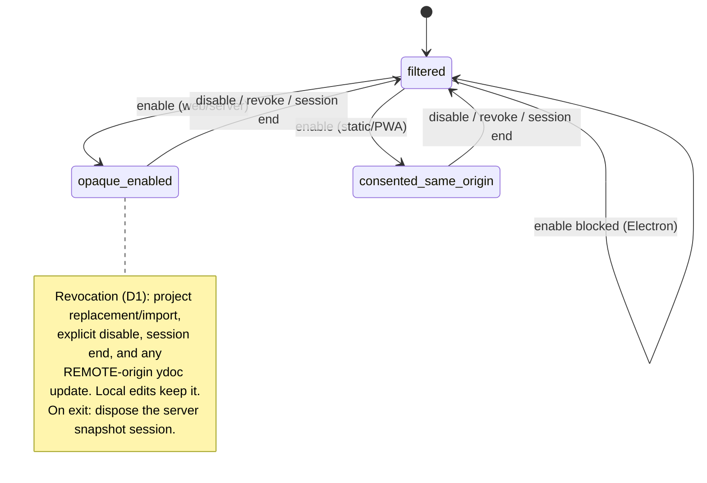
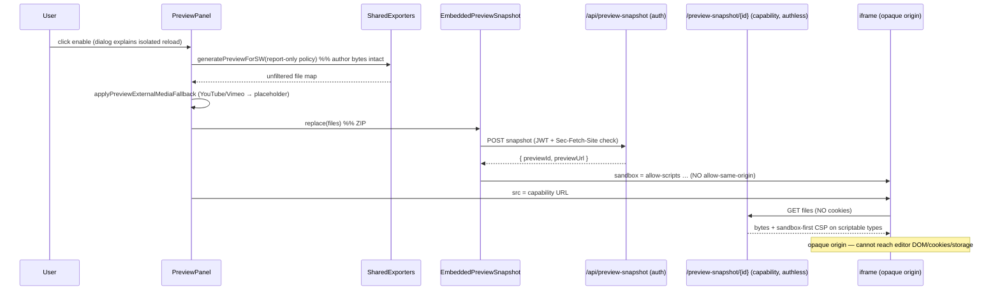

# Preview architecture and trust boundary

The editor preview renders a mix of two trust levels: **official** eXeLearning
runtime (themes, libraries, MathJax, iDevice runtimes — maintained by the
project) and **author-controlled** content (TinyMCE/HTML fields, component
properties, custom head/footer, custom CSS, imported `.elp`/`.elpx`). Official
runtime must keep working; author-controlled active content must not reach the
editor's DOM, storage, or session on the default path.

This page documents the **hybrid trust boundary**: source-filtered by default,
opaque-on-enable. See [ADR-0002](../architecture/adr/ADR-0002-hybrid-preview-trust-boundary.md)
for the decision, [ADR-0003](../architecture/adr/ADR-0003-preview-grant-revocation-under-collaboration.md)
for revocation under collaboration, and
[ADR-0004](../architecture/adr/ADR-0004-self-hosted-capability-snapshots-for-editor-preview.md)
for the capability-snapshot server.

## Transport matrix

The transport is chosen by the **runtime**, never by content, and there is **no
silent fallback** between rows: a web/server enable that cannot reach the
snapshot routes fails visibly and stays filtered.

| Runtime | Default preview | Active content detected | After explicit enable |
|---|---|---|---|
| Web / server | Same-origin SW, source-filtered | Indicator + dialog | **Opaque snapshot** served by eXe's server via a capability URL; iframe `sandbox` without `allow-same-origin` |
| Embedded LMS/CMS (Moodle, WordPress, …) | Opaque snapshot via **host** capability routes; full authored content retained — the origin boundary is the control | n/a (always isolated) | n/a |
| Static bundle / PWA / PHP-WASM (no backend) | Same-origin SW, source-filtered | Indicator + dialog | Same-origin with consent (**documented residual risk**; no server to mint capability URLs) |
| Electron | Same-origin SW, source-filtered | Dialog explains restriction | **Blocked** (preview shares a renderer with the preload bridge) |

Resolution lives in `resolvePreviewTransport()`
(`public/app/utils/previewContentPolicy.js`) and is mirrored by
`Capabilities.preview` (`public/app/core/Capabilities.js`); a unit test asserts
the two agree for every runtime.

## Enable/disable state machine



`filtered` is the default. Enabling maps to `opaque-enabled` (web/server) or
`consented-same-origin` (static/PWA); Electron blocks the enable. Every exit edge
returns to `filtered`, and any exit out of `opaque-enabled` disposes the server
snapshot (best-effort client `DELETE` + guaranteed server-side TTL expiry).

## Sequence — default (same-origin, source-filtered)

```mermaid
sequenceDiagram
    participant U as User
    participant P as PreviewPanel
    participant X as SharedExporters
    participant A as PreviewDocumentAdapter
    participant SW as Service Worker
    participant F as iframe (same-origin)

    U->>P: open / edit
    P->>X: generatePreviewForSW(policy = source-aware filter)
    X->>A: prepare author fields on a CLONE
    A-->>X: filtered file map + active-content report
    X-->>P: files, report
    P->>SW: postMessage(files)
    P->>F: load /viewer/index.html (SW-served)
    Note over F: official scripts run; author active content stripped
    P->>U: show active-content indicator if report.activeContentFound
```

## Sequence — enable → opaque snapshot (web/server)



## Sequence — embedded LMS/CMS host (unchanged)

```mermaid
sequenceDiagram
    participant P as PreviewPanel (embedded)
    participant S as EmbeddedPreviewSnapshot
    participant H as Host capability routes
    participant F as iframe (opaque origin)

    P->>S: replace(full authored files)  %% no filtering; origin is the control
    S->>H: POST snapshot (host auth/CSRF)
    H-->>S: { previewId, previewUrl }
    S->>F: sandbox without allow-same-origin
    P->>F: src = host capability URL
    Note over F: full authored content, isolated by origin
```

## Serving contract (capability route)

`/preview-snapshot/{previewId}/{path}` is authless and cookieless — the
unguessable id plus the TTL is the whole credential. Host adapters implement the
same contract against their own storage, so this table is the canonical version
they conform to; the CSP in particular must stay **byte-identical** to
`previewSnapshotCspHeader()` (one line, directives joined by `"; "`, no trailing
semicolon), because a divergent sandbox silently changes what author code can do.

Every response, 404s included, carries `X-Content-Type-Options: nosniff`,
`Referrer-Policy: no-referrer`, the preview `Permissions-Policy` and
`Access-Control-Allow-Origin: *` — sound only because the route is authless, and
never to be paired with credentials.

Caching is tiered on the scriptable/non-scriptable split, the same split that
decides the CSP:

| | Scriptable document (`text/html`, XHTML, SVG, XML, PDF) | Everything else |
|---|---|---|
| `Content-Security-Policy` | `sandbox …` | absent |
| `Cache-Control` | `no-store` | `no-cache` |
| `ETag` / `Accept-Ranges` | absent | `"{previewId}-{publishSeq}-{path}"` / `bytes` |
| Conditional / partial | — | `If-None-Match` → 304; single range → 206/416 |

A scriptable document is rewritten on every refresh and is the thing the sandbox
guards, so it is never cached or sliced. Everything else revalidates, which is
what lets a video or audio track inside the snapshot seek instead of
re-downloading on every scrub.

Two details are easy to get wrong and are covered by tests:

- **The ETag must fold in a publish counter.** A replace keeps the capability id
  so the iframe URL stays valid; an ETag derived from the id and path alone
  answers 304 with the *previous* bytes whenever the refreshed asset happens to
  be the same length. The tag never hashes bytes — serving a 200 MB video must
  not cost a hash.
- **An invalid `Range` is ignored, not rejected** (RFC 9110). `bytes=15-2`, a
  multi-range list and a non-`bytes` unit all answer `200` with the full body.
  Only a *valid but unsatisfiable* range (`bytes=99-` past EOF, `bytes=-0`, an
  empty body) answers `416` with `Content-Range: bytes */{size}`.

The bare capability root answers `302` with a **relative** `Location` — no
trailing slash → `{previewId}/index.html`, trailing slash → `index.html` — so the
iframe's relative-URL base is correct under any `BASE_PATH`.

## Threat model

- **Assets:** editor DOM and JS context, Yjs project state, eXe server session
  cookies, host LMS credentials (embedded), the user's machine (Electron).
- **Adversary:** a malicious `.elpx`/`.elp` project, or a malicious collaborator
  injecting active content mid-session.
- **In scope:** preventing author-controlled code from reaching those assets
  during preview.
- **Out of scope:** network requests initiated from inside the opaque frame,
  deceptive content, and the trust semantics of *published* exports (unchanged —
  exports have their own delivery model). This is why the opaque serving CSP is
  `sandbox`-only and does not restrict `frame-src`/`connect-src`.

## What the default filter removes

The source-aware policy disables author-controlled **active** content only:
scripts, inline `on*` handlers, `javascript:`/active `data:` URLs, `srcdoc`,
`base`, `meta refresh`, HTML imports, `form action`, SVG scripts/handlers, and
active XML processing instructions. Official eXe scripts/themes/MathJax/iDevice
runtimes are never filtered.

`<object>`/`<embed>` are **dual-use** and decided per element: a PDF or media
resource (`type` of `application/pdf`, `audio/*`, `video/*`, non-SVG `image/*`,
or a media/PDF file extension when untyped) is **kept** — it renders in the
browser's own isolated PDF/media context and cannot reach the editor, exactly
like a sandboxed `<iframe>` pointing at a PDF. An `<object>`/`<embed>` that loads
a **scriptable document** (HTML/XHTML/SVG/XML, a dangerous scheme, or an active
`data:` URL) runs in a nested same-origin context that could reach the parent,
so it is removed. `<applet>` is always removed. Fail closed: an untyped embed
with an unknown resource is removed.

## Non-mutation guarantee

No preview path mutates the Yjs document or stored project data. The
`PreviewDocumentAdapter` operates on a clone; save and export use the original
`YjsDocumentAdapter`. A spec asserts the source document is deep-equal before and
after a full adapter pass.

## Known limitations

- **YouTube/Vimeo in opaque-enabled mode** become an accessible "open in a new
  tab" placeholder (`previewExternalMediaFallback.js`) — an opaque frame cannot
  satisfy the providers' embedder-identity checks. The full media bridge (relay +
  trusted-parent modal) is follow-up work for embedded hosts.
- **Electron:** custom active content cannot be enabled — the preview shares a
  renderer with the `preload.js` bridge. Revisiting needs an isolated-renderer
  design.
- **Static bundle / PWA / PHP-WASM:** enabling runs author code same-origin
  (documented residual risk) — no backend exists to mint capability URLs, and
  OPFS + a Service Worker does not create an opaque origin
  ([ADR-0016](../architecture/adr/ADR-0016-opfs-service-worker-is-not-an-opaque-origin.md)).
- **Full-snapshot refresh while opaque-enabled:** each scheduled refresh
  re-uploads the whole snapshot. Acceptable because it is opt-in and temporary;
  see the [benchmark](../../test/benchmarks/preview/README.md) for the payload
  size (~400 KiB for text projects).

## YouTube "Error 153" and `referrerpolicy`

Independent of sandboxing, YouTube's embedded player returns Error 153 when it
cannot read the HTTP `Referer` header. eXeLearning preserves and stamps
`referrerpolicy="strict-origin-when-cross-origin"` on YouTube/Vimeo iframes in
both the sanitizer and the export/preview renderer. Full details, including the
host-side `Referrer-Policy` header and the WordPress/Jetpack note, are in
[embedding.md](embedding.md#youtube-error-153-and-referrerpolicy).

## Benchmark

`test/benchmarks/preview/` runs a three-way, real-browser comparison — `main` vs
this branch's filtered default vs opaque-enabled — with a gate that the default
mode stays within 10% of `main`. See the
[benchmark README](../../test/benchmarks/preview/README.md) and
[committed results](../../test/benchmarks/preview/results/comparison.md).
