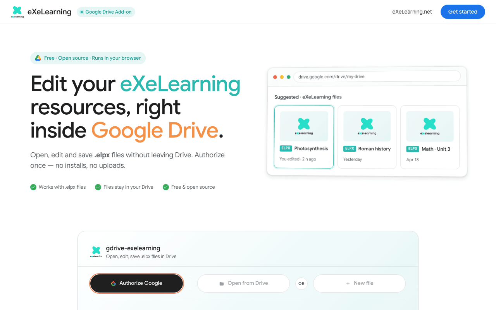

# eXeLearning in Google Drive

[Leer en español](google-drive.es.md){ .lang-switch }

<!-- --8<-- [start:guide] -->

**eXeLearning for Google Drive** lets you **open, edit and create** eXeLearning resources (`.elpx`)
stored in your Drive. There is nothing to install: it runs in the browser and files never leave Drive.

## Requirements

- A Google account.
- An up-to-date browser.

## Getting started

1. Go to <https://exelearning.github.io/gdrive-exelearning/>.
2. Click **Authorize Google** and accept the permissions. This adds eXeLearning to Drive's **Open
   with** and **New** menus.

!!! info "Permissions it asks for"
    It only accesses the files you open or create with eXeLearning (`drive.file` permission), not your
    whole Drive.

## Usage

### Open a resource

In Google Drive, right-click an `.elpx` file and choose **Open with → eXeLearning**. The first time,
click **Authorize and open**. A preview appears; click **Edit in eXeLearning** to edit.

### Save

Click **Save to Drive** (or Ctrl/Cmd + S). The file is updated in Drive, thumbnail included.

- If someone changed the file while you were editing, you can overwrite it, save a copy or cancel.
- Files you can only view open read-only.
- Old `.elp` files are saved as a new `.elpx` next to the original.

### Create a new resource

In Drive, click **New → More → eXeLearning**. The first time, click **Authorize and create**.

### Share

Use Google Drive's **Share** button, as with any other file.

!!! tip "For administrations"
    To use it with your own Google Workspace domain, you can host a copy with your own Google Cloud
    project. See the
    [self-hosting guide](https://github.com/exelearning/gdrive-exelearning/blob/main/SELF-HOSTING.md).

<!-- --8<-- [end:guide] -->
