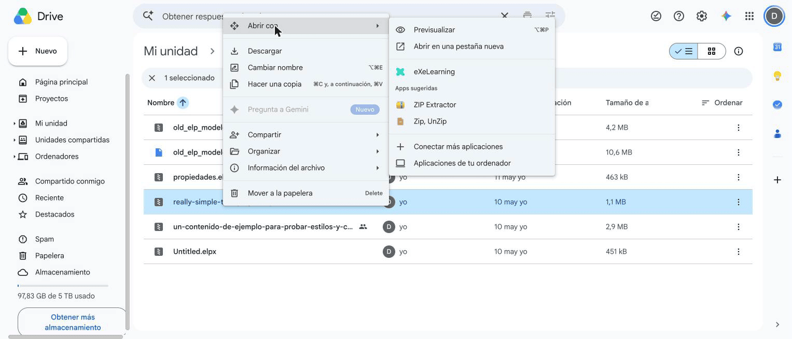
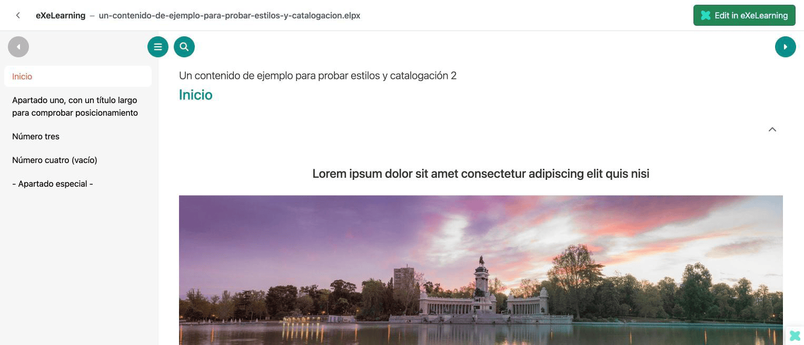
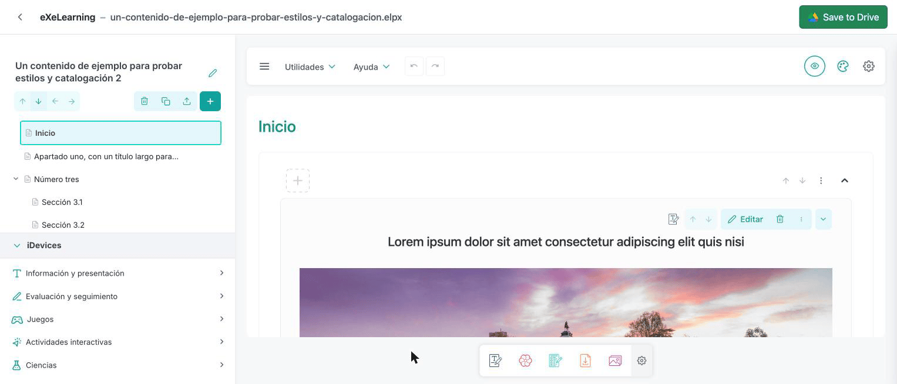
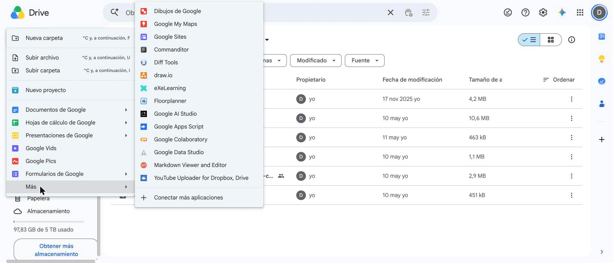

# eXeLearning in Google Drive

[Leer en español](google-drive.es.md){ .lang-switch }

<!-- --8<-- [start:intro] -->

**eXeLearning for Google Drive** lets you **open, edit and create** eXeLearning resources (`.elpx`)
stored in your Drive. There is nothing to install: it runs in the browser and files never leave Drive.

<!-- --8<-- [end:intro] -->

<!-- --8<-- [start:admin] -->

## For administrators { #admin }

**Nothing to install.** Every teacher can use the public app at
<https://exelearning.github.io/gdrive-exelearning/> with their own Google account, including Google
Workspace for Education accounts. It is free, needs no server and only accesses the files each person
opens or creates with it (`drive.file` permission).

### Check your Google Workspace domain

If your domain restricts third-party apps, a Workspace administrator must allow **eXeLearning** in
the **Google Admin console** (**Security → Access and data control → API controls → Manage
third-party app access**). Otherwise teachers see an error when they authorize it.

### Host your own copy (optional)

An administration can run its own copy instead of the public one, for example to show its own name
on the consent screen or to limit sign-in to its domain. The app is a static website, so any web
server works. You need:

1. A **Google Cloud project** with the **Google Drive API** enabled.
2. An **OAuth consent screen** with the `drive.file` and `drive.install` permissions, and an
   **OAuth client ID** for your website's address.
3. The **Drive UI integration** pointing to your copy, so that eXeLearning appears in Drive's **Open
   with** and **New** menus.

The [self-hosting guide](https://github.com/exelearning/gdrive-exelearning/blob/main/SELF-HOSTING.md)
has every step.

<!-- --8<-- [end:admin] -->

<!-- --8<-- [start:teacher] -->

## For teachers { #teachers }

### Requirements

- A Google account (personal or from your school).
- An up-to-date browser.

### Getting started

1. Go to <https://exelearning.github.io/gdrive-exelearning/>.
2. Click **Authorize Google** and accept the permissions. This adds eXeLearning to Drive's **Open
   with** and **New** menus.

!!! info "Permissions it asks for"
    It only accesses the files you open or create with eXeLearning (`drive.file` permission), not your
    whole Drive.

### Open a resource

In Google Drive, right-click an `.elpx` file and choose **Open with → eXeLearning**. The first time,
click **Authorize and open**.

A preview of the resource appears, ready to browse. Click **Edit in eXeLearning** to edit it.

### Edit and save

The editor opens in the same tab. When you are done, click **Save to Drive** (or Ctrl/Cmd + S). The
file is updated in Drive, thumbnail included.

- If someone changed the file while you were editing, you can overwrite it, save a copy or cancel.
- Files you can only view open read-only.
- Old `.elp` files are saved as a new `.elpx` next to the original.

### Create a new resource

In Drive, click **New → More → eXeLearning**. The first time, click **Authorize and create**. The
new file is created in the folder you are in and opens in the editor.

### Share

Use Google Drive's **Share** button, as with any other file.

!!! note "Language"
    For now this app's own screens are in English only. Drive's menus and the editor use your
    language.

<!-- --8<-- [end:teacher] -->
