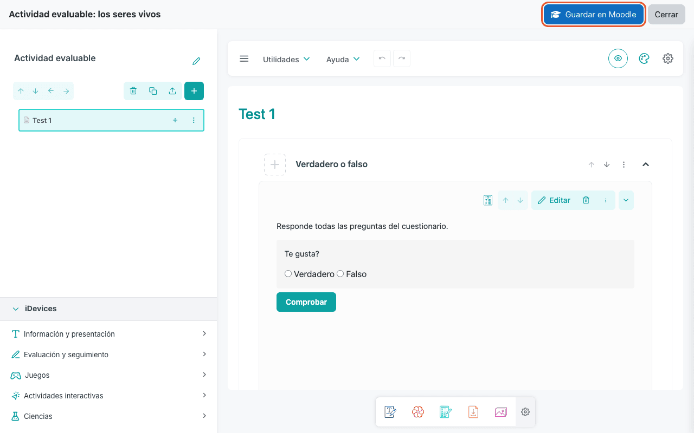

# eXeLearning Plugins

[Leer en español](index.es.md){ .lang-switch }

<!-- --8<-- [start:intro] -->

The plugins bring eXeLearning into the platforms your school already uses. Teachers create and edit
resources **without leaving Moodle, Nextcloud, WordPress, Omeka S, Google Drive or OneDrive**, and students see
them right on the page, with nothing to download or install.

Every plugin is **free and open source**, and every published release **includes the eXeLearning
editor**: install the plugin and you can start editing.

## Which plugin do I need?

| Platform | Plugin | What it is for | Grades |
| --- | --- | --- | --- |
| Moodle | [eXeLearning resource](moodle.md#mod_exelearning) (`mod_exelearning`) | Interactive activities that grade themselves | One column per exercise |
| Moodle | [eXeLearning (SCORM)](moodle.md#mod_exescorm) (`mod_exescorm`) | Content published as a SCORM 1.2 package | One overall grade (SCORM) |
| Moodle | [eXeLearning (website)](moodle.md#mod_exeweb) (`mod_exeweb`) | Reference material with its own menu | Not graded |
| Nextcloud | [eXeLearning for Nextcloud](nextcloud.md) | View, edit and create resources in Files | — |
| WordPress | [eXeLearning for WordPress](wordpress.md) | Publish resources in posts and pages | — |
| Omeka S | [eXeLearning for Omeka S](omeka-s.md) | Catalogue and show resources in collections | — |
| Google Drive | [eXeLearning for Google Drive](google-drive.md) | Open and edit resources stored in Drive | — |
| OneDrive | [eXeLearning for OneDrive](onedrive.md) | Open and edit resources stored in OneDrive | — |

!!! tip "Moodle? Start with `mod_exelearning`"
    For new content in Moodle, the **eXeLearning resource** (`mod_exelearning`) is the recommended
    choice: it has the embedded editor, keeps the resource's own menu and sends each exercise's score
    to the gradebook separately. `mod_exescorm` and `mod_exeweb` remain useful for existing SCORM
    packages and websites.

## Try them without installing anything

Each plugin has a demo that runs **in your browser**, with no server and no sign-up. Open it, play with
it and close it: nothing is kept.

| Plugin | Demo | User |
| --- | --- | --- |
| Moodle · eXeLearning resource | [Open in Moodle Playground](https://moodle-playground.com/?blueprint-url=https://raw.githubusercontent.com/exelearning/moodle-mod_exelearning/main/blueprint.json) | `admin` / `password` |
| Moodle · eXeLearning (SCORM) | [Open in Moodle Playground](https://moodle-playground.com/?blueprint-url=https://raw.githubusercontent.com/exelearning/mod_exescorm/refs/heads/main/blueprint.json) | `admin` / `password` |
| Moodle · eXeLearning (website) | [Open in Moodle Playground](https://moodle-playground.com/?blueprint-url=https://raw.githubusercontent.com/exelearning/mod_exeweb/refs/heads/main/blueprint.json) | `admin` / `password` |
| Nextcloud | [Open in Nextcloud Playground](https://ateeducacion.github.io/nextcloud-playground/?blueprint-url=https://raw.githubusercontent.com/exelearning/nextcloud-exelearning/main/blueprint.json) | `admin` / `admin` |
| WordPress | [Open in WordPress Playground](https://playground.wordpress.net/?blueprint-url=https://raw.githubusercontent.com/exelearning/wp-exelearning/refs/heads/main/blueprint.json) | already signed in |
| Omeka S | [Open in Omeka S Playground](https://ateeducacion.github.io/omeka-s-playground/?blueprint=https%3A%2F%2Fraw.githubusercontent.com%2Fexelearning%2Fomeka-s-exelearning%2Frefs%2Fheads%2Fmain%2Fblueprint.json) | `admin@example.com` / `password` |

!!! note "The first load takes a moment"
    The demo downloads a complete platform into your browser. Give it a few seconds the first time.

## How they work

1. **An administrator installs the plugin** once, from the platform's admin panel, using the ZIP of
   the published release. No separate eXeLearning server is needed. Google Drive and OneDrive need no
   installation at all.
2. **Teachers upload a resource** (`.elpx`) or create a new one, and edit it with the **Edit with
   eXeLearning** button. The editor opens inside the platform.
3. **When they save**, the updated resource goes back to the platform. Students always see the latest
   version.

!!! info "`.elpx` and `.elp` files"
    `.elpx` is the format of eXeLearning 3 and later. `.elp` files from older versions open in the
    editor and are saved as `.elpx`.

## Administrators and teachers { #roles }

Each guide has a **For administrators** part and a **For teachers** part, and there are two manuals:
the [administrator manual](manual-admin.md) and the [teacher manual](manual-teacher.md).

| | Moodle, Nextcloud, WordPress, Omeka S | Google Drive, OneDrive |
| --- | --- | --- |
| **Administrators** | Install the plugin **once per site**, from the platform's admin panel. | Nothing to install. Optionally allow the app in the Google Workspace or Microsoft 365 domain, or host your own copy. |
| **Teachers** | Install nothing. They find eXeLearning in their course, files or posts. | Sign in with their school account and start. |

!!! tip "Rolling it out to every school in a region"
    Installation does not change with the number of teachers. With a **shared platform** (one Moodle,
    Nextcloud, WordPress multisite or Omeka S for every school), install the plugin there once and
    every teacher gets it. With **one platform per school**, repeat the same installation on each one.
    For Google Drive and OneDrive, review the domain settings once in the Google Workspace or
    Microsoft 365 admin console.

!!! note "Screenshots"
    The screenshots in these guides show the Spanish interface. The steps are the same in any language.

<!-- --8<-- [end:intro] -->

<!-- --8<-- [start:admin] -->

## Downloads

Always install the ZIP of the **latest published release** (*Releases*). The source code's
*Download ZIP* button **does not include the editor**.

| Plugin | Download |
| --- | --- |
| Moodle · eXeLearning resource | <https://github.com/exelearning/moodle-mod_exelearning/releases/latest> |
| Moodle · eXeLearning (SCORM) | <https://github.com/exelearning/mod_exescorm/releases/latest> |
| Moodle · eXeLearning (website) | <https://github.com/exelearning/mod_exeweb/releases/latest> |
| Nextcloud | <https://github.com/exelearning/nextcloud-exelearning/releases/latest> |
| WordPress | <https://github.com/exelearning/wp-exelearning/releases/latest> |
| Omeka S | <https://github.com/exelearning/omeka-s-exelearning/releases/latest> |
| Google Drive | Nothing to install: <https://exelearning.github.io/gdrive-exelearning/> |
| OneDrive | Nothing to install: <https://exelearning.github.io/onedrive-exelearning/> |

<!-- --8<-- [end:admin] -->

<!-- --8<-- [start:help] -->

## Need help?

Report bugs and suggestions in the
[eXeLearning repository](https://github.com/exelearning/exelearning/issues). Each plugin has its own
label (`moodle`, `nextcloud`, `wordpress`, `omeka-s`, `gdrive`) so you can find similar reports.

<!-- --8<-- [end:help] -->

## Manuals

Every guide, gathered in two manuals. Open one and use **Print → Save as PDF** in your browser, or
download it as an **eXeLearning project** to adapt it to your school and publish it as a website,
SCORM package or ePub.

| Manual | Web and PDF | eXeLearning project |
| --- | --- | --- |
| Administrator manual | [Open](manual-admin.md) | <a href="manual-admin.elpx" download>manual-admin.elpx</a> |
| Teacher manual | [Open](manual-teacher.md) | <a href="manual-teacher.elpx" download>manual-teacher.elpx</a> |
