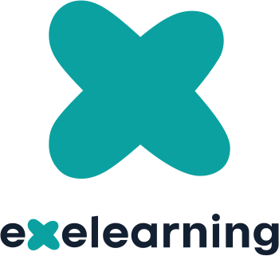

# eXeLearning Plugins: Administrator Manual

[Leer en español](manual-admin.es.md){ .lang-switch }

{ .manual-logo }

How to install and configure the eXeLearning plugins for Moodle, Nextcloud, WordPress, Omeka S,
Google Drive and OneDrive. For teachers, see the [teacher manual](manual-teacher.md).

!!! tip manual-download "Save as PDF or as an eXeLearning project"
    Use **Print → Save as PDF** in your browser to get this manual as a PDF. Each guide starts on a
    new page. You can also download it as an eXeLearning project:
    <a href="../manual-admin.elpx" download>manual-admin.elpx</a>.

--8<-- "plugins/index.md:intro"

--8<-- "plugins/index.md:admin"

--8<-- "plugins/index.md:help"

# Moodle

--8<-- "plugins/moodle.md:intro"

--8<-- "plugins/moodle.md:admin"

# Nextcloud

--8<-- "plugins/nextcloud.md:intro"

--8<-- "plugins/nextcloud.md:admin"

# WordPress

--8<-- "plugins/wordpress.md:intro"

--8<-- "plugins/wordpress.md:admin"

# Omeka S

--8<-- "plugins/omeka-s.md:intro"

--8<-- "plugins/omeka-s.md:admin"

# Google Drive

--8<-- "plugins/google-drive.md:intro"

--8<-- "plugins/google-drive.md:admin"

# OneDrive

--8<-- "plugins/onedrive.md:intro"

--8<-- "plugins/onedrive.md:admin"
