# eXeLearning en Moodle

[Read in English](moodle.md){ .lang-switch }

<!-- --8<-- [start:intro] -->

Hay **tres plugins** de eXeLearning para Moodle. Se instalan igual y pueden convivir en el mismo sitio.

| En el selector de actividades | Plugin | Úsalo para… | Calificación |
| --- | --- | --- | --- |
| **Recurso eXeLearning** | [`mod_exelearning`](moodle.es.md#mod_exelearning) | Actividades interactivas evaluables. **Recomendado.** | Una columna por ejercicio |
| **eXeLearning (SCORM)** | [`mod_exescorm`](moodle.es.md#mod_exescorm) | Contenidos que deben ser un paquete SCORM 1.2 | Una nota global |
| **eXeLearning (sitio web)** | [`mod_exeweb`](moodle.es.md#mod_exeweb) | Materiales de consulta, sin nota | No califica |

!!! tip "Pruébalo antes de instalar"
    Cada plugin tiene una demostración en [Moodle Playground](https://moodle-playground.com/) que se
    abre en el navegador. Los enlaces están en la [introducción](index.es.md#pruebalos-sin-instalar-nada).

<!-- --8<-- [end:intro] -->

<!-- --8<-- [start:admin] -->

## Para administración { #administracion }

La administración del sitio instala y configura los plugins una sola vez para todo el sitio; el
profesorado no tiene que instalar nada.

### Requisitos

| Plugin | Moodle | Archivo de la versión |
| --- | --- | --- |
| `mod_exelearning` | 4.5 o posterior | [`mod_exelearning-X.Y.Z.zip`](https://github.com/exelearning/moodle-mod_exelearning/releases/latest) |
| `mod_exescorm` | 4.2 o posterior | [`mod_exescorm-X.Y.Z.zip`](https://github.com/exelearning/mod_exescorm/releases/latest) |
| `mod_exeweb` | 4.2 o posterior | [`mod_exeweb-X.Y.Z.zip`](https://github.com/exelearning/mod_exeweb/releases/latest) |

Cada ZIP pesa unos 30 MB porque **incluye el editor de eXeLearning**. Si tu Moodle limita el tamaño
de subida, auméntalo o instala el plugin descomprimiéndolo en la carpeta `mod/` del servidor.

### Instalación (los tres plugins) { #instalacion }

Necesitas una cuenta de **administración** del sitio Moodle.

1. Descarga el ZIP de la última versión desde la tabla de [requisitos](moodle.es.md#requisitos).
2. Entra en **Administración del sitio → Extensiones → Instalar complementos**, arrastra el ZIP a
   **Paquete ZIP** y pulsa **Instalar complemento desde archivo ZIP**.

    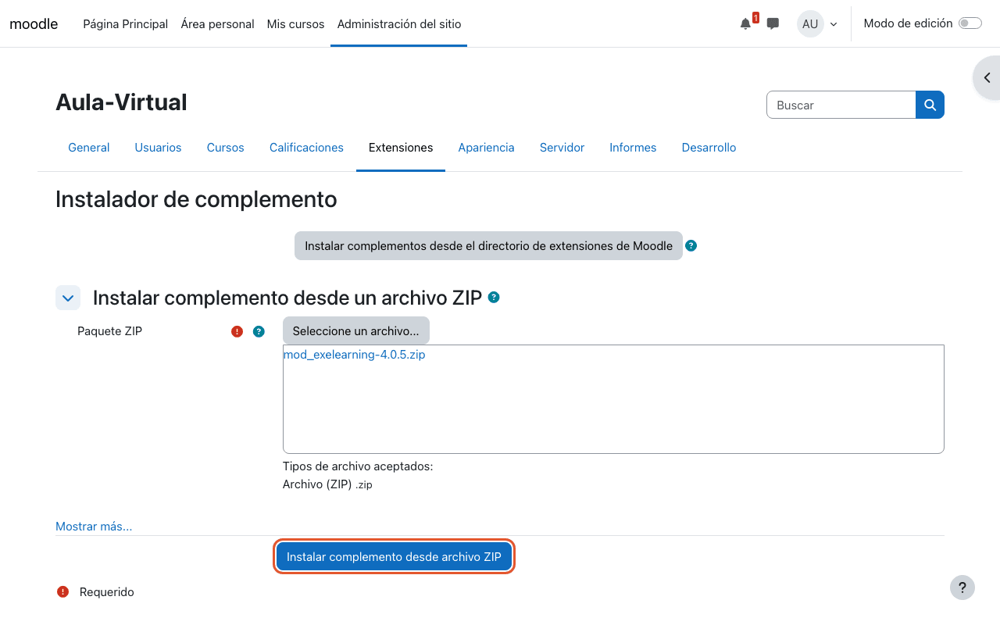

3. Moodle comprueba el paquete. Si la validación es correcta, pulsa **Continuar** (y otra vez
   **Continuar** en la página de comprobaciones del servidor).

    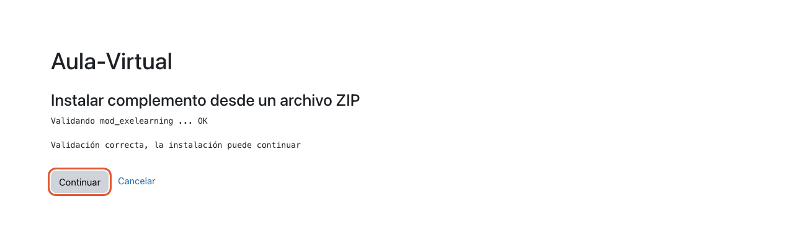

4. Pulsa **Actualizar base de datos Moodle ahora**. Al terminar, pulsa **Continuar** y, en la página
   de **Nuevos ajustes**, **Guardar cambios**.

    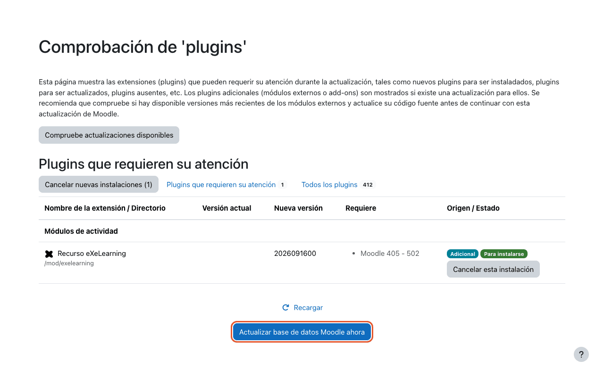

Repite los pasos con cada plugin que quieras usar. Cuando estén instalados, aparecen al pulsar
**+ → Actividad o recurso** en cualquier curso:

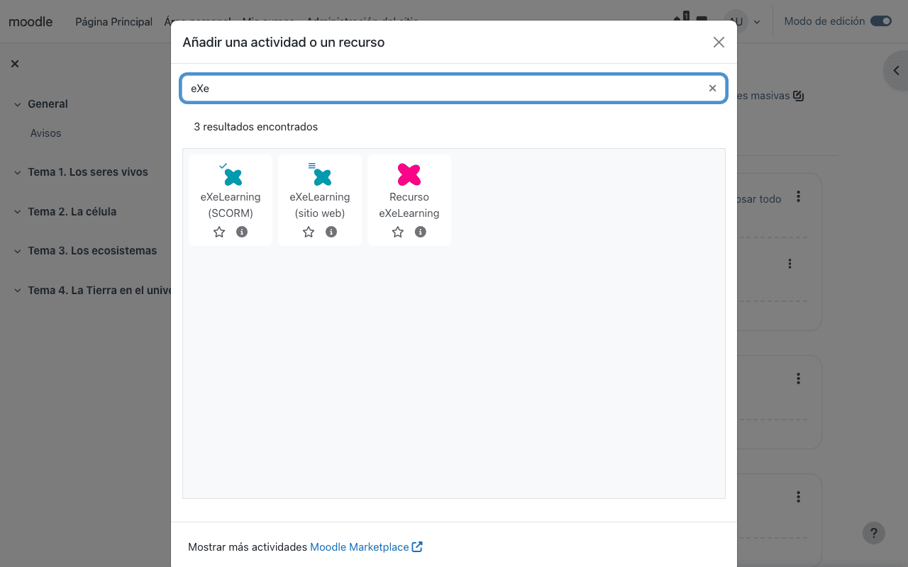

!!! note "Instalación manual"
    Si no puedes subir el ZIP desde la web, descomprímelo en el servidor (`mod/exelearning`,
    `mod/exescorm` o `mod/exeweb`) y visita **Administración del sitio → Notificaciones**.

!!! info "Despliegues regionales o con varios sitios"
    Instala los plugins una vez en cada sitio Moodle (por ejemplo, el Moodle regional que comparten
    todos los centros). Así todo el profesorado los tiene en todos sus cursos; no hay que instalar nada
    por docente.

### Configuración { #configuracion }

#### Recurso eXeLearning (`mod_exelearning`)

Ninguna. Funciona nada más instalarlo. En **Administración del sitio → Extensiones → Módulos de
actividad → Recurso eXeLearning** puedes desactivar el editor integrado o gestionar los estilos
disponibles.

#### eXeLearning (SCORM) (`mod_exescorm`)

**Imprescindible.** Tras instalarlo, el plugin espera un servidor de **eXeLearning Online**. Para usar
el editor que viene incluido:

1. Ve a **Administración del sitio → Extensiones → Módulos de actividad → eXeLearning (SCORM)**.
2. En **Modo del editor** elige **Editor integrado (embebido)** y guarda.

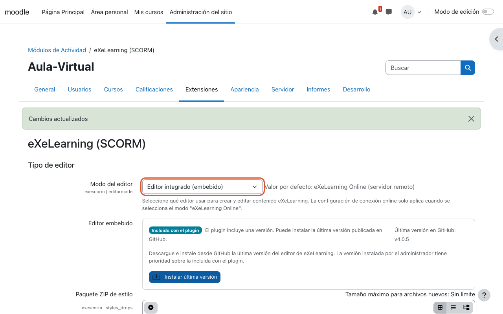

!!! note "¿Tienes un servidor de eXeLearning Online?"
    Deja **eXeLearning Online (servidor remoto)** y rellena **URI remoto** y **Clave de firma** con los
    datos de tu servidor. Consulta [Despliegue](../deployment.md) para instalarlo.

#### eXeLearning (sitio web) (`mod_exeweb`)

**Imprescindible.** Igual que con el plugin SCORM:

1. Ve a **Administración del sitio → Extensiones → Módulos de actividad → eXeLearning (sitio web)**.
2. En **Modo de editor** elige **Editor integrado (embebido)** y guarda.

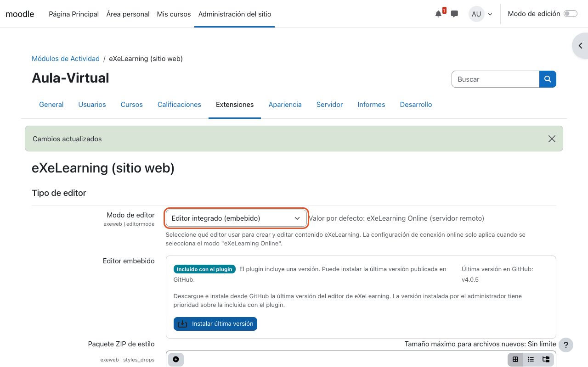

### Migrar desde `mod_exeweb` o `mod_exescorm`

Puedes pasar las actividades de `mod_exeweb` y `mod_exescorm` a `mod_exelearning`. Con
`mod_exelearning` y alguno de los otros instalados, aparece la página **Migrar a eXeLearning** en la
administración del sitio.

### Copias de seguridad

Los tres plugins participan en las copias de seguridad y restauraciones de Moodle, contenido incluido.

<!-- --8<-- [end:admin] -->

<!-- --8<-- [start:teacher] -->

## Para el profesorado { #profesorado }

### Recurso eXeLearning (`mod_exelearning`) { #mod_exelearning }

Crea, edita y **califica** recursos de eXeLearning dentro de Moodle. El recurso conserva su propio
menú lateral y **cada ejercicio evaluable tiene su columna** en el libro de calificaciones (o una sola
nota global, si lo prefieres).

#### Crear una actividad

1. En el curso, activa el **Modo de edición**, pulsa **+ → Actividad o recurso** y elige **Recurso
   eXeLearning**.
2. Escribe un nombre. Si ya tienes el recurso, súbelo en **Archivo de paquete (.elpx)**. Si lo dejas
   vacío, la actividad empieza en blanco y la creas con el editor.
3. En **Calificación** elige si quieres una columna por ejercicio o una nota global (**Columnas del
   libro de calificaciones**) y, en **Gestión de intentos**, cuántos intentos se permiten y cómo se
   califican.

    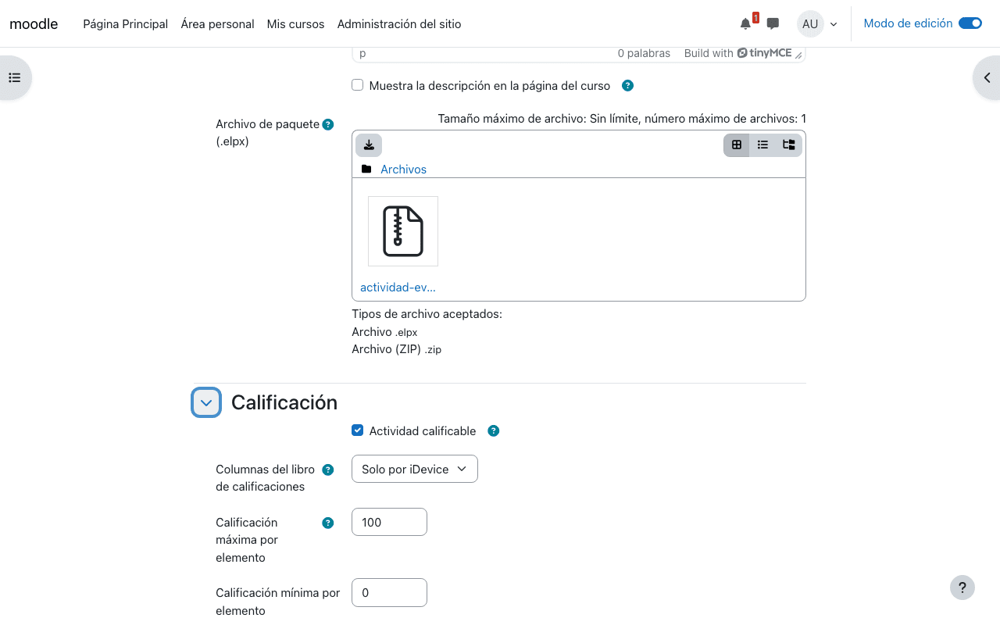

4. Pulsa **Guardar cambios y mostrar**. Moodle detecta los ejercicios evaluables y crea sus columnas.

#### Editar el contenido

En la página de la actividad, pulsa **Editar con eXeLearning**:

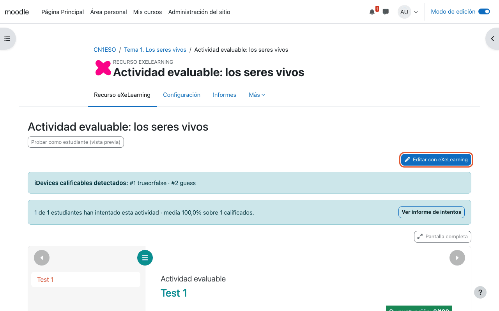

El editor se abre a pantalla completa. Cuando termines, pulsa **Guardar en Moodle**: el alumnado verá
la nueva versión y las columnas de calificación se actualizan solas.

#### Ver los resultados

Las notas llegan al **libro de calificaciones** del curso, con una columna por ejercicio:

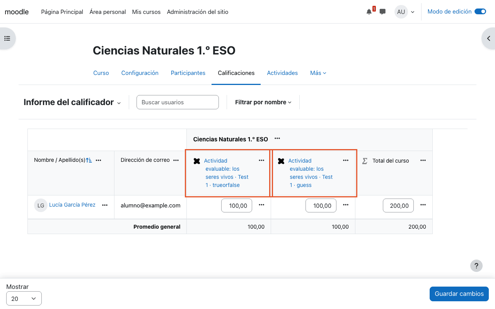

Desde la actividad, **Ver informe de intentos** muestra el detalle de cada estudiante, intento y
ejercicio:

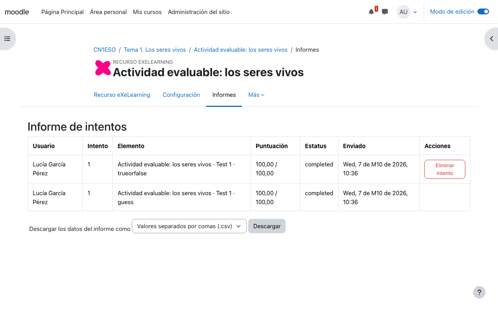

!!! tip "Probar como estudiante"
    **Probar como estudiante (vista previa)** muestra la actividad tal y como la verá el alumnado.
    Lo que respondas en la vista previa no se guarda.

!!! info "Ejercicios que se califican"
    Verdadero o falso, adivinanza, preguntas rápidas, arrastrar y soltar, completar, clasificar,
    relacionar, ordenar, identificar, descubrir, crucigrama, sopa de letras, puzle, trivial, rosco,
    problemas y operaciones matemáticas y lista desordenada.

---

### eXeLearning (SCORM) (`mod_exescorm`) { #mod_exescorm }

Crea y edita contenidos de eXeLearning que Moodle reproduce como **paquete SCORM 1.2**, con intentos,
puntuación y finalización, y **una nota global** en el libro de calificaciones.

#### Crear una actividad

1. **+ → Actividad o recurso → eXeLearning (SCORM)**.
2. En **Paquete → Tipo** elige **Crear con eXeLearning** para empezar desde cero, o **Paquete subido**
   para subir un `.zip` SCORM o un `.elpx`.

    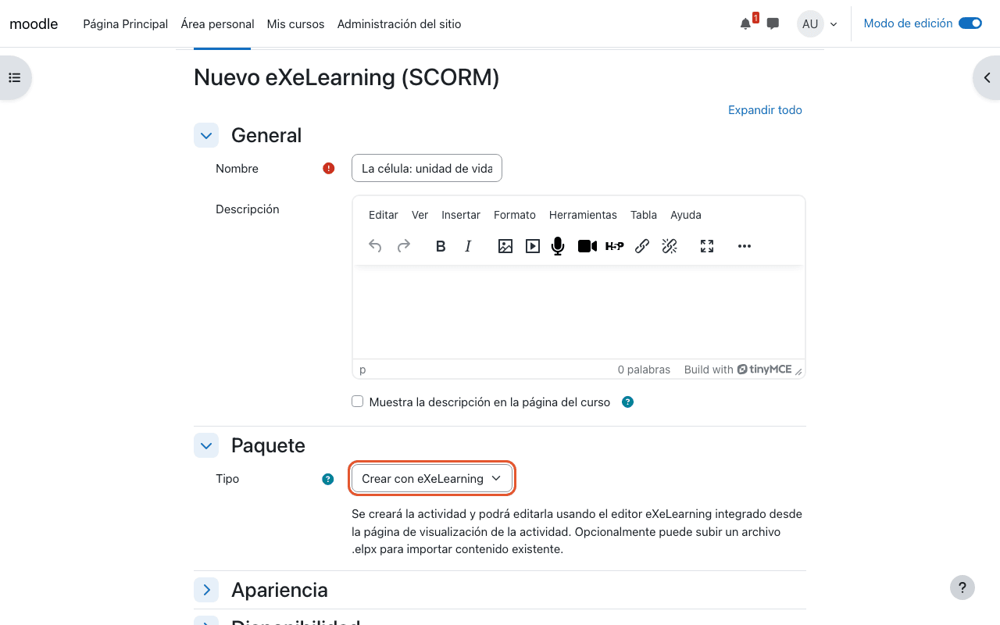

3. Guarda. En la página de la actividad, **Editar con eXeLearning** abre el editor; guarda con
   **Guardar en Moodle**.

    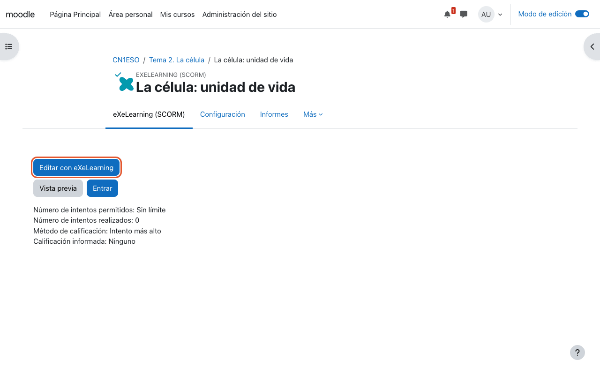

!!! warning "Si subes un `.elpx`"
    Ábrelo una vez con **Editar con eXeLearning** y guárdalo para convertirlo en paquete SCORM. Hasta
    entonces el alumnado no puede verlo.

El alumnado pulsa **Entrar** y Moodle registra su progreso. Los resultados están en **Informes** y
en el libro de calificaciones.

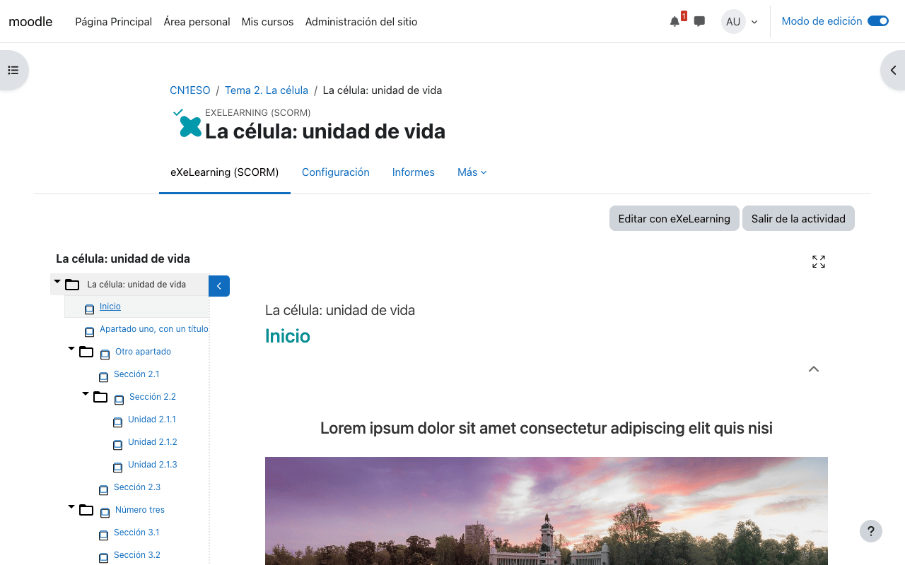

---

### eXeLearning (sitio web) (`mod_exeweb`) { #mod_exeweb }

Muestra contenidos de eXeLearning como un **sitio web** integrado en el curso, con su propio menú.
**No califica**; solo registra la visualización (finalización de actividad).

#### Crear un recurso

1. **+ → Actividad o recurso → eXeLearning (sitio web)**.
2. En **Paquete → Tipo** elige **Crear con eXeLearning (editor integrado)** o **Paquete subido**
   (`.zip` o `.elpx`).

    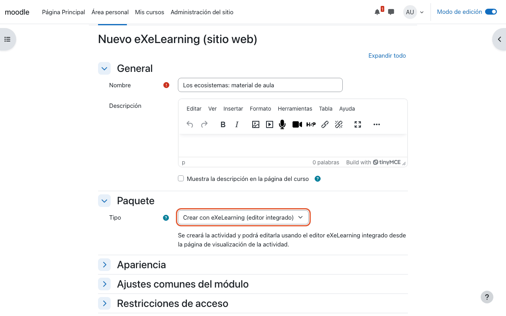

3. Guarda. El contenido se muestra en la página; **Editar con eXeLearning** abre el editor.

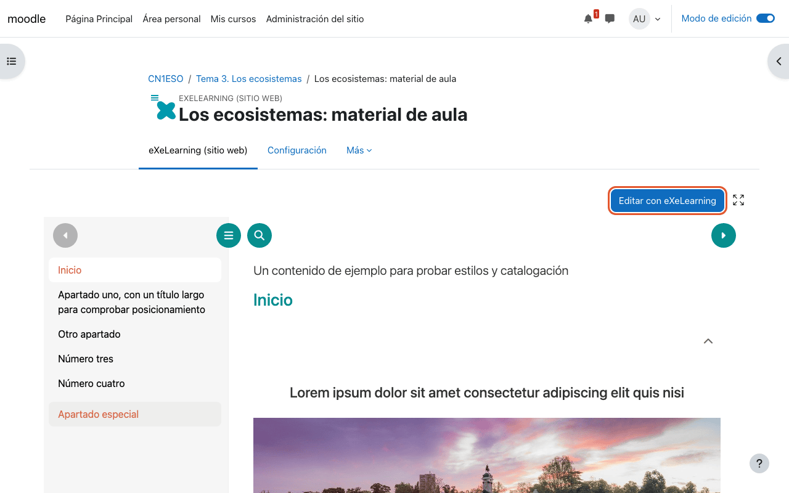

---

### Preguntas frecuentes { #faq }

**No aparece el botón Editar con eXeLearning.**
: Comprueba que tu usuario puede editar el curso. Si puede, pide a la administración de Moodle que
  compruebe que instaló el ZIP de la versión publicada (el código fuente no trae el editor) y que en
  `mod_exescorm` y `mod_exeweb` el modo de editor es **Editor integrado (embebido)** (consulta
  [Configuración](moodle.es.md#configuracion)).

<!-- --8<-- [end:teacher] -->
