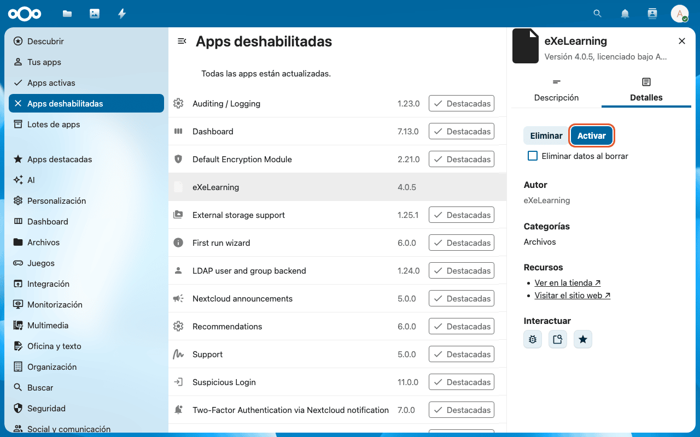
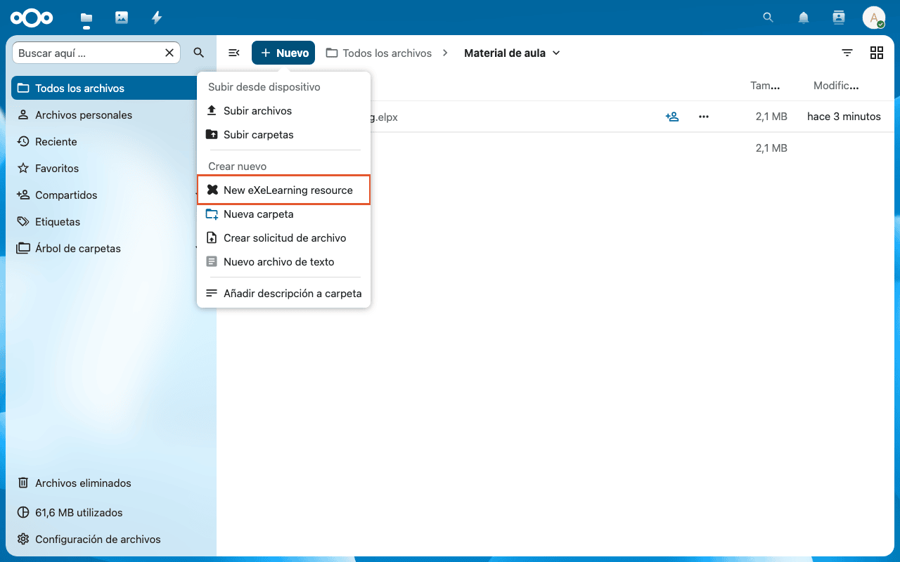
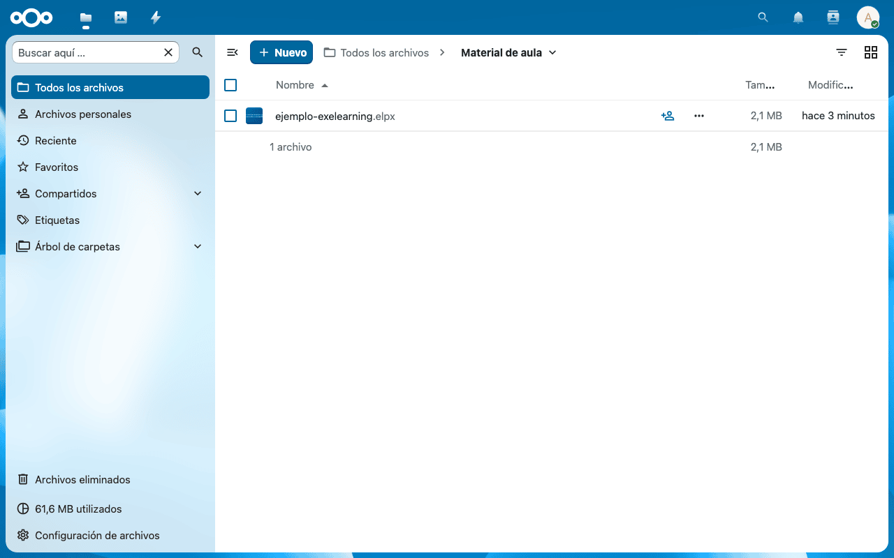
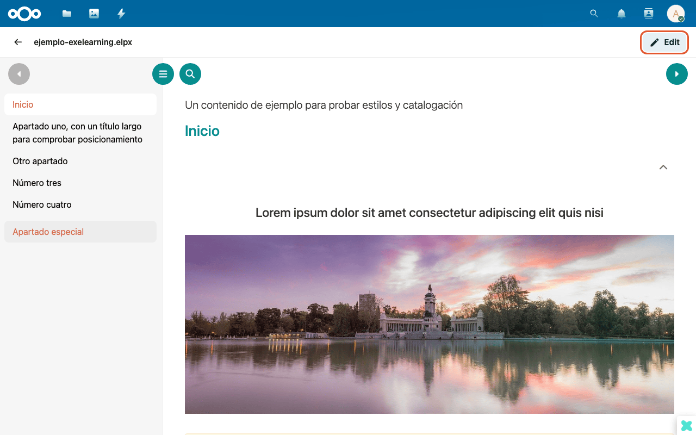
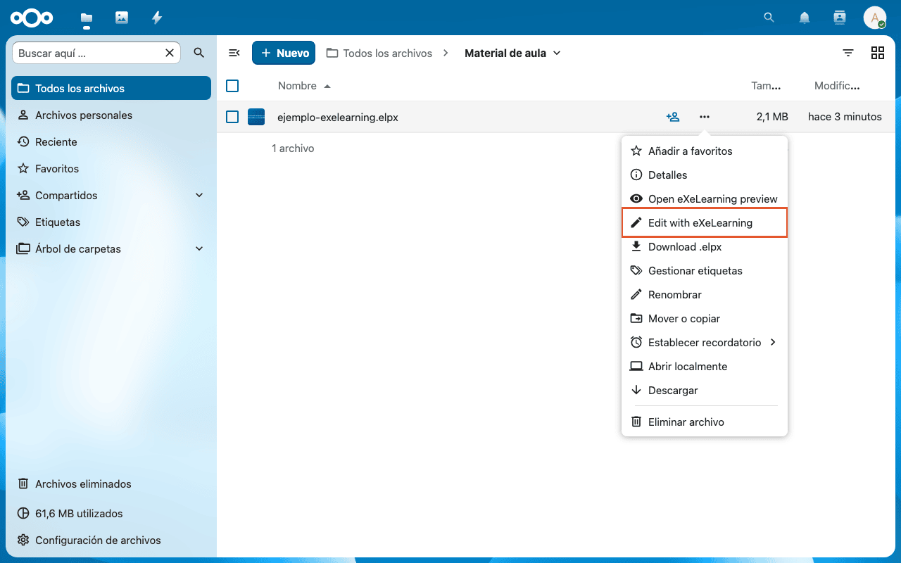
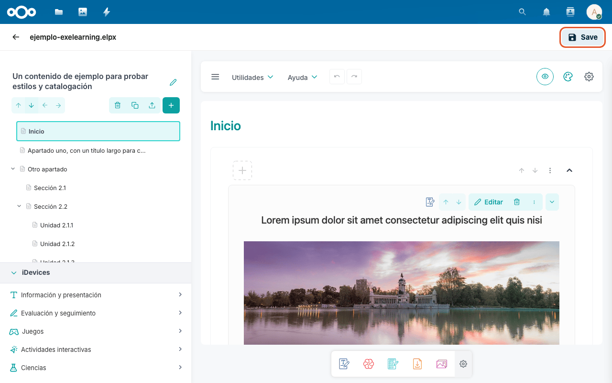

# eXeLearning in Nextcloud

[Leer en español](nextcloud.es.md){ .lang-switch }

<!-- --8<-- [start:intro] -->

The **eXeLearning** app for Nextcloud lets you **view, edit and create** eXeLearning resources
(`.elpx`) straight from **Files**, without downloading them. It helps teachers keep and share their
material in the school cloud.

!!! tip "Try it before installing"
    [Open the demo in Nextcloud Playground](https://ateeducacion.github.io/nextcloud-playground/?blueprint-url=https://raw.githubusercontent.com/exelearning/nextcloud-exelearning/main/blueprint.json)
    (user `admin`, password `admin`). It comes with two sample resources in the `exelearning-samples`
    folder.

<!-- --8<-- [end:intro] -->

<!-- --8<-- [start:admin] -->

## For administrators { #admin }

The administrator installs the app once on the Nextcloud server and it is available to every user;
teachers install nothing. If all your schools share one Nextcloud, install it there once.

### Requirements

- Nextcloud 31, 32 or 33. With plugin version 4.0.5, Nextcloud 33 only.
- An up-to-date browser (the preview uses *Service Workers*).

### Installation

You need **administrator** access to the Nextcloud server.

1. Download `exelearning-X.Y.Z.tar.gz` from the
   [latest release](https://github.com/exelearning/nextcloud-exelearning/releases/latest). It already
   includes the editor.
2. Extract it into Nextcloud's `custom_apps/` (or `apps/`) folder. You must end up with a folder named
   `exelearning`.
3. Open **Apps → Disabled apps**, select **eXeLearning** and click **Enable** (you will be asked for
   your password). From the command line: `occ app:enable exelearning`.



!!! note "Recommended: recognise `.elpx` files"
    So that Nextcloud shows the right icon and type for `.elpx` and `.elp` files, create
    `config/mimetypemapping.json` with:

    ```json
    {
      "elpx": ["application/vnd.exelearning.elpx", "application/zip"],
      "elp": ["application/vnd.exelearning.elpx", "application/zip"]
    }
    ```

    and run `occ maintenance:mimetype:update-js` and
    `occ maintenance:mimetype:update-db --repair-filecache`.

### Configuration

The app has no settings.

<!-- --8<-- [end:admin] -->

<!-- --8<-- [start:teacher] -->

## For teachers { #teachers }

### Create a new resource

In **Files**, click **New → New eXeLearning resource**. The file is created and opens in the editor.



### View a resource

Upload the `.elpx` like any other file and click it. The preview opens with the content ready to
browse.





### Edit a resource

From the preview click **Edit**, or open the file's **…** menu and choose **Edit with eXeLearning**.



In the editor, click **Save** to store your changes in Nextcloud.



!!! info "Old `.elp` files"
    They open in the editor with **Open in eXeLearning editor** and are saved as `.elpx`.

### Share

Share the resource with Nextcloud's usual sharing (users, groups or a public link).

<!-- --8<-- [end:teacher] -->
