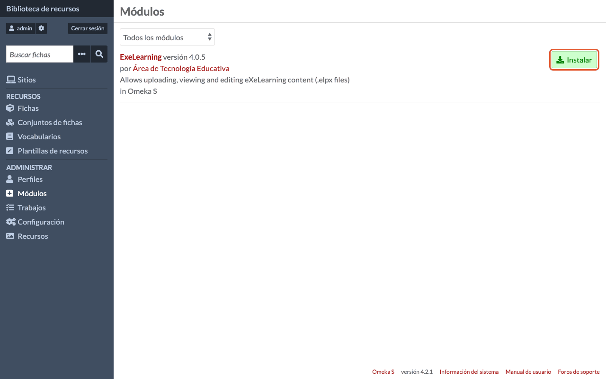
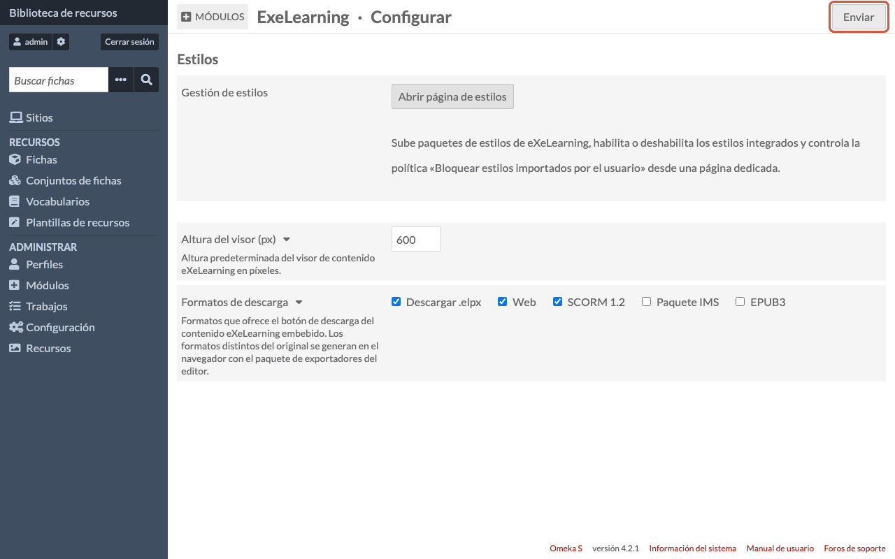
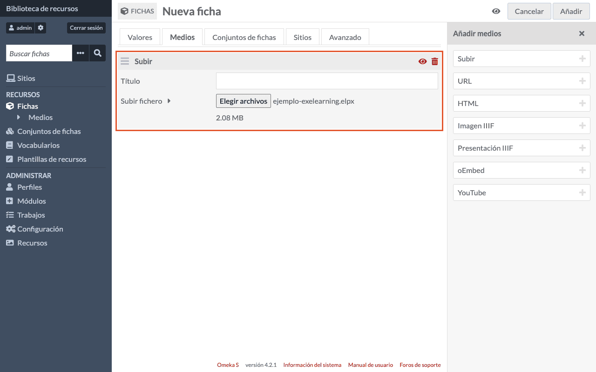
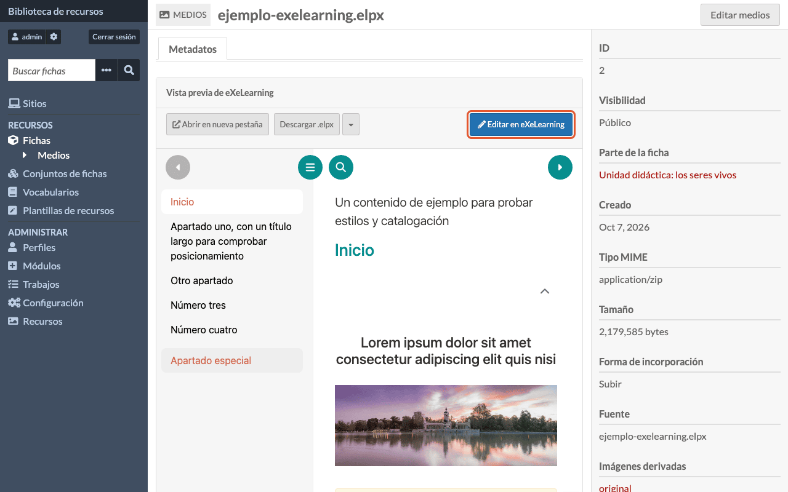
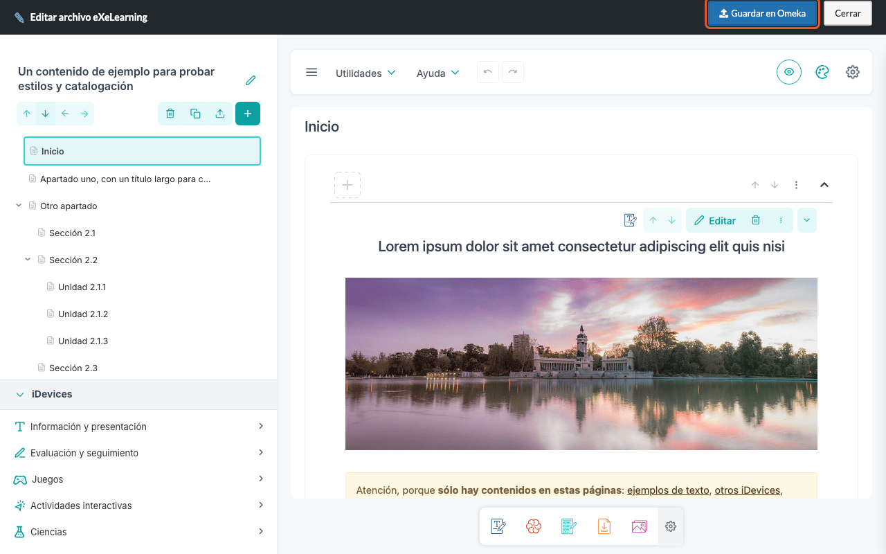
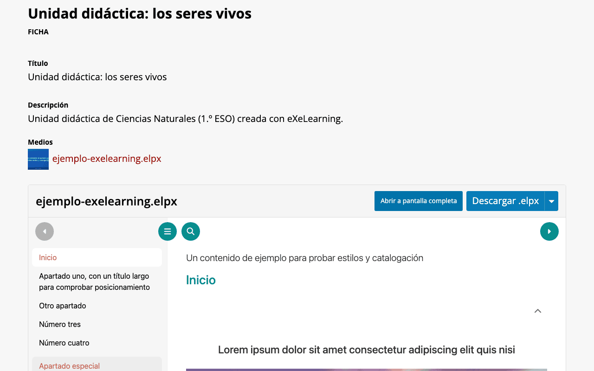

# eXeLearning in Omeka S

[Leer en español](omeka-s.es.md){ .lang-switch }

<!-- --8<-- [start:guide] -->

The **ExeLearning** module for Omeka S lets you add eXeLearning resources (`.elpx`) as item **media**,
**view** them embedded in the page and **edit** them with the eXeLearning editor. It is useful for
repositories and collections of learning resources.

!!! tip "Try it before installing"
    [Open the demo in Omeka S Playground](https://ateeducacion.github.io/omeka-s-playground/?blueprint=https%3A%2F%2Fraw.githubusercontent.com%2Fexelearning%2Fomeka-s-exelearning%2Frefs%2Fheads%2Fmain%2Fblueprint.json)
    (user `admin@example.com`, password `password`). It includes a sample item and a public site at
    `/s/demo`.

## Requirements

- Omeka S 4.0 or later.
- PHP 7.4 or later with the ZIP extension.
- On **nginx** servers, the extra rules listed in the
  [module README](https://github.com/exelearning/omeka-s-exelearning#readme). Nothing is needed with
  Apache.

## Installation

1. Download `ExeLearning-X.Y.Z.zip` from the
   [latest release](https://github.com/exelearning/omeka-s-exelearning/releases/latest).
2. Unzip it into Omeka S's `modules/` folder. You must end up with `modules/ExeLearning`.
3. In the admin panel, open **Modules** and click **Install** next to ExeLearning.

## Configuration

Click **Configure** next to the module to set the **Viewer Height (px)** and the **Download formats**
offered (`.elpx`, web, SCORM 1.2, IMS, EPUB3). Click **Submit** to save.

**Open styles page** lets you upload and enable your own styles.

## Usage

### Add a resource to an item

Create or edit an item (**Items**), go to the **Media** tab, choose **Upload** and select the `.elpx`.
Save the item.

### View and edit it

Open the media: you will see the eXeLearning preview, with buttons to open it in a new tab or
download the `.elpx`. Click **Edit in eXeLearning** to change it.

When you are done, click **Save to Omeka**.

### On the public site

The resource appears automatically on the item page of the public site, with buttons to view it
full screen or download it.

!!! info "Who can edit?"
    The owner of the media and the Omeka S roles that can change any resource (administrators,
    editors). Visitors only see the content.

<!-- --8<-- [end:guide] -->
