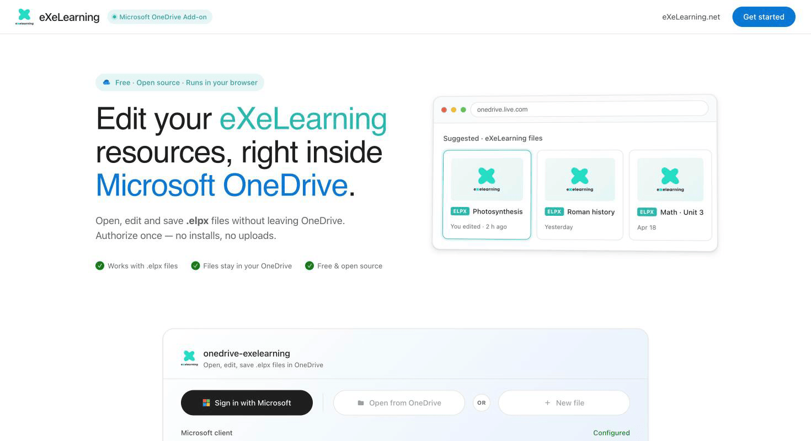
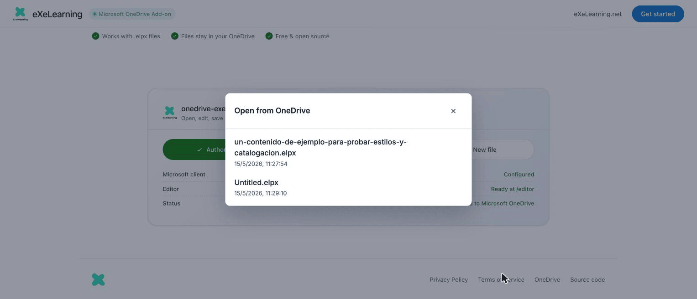
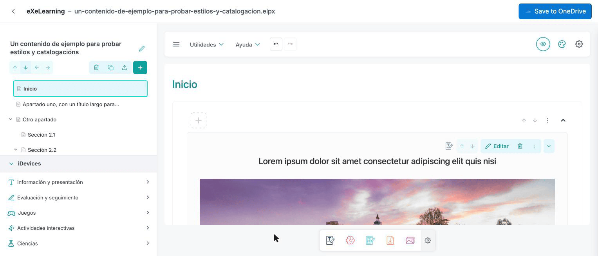

# eXeLearning in OneDrive

[Leer en español](onedrive.es.md){ .lang-switch }

<!-- --8<-- [start:intro] -->

**eXeLearning for OneDrive** lets you **open, edit and create** eXeLearning resources (`.elpx`)
stored in your Microsoft OneDrive. There is nothing to install: it runs in the browser and files never
leave OneDrive.

<!-- --8<-- [end:intro] -->

<!-- --8<-- [start:admin] -->

## For administrators { #admin }

**Nothing to install.** Every teacher can use the public app at
<https://exelearning.github.io/onedrive-exelearning/> with a Microsoft account: a Microsoft 365
account from their school or a personal one. It is free and needs no server.

### Check your Microsoft 365 tenant

The first time someone signs in, Microsoft asks them to accept the app's permissions (read and write
their OneDrive files, and their name). If your tenant does not let users consent to apps, a Microsoft
Entra administrator must **grant admin consent** to **onedrive-exelearning** for the whole
organisation. Otherwise teachers see a "Need admin approval" message when they sign in.

### Host your own copy (optional)

An administration can run its own copy instead of the public one, for example to limit sign-in to its
own Microsoft 365 tenant and grant consent once for every teacher. The app is a static website, so any
web server works. You need:

1. An **app registration** in the Microsoft Entra admin center, with your copy's address as a
   **single-page application** redirect URI.
2. The delegated Microsoft Graph permissions `Files.ReadWrite`, `User.Read`, `openid` and `profile`.
   For a single-tenant copy, click **Grant admin consent** so teachers are not asked.
3. The app's client ID and tenant in the build settings.

The [self-hosting guide](https://github.com/exelearning/onedrive-exelearning/blob/main/SELF-HOSTING.md)
has every step.

<!-- --8<-- [end:admin] -->

<!-- --8<-- [start:teacher] -->

## For teachers { #teachers }

### Requirements

- A Microsoft account (Microsoft 365 from your school, or personal) with OneDrive.
- An up-to-date browser that allows pop-up windows from the app (for signing in).

### Getting started

1. Go to <https://exelearning.github.io/onedrive-exelearning/>.
2. Click **Sign in with Microsoft**, choose your account and accept the permissions.

!!! note "Unlike Google Drive"
    OneDrive does not add eXeLearning to its own menus. You always start from the app's page: bookmark
    it.

### Open a resource

Click **Open from OneDrive** and choose an `.elpx` file from the list.

A preview of the resource appears, ready to browse. Click **Edit in eXeLearning** to edit it.

### Edit and save

When you are done, click **Save to OneDrive** (or Ctrl/Cmd + S). The file is updated in OneDrive.

- If someone changed the file while you were editing, you can overwrite it, save a copy or cancel.
- Old `.elp` files are saved as a new `.elpx` next to the original.

### Create a new resource

Click **New file**. An `Untitled.elpx` file is created in your OneDrive and opens in the editor.
Rename it from OneDrive whenever you like.

### Share

Use OneDrive's **Share** button, as with any other file.

!!! note "Language"
    For now this app's own screens are in English only. The editor uses your language.

<!-- --8<-- [end:teacher] -->
