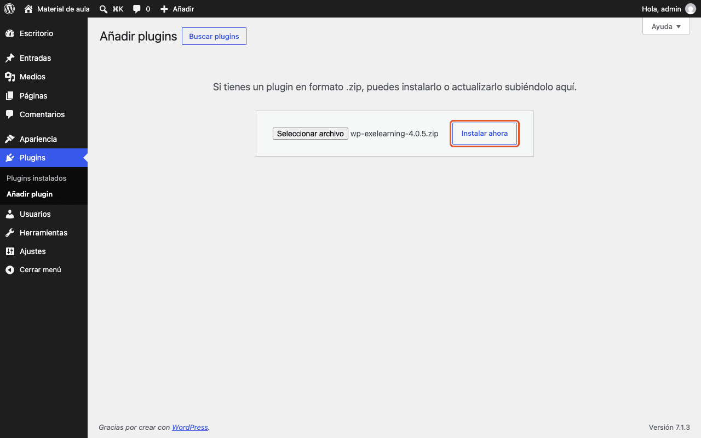
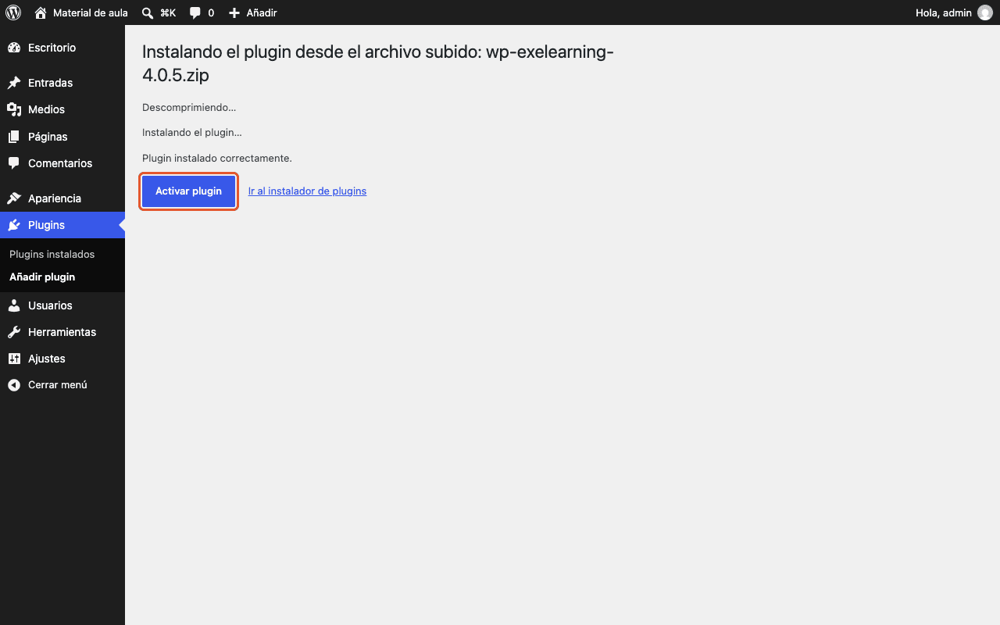
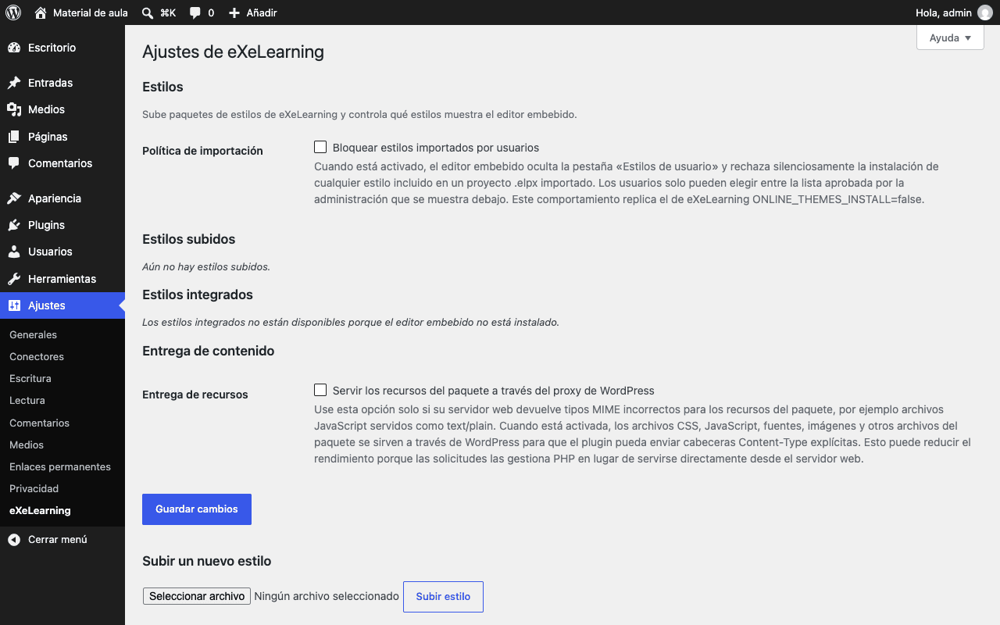
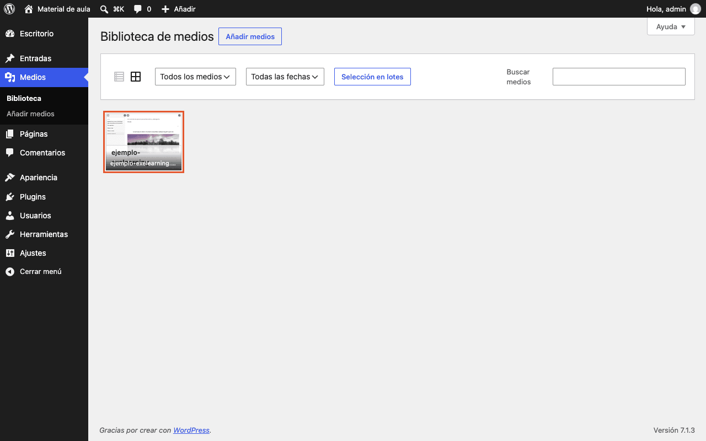
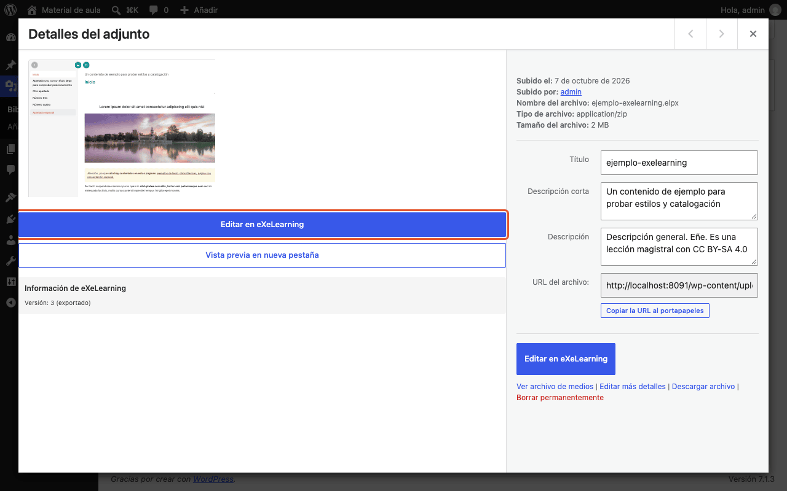
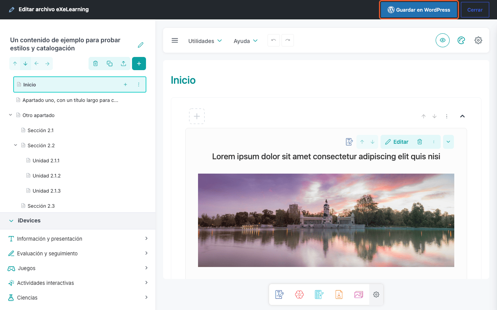
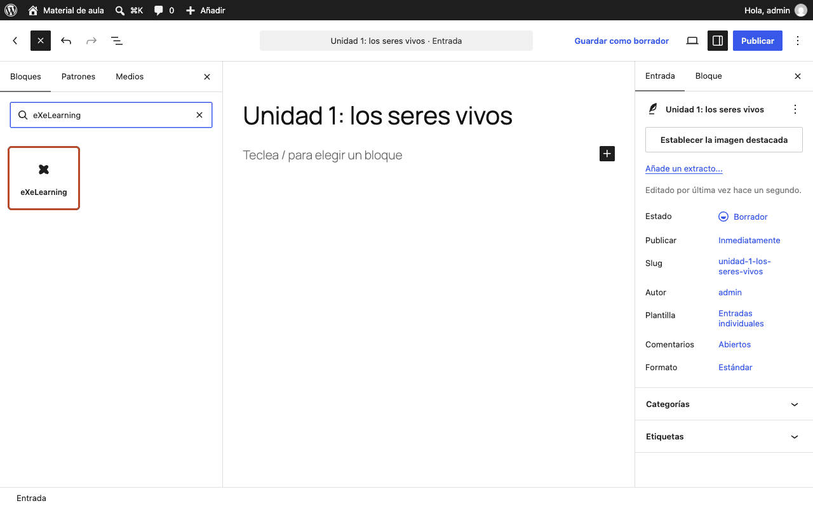
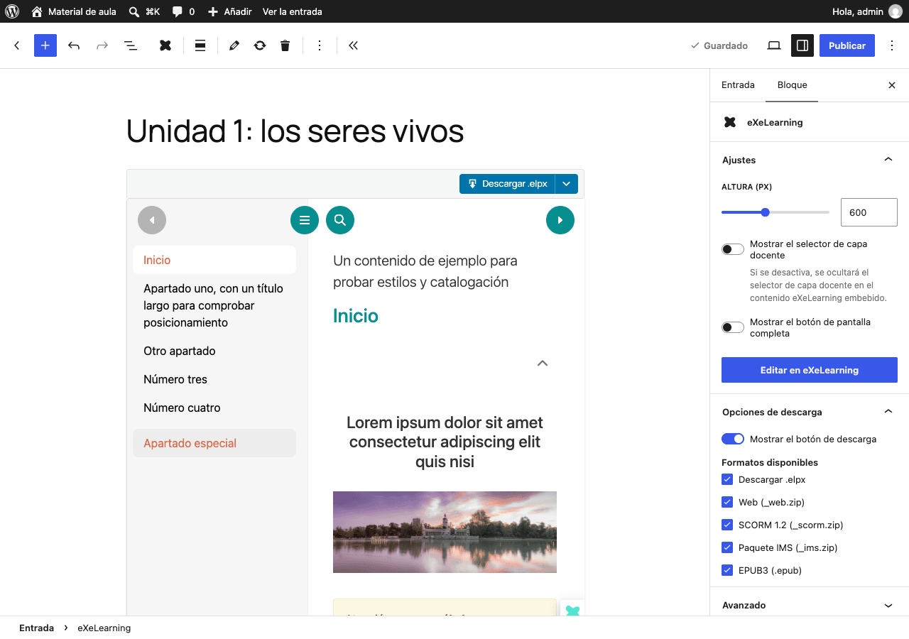
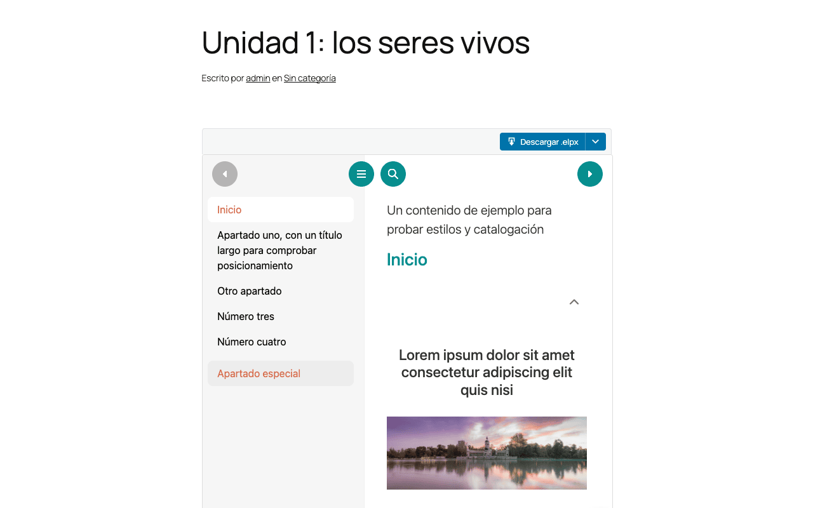

# eXeLearning in WordPress

[Leer en español](wordpress.es.md){ .lang-switch }

<!-- --8<-- [start:guide] -->

The **eXeLearning** plugin for WordPress lets you upload resources (`.elpx`) to the **Media Library**,
**edit** them with the embedded editor and **publish** them in posts and pages with a block or a
shortcode. It is a good fit for a school blog or website.

!!! tip "Try it before installing"
    [Open the demo in WordPress Playground](https://playground.wordpress.net/?blueprint-url=https://raw.githubusercontent.com/exelearning/wp-exelearning/refs/heads/main/blueprint.json).
    You are signed in automatically and two sample resources are already in Media.

## Requirements

- WordPress 6.1 or later.
- PHP 8.0 or later.
- An upload limit large enough for the plugin (about 30 MB) and your resources.

## Installation

1. Download `exelearning-X.Y.Z.zip` from the
   [latest release](https://github.com/exelearning/wp-exelearning/releases/latest).
2. Go to **Plugins → Add Plugin → Upload Plugin**, choose the ZIP and click **Install Now**.

    

3. Click **Activate Plugin**.

    

## Configuration

Nothing to configure. In **Settings → eXeLearning** you can check the editor status, manage styles and
see shortcode examples.



## Usage

### 1. Upload a resource

In **Media → Add Media File**, upload the `.elpx` file. WordPress checks it and gets it ready to be
shown.



The attachment details show the **eXeLearning Info**, a preview and the **Edit in
eXeLearning** button.



### 2. Edit it

Click **Edit in eXeLearning**. The editor opens in a window; when you are done, click **Save to
WordPress**. Every post that uses the resource shows the new version.



### 3. Publish it in a post or page

In the block editor, click **+** (block inserter), search for **eXeLearning** and add the block. Then
pick the resource with **Upload .elpx File** or **Media Library**.



In the block sidebar you can change the **Height (px)** and show the **teacher layer selector**, the
**fullscreen button** and the **download options**.



This is what students see on the site:



??? note "Using the classic editor? Shortcode"
    Type `[exelearning id="123"]`, where `123` is the file's number in the Media Library (it appears in
    the address when you open it: `upload.php?item=123`). Useful options:

    ```text
    [exelearning id="123" height="800" fullscreen="1" show_download="1" screenshot="poster"]
    ```

    `height` and `width` change the size, `fullscreen` adds the fullscreen button, `show_download`
    lets visitors download the resource and `screenshot="poster"` shows an image until **Load
    interactive content** is clicked.

<!-- --8<-- [end:guide] -->
